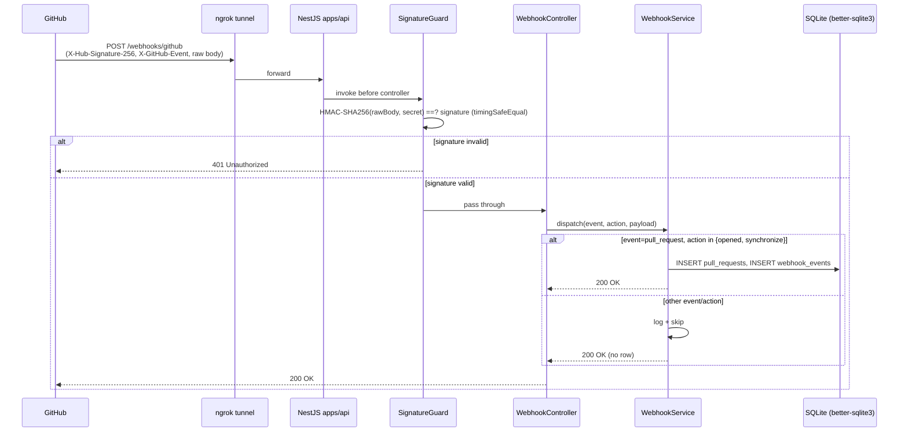

# Day 1 baseline — monorepo + GitHub webhook receiver + SQLite persistence

This is the implementation-level plan for Day 1 of the 10-day sprint described in [docs/plans/01-baseline.md](01-baseline.md). It expands the parent plan's Day 1 paragraph into concrete implementation units a coding agent can execute.

---

## Summary

Stand up the project skeleton so a registered GitHub App can deliver `pull_request` webhooks into a local NestJS service, which verifies the signature and persists the event to SQLite. By end of Day 1 the bot can *see* PRs locally over an ngrok tunnel — no analysis, no comments back, no LLM, no embeddings.

Day 1 is the foundation: monorepo, webhook receiver, signature verification, storage, and the dev-loop docs (GitHub App registration + ngrok). Everything else in the sprint (Chroma, Claude, agents, dashboard, deployment) builds on top of this.

---

## Problem Frame

The 10-day baseline plan defines Day 1 as: *"Bot can see PRs locally via ngrok tunnel."* That breaks down into four concrete pieces:

1. A monorepo that will eventually host both the API (`apps/api`) and dashboard (`apps/web`).
2. A GitHub-App-compatible webhook endpoint that survives the real internet (HMAC signature verification, raw-body handling).
3. Local storage for received events so later days can replay/inspect them without re-triggering PRs.
4. Setup docs detailed enough for a re-clone to reach a working ngrok loop in under 15 minutes.

There is no production load, no shared infra, and no real users yet. The risk surface is the webhook security boundary (HMAC verification done wrong is the dominant vulnerability) and the fragility of getting a fresh monorepo + native module (`better-sqlite3`) running cleanly on Node 24.

---

## Scope

### In scope (Day 1)

- npm-workspaces monorepo with `apps/api` (NestJS) and `apps/web` (Next.js scaffold).
- `POST /webhooks/github` endpoint with HMAC SHA-256 signature verification.
- Routing of `pull_request` events (`opened`, `synchronize` actions) into a webhook handler service; all other events ignored with 200 OK and a log line.
- SQLite persistence (via `better-sqlite3`) of: pull-request metadata (`pull_requests` table) and the raw webhook delivery (`webhook_events` table) for replay/audit.
- Unit tests for signature verification, event routing, and persistence.
- `.env.example`, root `README.md`, and `docs/setup/github-app.md` with GitHub App registration + ngrok instructions.
- Minimal GitHub Actions CI workflow that runs lint + tests on PRs to `main` (required so `/lfg`'s CI-watch step has something to watch).

### Scope Boundaries

#### Deferred to Follow-Up Work
- **Fetching the full unified diff via Octokit.** The webhook payload contains PR metadata and pointers (`head.sha`, `base.sha`, `diff_url`) but not the diff itself. Fetching it requires authenticating *as the GitHub App* (JWT signed with the App's private key, exchanged for an installation access token, then `GET /repos/{owner}/{repo}/pulls/{n}` with the `diff` media type). That auth subsystem is a meaningful chunk of work (key management, JWT signing, token caching with TTL) and the parent plan's literal Day 1 deliverable is "store diff" without specifying *which* representation. Day 1 stores the webhook delivery payload (which includes PR-level metadata sufficient to demo the loop); the diff-fetch subsystem lands on Day 2 alongside the embedding pipeline that consumes it.
- **Webhook delivery deduplication via `X-GitHub-Delivery`.** GitHub re-delivers on its own schedule. Day 1 stores every delivery; Day 2+ adds a uniqueness constraint and a redelivery-skip path once we know we want it.
- **Real DB migration tooling** (Prisma, Knex, umzug). Day 1 applies a single `schema.sql` idempotently on boot. Swap when schema complexity grows.
- **Rate limiting / DoS protection** on the webhook endpoint. Signature verification is the gate; abuse from an attacker without the secret produces only 401s.

#### Out of Scope (Day 2+)
All of the following belong to later sprint days as defined in the parent plan and **must not** be pulled into Day 1:
- Chroma vector DB, embedding pipeline, knowledge-base seed (Day 2).
- Anthropic Claude SDK, prompt caching, structured-JSON findings (Day 3).
- Agentic tool-use loop, `fetch_related_file` / `fetch_function_definition` tools (Day 4).
- Posting review comments back to the PR via Octokit (Day 5).
- Ragas evaluation harness, precision/recall scoring (Day 6).
- Dashboard UI features — list view, severity counts, settings page (Day 7); the Next.js scaffold in U6 is **scaffold-only** so Day 7 has a workspace to land in.
- Token-cost logging, latency telemetry, hallucination flags (Day 8).
- Blog post + architecture diagrams (Day 9).
- LangGraph migration, profile pinning, polish (Day 10).
- Production deployment to Vercel/Railway/Fly — Day 1 runs locally only.

---

## Key Technical Decisions

| Decision | Choice | Rationale |
|---|---|---|
| Monorepo tooling | npm workspaces | Built into npm (already installed, no extra dep). `pnpm`/Turbo are stronger but add a tooling barrier on Day 1. Easy to migrate later. |
| Backend framework | NestJS | Locked by the parent plan. Decorator-driven controllers/guards fit signature-verification-as-guard and webhook-routing-as-controller naturally. |
| SQLite driver | `better-sqlite3` | Synchronous API → no async ceremony for tiny inserts; widely used, well-maintained native module. Day 1 schema is small enough that sync I/O is fine. Swap for `node:sqlite` (Node 24 built-in) only if native-rebuild pain materializes. |
| Schema management | Single `schema.sql` applied idempotently with `CREATE TABLE IF NOT EXISTS` on boot | Avoids a migrations framework on Day 1. The schema is two tables. |
| Raw-body handling in NestJS | `rawBody: true` on `NestFactory.create` + targeted raw-body parser for the webhook route | NestJS's default body parser consumes the stream; HMAC verification needs the *exact* bytes that were signed. The official NestJS pattern is `rawBody: true` with `req.rawBody` accessed in the guard. |
| Signature verification | NestJS Guard on the webhook controller | Guards run before the route handler, can read `req.rawBody`, and short-circuit with 401 on mismatch. Cleaner than middleware for this single route. |
| Constant-time compare | `crypto.timingSafeEqual` | Standard mitigation for signature-comparison timing attacks. Buffers must be equal-length — guard against that explicitly. |
| Frontend | Next.js 14+ App Router, scaffold-only | Locked by parent plan. App Router is the current Next.js default; reduces drift when Day 7 builds the dashboard. |
| CI | One GitHub Actions workflow (`ci.yml`) running install + lint + test on PRs to `main` | `/lfg`'s step 8 watches CI. Without a workflow, that step is a no-op and we lose the autofix loop. Keep it minimal — one job, one Node version. |
| Test runner | Jest (NestJS default) for `apps/api`; no tests for `apps/web` on Day 1 (scaffold-only) | Matches NestJS's generator output and avoids a per-app test-framework decision in this sprint. |

---

## High-Level Technical Design

This illustrates the intended request flow and is directional guidance for review, not implementation specification.



---

## Output Structure

Expected layout at end of Day 1 (per-unit `Files:` sections are authoritative; the implementer may adjust if a cleaner layout emerges):

```
ai-pr-review-copilot/
├── .env.example
├── .github/
│   └── workflows/
│       └── ci.yml
├── .gitignore                       # already exists
├── README.md
├── apps/
│   ├── api/
│   │   ├── .env.example
│   │   ├── nest-cli.json
│   │   ├── package.json
│   │   ├── src/
│   │   │   ├── app.module.ts
│   │   │   ├── main.ts
│   │   │   ├── health/
│   │   │   │   └── health.controller.ts
│   │   │   ├── db/
│   │   │   │   ├── database.module.ts
│   │   │   │   ├── database.service.ts
│   │   │   │   └── schema.sql
│   │   │   └── webhooks/
│   │   │       ├── webhook.module.ts
│   │   │       ├── webhook.controller.ts
│   │   │       ├── webhook.service.ts
│   │   │       └── signature-verification.guard.ts
│   │   ├── test/
│   │   │   ├── health.e2e-spec.ts
│   │   │   ├── db/database.service.spec.ts
│   │   │   └── webhooks/
│   │   │       ├── signature-verification.guard.spec.ts
│   │   │       ├── webhook.controller.spec.ts
│   │   │       └── webhook.service.spec.ts
│   │   ├── tsconfig.json
│   │   └── jest.config.js
│   └── web/
│       ├── app/
│       │   ├── layout.tsx
│       │   └── page.tsx
│       ├── next.config.js
│       ├── package.json
│       └── tsconfig.json
├── docs/
│   ├── plans/                       # already exists
│   │   ├── 01-baseline.md
│   │   └── 02-day1-baseline-implementation.md   # this file
│   └── setup/
│       └── github-app.md
└── package.json                     # root workspace
```

---

## Implementation Units

### U1. Root monorepo + npm workspaces

**Goal:** Establish the root `package.json` declaring `apps/*` workspaces so all subsequent units have a home.

**Dependencies:** none.

**Files:**
- Create: `package.json` (root)
- Modify: `.gitignore` (already exists; verify it covers `node_modules/`, `dist/`, `.next/`, `*.sqlite` — it does)
- Create: `.env.example` (root, with placeholders for `GITHUB_WEBHOOK_SECRET`, `DATABASE_PATH`, `PORT`)

**Approach:**
- Root `package.json` is `"private": true`, declares `"workspaces": ["apps/*"]`, exposes top-level scripts that fan out across workspaces: `npm run build`, `npm run lint`, `npm test`, `npm run dev:api`, `npm run dev:web`.
- No production dependencies at the root. Dev tooling shared across workspaces (e.g., a root `prettier` config) is fine here but not required for Day 1.
- `.env.example` documents the env contract; never commit a real `.env`.

**Patterns to follow:** Standard npm-workspaces layout — see npm's official workspaces docs. Any modern monorepo template (e.g., Vercel's Next.js + API examples) uses the same shape.

**Test scenarios:** *Test expectation: none — pure scaffolding, no behavior to assert. U2/U3/U6 will exercise the workspace wiring transitively.*

**Verification:**
- `npm install` from the repo root completes without error.
- `npm run -ws ls` (or `npm query .workspace`) lists both `apps/api` and `apps/web`.

---

### U2. NestJS `apps/api` scaffold + health endpoint

**Goal:** A minimal runnable NestJS app inside `apps/api` with a `GET /health` route, so the rest of Day 1 has a host to mount the webhook into.

**Dependencies:** U1.

**Files:**
- Create: `apps/api/package.json`
- Create: `apps/api/tsconfig.json`, `apps/api/nest-cli.json`, `apps/api/jest.config.js`
- Create: `apps/api/src/main.ts` (bootstrap, `rawBody: true`)
- Create: `apps/api/src/app.module.ts`
- Create: `apps/api/src/health/health.controller.ts`
- Create: `apps/api/test/health.e2e-spec.ts`

**Approach:**
- Hand-rolled minimal NestJS app (avoids the `nest new` generator polluting the workspace with its own lockfile and node_modules layout).
- `main.ts` bootstraps `NestFactory.create(AppModule, { rawBody: true })` — the `rawBody` flag is required upstream of U4 so the signature guard can read `req.rawBody`.
- `AppModule` wires `HealthModule` (or just the controller directly) plus the modules added in U3, U5.
- Listen on `process.env.PORT ?? 3001` (3000 is reserved for `apps/web`).
- Health controller responds `{ status: 'ok', uptime: process.uptime() }`. The route exists to make ngrok/curl smoke tests easy and to give CI a trivial endpoint to hit.

**Patterns to follow:** NestJS official quickstart structure (`main.ts` → `bootstrap()` → `AppModule`). NestJS docs page on raw-body handling for the `rawBody: true` pattern.

**Test scenarios:**
- *Happy:* `GET /health` returns 200 with `status: 'ok'`.

**Verification:**
- `npm run dev:api` (from root) or `npm run start:dev` (from `apps/api`) boots the app and logs the listening port.
- `curl localhost:3001/health` returns `{ "status": "ok", ... }`.
- `npm test --workspace apps/api` passes the health e2e.

---

### U3. SQLite storage layer (`better-sqlite3`)

**Goal:** A `DatabaseModule` that opens a single `better-sqlite3` connection on boot, applies the schema idempotently, and exposes a `DatabaseService` other modules can inject.

**Dependencies:** U1, U2.

**Files:**
- Create: `apps/api/src/db/database.module.ts`
- Create: `apps/api/src/db/database.service.ts`
- Create: `apps/api/src/db/schema.sql`
- Create: `apps/api/test/db/database.service.spec.ts`

**Approach:**
- Add `better-sqlite3` as a runtime dep in `apps/api/package.json`; verify it builds against Node 24 on install (postinstall step prints a clear error if native rebuild fails).
- `DatabaseModule` is a NestJS global module; provides a single `DatabaseService` singleton.
- `DatabaseService` opens the DB at `process.env.DATABASE_PATH ?? './data/app.sqlite'` (path is gitignored), enables `PRAGMA journal_mode=WAL` and `PRAGMA foreign_keys=ON`, then reads `schema.sql` and executes it (`CREATE TABLE IF NOT EXISTS` everywhere so re-runs are no-ops).
- Schema for Day 1:
  - `pull_requests` — primary key is the GitHub PR's `node_id` (stable across renames); columns capture repo full name, PR number, title, state, head SHA, base SHA, author login, created_at, updated_at, raw payload JSON.
  - `webhook_events` — primary key is `X-GitHub-Delivery` (UUID; uniqueness lets us add dedup later as a pure read-side check without schema change); columns capture event name, action, FK `pull_request_node_id` (nullable for non-PR events), received_at, raw payload JSON.
- The service exposes a small surface: `insertOrReplacePullRequest(record)`, `insertWebhookEvent(record)`, `findPullRequest(nodeId)`, `findWebhookEvent(deliveryId)`. Keep methods narrow — no generic query builder.
- On shutdown (`OnApplicationShutdown`), close the DB.

**Patterns to follow:** Standard NestJS module-with-service pattern. `better-sqlite3`'s README for `db.prepare(...).run(...)` and `db.exec(schemaSql)`.

**Test scenarios:**
- *Happy:* `insertOrReplacePullRequest` round-trips through `findPullRequest`, returning all fields including the raw payload JSON.
- *Happy:* `insertWebhookEvent` for an existing PR succeeds and `findWebhookEvent` returns it.
- *Edge:* Schema applies idempotently — calling the boot routine twice produces no error and no duplicate tables.
- *Edge:* `insertOrReplacePullRequest` for an existing `node_id` updates the row (no duplicate primary key error).
- *Edge:* `insertWebhookEvent` with `pull_request_node_id = null` (non-PR event) succeeds.
- *Error:* `insertWebhookEvent` with a non-existent `pull_request_node_id` FK raises a constraint error (proves `foreign_keys=ON` is active).
- *Error:* Inserting a webhook event with a duplicate `delivery_id` raises a unique-constraint error (basis for future dedup).

**Verification:**
- `npm test --workspace apps/api -- db` passes.
- Manual: delete the SQLite file, boot the app, hit `/health`, verify the file is re-created and contains both tables (`sqlite3 data/app.sqlite '.schema'`).

---

### U4. GitHub webhook signature-verification guard

**Goal:** A NestJS `CanActivate` guard that verifies `X-Hub-Signature-256` against `GITHUB_WEBHOOK_SECRET` using HMAC-SHA256 with a constant-time compare. Applied to the webhook controller in U5.

**Dependencies:** U2.

**Execution note:** Write the guard's tests first. Signature verification is the project's security boundary — a passing test for the bad-input cases is the primary correctness signal, and test-first prevents the common bug where dev-loop tweaks accidentally weaken the check.

**Files:**
- Create: `apps/api/src/webhooks/signature-verification.guard.ts`
- Create: `apps/api/test/webhooks/signature-verification.guard.spec.ts`

**Approach:**
- The guard reads `req.rawBody` (Buffer, provided by `rawBody: true` from U2) and `X-Hub-Signature-256` from headers.
- It computes `'sha256=' + hmac('sha256', GITHUB_WEBHOOK_SECRET).update(rawBody).digest('hex')` and compares with the header using `crypto.timingSafeEqual` over equal-length Buffers.
- Reject (return false → 401) when:
  - The header is missing or doesn't start with `sha256=`.
  - The computed and received digests differ in length (timingSafeEqual would throw — handle as mismatch).
  - The constant-time compare returns false.
- Throw a clear server error on boot/startup if `GITHUB_WEBHOOK_SECRET` is unset — fail fast rather than silently accept everything.
- The guard is route-scoped, applied via `@UseGuards(SignatureVerificationGuard)` on the webhook controller in U5 (not globally — health and future routes are unauthenticated).

**Patterns to follow:** GitHub's official docs on "Securing your webhooks" (the HMAC-SHA256 + `X-Hub-Signature-256` pattern is universal; Octokit's `@octokit/webhooks` library implements the same algorithm and is a reasonable reference, though we implement directly to avoid the dependency).

**Test scenarios:**
- *Happy:* A request with a body and a correctly-computed signature passes the guard.
- *Happy:* Empty body with a correctly-computed signature passes (HMAC of empty buffer is a real value).
- *Error:* Wrong signature returns false → 401.
- *Error:* Missing `X-Hub-Signature-256` header returns false → 401.
- *Error:* Signature header without `sha256=` prefix returns false → 401 (don't crash on `.slice(7)`).
- *Error:* Signature header that decodes to a different-length Buffer than the computed digest returns false → 401 (don't let `timingSafeEqual` throw).
- *Error:* Boot with `GITHUB_WEBHOOK_SECRET` unset surfaces a clear error (covered by service-construction test, not guard runtime — pick the right test home and document the choice).
- *Integration:* When mounted on a controller via `@UseGuards`, a bad-signature POST short-circuits before the controller handler runs (no DB writes, no log noise from the handler).

**Verification:**
- `npm test --workspace apps/api -- signature-verification` passes all cases above.
- Manual: `curl -X POST localhost:3001/webhooks/github` (no signature) returns 401.

---

### U5. `pull_request` webhook controller + service

**Goal:** `POST /webhooks/github` accepts signed webhook deliveries, routes `pull_request` events with action `opened` or `synchronize` into persistence, and ignores everything else with 200 OK + log line.

**Dependencies:** U3 (storage), U4 (guard).

**Files:**
- Create: `apps/api/src/webhooks/webhook.module.ts`
- Create: `apps/api/src/webhooks/webhook.controller.ts`
- Create: `apps/api/src/webhooks/webhook.service.ts`
- Create: `apps/api/test/webhooks/webhook.controller.spec.ts`
- Create: `apps/api/test/webhooks/webhook.service.spec.ts`
- Modify: `apps/api/src/app.module.ts` (register `WebhookModule`)

**Approach:**
- `WebhookController` exposes `POST /webhooks/github`, guarded by `SignatureVerificationGuard` from U4. It reads `X-GitHub-Event`, `X-GitHub-Delivery`, and the parsed JSON body, then calls `WebhookService.handleDelivery({ event, delivery, action, payload })`.
- `WebhookService` is the routing brain:
  - If `event === 'pull_request'` and `action ∈ {'opened', 'synchronize'}`:
    - Upsert into `pull_requests` from `payload.pull_request` (node_id, number, title, state, head/base SHA, author).
    - Insert into `webhook_events` with the FK linked.
    - Return `{ status: 'processed' }`.
  - If `event === 'pull_request'` with another action (e.g. `closed`, `reopened`, `edited`):
    - Insert into `webhook_events` with the FK linked (no PR upsert — Day 1 doesn't model PR state transitions yet).
    - Log at info level, return `{ status: 'ignored-action' }`.
  - Any other event:
    - Insert into `webhook_events` with `pull_request_node_id = null`.
    - Log at info level, return `{ status: 'ignored-event' }`.
- All branches return 200 OK with a small JSON body — GitHub treats non-2xx as delivery failure and will retry, which we don't want during dev.
- Persistence failures are *logged and re-thrown* so the response is 500 and GitHub retries. (Day 1 trades availability for visibility; we'd rather see the failure than swallow it.)
- `X-GitHub-Delivery` is the `webhook_events.delivery_id` — sets us up for cheap dedup later.

**Patterns to follow:** Standard NestJS controller/service split. The `@octokit/webhooks` README has a good enumeration of `pull_request` action values for reference.

**Test scenarios:**
- *Happy:* `pull_request` + `opened` payload → row in `pull_requests`, row in `webhook_events` with FK, controller returns 200 + `{ status: 'processed' }`.
- *Happy:* `pull_request` + `synchronize` payload → existing PR row updated, new `webhook_events` row inserted.
- *Edge:* `pull_request` + `closed` action → `webhook_events` row inserted with FK, no PR upsert, returns `{ status: 'ignored-action' }`.
- *Edge:* `pull_request` + `synchronize` for a PR that hasn't been `opened` yet → upserts the PR row (proves the upsert isn't gated on prior insert).
- *Edge:* Non-PR event (e.g. `push`) → `webhook_events` row inserted with `pull_request_node_id = null`, returns `{ status: 'ignored-event' }`.
- *Error:* Malformed JSON body → NestJS validation 400 (verify the framework's default behavior, don't assume).
- *Error:* DB write failure → service re-throws, controller returns 500.
- *Integration:* Full POST → guard → controller → service → SQLite. Valid signature + valid `pull_request.opened` payload → row appears in `pull_requests`, row appears in `webhook_events`, response is 200. *(This is the test that proves the layers connect; the service-level spec only proves the service in isolation.)*
- *Integration:* Bad signature → no DB write, no controller call, response is 401 (verifies U4 short-circuits the chain in practice, not just in unit tests).

**Verification:**
- `npm test --workspace apps/api -- webhook` passes all cases.
- Manual: with the app running, `curl -X POST localhost:3001/webhooks/github -H 'X-Hub-Signature-256: sha256=<computed>' -H 'X-GitHub-Event: pull_request' -H 'X-GitHub-Delivery: <uuid>' -H 'Content-Type: application/json' -d @fixtures/pr-opened.json` returns 200 and inserts a row (use a saved fixture from a real GitHub delivery, not a hand-written one — the schemas are huge).

---

### U6. Next.js `apps/web` scaffold (placeholder)

**Goal:** A bootable Next.js 14+ App Router project at `apps/web` rendering a static placeholder page. Establishes the workspace and toolchain so Day 7 can land dashboard UI without re-scaffolding.

**Dependencies:** U1.

**Files:**
- Create: `apps/web/package.json`
- Create: `apps/web/tsconfig.json`, `apps/web/next.config.js`, `apps/web/next-env.d.ts`
- Create: `apps/web/app/layout.tsx`
- Create: `apps/web/app/page.tsx`

**Approach:**
- Either bootstrap with `npx create-next-app@latest apps/web --typescript --app --eslint --no-tailwind --no-src-dir --import-alias '@/*' --skip-install` and then re-jig the result into the workspace, or hand-roll the minimal App Router layout. Either is fine; the hand-rolled path is fewer files but requires the implementer to know the layout. **Bias toward `create-next-app` then trim** — it's the more durable choice.
- Page renders: title "AI PR Review Copilot", subtitle "Dashboard coming soon — see [README](https://github.com/azaz101hassan/ai-pr-review-copilot)." No interactivity, no client state, no API calls.
- Wire root scripts: `"dev:web": "npm run dev --workspace apps/web"`.

**Patterns to follow:** Next.js App Router quickstart (default `layout.tsx` + `page.tsx` shape).

**Test scenarios:** *Test expectation: none — Day 1 ships scaffold only. The static page has no behavior to assert. UI tests land alongside actual dashboard features on Day 7.*

**Verification:**
- `npm run dev --workspace apps/web` boots on `localhost:3000` without errors.
- The page renders the placeholder text in a browser.

---

### U7. README + `.env.example` + GitHub-App + ngrok setup docs

**Goal:** A new contributor (or the author after a context wipe) can re-create the running Day 1 loop in under 15 minutes following only the repo docs.

**Dependencies:** U1, U2, U5, U6 (the docs reference what exists).

**Files:**
- Create: `README.md`
- Create: `apps/api/.env.example`
- Create: `docs/setup/github-app.md`
- Modify: `.env.example` (root) — already created in U1; verify it stays in sync

**Approach:**
- `README.md` covers: one-paragraph project description (lift from `docs/plans/01-baseline.md`), repo layout (link to U6's tree), quickstart (`npm install`, copy env, `npm run dev:api`, `npm run dev:web`), pointer to `docs/setup/github-app.md` for the webhook loop, link to the 10-day plan and this Day 1 plan.
- `docs/setup/github-app.md` walks through:
  - GitHub App creation at `https://github.com/settings/apps/new`.
  - Required permissions: Pull requests (Read & write — we'll write comments on Day 5), Contents (Read), Metadata (Read).
  - Required event subscriptions: Pull request.
  - Webhook URL: ngrok HTTPS URL + `/webhooks/github`.
  - Webhook secret: copy into `apps/api/.env`'s `GITHUB_WEBHOOK_SECRET`.
  - Generating and downloading the App's private key (needed for U2 of *Day 2*, not Day 1, but install instructions belong here).
  - Installing the App on a test repo.
  - Running ngrok (`ngrok http 3001`) and pasting the URL into the App's webhook config.
  - "Redeliver" instructions in the App's "Advanced" tab for replaying a webhook against your local server without making a new PR.
- `.env.example` files (root + `apps/api/.env.example`) cover: `GITHUB_WEBHOOK_SECRET`, `DATABASE_PATH`, `PORT`. Root mirrors so contributors only copy once if they prefer.

**Patterns to follow:** GitHub's own "Creating a GitHub App" docs; ngrok's quickstart.

**Test scenarios:** *Test expectation: none — documentation. Verification is the dogfood loop below.*

**Verification:**
- Dogfood: in a fresh shell, follow `README.md` quickstart from `npm install` through to a green `npm run dev:api` boot. Time it. If it takes longer than 15 minutes the docs are wrong.
- A real test PR opened on a repo with the App installed delivers a webhook to ngrok → 200 OK → a row in `pull_requests` and a row in `webhook_events`. *(This is the parent plan's Day 1 verification gate.)*

---

### U8. Minimal GitHub Actions CI workflow

**Goal:** A single CI workflow that runs on PRs to `main` (and on pushes to `main`) installing deps and running tests. Required for `/lfg`'s CI-watch step to have something to watch.

**Dependencies:** U2, U3, U4, U5 (the tests CI runs need to exist).

**Files:**
- Create: `.github/workflows/ci.yml`

**Approach:**
- Single workflow, single job (`test`), single Node version (24, matching local dev).
- Steps: checkout → setup-node with npm cache → `npm ci` → `npm test --workspaces --if-present`.
- Triggers: `pull_request` to `main`, `push` to `main`.
- No deployment, no matrix, no caching beyond the setup-node default. Day 1 CI is "did tests pass?" — nothing more.
- If `better-sqlite3` rebuild fails in CI (different Linux glibc than local macOS), pin to a version with prebuilt binaries for Node 24 on `ubuntu-latest`.

**Patterns to follow:** Standard `actions/checkout@v4` + `actions/setup-node@v4` shape. GitHub Actions docs for the Node.js starter workflow.

**Test scenarios:** *Test expectation: none — workflow YAML. Verified by the workflow itself running green on the PR opened by `/lfg`.*

**Verification:**
- `gh workflow list` (after push) shows `CI`.
- The PR opened by `/lfg` triggers the workflow and it finishes green. *(If it fails, `/lfg`'s step 8 autofix loop kicks in.)*

---

## System-Wide Impact

| Surface | Impact |
|---|---|
| **Security boundary** | The webhook signature guard (U4) is the only thing standing between the public internet (via ngrok) and our DB writes. A bug here means anyone can spam the DB. Test-first execution (U4's `Execution note`) is the mitigation. |
| **Environment variables** | New required env: `GITHUB_WEBHOOK_SECRET`, `DATABASE_PATH`, `PORT`. All documented in `.env.example`. The webhook secret is the only one that's a real secret — surfaced in the GitHub App setup docs. |
| **Native modules** | `better-sqlite3` is a native module. Node 24 + macOS arm64 should have prebuilt binaries; CI runs on `ubuntu-latest` and may need a different prebuilt or a build-from-source fallback. Pin the version to one with broad prebuilt coverage. |
| **CI** | New `.github/workflows/ci.yml` will run on every PR going forward. If a downstream day breaks tests, CI catches it. |
| **GitHub App + ngrok** | The end-to-end loop depends on the user (a) registering the App on github.com and (b) running ngrok. These are documented in U7 but **cannot be automated** — they live outside the agent's reach. |

---

## Deferred to Implementation

Genuinely-unknowable-until-execution items the implementing agent should resolve in `ce-work`:

- **Exact `better-sqlite3` version.** Latest stable that has prebuilt binaries for Node 24 on both `darwin-arm64` and `linux-x64`. Check at install time; pin in `apps/api/package.json`.
- **NestJS version.** Latest stable major (10.x at time of writing). `nest-cli` is *not* required at runtime — only as a devDep for `nest start --watch` ergonomics.
- **Next.js version.** Latest stable 14.x or 15.x. Use the App Router; pages router is legacy.
- **Whether `create-next-app` or hand-rolling is faster for U6.** Try `create-next-app --skip-install` first; if it fights the workspace layout, hand-roll.
- **Exact NestJS raw-body wiring incantation.** The docs and the framework's behavior changed between major versions; verify against the installed version's docs at implementation time.
- **Whether to keep `@nestjs/testing` or drop to plain Jest.** Nest's testing module is heavier but matches the framework's idioms. Default to keeping it.

---

## Risks and Mitigations

| Risk | Likelihood | Mitigation |
|---|---|---|
| Signature verification has a subtle bug (e.g. timing-attack-vulnerable compare, off-by-one slice, wrong encoding) | Medium | U4 is test-first; tests cover the known failure modes; we use `crypto.timingSafeEqual` not `===`. |
| `better-sqlite3` fails to rebuild on Node 24 (locally or in CI) | Medium | Pin to a version with broad prebuilt coverage; document the rebuild command in `README.md` troubleshooting; fall back to Node 22 if no Node 24 prebuilds exist (Node 24 is bleeding-edge as of plan date). |
| NestJS raw-body handling silently consumes the body before the guard sees it | Medium | Explicitly set `rawBody: true` on `NestFactory.create`; the guard's integration test (U4) proves end-to-end that the rawBody is available. |
| ngrok URL changes on each free-tier restart, breaking the App's configured webhook URL | High | Document in U7's setup guide; recommend `ngrok config add-authtoken` + a reserved domain on a paid tier as a follow-up. Not blocking for Day 1 demo. |
| GitHub App installation/permissions misconfigured by the user → no events delivered | Medium | U7 spells out exact permissions and event subscriptions; the App's "Recent Deliveries" tab is the troubleshooting tool to surface in docs. |
| `apps/web` Next.js scaffold drifts from later UI conventions because it's set up speculatively | Low | Keep the scaffold *minimal* — one page, no design system, no client components. Day 7 will rewrite the page contents anyway. |

---

## Requirements Trace

Day 1 deliverables from `docs/plans/01-baseline.md` lines 51-56:

| Parent-plan deliverable | Covered by |
|---|---|
| "Init monorepo: `apps/api` (NestJS) + `apps/web` (Next.js)" | U1, U2, U6 |
| "Register GitHub App, configure webhook for PR events" | U7 (docs only; the user performs the actual registration) |
| "Webhook handler that receives PR open/sync events and stores diff in local SQLite" | U3 (storage), U4 (signature gate), U5 (handler) — note the *full unified diff* is explicitly deferred to Day 2 per Scope Boundaries above; Day 1 stores PR metadata + the raw webhook payload. |
| "Verify with ngrok tunnel + test PR" | U7 (docs); manual user verification step at end of execution |

Additional plan-level deliverables (not in parent plan, justified above):
- CI workflow (U8) — required so `/lfg`'s CI-watch loop is non-trivial.
- Health endpoint (U2) — trivially small, makes smoke-testing the loop easier.

---

## Execution Strategy Hint for `ce-work`

Dependency graph between units:

```
U1 (root)
 ├── U2 (api scaffold)
 │    ├── U3 (db)
 │    └── U4 (signature guard)
 │         └── U5 (webhook handler, also depends on U3)
 └── U6 (web scaffold)
U2 + U3 + U4 + U5 ──> U8 (CI, needs tests to exist)
U1 + U2 + U5 + U6 ──> U7 (docs reference all of the above)
```

Suggested order: **U1 → U2 → (U3 ∥ U6) → U4 → U5 → U8 → U7**. `U3` and `U6` are independent and could parallelize; everything else is sequential because each unit needs the previous to exist.

`ce-work` may dispatch U3 and U6 as parallel subagents (they touch disjoint file trees: `apps/api/src/db/` vs `apps/web/`); the Parallel Safety Check should pass cleanly. All other units are serial.
