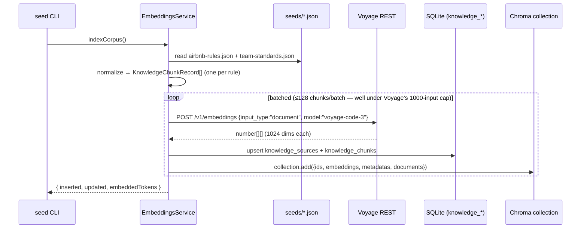
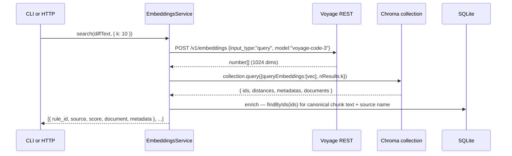

# Day 2 RAG foundation — Chroma vector DB + Voyage embeddings + knowledge corpus seed

This is the implementation-level plan for Day 2 of the 10-day sprint described in [docs/plans/01-baseline.md](01-baseline.md). It expands the parent plan's Day 2 paragraph into concrete implementation units a coding agent can execute.

---

## Summary

Stand up the retrieval half of the RAG pipeline. Run Chroma locally as a Docker Compose service, build an `EmbeddingsModule` that chunks a corpus of code-style rules, embeds each chunk via Voyage AI's `voyage-code-3` model, and stores the vectors in Chroma with metadata. Seed the corpus from two sources committed to the repo: a curated subset of Airbnb's ESLint rules (with hand-enriched descriptions) and ~10 plausible team-standards rules. Verify the loop end-to-end by paving two retrieval surfaces — a dev CLI (`npm run query:rules`) and an HTTP endpoint (`POST /embeddings/search`) — and writing an integration test that proves a violation snippet retrieves the rule it violates.

By end of Day 2 the bot can answer the question *"given this diff, which of our team's rules is it likely to violate?"* — but it does not yet *use Claude* to write a review (that's Day 3) or post comments back to GitHub (Day 5).

---

## Problem Frame

The parent plan defines Day 2 as: *"Can semantically retrieve relevant rules by PR diff content."* That breaks down into five concrete pieces:

1. A locally-running vector DB the API can talk to over HTTP (Chroma via Docker Compose).
2. An embedding provider integration (Voyage AI `voyage-code-3` — chosen over OpenAI/local because (a) Anthropic owns Voyage and the project is Anthropic-first, (b) `voyage-code-3` is code-tuned and the corpus is code rules).
3. Persistent storage for the chunk text + metadata as the source of truth in SQLite, with the vectors mirrored into Chroma keyed by chunk id. SQLite is authoritative; Chroma is the index.
4. A seed corpus committed to the repo with realistic content (curated Airbnb rules + team standards), so retrieval can be exercised meaningfully without a live ESLint-docs fetch.
5. Two retrieval surfaces — a dev CLI for ad-hoc queries and an HTTP endpoint Day 3 can call from the review pipeline — backed by a shared service method.

Day 2 is *retrieval only*. No LLM analysis, no generation, no GitHub interaction. The risk surface is mostly correctness of the embedding write path (right vector dims, right `input_type`, right metadata) and the persistence model (chunk id consistency between SQLite and Chroma). The dominant external dependency is Voyage's rate-limit floor on the free tier — a payment method is required for any meaningful indexing throughput.

---

## Scope

### In scope (Day 2)

- Docker Compose service for Chroma at repo root, with persistent volume and a v2-compatible healthcheck.
- New Drizzle schema: `knowledge_sources` (provenance: airbnb-eslint, team-standards, …) and `knowledge_chunks` (chunk text + metadata + FK to source).
- New repository tokens + SQLite implementations for both tables, wired in `database.module.ts`.
- `ConfigService` extension: `VOYAGE_API_KEY`, `CHROMA_URL` (defaults to `http://localhost:8000`), `CHROMA_COLLECTION` (defaults to `code-style-rules`), `EMBEDDING_MODEL` (defaults to `voyage-code-3`).
- Voyage AI adapter under `apps/api/src/infrastructure/voyage/` exposing an `IEmbeddingProvider` interface defined in `modules/embeddings/types/`. Uses native `fetch` against the REST API; no SDK dependency.
- Chroma adapter under `apps/api/src/infrastructure/chroma/` exposing an `IVectorStore` interface defined in `modules/embeddings/types/`. Uses the `chromadb` v3.x JS client.
- `EmbeddingsModule` under `apps/api/src/modules/embeddings/` exposing:
  - `EmbeddingsService.indexCorpus()` — seed-time write path (read seeds → chunk → embed batch → upsert SQLite + Chroma transactionally).
  - `EmbeddingsService.search(query, opts)` — read path (embed query with `input_type: "query"` → Chroma top-K → enrich with chunk text from SQLite).
- Seed fixtures committed at `apps/api/seeds/`:
  - `airbnb-rules.json` — curated subset of ~30–50 Airbnb rules with hand-enriched `{id, severity, language, category, description, examples}`.
  - `team-standards.json` — ~10 plausible team rules in the same shape.
- Two retrieval surfaces, both calling the same `EmbeddingsService.search()`:
  - `npm run query:rules -- <path-to-diff>` CLI.
  - `POST /embeddings/search` HTTP endpoint, body `{ diff: string, k?: number }`, response `{ hits: [{ rule_id, source, score, document, metadata }] }`.
- Seed runner script: `npm run seed:knowledge` (idempotent — re-running upserts).
- Tests: schema + repository specs, embedding-provider spec (with `fetch` mocked at the transport boundary), vector-store spec (with the Chroma client mocked at the boundary), `EmbeddingsService` unit specs (with provider + store stubbed), and an integration spec that exercises the retrieval surface against a live or stubbed Chroma + a stubbed Voyage to assert hit@K on a fixture violation.
- Setup docs update: extend `docs/setup/github-app.md` (or add `docs/setup/embeddings.md`) covering Chroma compose-up, Voyage signup + payment method, seed run, smoke test.

### Scope Boundaries

#### Deferred to Follow-Up Work

- **Live fetch of full Airbnb ESLint config + rule-doc scraping from eslint.org.** The Airbnb npm package exports rule *settings* (`{ 'no-var': 'error', ... }`), not rule documentation. Production-quality seeding requires either fetching ESLint's rule docs and joining, or scraping the Airbnb style guide HTML. Day 2 ships a curated JSON snapshot so retrieval can be verified on realistic-shape content. Building the live-fetch pipeline is a Day 6+ concern (alongside the eval harness) — at that point a "refresh the corpus" command becomes worth building.
- **Per-hunk diff embedding.** Day 2 embeds the whole diff as one vector (one Voyage call, one Chroma query). The known dilution risk on large diffs is acknowledged but deferred — the parent plan's Day 2 deliverable is "verify retrieval works," not "optimize precision." Day 3+ will revisit if eval shows dilution hurting review quality.
- **Reranking / hybrid search.** No cross-encoder rerank, no BM25 hybrid. Cosine over Voyage embeddings only. Day 6's eval harness will decide whether reranking earns its weight.
- **Embedding-model versioning in metadata.** One collection per model is the convention; the collection name (`code-style-rules` for `voyage-code-3`) carries the version implicitly. Add a `model_version` metadata field only when a second model coexists.
- **Authentication on the `POST /embeddings/search` endpoint.** Day 1 already exposes `/health` unauthenticated. Day 2 adds one more unauthenticated dev endpoint. Day 5 (when GitHub posting goes live) will introduce a proper auth strategy and back-port it.
- **Background-job / queue-based indexing.** Seed runs synchronously inline. Scale-out indexing for large corpora is a real-deployment problem, not a sprint-demo problem.
- **Embedding cache.** Re-embedding identical chunks during dev iteration is wasted Voyage tokens. Worth a small file-based cache later; not Day 2.

#### Out of Scope (Day 3+)

- Anthropic Claude SDK, prompt caching, structured-JSON findings (Day 3).
- Multi-step agent loop and tool use (Day 4).
- Posting review comments back to PRs via Octokit (Day 5).
- Ragas eval harness, precision/recall scoring against expected findings (Day 6).
- Dashboard UI for reviewed PRs (Day 7).
- Token-cost logging, latency telemetry, hallucination flags (Day 8).
- Blog post, architecture diagrams (Day 9).
- Production deployment (Day 10).

---

## Key Technical Decisions

| Decision | Choice | Rationale |
|---|---|---|
| Embedding provider | Voyage AI `voyage-code-3` | Anthropic-owned, code-tuned, ~1024-dim default. Anthropic does not ship a first-party embeddings API; their docs route to Voyage. Anthropic-first project stays single-vendor at the LLM tier; embedding tier picks the Anthropic-aligned partner. |
| Embedding dimension | 1024 (model default) | Voyage `voyage-code-3` supports 256/512/1024/2048. 1024 is the documented default and the right balance for our corpus size. Storing the dim choice in `ConfigService` keeps it swappable. |
| Voyage transport | Native `fetch` against REST endpoint | The REST surface is small (one method we need). The `voyageai` npm SDK adds a dep for marginal benefit; we'd wrap it behind our `IEmbeddingProvider` interface anyway. |
| `input_type` discipline | `"document"` at index, `"query"` at retrieve | Voyage `voyage-code-3` uses asymmetric encoding; mixing degrades recall measurably (per Voyage docs). Encode this in the provider's method signature, not as a free-form arg the caller has to remember. |
| Vector store | Chroma v3.x via Docker Compose at repo root | Decided by parent plan. v3.x JS client is HTTP-only — fits the compose-hosted-server model perfectly. Healthcheck endpoint moved to `/api/v2/heartbeat` in current builds; old `/v1/` tutorials are wrong. |
| Embedding ownership | We pre-compute embeddings and pass vectors to Chroma via `add({ids, embeddings, metadatas, documents})` | Avoids depending on `@chroma-core/voyageai`; keeps the Voyage call observable and cacheable in our code; matches our repository-pattern boundary (the vector store is a key-value index, not an embedding service). |
| Distance metric | Cosine (`space: 'cosine'`) | The canonical choice for text/code embeddings. Voyage outputs are unit-normalized in float mode, so cosine and inner product are effectively equivalent, but cosine is the readable default. Chroma's default is `l2` — must be set explicitly at collection creation. |
| Chunking strategy | One chunk per rule, no overlap | Rules are short (≤300 tokens), self-contained, semantically discrete. Sliding-window chunking would splice rule A's example into rule B's chunk — pure noise. LangChain / LlamaIndex consensus: skip the splitter when source documents are already atomic. |
| Source of truth | SQLite `knowledge_chunks` is authoritative; Chroma indexes vectors keyed by `chunk_id` | Two-store split with one authoritative side avoids drift. If Chroma's data dir is wiped, we can re-embed from SQLite without re-reading seeds. Repository pattern keeps the swap seam (e.g., libsql, Postgres) clean. |
| Persistence transaction model | Insert chunks into SQLite first, then upsert into Chroma; on Chroma failure, leave the SQLite rows (they're idempotent on re-run) | Chroma is the secondary index. Reindexing on next run will catch up. Failing fast on Chroma errors during seed is OK (loud is good); failing fast on query-time misses returns a clear error rather than a silent empty result. |
| Top-K default | K=10 | Multi-concern queries (a PR can violate naming + imports + complexity at once) need more headroom than typical Q&A K=3-5. Cheap enough at Voyage rates; Claude's Day 3 context can still digest 10 short rule chunks easily. CLI flag `--k` makes it tunable. |
| Diff-as-query strategy | Whole diff embedded as one vector, one Chroma query | Day 2 verifies the pipeline. Per-hunk embedding (with union-of-top-K) is sharper but doubles complexity and is the right Day 6 optimization once eval data exists. |
| Seed corpus shape | Two committed JSON files: curated Airbnb subset + agent-generated team standards | Bundled fixtures avoid runtime network dependencies during dev/test. Production-grade seeding (live ESLint docs, scraping) is documented as deferred. JSON over YAML keeps parsing dependency-free. |
| Compose file location | Repo root (`docker-compose.yml`) | No prior precedent in the repo (no infra files exist). Root is conventional for top-level dev services; `apps/api/` is too service-specific when later days may add the dashboard back-end or worker services. |
| Drizzle migration name | `0001_knowledge_sources_and_chunks` | Matches the existing `0000_initial` convention. `npx drizzle-kit generate --name=knowledge_sources_and_chunks` from `apps/api` produces this. |

---

## High-Level Technical Design

Two flows. Both illustrate the intended structure and are directional guidance for review, not implementation specification.

### Seed / index flow (`npm run seed:knowledge`)



### Query flow (CLI + HTTP both call `EmbeddingsService.search()`)



---

## Output Structure

Expected layout at end of Day 2 (per-unit `Files:` sections are authoritative; the implementer may adjust if a cleaner layout emerges):

```
ai-pr-review-copilot/
├── docker-compose.yml              ← NEW (Chroma service)
├── apps/
│   └── api/
│       ├── package.json            ← MODIFY (add chromadb dep + seed/query scripts)
│       ├── seeds/                  ← NEW
│       │   ├── airbnb-rules.json
│       │   └── team-standards.json
│       └── src/
│           ├── app.module.ts       ← MODIFY (register EmbeddingsModule)
│           ├── config/
│           │   └── config.service.ts  ← MODIFY (add Voyage + Chroma + embedding env)
│           ├── infrastructure/
│           │   ├── chroma/                       ← NEW
│           │   │   ├── chroma.module.ts
│           │   │   ├── chroma-vector-store.ts
│           │   │   └── index.ts
│           │   ├── voyage/                       ← NEW
│           │   │   ├── voyage.module.ts
│           │   │   ├── voyage-embedding.provider.ts
│           │   │   └── index.ts
│           │   └── db/
│           │       ├── database.module.ts        ← MODIFY (bind new repos)
│           │       ├── schema/
│           │       │   ├── index.ts              ← MODIFY (export new tables)
│           │       │   ├── knowledge-sources.ts  ← NEW
│           │       │   └── knowledge-chunks.ts   ← NEW
│           │       ├── migrations/
│           │       │   ├── 0001_knowledge_sources_and_chunks.sql  ← NEW (generated)
│           │       │   └── meta/                                    ← MODIFY (drizzle-kit)
│           │       └── repositories/
│           │           ├── sqlite-knowledge-sources.repository.ts  ← NEW
│           │           └── sqlite-knowledge-chunks.repository.ts   ← NEW
│           └── modules/
│               └── embeddings/                   ← NEW
│                   ├── embeddings.module.ts
│                   ├── embeddings.controller.ts  (POST /embeddings/search)
│                   ├── embeddings.service.ts
│                   ├── helpers/
│                   │   └── corpus-loader.ts      (reads + normalizes seeds/*.json)
│                   ├── scripts/
│                   │   ├── seed.ts               (npm run seed:knowledge)
│                   │   └── query.ts              (npm run query:rules)
│                   ├── types/
│                   │   ├── knowledge-source.types.ts
│                   │   ├── knowledge-source.repository.ts
│                   │   ├── knowledge-chunk.types.ts
│                   │   ├── knowledge-chunk.repository.ts
│                   │   ├── embedding-provider.ts        (IEmbeddingProvider + token)
│                   │   ├── vector-store.ts              (IVectorStore + token)
│                   │   └── dto/
│                   │       └── search-request.dto.ts    (class-validator)
│                   └── index.ts
├── docs/
│   └── setup/
│       └── embeddings.md           ← NEW (Chroma + Voyage setup)
└── apps/api/test/                  ← NEW specs mirroring src/
    ├── infrastructure/
    │   ├── chroma/
    │   │   └── chroma-vector-store.spec.ts
    │   ├── voyage/
    │   │   └── voyage-embedding.provider.spec.ts
    │   └── db/repositories/
    │       ├── sqlite-knowledge-sources.repository.spec.ts
    │       └── sqlite-knowledge-chunks.repository.spec.ts
    └── modules/
        └── embeddings/
            ├── embeddings.service.spec.ts
            ├── embeddings.controller.spec.ts
            ├── helpers/corpus-loader.spec.ts
            └── embeddings.e2e-spec.ts            (full retrieval round-trip)
```

---

## Implementation Units

### U1. Drizzle schema: `knowledge_sources` + `knowledge_chunks`

**Goal:** Add the two new tables to the Drizzle schema and generate the `0001_…` migration so subsequent units have a typed persistence surface for the corpus.

**Requirements:** Day 2 parent-plan line 60 ("Embedding pipeline: chunk → embed → store"). SQLite is the source of truth per Key Technical Decisions.

**Dependencies:** none.

**Files:**
- Create: `apps/api/src/infrastructure/db/schema/knowledge-sources.ts`
- Create: `apps/api/src/infrastructure/db/schema/knowledge-chunks.ts`
- Modify: `apps/api/src/infrastructure/db/schema/index.ts` (add barrel exports)
- Create (generated by drizzle-kit): `apps/api/src/infrastructure/db/migrations/0001_knowledge_sources_and_chunks.sql` plus updates to `migrations/meta/_journal.json` and a new `meta/0001_snapshot.json`
- Create: `apps/api/test/infrastructure/db/repositories/sqlite-knowledge-sources.repository.spec.ts` (placeholder skeleton; populated in U2's wiring; actual assertions live with U6's repos)

**Approach:**
- `knowledge_sources`: one row per logical corpus source (e.g., `airbnb-eslint`, `team-standards`). Columns: `id text primary key` (slug), `name text not null`, `description text`, `created_at integer not null` (timestamp_ms).
- `knowledge_chunks`: one row per chunk (one-per-rule per the chunking decision). Columns: `id text primary key` (deterministic from `{source_id}:{rule_id}` — makes upserts safe and ties SQLite row id ↔ Chroma vector id), `source_id text not null` (FK to `knowledge_sources.id`, `onDelete: 'cascade'`), `rule_id text not null`, `title text not null`, `body text not null` (the full chunk content sent to Voyage), `severity text` (enum: `error | warning | info`), `language text` (enum: `javascript | typescript | other`), `category text` (e.g., `style`, `complexity`, `imports`), `embedding_model text not null` (e.g., `voyage-code-3`), `embedding_dim integer not null`, `created_at integer not null`, `updated_at integer not null`.
- Indexes: `idx_knowledge_chunks_source_id` on `source_id`, `idx_knowledge_chunks_rule_id` on `rule_id`. Composite unique on `(source_id, rule_id)` for upsert safety (the deterministic `id` column already enforces this, but the named constraint reads better in `where` clauses).
- Use real column affinities — `timestamp_ms` for dates, `enum` mode for severity/language. Don't store everything as TEXT.
- Generate the migration via `npx drizzle-kit generate --name=knowledge_sources_and_chunks` from `apps/api`. **Do not hand-edit** the generated SQL — fix the schema TS if the SQL is wrong.

**Patterns to follow:**
- `apps/api/src/infrastructure/db/schema/pull-requests.ts` — canonical reference for `sqliteTable`, primary key, enum mode, index naming.
- `apps/api/src/infrastructure/db/schema/webhook-events.ts` — `foreignKey({ columns, foreignColumns, name }).onDelete(...)` pattern.
- `apps/api/src/infrastructure/db/schema/index.ts` — barrel export shape.

**Test scenarios:** *Test expectation: none for this unit — schema is exercised by U2's repositories and U6's service. Verification below is the gate.*

**Verification:**
- `npx drizzle-kit generate --name=knowledge_sources_and_chunks` produces a non-empty `0001_…sql` file with `CREATE TABLE knowledge_sources` and `CREATE TABLE knowledge_chunks` plus the FK and unique constraints.
- `npm test --workspace apps/api` still passes (existing 49 tests; the migration applies automatically in `beforeEach` temp DBs).
- Boot `npm run dev:api`; the new tables are present (`sqlite3 apps/api/data/app.sqlite '.schema'` shows them).

---

### U2. Repositories for `knowledge_sources` + `knowledge_chunks`

**Goal:** Provide the typed read/write surface for the new tables behind interface tokens, so the embeddings module can persist chunks without coupling to the storage engine.

**Requirements:** CLAUDE.md repository pattern (interface + Symbol token in `modules/<owner>/types/`, concrete implementation in `infrastructure/db/repositories/`, wiring in `database.module.ts`).

**Dependencies:** U1.

**Files:**
- Create: `apps/api/src/modules/embeddings/types/knowledge-source.types.ts` (entity type via `InferSelectModel<typeof knowledgeSources>`)
- Create: `apps/api/src/modules/embeddings/types/knowledge-source.repository.ts` (token + interface)
- Create: `apps/api/src/modules/embeddings/types/knowledge-chunk.types.ts`
- Create: `apps/api/src/modules/embeddings/types/knowledge-chunk.repository.ts`
- Create: `apps/api/src/infrastructure/db/repositories/sqlite-knowledge-sources.repository.ts`
- Create: `apps/api/src/infrastructure/db/repositories/sqlite-knowledge-chunks.repository.ts`
- Modify: `apps/api/src/infrastructure/db/database.module.ts` (bind both new tokens to their Sqlite implementations)
- Create: `apps/api/test/infrastructure/db/repositories/sqlite-knowledge-sources.repository.spec.ts`
- Create: `apps/api/test/infrastructure/db/repositories/sqlite-knowledge-chunks.repository.spec.ts`

**Approach:**
- Interface surfaces — keep narrow:
  - `IKnowledgeSourceRepository`: `upsert(record)`, `findById(id)`, `listAll()`.
  - `IKnowledgeChunkRepository`: `upsertMany(records)` (batch for seed throughput), `findById(id)`, `findByIds(ids)` (bulk read for query enrichment), `deleteBySourceId(sourceId)` (for future "rebuild this source" flows; small enough to include now, big risk to omit).
- Entity types derive from the Drizzle schema via `InferSelectModel` — never hand-typed (per CLAUDE.md "the one allowed cross-tier import").
- Concrete impls inject `DatabaseService` and call `this.db.drizzle.insert(...).values(...).onConflictDoUpdate(...).run()` for upserts; `this.db.drizzle.select().from(table).where(...).all()` for reads.
- Wiring in `database.module.ts` adds two provider entries:
  ```ts
  { provide: KNOWLEDGE_SOURCE_REPOSITORY, useClass: SqliteKnowledgeSourcesRepository },
  { provide: KNOWLEDGE_CHUNK_REPOSITORY, useClass: SqliteKnowledgeChunksRepository },
  ```
  …and exports both tokens so consumers can inject them.

**Patterns to follow:**
- `apps/api/src/infrastructure/db/repositories/sqlite-pull-requests.repository.ts` — canonical impl shape (`@Injectable`, constructor `DatabaseService`, drizzle calls).
- `apps/api/src/infrastructure/db/repositories/sqlite-webhook-events.repository.ts` — pattern for FK-bearing entity.
- `apps/api/src/modules/webhooks/types/pull-request.repository.ts` — token + interface pattern.
- `apps/api/test/infrastructure/db/repositories/sqlite-pull-requests.repository.spec.ts` — repo spec shape (tmpdir DB, real SQLite, no driver mocks).

**Test scenarios:**

For `SqliteKnowledgeSourcesRepository`:
- *Happy:* `upsert` then `findById` round-trips all fields.
- *Happy:* `listAll` returns inserted sources in insertion order (or alphabetical — assert whichever the impl chooses).
- *Edge:* `upsert` for an existing `id` updates rather than failing.

For `SqliteKnowledgeChunksRepository`:
- *Happy:* `upsertMany` with 50 records inserts all and `findByIds` returns the same 50.
- *Happy:* `findByIds` preserves order matching input array (so query-result enrichment is positional). If impl returns unsorted, the test asserts a stable sort by id.
- *Edge:* `upsertMany` for existing `(source_id, rule_id)` keys updates instead of duplicating.
- *Edge:* `findByIds([])` returns `[]` without a SQL syntax error.
- *Edge:* `findByIds(['unknown'])` returns `[]` (not undefined, not error).
- *Error:* `upsertMany` with a `source_id` that doesn't exist in `knowledge_sources` raises FK constraint error (proves `PRAGMA foreign_keys=ON` is honored).
- *Edge:* `deleteBySourceId` removes all chunks for that source and returns the count.

**Verification:**
- `npm test --workspace apps/api -- knowledge` passes both repo specs.
- Manual: boot the app, observe in `apps/api/data/app.sqlite` that the tables exist and are empty.

---

### U3. `ConfigService` extension: Voyage + Chroma + embedding env vars

**Goal:** Make `VOYAGE_API_KEY`, `CHROMA_URL`, `CHROMA_COLLECTION`, and `EMBEDDING_MODEL` readable through the typed config gateway. No feature code reads `process.env` directly.

**Requirements:** CLAUDE.md "Environment variables" rule — read only through `ConfigService`. Fail-fast validation at construction.

**Dependencies:** none.

**Files:**
- Modify: `apps/api/src/config/config.service.ts` (add four new readonly properties + validators)
- Modify: `apps/api/.env.example` (add four new entries with placeholder/default comments)
- Modify: `.env.example` (root, keep in sync)
- Modify: `apps/api/test/...` — find existing ConfigService tests if any; add cases for the new env vars (look in `test/` after U1/U2 — Day 1 may have no standalone ConfigService spec, in which case the e2e setup pattern in `webhook.e2e-spec.ts` is what new env vars must work with)

**Approach:**
- New properties:
  - `voyageApiKey: string` — required; reject missing / `"undefined"` / `"null"` / values shorter than 16 chars (use existing `requireSecret` helper).
  - `chromaUrl: string` — optional; default `'http://localhost:8000'` if unset. Validate it parses as a URL with `http` or `https` protocol.
  - `chromaCollection: string` — optional; default `'code-style-rules'`. Validate non-empty, no whitespace.
  - `embeddingModel: string` — optional; default `'voyage-code-3'`. Validate non-empty.
- Validators run in the constructor body next to existing ones; fail-fast preserves the Day 1 contract.
- Update both `.env.example` files: VOYAGE_API_KEY documented as required + how to obtain (link to setup doc from U8); the three Chroma/embedding vars documented with their defaults.

**Patterns to follow:**
- `apps/api/src/config/config.service.ts` lines 13–38 — existing property declaration and `requireSecret` helper.
- The e2e env-override pattern in `apps/api/test/modules/webhooks/webhook.e2e-spec.ts` lines 45–76 — `beforeAll` set, `afterAll` restore, then compile.

**Test scenarios:**
- *Happy:* All four env vars set → `ConfigService` instantiates and exposes the values.
- *Happy:* Only `VOYAGE_API_KEY` set; others unset → instantiates with the documented defaults.
- *Error:* `VOYAGE_API_KEY` missing → constructor throws with a clear message naming the missing var.
- *Error:* `VOYAGE_API_KEY` set to the literal string `"undefined"` → rejected (matches existing webhook-secret validation behavior).
- *Error:* `CHROMA_URL` set to a non-URL or unsupported protocol (`ftp://…`) → rejected.
- *Edge:* `EMBEDDING_MODEL` set to `voyage-3-lite` (a different real Voyage model) → accepted (no allowlist; we don't gate model names).

**Verification:**
- `npm test --workspace apps/api -- config` (or whatever pattern hits ConfigService) passes.
- `npm test --workspace apps/api` all green — Day 1's 49 tests still pass because their `webhook.e2e-spec.ts` env-override block continues to satisfy the constraints (verify the existing block already sets a valid `VOYAGE_API_KEY` or that it doesn't transitively load the new module — if it does, add the var to the override block).

---

### U4. Voyage embedding provider adapter

**Goal:** A NestJS provider that takes an array of strings and returns their `voyage-code-3` embeddings via the Voyage REST API. Honors the `input_type` asymmetric-encoding contract.

**Requirements:** Voyage-as-embedding-provider Key Technical Decision. CLAUDE.md tier rule — Voyage is an external service, so it lives under `infrastructure/voyage/`.

**Dependencies:** U3 (for `voyageApiKey`).

**Execution note:** Write the provider's tests first, mocking `fetch` at the transport boundary. The provider's correctness (right URL, right headers, right body shape, right `input_type` per method) is the spec — easier to lock in via tests than to debug from a misshapen Voyage call.

**Files:**
- Create: `apps/api/src/modules/embeddings/types/embedding-provider.ts` (`EMBEDDING_PROVIDER` Symbol + `IEmbeddingProvider` interface)
- Create: `apps/api/src/infrastructure/voyage/voyage-embedding.provider.ts`
- Create: `apps/api/src/infrastructure/voyage/voyage.module.ts`
- Create: `apps/api/src/infrastructure/voyage/index.ts`
- Create: `apps/api/test/infrastructure/voyage/voyage-embedding.provider.spec.ts`

**Approach:**
- Interface (`IEmbeddingProvider`) exposes two methods to encode the `input_type` discipline at the type level:
  - `embedDocuments(texts: string[]): Promise<{ vectors: number[][]; tokensUsed: number }>`
  - `embedQuery(text: string): Promise<{ vector: number[]; tokensUsed: number }>`
  Plus `readonly modelName: string` and `readonly dimension: number` so consumers can persist provenance.
- `VoyageEmbeddingProvider` implements both:
  - Posts to `https://api.voyageai.com/v1/embeddings` with `Authorization: Bearer ${voyageApiKey}`, `Content-Type: application/json`.
  - Request body: `{ input, model: embeddingModel, input_type: "document"|"query", output_dimension: 1024, truncation: true }`.
  - Response: `{ data: [{ embedding: number[], index }], usage: { total_tokens } }`. Reassemble `embedding`s in input order.
  - Batches: chunk inputs into batches of ≤128 strings to stay well under Voyage's 1000-input / 120K-token-per-request caps (the corpus is small enough that one batch fits everything, but the loop guards future growth).
  - Errors: surface 4xx/5xx with body included; raise a typed error class (`VoyageRequestError`) carrying status + Voyage error code. Do not silently retry — let the caller decide.
- `VoyageModule` binds `EMBEDDING_PROVIDER` token to `VoyageEmbeddingProvider` and exports it. Other modules import `VoyageModule` (not the class directly) and `@Inject(EMBEDDING_PROVIDER)`.
- No SDK dependency. The native `fetch` global is available on Node 24.

**Patterns to follow:**
- `apps/api/src/infrastructure/db/database.module.ts` — module shape that binds an interface token to a concrete class.
- `apps/api/src/guards/signature-verification.guard.ts` — example of a security-sensitive class with tight, focused tests.

**Test scenarios:**
- *Happy:* `embedDocuments(["a", "b", "c"])` posts once to the right URL with `input_type: "document"`, returns three 1024-dim vectors in input order. Assert auth header, body shape, response parsing.
- *Happy:* `embedQuery("diff text")` posts with `input_type: "query"`, returns one vector.
- *Edge:* `embedDocuments([])` returns `{ vectors: [], tokensUsed: 0 }` without calling Voyage (short-circuit).
- *Edge:* Input array of 200 strings is split into two batches of ≤128, each posted separately, results concatenated in original order.
- *Error:* Voyage responds 401 → throws `VoyageRequestError` with `status: 401` and the response body included.
- *Error:* Voyage responds 429 → throws `VoyageRequestError` with `status: 429` (no auto-retry; caller decides).
- *Error:* Voyage responds 200 but with `data.length` ≠ input length → throws clear error (defensive against API drift).
- *Error:* Network error (`fetch` rejects) → throws `VoyageRequestError` with the wrapped cause.

**Verification:**
- `npm test --workspace apps/api -- voyage` passes all cases above.
- Manual smoke (optional, requires a real `VOYAGE_API_KEY`): a small one-off script in the spec's `describe.skip(...)` block proves a real call returns a 1024-element array. Keep skipped in CI.

---

### U5. Chroma vector store adapter

**Goal:** A NestJS provider that wraps the `chromadb` v3.x JS client and exposes a narrow `IVectorStore` interface for upserts and top-K queries. Hides the v3 client surface from feature code so future swaps (e.g., Qdrant) only touch this file.

**Requirements:** Chroma-as-vector-store Key Technical Decision. CLAUDE.md tier rule — Chroma lives under `infrastructure/chroma/`.

**Dependencies:** U3 (for `chromaUrl`, `chromaCollection`).

**Files:**
- Create: `apps/api/src/modules/embeddings/types/vector-store.ts` (`VECTOR_STORE` Symbol + `IVectorStore` interface)
- Create: `apps/api/src/infrastructure/chroma/chroma-vector-store.ts`
- Create: `apps/api/src/infrastructure/chroma/chroma.module.ts`
- Create: `apps/api/src/infrastructure/chroma/index.ts`
- Create: `apps/api/test/infrastructure/chroma/chroma-vector-store.spec.ts`
- Modify: `apps/api/package.json` (add `chromadb` dep pinned to current v3.x)

**Approach:**
- Interface (`IVectorStore`):
  - `ensureCollection(): Promise<void>` — idempotent `getOrCreateCollection({ name, configuration: { hnsw: { space: 'cosine' } } })`. Called at module init (or first use) so seed runs don't race.
  - `upsert(items: Array<{ id: string; embedding: number[]; document: string; metadata: Record<string, string | number | boolean> }>): Promise<void>` — calls `collection.upsert({ ids, embeddings, documents, metadatas })`.
  - `query(opts: { embedding: number[]; k: number; where?: Record<string, unknown> }): Promise<Array<{ id: string; score: number; document: string | null; metadata: Record<string, unknown> }>>` — calls `collection.query({ queryEmbeddings: [opts.embedding], nResults: opts.k, where: opts.where })`, unwraps the nested-by-query response, converts Chroma's distance to a `score` (`1 - distance` for cosine so higher = better).
  - `deleteAll(): Promise<void>` — `collection.delete({})` for test isolation and rebuild-from-scratch flows.
- `ChromaVectorStore` constructor reads `chromaUrl` from `ConfigService`, parses it into `{host, port, ssl}` for the v3 client init (`new ChromaClient({ host, port, ssl })`). Stores the collection name; calls `ensureCollection()` in `onModuleInit`.
- `ChromaModule` binds `VECTOR_STORE` token to `ChromaVectorStore` and exports it.
- Pin `chromadb` to the current v3.x version with prebuilt binaries for Node 24 (verify at impl time per "Deferred to Implementation").

**Patterns to follow:**
- `apps/api/src/infrastructure/db/database.service.ts` — example of an infra service with `onModuleInit` / `onApplicationShutdown` lifecycle hooks.
- `apps/api/src/infrastructure/db/database.module.ts` — `@Global()` module that binds a token to a class.

**Test scenarios:**

Mock the `chromadb` client at the boundary (don't hit a real Chroma in unit tests; integration coverage lives in U8's e2e spec).

- *Happy:* `ensureCollection` calls `getOrCreateCollection` with the configured name and `space: 'cosine'`. Idempotent — calling twice doesn't error.
- *Happy:* `upsert` with 5 items calls `collection.upsert` with parallel arrays in matching order (ids, embeddings, documents, metadatas).
- *Happy:* `query({embedding, k: 10})` calls `collection.query` with `queryEmbeddings: [embedding]` and `nResults: 10`. Result transformation: nested `{ids: [[a, b]], distances: [[0.1, 0.4]], ...}` flattens to `[{id: 'a', score: 0.9, ...}, {id: 'b', score: 0.6, ...}]` (cosine: `score = 1 - distance`).
- *Edge:* `query` with `where` filter passes through to the client.
- *Edge:* `query` returns zero results → method returns `[]` (not error).
- *Edge:* URL parsing handles `http://localhost:8000` (port 8000), `https://chroma.example.com` (port 443, ssl true), and `http://host:1234/` (trailing slash).
- *Error:* `upsert` with mismatched array lengths is caught by the interface layer before reaching the client (defensive type guard) — return a typed error.
- *Error:* Chroma client throws → method re-throws as `ChromaRequestError` with original cause.

**Verification:**
- `npm test --workspace apps/api -- chroma` passes.
- Manual (with `docker compose up chroma` from U6): boot the app; check the log line confirms the collection exists in Chroma (`curl http://localhost:8000/api/v2/collections`).

---

### U6. Docker Compose service for Chroma

**Goal:** A repo-root `docker-compose.yml` that brings up Chroma on `localhost:8000` with persistent storage and a working healthcheck. One command (`docker compose up chroma` or `docker compose up -d`) to start it.

**Requirements:** Day 2 parent-plan line 61 ("Chroma local instance via Docker Compose").

**Dependencies:** none.

**Files:**
- Create: `docker-compose.yml` (repo root)
- Modify: `.gitignore` (add `chroma-data/` for the Chroma volume mount; also verify that `apps/api/data/` and `apps/api/.env` are already covered by existing rules before committing — the seeded SQLite database and the `VOYAGE_API_KEY`-bearing `.env` file must never be committed)

**Approach:**
- Single service `chroma` using `chromadb/chroma:<pinned-v1.x>` (pin to a specific tag; don't use `:latest` — resolve the exact tag from Docker Hub at impl time per "Deferred to Implementation").
- Port mapping: `8000:8000`.
- Volume: `./chroma-data:/data` (bind-mount keeps the data inspectable; the `/data` path inside the container is the current convention, not the legacy `/chroma/chroma`).
- Healthcheck: `curl -f http://localhost:8000/api/v2/heartbeat || exit 1` with `interval: 30s, timeout: 10s, retries: 3, start_period: 20s`. **Note v2 path** — older tutorials show `/api/v1/heartbeat`, which is removed in current builds.
- `restart: unless-stopped` so the service comes back after Docker Desktop restarts.
- No env vars needed for default dev — the legacy `IS_PERSISTENT` / `PERSIST_DIRECTORY` are obsolete in the current Rust-based server.
- Add `chroma-data/` to `.gitignore` so the persisted volume doesn't pollute git.
- Document the compose command in U8's setup doc.

**Patterns to follow:**
- None in the repo (no prior Docker presence). External pattern: the official `docker-compose.yml` in the chroma-core/chroma repo, trimmed to one service.

**Test scenarios:** *Test expectation: none — compose YAML. Verified by U8's integration test booting against a running Chroma plus the manual verification below.*

**Verification:**
- `docker compose up -d chroma` starts the container; `docker compose ps` shows it healthy after ~20s.
- `curl http://localhost:8000/api/v2/heartbeat` returns 200 with a JSON timestamp.
- `docker compose down` cleanly stops; `./chroma-data/` persists; restarting reuses the same data.

---

### U7. `EmbeddingsModule` — corpus loader, service, seed runner, controller

**Goal:** The core feature module that chunks → embeds → stores at seed time and embeds query → retrieves → enriches at search time. Both retrieval surfaces (CLI in U8, HTTP endpoint here) call its `search()` method.

**Requirements:** Day 2 parent-plan lines 60-63 in their entirety.

**Dependencies:** U2 (repos), U4 (embedding provider), U5 (vector store). Seed runner requires U8's seed fixtures to actually run end-to-end, but the module itself depends only on the repos and adapters.

**Files:**
- Create: `apps/api/src/modules/embeddings/embeddings.module.ts`
- Create: `apps/api/src/modules/embeddings/embeddings.service.ts`
- Create: `apps/api/src/modules/embeddings/embeddings.controller.ts`
- Create: `apps/api/src/modules/embeddings/helpers/corpus-loader.ts`
- Create: `apps/api/src/modules/embeddings/types/dto/search-request.dto.ts` (class-validator: `diff: string` non-empty, `k?: number` int 1-100)
- Create: `apps/api/src/modules/embeddings/scripts/seed.ts`
- Create: `apps/api/src/modules/embeddings/index.ts`
- Modify: `apps/api/src/app.module.ts` (register `EmbeddingsModule`; import `VoyageModule` + `ChromaModule` from U4/U5)
- Modify: `apps/api/package.json` (add `"seed:knowledge": "ts-node -r tsconfig-paths/register src/modules/embeddings/scripts/seed.ts"` — the `-r tsconfig-paths/register` flag is mandatory because the script imports through the `@/` path alias and `ts-node` does not resolve TS path aliases without it; `tsconfig-paths` is already a devDep in `apps/api/package.json`)
- Create: `apps/api/test/modules/embeddings/embeddings.service.spec.ts`
- Create: `apps/api/test/modules/embeddings/embeddings.controller.spec.ts`
- Create: `apps/api/test/modules/embeddings/helpers/corpus-loader.spec.ts`

**Approach:**
- `CorpusLoader` (pure helper): reads `apps/api/seeds/airbnb-rules.json` and `apps/api/seeds/team-standards.json`, normalizes each rule to a `KnowledgeChunkInput`: `{ source_id, rule_id, title, body, severity, language, category }`. `body` is the concatenation `${title}\n\n${description}\n\nBad:\n${examples.bad}\n\nGood:\n${examples.good}` so the embedding captures the full rule context. `id` is computed `${source_id}:${rule_id}` (deterministic — re-runs upsert cleanly).
- `EmbeddingsService.indexCorpus()`:
  - Loads inputs via `CorpusLoader`.
  - Upserts the two `knowledge_sources` rows (airbnb-eslint, team-standards).
  - For each batch of 128 chunks: calls `provider.embedDocuments(bodies)`; persists chunks to SQLite via `chunkRepo.upsertMany(...)` with `embedding_model` + `embedding_dim` metadata; upserts vectors to Chroma via `vectorStore.upsert(...)` with `{id, embedding, document: body, metadata: { source: source_id, rule_id, severity, language, category }}`.
  - Returns `{ insertedSources: number, upsertedChunks: number, totalTokens: number }` for the seed CLI to print.
  - Order discipline: SQLite first, then Chroma. If Chroma fails, throw — the next seed run will catch up because SQLite is the source of truth.
- `EmbeddingsService.search(diff, opts)`:
  - Validates `diff` non-empty.
  - Calls `provider.embedQuery(diff)` → 1 vector.
  - Calls `vectorStore.query({embedding, k: opts.k ?? 10, where: opts.where})` → list of hits.
  - Calls `chunkRepo.findByIds(hits.map(h => h.id))` to get canonical chunk text + source name from SQLite (don't trust Chroma's `document` field for display — it's a denormalized copy).
  - Joins hits ↔ chunks; returns `[{ rule_id, source, score, document, metadata }]` ordered by score descending.
- `EmbeddingsController`: `@Controller('embeddings')` with `@Post('search')` taking `SearchRequestDto`, calling `service.search(dto.diff, { k: dto.k })`, returning `{ hits: [...] }`. Thin, no logic.
- Seed runner (`scripts/seed.ts`): uses `NestFactory.createApplicationContext(AppModule)` (no HTTP), resolves `EmbeddingsService`, calls `indexCorpus()`, logs results, exits. Idempotent — running twice produces no errors and updates `updated_at` timestamps.
- `EmbeddingsModule` imports `DatabaseModule`, `VoyageModule`, `ChromaModule`; declares `EmbeddingsController`, `EmbeddingsService`, `CorpusLoader`; exports `EmbeddingsService` (Day 3 will inject it from the review module).

**Patterns to follow:**
- `apps/api/src/modules/webhooks/webhook.module.ts` — module shape.
- `apps/api/src/modules/webhooks/webhook.controller.ts` — thin controller delegating to service.
- `apps/api/src/modules/webhooks/webhook.service.ts` lines 22-28 — `@Inject(TOKEN)` for injected interfaces.
- `apps/api/test/modules/webhooks/webhook.service.spec.ts` — service spec shape with stubbed dependencies.

**Test scenarios:**

For `CorpusLoader`:
- *Happy:* Loads both fixture files, returns the right total count and shape; assert one specific known rule (e.g., `eqeqeq`) has the expected `body` concatenation.
- *Edge:* Missing fixture file throws a clear error naming the missing path.
- *Edge:* Fixture file with malformed JSON throws a clear error.
- *Edge:* Rule with missing `examples.good` falls back to `body` without the "Good:" section (or fails validation — pick one, test it).

For `EmbeddingsService.indexCorpus()` (provider + store + repos stubbed):
- *Happy:* Loads 40 fixture chunks → calls `embedDocuments` (once if batch ≥40, else twice) → upserts 2 sources + 40 chunks to SQLite → upserts 40 vectors to Chroma. Returns `{insertedSources: 2, upsertedChunks: 40, totalTokens: <stub>}`.
- *Happy:* Running twice produces the same final state (idempotent).
- *Edge:* Empty corpus (both seed files empty arrays) → no embed calls, no SQLite writes, no Chroma writes, returns zeros without erroring.
- *Error:* `provider.embedDocuments` throws → SQLite and Chroma are *not* written for that batch (verify with stub assertions). The error propagates.
- *Error:* `chunkRepo.upsertMany` throws → `vectorStore.upsert` is *not* called (ordering invariant).
- *Error:* `vectorStore.upsert` throws after SQLite succeeded → error propagates; SQLite rows remain (intentional — they get re-attempted next run).
- *Integration scenario:* `indexCorpus` batches: 200 chunks in input → `embedDocuments` called twice with 128 + 72 inputs respectively (verifies the batching loop). Use a stub that records calls.

For `EmbeddingsService.search()`:
- *Happy:* `search("some diff", {k: 5})` → calls `embedQuery` once, `vectorStore.query` once with `nResults: 5`, `findByIds` with the returned ids, returns enriched hits in score-descending order.
- *Happy:* `score` field is `1 - distance` (verify with known input distances 0.1, 0.4 → scores 0.9, 0.6).
- *Edge:* Empty diff → throws validation error before any provider/store calls.
- *Edge:* Vector store returns zero hits → service returns `[]` without calling `findByIds` (or with empty array — either is fine, assert the actual choice).
- *Edge:* Vector store returns ids that don't exist in SQLite (drift between stores) → those hits are dropped silently with a warning log, remaining hits returned. *(This is the failure mode that proves "SQLite is source of truth" semantically — Chroma is allowed to be out of date.)*
- *Error:* `embedQuery` throws → error propagates with original cause.

For `EmbeddingsController`:
- *Happy:* `POST /embeddings/search` with valid body → service called, response shape `{ hits: [...] }`.
- *Error:* Missing `diff` → 400 validation error from class-validator.
- *Error:* `k: 0` or `k: 101` → 400 (range validator).
- *Error:* `k: "ten"` → 400 (type validator).

**Verification:**
- `npm test --workspace apps/api -- embeddings` passes all service/controller/helper specs.
- `npm test --workspace apps/api` all green (Day 1's 49 + Day 2's new tests).
- Manual (with Chroma up + a real Voyage key): `npm run seed:knowledge` exits cleanly and prints non-zero counts.

---

### U8. Seed fixtures + dev CLI + integration test + setup docs

**Goal:** The content and end-user-facing surface that prove Day 2 works: a curated rule corpus, a dev CLI for ad-hoc queries, an integration test that proves end-to-end retrieval, and setup docs that walk a fresh contributor through the loop.

**Requirements:** Day 2 parent-plan line 62 ("Seed with real ruleset: Airbnb style guide + sample team review standards"), line 63 ("Manual retrieval test: paste a diff, get back top-K rules").

**Dependencies:** U6 (Chroma running), U7 (module + seed runner).

**Files:**
- Create: `apps/api/seeds/airbnb-rules.json` — curated ~30-50 rules
- Create: `apps/api/seeds/team-standards.json` — ~10 plausible team rules
- Create: `apps/api/src/modules/embeddings/scripts/query.ts` — dev CLI
- Modify: `apps/api/package.json` (add `"query:rules"` script)
- Create: `apps/api/test/modules/embeddings/embeddings.e2e-spec.ts` — integration test with retrieval assertions
- Create: `apps/api/test/fixtures/diffs/eqeqeq-violation.patch` (and 2-3 more known-violation snippets)
- Create: `docs/setup/embeddings.md` — setup walkthrough
- Modify: `README.md` (link to the new setup doc; add `Day 2 — RAG foundation` to status table)

**Approach:**
- **`airbnb-rules.json`**: array of ~30-50 rules drawn from Airbnb's JavaScript style guide, hand-enriched. Each entry: `{ id, severity, language, category, title, description, examples: { bad, good } }`. Examples to include (the implementer can extend): `no-var`, `prefer-const`, `eqeqeq`, `no-unused-vars`, `import/order`, `import/no-default-export`, `arrow-body-style`, `prefer-template`, `no-param-reassign`, `max-lines-per-function`, `complexity`, `consistent-return`, `no-else-return`, `prefer-destructuring`, `object-shorthand`. Use concrete, paste-able code examples — they make the embedding signal sharp.
- **`team-standards.json`**: ~10 rules in the same shape, written to look like a real team's standards. Examples to include (illustrative — the implementer should produce content of similar tone): "Guards live in src/guards/, never inside feature modules" (category: architecture); "All env access goes through ConfigService" (category: architecture); "Repository interfaces live in modules/<owner>/types/, implementations in infrastructure/" (category: architecture); "Tests mirror the src/ tree exactly" (category: testing); "Never add Co-Authored-By: Claude to commits" (category: process); etc. These mirror the team conventions in CLAUDE.md so the demo feels coherent.
- **`scripts/query.ts`**: same `NestFactory.createApplicationContext(AppModule)` bootstrap as the seed runner. Reads diff text from a file arg (`process.argv[2]`) or stdin if no arg. Accepts `--k=<n>` flag (default 10). Calls `EmbeddingsService.search()`, prints results as a small table (`rule_id | source | score | title — first line of body`). Exits 0 on success, 1 on error.
- **`package.json` script**: `"query:rules": "ts-node -r tsconfig-paths/register src/modules/embeddings/scripts/query.ts"`. The `-r tsconfig-paths/register` flag is required for the same reason as the seed script (`@/` path alias resolution at TS-runtime). Usage from repo root: `npm run query:rules --workspace apps/api -- test/fixtures/diffs/eqeqeq-violation.patch`. Optionally add a root delegator (`"query:rules": "npm run query:rules --workspace apps/api"`) per the `dev:api` precedent.
- **Integration test (`embeddings.e2e-spec.ts`)**: the hit@K smoke test. Setup:
  - Stand up the full `AppModule` in a tmpdir DB.
  - Stub `EMBEDDING_PROVIDER` with a deterministic fake (e.g., a simple bag-of-words → 1024-dim vector so we don't hit Voyage in CI) — OR use a real Voyage call gated by `process.env.RUN_INTEGRATION === 'true'`, defaulting to the stub. **Recommendation: stub in CI.** A non-stub test is documented as a `.skip` block that's manually unskipped for local verification.
  - Stub `VECTOR_STORE` similarly with an in-memory implementation that does naive cosine over the stub-embedded chunks — proves the orchestration without depending on a running Chroma in CI. The real-Chroma path is verified by the manual smoke in U7's verification.
  - Seed the corpus from fixtures.
  - For 3 known violation snippets (eqeqeq, no-var, max-lines-per-function), `POST /embeddings/search` with the snippet and assert the expected `rule_id` appears in top-10. This is `Hit@10 = 1.0` on a micro-eval — the documented Day 2 success bar.
- **Setup doc (`docs/setup/embeddings.md`)** covers:
  - One-time: sign up at voyageai.com, attach a payment method (mention the 3 RPM free-tier limit and why), generate API key, paste into `apps/api/.env` as `VOYAGE_API_KEY=...`.
  - Daily: `docker compose up -d chroma`, `npm run seed:knowledge --workspace apps/api`, `npm run query:rules --workspace apps/api -- some.patch`.
  - Troubleshooting: Chroma healthcheck failing (check `/api/v2/heartbeat`, not v1), Voyage 429s (check rate-limit tier, attach payment), SQLite migration drift (the existing `rm -f apps/api/data/app.sqlite*` recipe carries over).

**Patterns to follow:**
- `apps/api/test/modules/webhooks/webhook.e2e-spec.ts` — e2e shape: temp DB, full `AppModule`, supertest.
- `docs/setup/github-app.md` — setup-doc voice and structure.

**Test scenarios:** Covered by the integration spec above. Fixture files have no test of their own (they're data; corpus-loader's spec in U7 already covers parsing).

**Verification:**
- `npm test --workspace apps/api -- embeddings.e2e` passes the hit@10 assertions on all 3 fixture violations.
- `npm test --workspace apps/api` reports 49 + N new tests green (N depends on per-unit count).
- Manual end-to-end (the parent plan's Day 2 verification gate): `docker compose up -d chroma`, `npm run seed:knowledge --workspace apps/api`, `npm run query:rules --workspace apps/api -- <some patch with var x = 1>`. Output table includes `no-var` in the top-K.
- Setup doc dogfood: in a fresh shell, follow `docs/setup/embeddings.md` from scratch. Time it. If it takes longer than 20 minutes (excluding waiting for `docker pull`), the docs are wrong.

---

## System-Wide Impact

| Surface | Impact |
|---|---|
| **Persistence** | Two new tables, one new migration. Existing tests automatically pick up the migration via `DatabaseService.open()` → `migrate(...)`. Old dev DBs need the same `rm -f apps/api/data/app.sqlite*` recipe documented in the project handoff if migration application surfaces drift. |
| **Environment** | Four new env vars (`VOYAGE_API_KEY` required; `CHROMA_URL`, `CHROMA_COLLECTION`, `EMBEDDING_MODEL` with defaults). Documented in both `.env.example` files and the new setup doc. `webhook.e2e-spec.ts`'s env-override block likely needs `VOYAGE_API_KEY` added (verify at impl time — if its `AppModule` load transitively constructs `ConfigService`, the new required var will fail-fast there too). |
| **Native deps & runtime** | `chromadb` is a pure-JS npm dep (no native build). No `better-sqlite3`-style rebuild headaches. Adds ~5MB to `node_modules`. |
| **Docker dependency** | Day 2 introduces Docker as a development requirement (Day 1 had none). Document the Docker Desktop install in `docs/setup/embeddings.md`; CI doesn't need Docker because the e2e test uses in-memory stubs. |
| **External services** | Voyage AI (commercial, attached payment method required for real rate limits). Outage in Voyage breaks the seed run and the query path. Day 6+ can add an embedding cache to soften this. |
| **CI** | No CI changes. Existing workflow runs `npm test --workspaces --if-present`; the new tests use stubs so they don't need a running Chroma or a real Voyage key. **Required:** the integration spec must default to stubbed dependencies, never call out to Voyage or Chroma from CI. |
| **HTTP surface** | New unauthenticated `POST /embeddings/search` endpoint. Matches Day 1's unauthenticated `/health`. Day 5's auth work back-ports across both. |
| **GitHub App permissions** | No change; Day 2 doesn't touch the GitHub integration. |

---

## Deferred to Implementation

Genuinely-unknowable-until-execution items the implementing agent should resolve in `ce-work`:

- **Exact `chromadb` npm version.** Pin to the current v3.x with prebuilt binaries and a stable client surface for Node 24. Check at install time.
- **Exact `chromadb/chroma` Docker image tag.** Pin to a specific 1.x patch from Docker Hub; do not use `:latest`. The major version is stable; the patch version is what the implementer picks at compose-writing time.
- **TS script runner for `seed.ts` and `query.ts`.** `ts-node` is the path-of-least-resistance and matches the NestJS conventional dev-time setup. If the repo already standardizes on `tsx` or compiled-dist, follow that. Document the choice in the script's shebang/comment.
- **Whether the e2e spec's in-memory `IVectorStore` stub deserves its own helper file** (`apps/api/test/helpers/in-memory-vector-store.ts`) or lives inline in the spec. Inline first; promote to a helper if a second spec wants it.
- **Voyage SDK vs raw fetch (final).** The plan picks raw fetch. If at impl time the SDK ergonomics are dramatically better than the plan assumed (auto-retry, typed errors), the implementer may pull it in. Update the Key Technical Decisions row with the rationale.
- **Voyage `output_dimension` confirmation.** Plan assumes 1024 default. Confirm by inspecting an actual `data[0].embedding.length` on first call; update the `embedding_dim` schema default if it differs.
- **Exact curated Airbnb rule list.** The plan gives 15 example rule ids; the implementer picks ~30-50 from the Airbnb style guide that have clear bad/good examples. Keep the count under 50 for Day 2 (cheap embed, fast iteration).

---

## Risks and Mitigations

| Risk | Likelihood | Mitigation |
|---|---|---|
| Voyage 429s during seed kill the run | Medium | Recommend payment method in setup doc; corpus is small (~50 chunks → 1-2 requests) so single-run throughput is well below rate limit. Service surfaces 429 as a typed error so the user knows what to fix. |
| Voyage 401s (typo'd API key) | Medium | `ConfigService` fail-fast catches missing/short keys at boot. Real 401 from Voyage surfaces with the response body included. Setup doc explicitly says "paste key, restart api." |
| `chromadb` v3 API drifts mid-sprint | Low | Pin to a specific patch version. Sub-second to swap if drift is breaking. |
| Chroma container fails healthcheck because docs/tutorials still reference `/api/v1/heartbeat` | Medium | Plan explicitly calls out v2 path. Setup doc explicitly says v2. Healthcheck failure surfaces fast via `docker compose ps`. |
| In-memory vector-store stub diverges from real Chroma behavior, hiding a real bug | Medium | The integration spec proves orchestration; the manual smoke in U7 (`npm run seed:knowledge` against real Chroma) proves real Chroma. CI catches structural breaks; manual catches semantic divergence. Day 6's eval harness will tighten this. |
| Whole-diff embedding produces noisy results on real-size PRs | High | Documented as a Day 2 limitation. Per-hunk embedding is the Day 6+ optimization, gated on eval data showing it matters. |
| Seed corpus is too small / too contrived to be a real test signal | Medium | The 3-fixture hit@10 smoke test is a sanity check, not a quality bar. Real corpus growth lands when live ESLint-doc fetch lands (deferred). |
| `webhook.e2e-spec.ts` breaks because constructing `AppModule` now requires `VOYAGE_API_KEY` | High | The plan flags this in System-Wide Impact. Add `VOYAGE_API_KEY` to the existing env-override block in `beforeAll`. |
| Test isolation across runs — Chroma collection persists data across CI invocations if anyone wires a real Chroma in | Low | In-CI integration uses in-memory stub; real-Chroma path is local-only. If a future day adds real-Chroma integration tests, they must call `vectorStore.deleteAll()` in `beforeEach`. |

---

## Requirements Trace

Day 2 deliverables from `docs/plans/01-baseline.md` lines 58-63:

| Parent-plan deliverable | Covered by |
|---|---|
| "Chroma local instance via Docker Compose" | U6 (compose) + U5 (client adapter) |
| "Embedding pipeline: chunk → embed (text-embedding-3-small or Claude embeddings) → store" | U1 (schema) + U2 (repos) + U4 (Voyage provider — *chosen over text-embedding-3-small / Claude embeddings; rationale in Key Technical Decisions*) + U7 (orchestration) |
| "Seed with real ruleset: Airbnb style guide + sample team review standards" | U7 (`indexCorpus` mechanism) + U8 (curated fixtures, including agent-generated team standards per user direction) |
| "Manual retrieval test: paste a diff, get back top-K rules" | U7 (search service + HTTP endpoint) + U8 (CLI script + integration test that proves hit@10) |

Additional plan-level deliverables (not in parent plan, justified above):

- New env-var contract via `ConfigService` (U3) — required by the project's no-bare-`process.env` rule from CLAUDE.md.
- Repository pattern coverage for the new tables (U2) — required by the project's persistence convention.
- Setup doc + README update (U8) — required so re-clones can reach a working Day 2 loop in <20 minutes.

---

## Execution Strategy Hint for `ce-work`

Dependency graph between units:

```
U1 (drizzle schema)         U6 (compose)
 └── U2 (repos)              │
U3 (config)                  │
 ├── U4 (voyage)             │
 └── U5 (chroma client) ─────┘
        │
        └── (U2 + U4 + U5) ─── U7 (embeddings module) ──── U8 (seeds + CLI + e2e + docs)
```

Suggested order: **(U1 ∥ U3 ∥ U6) → U2 → (U4 ∥ U5) → U7 → U8**.

- U1, U3, U6 are independent and can parallelize (disjoint file trees: db/schema, config, repo-root compose).
- U4 and U5 are independent and can parallelize after U3 (disjoint: infrastructure/voyage vs infrastructure/chroma).
- U2 depends on U1; U7 depends on U2 + U4 + U5; U8 depends on U7 + U6.

`ce-work` may dispatch (U1, U3, U6) and later (U4, U5) as parallel subagents — the Parallel Safety Check should pass cleanly because file trees are disjoint and there are no shared mutable resources. All other transitions are serial.
