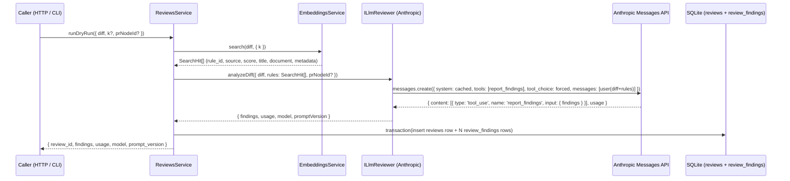

# Day 3 Claude integration — Anthropic SDK + structured findings + reviews persistence

This is the implementation-level plan for Day 3 of the 10-day sprint described in [docs/plans/01-baseline.md](01-baseline.md). It expands the parent plan's Day 3 paragraph into concrete implementation units a coding agent can execute.

---

## Summary

Wire Claude into the review loop. Add an `infrastructure/anthropic/` adapter that talks to the Anthropic Messages API via `@anthropic-ai/sdk`, using prompt caching on the static system prompt + tool schema and `tool_use` forced-call to extract a structured `report_findings` payload. Build a new `reviews` feature module that orchestrates the pipeline: take a PR diff, call `EmbeddingsService.search()` for the top-K candidate rules, hand the diff + rules to Claude, parse the tool-call findings, and persist a `reviews` row + N `review_findings` rows. Expose two surfaces — `POST /reviews/dry-run` (rate-limited, gated by `ENABLE_DRY_RUN`) and `npm run review:dry-run -- <diff-path>` — both backed by the same `ReviewsService.runDryRun()` method.

By end of Day 3 the bot can answer the question *"given this diff, which of our team's retrieved rules does it violate?"* and write the answer to SQLite. It does not yet post comments back to GitHub (Day 5) and does not yet drive a multi-step agent loop (Day 4).

Each call costs approximately 1–5¢ depending on cache state (cold Sonnet ~$0.04–0.10; warm cache halves it). This is the project's first production-spend code path. A session-spend counter logged at the end of every CLI invocation makes the running cost visible; a budget of ~$5 covers Day-3 dev iteration comfortably.

---

## Problem Frame

The parent plan defines Day 3 as: *"First automated review running on a test PR."* That breaks down into four concrete pieces:

1. A typed Claude client wrapped behind an interface so the reviewer doesn't couple to `@anthropic-ai/sdk` symbols directly, with prompt caching for the static prefix and `tool_use` for the dynamic output.
2. A new `reviews` feature module that reuses the Day-2 `EmbeddingsService.search()` output verbatim — no re-implementation of retrieval — and chains it into the Claude call.
3. Persistence for the synthesized result: a parent `reviews` row capturing the API call (model, prompt version, token usage, status) and a child `review_findings` row per violation, joined by FK with cascade delete.
4. Two ergonomic surfaces (`POST /reviews/dry-run` + CLI) so the loop can be exercised end-to-end without a GitHub webhook, mirroring the Day-2 two-surface pattern.

The dominant risk surface is correctness of the prompt + tool schema (cache hits depend on the static prefix staying byte-identical across calls; tool-call parsing depends on Claude returning the forced tool block with a schema-valid `input`). Secondary risk: real-Anthropic spend in CI. Day 2's Voyage convention — adapter mocked everywhere except a manually-gated integration spec — is the precedent and the constraint.

---

## Scope

### In scope (Day 3)

- New Drizzle schema: `reviews` (one row per Claude call) and `review_findings` (one row per parsed finding, FK to `reviews.id` with cascade delete).
- Generated Drizzle migration `0002_reviews_and_review_findings`.
- New repository tokens + SQLite implementations for both tables, wired in `database.module.ts`.
- `ConfigService` extension: `ANTHROPIC_API_KEY` (required, fail-fast like the Voyage key), `ANTHROPIC_MODEL` (NODE_ENV-aware default — `claude-haiku-4-5-20251001` outside production, `claude-sonnet-4-6` in production; explicit `.env` value always wins), and `ENABLE_DRY_RUN` (boolean, defaults to `false` outside dev — the `POST /reviews/dry-run` route only registers when true).
- Rate limiting on the HTTP surface: `@nestjs/throttler` global guard at 30 req/min/IP. The CLI path bypasses (process-local invocation). Defense-in-depth complement to the required Anthropic console hard-cap documented in the setup doc.
- Anthropic SDK adapter under `apps/api/src/infrastructure/anthropic/` exposing an `ILlmReviewer` interface defined in `modules/reviews/types/`. Uses the `@anthropic-ai/sdk` npm package, not raw `fetch` (deliberate deviation from Voyage — rationale in Key Technical Decisions).
- Static system prompt + `report_findings` tool schema, with `cache_control: { type: 'ephemeral' }` set on the trailing element of the system content so the prefix caches and the per-call user message (rules + diff) stays uncached.
- Typed `AnthropicRequestError` wrapping the SDK's `APIError` family — surfaces `status` + structured `error.type` only, never the raw response body.
- `ReviewsModule` under `apps/api/src/modules/reviews/` exposing:
  - `ReviewsService.runDryRun({ diff, k?, prNodeId? })` — orchestrates `embeddings.search()` → `llm.analyzeDiff()` → persist `reviews` row + `review_findings` rows transactionally → return findings + usage.
- Two retrieval surfaces, both calling the same `ReviewsService.runDryRun()`:
  - `POST /reviews/dry-run` HTTP endpoint, body `{ diff: string, k?: number, pr_node_id?: string }`, response `{ review_id, findings, usage, model, prompt_version }`.
  - `npm run review:dry-run -- <path-to-diff>` CLI (reads diff from file or stdin, accepts `--k=<n>`, prints findings as a table).
- Tests: schema + repository specs, Anthropic adapter spec (mocked at the SDK `messages.create` boundary), `ReviewsService` unit spec (with embeddings + llm + repos stubbed), `ReviewsController` unit spec, `/reviews/dry-run` e2e spec with the Anthropic client overridden via `overrideProvider`, a real-API integration spec at `test/infrastructure/anthropic/anthropic-client.integration.spec.ts` gated by `RUN_ANTHROPIC_INTEGRATION=true` with a session rate-limit guard (>5 calls/60s aborts) to keep `jest --watch` from quietly burning budget, and a snapshot test that hashes `SYSTEM_PROMPT + JSON.stringify(REPORT_FINDINGS_TOOL)` so prompt or schema edits force a `PROMPT_AND_TOOL_VERSION` bump in the same commit.
- Demo fixtures: 2–3 OSS PR diffs at `apps/api/test/fixtures/diffs/` (or extend the existing fixtures) chosen for obvious style/correctness violations the rule corpus catches. The Day-3 smoke runs against each and asserts findings emerge — pays the ~30-min cost on Day 3 instead of hunting for demo PRs under pressure on Day 5/6/9.
- Session-spend counter logged at the end of every CLI invocation (estimated from `input_tokens` / `output_tokens` and the model's published rates).
- Resolved-model logging: log the resolved `ANTHROPIC_MODEL` at NestJS startup AND at the end of every CLI/dry-run call, so a NODE_ENV misconfig (Sonnet silently downgrading to Haiku, or vice versa) surfaces immediately.
- `.env.example` updates (both repo root and `apps/api/.env.example`) with a `── Day 3 — Anthropic ──` block.
- Setup doc: `docs/setup/claude.md` (sign up at console.anthropic.com, generate key, **set an Anthropic console hard-cap of ~$10–25 for the sprint as a required step**, paste key into `.env`, run the dry-run CLI, document Haiku as the recommended dev-iteration override via one-line `.env` change, troubleshoot common errors).
- Update existing tests that bootstrap `AppModule` (most notably `webhook.e2e-spec.ts`, `health.e2e-spec.ts`, `embeddings.e2e-spec.ts`, and every test in `test/config/config.service.spec.ts`) so their `beforeAll` env-override blocks set `ANTHROPIC_API_KEY` — without this, the fail-fast in `ConfigService` will break the existing 130 passing tests.

### Scope Boundaries

#### Deferred to Follow-Up Work

- **GitHub PR comment posting.** Day 5 wires Octokit to post the parsed findings as review comments on the PR. Day 3 only persists them. The `pr_node_id` column on `reviews` is the handle Day 5 will use.
- **Webhook-triggered reviews.** Day 4 (agent loop) and Day 5 (posting) extend the webhook handler so an `opened`/`synchronize` PR event drives `ReviewsService.runDryRun()`. Day 3's surface is dry-run only — no webhook integration.
- **Per-hunk diff analysis / chunked review.** Day 3 sends the whole diff in one Claude call, same as Day 2 sends the whole diff in one Voyage call. If retrieval-side dilution proves to be the dominant precision problem at Day 6 eval, per-hunk embedding lands; per-hunk *analysis* (one Claude call per hunk) would be a separate optimization downstream of that.
- **Conversational refinement / agent loop.** Day 4 introduces the multi-turn pattern (Claude can request additional context, call sub-tools, iterate). Day 3 is single-turn forced-tool-call.
- **Authentication on `POST /reviews/dry-run`.** Mirrors Day 2's deferred-to-Day-5 decision for `POST /embeddings/search`. The endpoint stays unauthenticated locally; Day 5 introduces a unified auth strategy and back-ports it across all dev endpoints.
- **Cost / token telemetry dashboard.** Day 8 reads the `input_tokens`, `output_tokens`, `cache_read_input_tokens`, and `cache_creation_input_tokens` columns we are now writing on every review. Day 3 only writes them.
- **Prompt evaluation harness (Ragas / similar).** Day 6 introduces precision/recall scoring against expected findings. Day 3 has only the smoke-level "does the loop run end-to-end on a fixture?" assertion.
- **Embedding cache for re-running the same diff.** Out of scope — the same Day-2 deferral applies (no caching on re-running identical inputs).
- **Anthropic response streaming.** The SDK supports streaming, but Day 3 uses the blocking `messages.create()` path because findings are persisted atomically per review. Streaming earns its complexity only when a UI is consuming it (Day 7).
- **A second prompt-cache breakpoint on the retrieved rules.** Possible if we observe repeated PRs reviewed with the same retrieved rule-set, but cache hits at that breakpoint will be rare because retrieval varies per diff. Add it only when telemetry justifies it.
- **`docs/solutions/` learnings store.** ce-learnings-researcher flagged that no such directory exists yet and Day 3 will produce learnings worth capturing (prompt-cache invalidation traps, tool-call parse edge cases, model-tier surprises). Documenting that loop is a follow-up, not a Day 3 unit.

#### Schema contract for Day 5

Day 5 introduces auth and back-fills user identity onto `reviews` rows. Day 3 lays the schema and gating surface explicitly so Day 5 inherits a clean contract rather than retrofitting under demo pressure.

- **`reviews.created_by text NULL`** ships in the Day 3 migration. Day 3 always writes `NULL` (no auth yet). Day 5 populates it from the resolved actor (likely GitHub login). Width sized for the longest expected identifier (~200 chars).
- **`ENABLE_DRY_RUN` env flag** gates registration of the `POST /reviews/dry-run` route. Default `false` outside dev (`NODE_ENV === 'development'` flips to `true` for ergonomics; explicit `.env` always wins). Forecloses the accidental-public-deploy denial-of-wallet scenario. The CLI path is unaffected (no HTTP).
- **Status enum stays open.** Day 3 ships `['completed', 'failed', 'in_progress']` (see Key Technical Decisions). Day 5 may add `'cancelled'` if cancellation lands; the migration is one column line.
- **`prompt_version` (renamed `PROMPT_AND_TOOL_VERSION`) is a contract.** Day 5+ assertions about reproducibility key on it. The Day 3 snapshot test guarantees it's bumped whenever the system prompt or tool schema changes.

Day 5 should not need to retrofit any column on `reviews`; the only Day-5 schema work should be net-new (e.g., `users`, `sessions`).

#### Out of Scope (Day 4+)

- Agentic multi-step loop with tool use beyond `report_findings` (Day 4).
- Posting findings back to GitHub PRs via Octokit (Day 5).
- Ragas / precision-recall eval against expected findings (Day 6).
- Dashboard UI for reviewed PRs (Day 7).
- Token-cost dashboards, latency telemetry, hallucination flagging UI (Day 8).
- Blog post, architecture diagrams, public README polish (Day 9).
- Production deployment (Day 10).

---

## Key Technical Decisions

| Decision | Choice | Rationale |
|---|---|---|
| LLM provider | Anthropic Claude via `@anthropic-ai/sdk` | Parent plan deliverable. Anthropic-first project; the SDK is the project's primary external dependency. |
| Default model | NODE_ENV-aware default in `ConfigService`: `claude-haiku-4-5-20251001` when `NODE_ENV !== 'production'`, `claude-sonnet-4-6` when `NODE_ENV === 'production'`. Explicit `ANTHROPIC_MODEL` in `.env` always wins. | Dev iteration burns ~8× more calls per dollar at Haiku rates — meaningful when tweaking prompts. Sonnet stays the production default for demo-quality output. The misconfig risk (Sonnet silently downgrading because NODE_ENV is wrong) is mitigated by logging the resolved model at NestJS startup AND at the end of every CLI/dry-run call. Day 6 eval still locks the choice with data. |
| Severity sourcing | Drop `severity` from the `report_findings` tool schema entirely. Source per-finding severity from the matched `SearchHit.metadata.severity` at persistence in `ReviewsService`. | Claude-emitted severity could contradict the rule's metadata severity; the contradiction was silent and depended on which code path read first. Sourcing from the retrieved rule's metadata makes rule metadata authoritative and forecloses the conflict. Loses Claude's ability to escalate severity beyond the rule's declaration — acceptable for the corpus we have today. |
| Status enum | `status text not null` enum: `['completed', 'failed', 'in_progress']`. The row is inserted with `status='in_progress'` BEFORE the Claude call; flipped to `completed` (with usage stats) or `failed` (with error fields) inside a transaction on terminal state. A startup sweep marks `in_progress` rows older than 5 minutes as `failed` with `error_code='process_terminated'`. | The 2-state enum left a 5-state lifecycle (pending, in-flight, completed, failed, process-killed-mid-call) under-represented; process death between insert and update silently dropped state. Three states + a sweep is the standard durable-execution pattern at this scale. |
| Rate limiting | Two layers, both required. (1) Anthropic console hard-cap (~$10–25 for the sprint) — documented as a required setup step in `docs/setup/claude.md`. (2) `@nestjs/throttler` global guard at 30 req/min/IP. The CLI bypasses the throttle (process-local, no HTTP). | The Day-3 endpoint is unauthenticated and forwards to a pay-per-token API. Single attacker × 5s poll loop = ~$20+/day per attacker. Throttler caps per-IP rate; the console cap is the dollar backstop. Either alone has a failure mode (throttler bypassable via IP rotation; console cap is reactive and dead-mans the key for legitimate use). |
| Auth handoff | Day-3 schema includes a nullable `created_by text` column on `reviews` (always written NULL on Day 3). Day-3 controller registers the `POST /reviews/dry-run` route only if `ENABLE_DRY_RUN === 'true'`; default `false` outside `NODE_ENV === 'development'`. A dedicated "Schema contract for Day 5" section in Scope Boundaries documents what Day 5 inherits. | Day 5 introduces auth and wants to record the actor on every review. Adding `created_by` now means Day 5 only writes data, never migrates schema. `ENABLE_DRY_RUN` forecloses the accidental-deploy-to-prod denial-of-wallet path. |
| Transport | The SDK, not raw `fetch` | Deliberate deviation from the Voyage pattern. The SDK provides typed `tool_use` content blocks, native `cache_control` support, typed `APIError` subclasses, and request retry semantics — all of which we would otherwise re-implement. Voyage's surface was small enough to skip the SDK; Anthropic's is not. |
| Structured output | Forced single-tool call via `tool_choice: { type: 'tool', name: 'report_findings' }` | The parent plan says "structured JSON findings." Tool-use with a strict `input_schema` enforces this at the API layer — parse failures become validation errors, not hallucinated commentary. Free-form JSON in message content is more failure-prone and harder to recover from. |
| Tool schema | One tool, `report_findings`, taking `{ findings: Finding[] }` where each `Finding` requires `rule_id`, `title`, `message` and optionally `location_hint`, `citation`. `severity` is NOT in the tool schema — it's sourced from rule metadata at persistence (see Severity sourcing row). | Tight schema = fewer hallucination vectors. The three required fields cover persistence; the two optional fields are nice-to-have when Claude can identify them but the parser doesn't depend on them. Dropping `severity` entirely (vs. making it optional) keeps the prompt-cache prefix smaller and removes any opportunity for Claude/rule disagreement. |
| Empty findings | `findings: []` is valid and persists a review row with zero `review_findings` children | Distinguishes "Claude reviewed and found nothing" from "the call failed" — the former gets a `status='completed'` row; the latter gets `status='failed'` with the error status/code captured. |
| Prompt caching | `cache_control: { type: 'ephemeral' }` set once, on the trailing element of the system content. The user message (retrieved rules + diff) stays uncached. | The static prefix is the system prompt + tool definitions (Anthropic caches tools automatically when system content is cached). The per-call payload (retrieved rules + diff) varies per request, so caching it is rarely a hit. A 5-minute TTL ephemeral cache is the right shape; Day 8 telemetry will tell us whether to upgrade to 1h beta caching. |
| Cache breakpoint count | One (on the system content). The schema also writes `retrieved_chunk_ids_hash` (SHA-256 of the sorted retrieved chunk-id composite) on every review row so Day 6/8 telemetry can measure rule-set overlap before deciding whether to add a second breakpoint. | Minimum viable. Two would let us cache retrieved rules separately, but rule-sets vary per diff so cache hits depend on collision rate, which we can't predict without data. The hash column is a cheap instrument for the Day-8 decision. |
| Cache verification | U4's integration spec asserts `cache_creation_input_tokens > 0` on the first real call. If it's zero, the cacheable prefix is below Sonnet's 1024-token minimum and the spec instructs the implementer to pad the system prompt with explicit constraint examples until the threshold clears. | The system prompt is intentionally short and the tool schema is ~250–400 tokens. The combined prefix may sit below the cache-breakpoint minimum; cache columns would then silently write zeros and Day-8 dashboards would mislead. Verifying on first call locks in real caching behavior. |
| Prompt versioning | A `PROMPT_AND_TOOL_VERSION` constant (initial value `"v1"`) exported from the adapter and written to every `reviews` row. A Jest snapshot test in U4 records `sha256(SYSTEM_PROMPT + JSON.stringify(REPORT_FINDINGS_TOOL))` and fails CI when the hash drifts — updating the snapshot requires bumping the version constant in the same commit. | Day 6 eval needs reproducibility. A hand-bumped version constant is too easy to forget when editing the prompt or tool schema; the snapshot test makes drift unmissable. Rename from `PROMPT_VERSION` makes the tool schema's inclusion in the version explicit. |
| Citation source | `rule_id` + `source` from `EmbeddingsService.search()`, not Claude's free-form quoting | The SQLite `knowledge_chunks` row is authoritative for rule text. Claude's response is constrained to citing `rule_id`s from the retrieved set (instruction in the system prompt + validated post-hoc against the search hit IDs). Forging a `rule_id` is logged as a parse warning and the finding is dropped. |
| Top-K passed to Claude | Same as Day 2's default (`k=10`), tunable per request via the DTO | The Day 2 plan chose 10 explicitly because Claude can digest 10 short rule chunks comfortably and multi-concern PRs need headroom. Keep that ballpark. |
| Diff cap | 50 000 chars (mirrors Day 2's `SearchRequestDto.diff` cap) | Same denial-of-wallet hedge. An unauthenticated endpoint forwarding to a pay-per-token API needs the same ceiling on both surfaces. |
| `pr_node_id` nullable | Yes — present when called from a webhook context (Day 5+), null for arbitrary dry-runs | Lets the dry-run surface accept any diff without coupling to a GitHub PR. The FK uses `onDelete('set null')` mirroring the `webhook_events.pull_request_node_id` pattern, so deleting a PR row preserves the audit trail. |
| Persistence atomicity | Three-step lifecycle. (1) Insert the `reviews` row with `status='in_progress'` BEFORE the Claude call (outside any transaction). (2) On success: open a Drizzle `transaction()` to flip status to `completed` with usage stats, then insert all `review_findings` rows. `crypto.randomUUID()` for both `review_id` (in step 1) and per-finding IDs (in step 2). The transaction callback is **synchronous** — annotated `// SYNCHRONOUS ONLY` because `better-sqlite3`'s `db.transaction()` commits immediately on the first `await`. (3) On Anthropic error: flip the `reviews` row to `status='failed'` with `error_status`/`error_code` populated (outside the transaction; no findings to coordinate with). | Three-state lifecycle removes the "row never written because process died mid-call" failure mode. Synchronous callback annotation forecloses a known better-sqlite3 footgun. ID generation timing: `review_id` must exist before step 1 so the row can be inserted, but is never logged before that insert — pre-insert logging uses a separate request/session id. |
| `review_findings.rule_id` FK | **No FK** — `rule_id` is a soft reference to `knowledge_chunks.rule_id` | A `knowledge_chunks` row can be re-seeded or removed; we still want to keep historical findings even if their cited rule disappeared. Cross-source ambiguity is fine because the `reviews` row records which retrieved rule-set Claude saw (via `retrieved_chunk_ids`). |
| Adapter mocking discipline | Real Anthropic calls are gated behind a per-suite `RUN_ANTHROPIC_INTEGRATION=true` env flag; CI never sets it; the e2e specs use `overrideProvider(LLM_REVIEWER).useValue(new StubLlmReviewer())` | Mirrors the Voyage convention exactly. No anthropic-integration CI job (no real spend on every PR). The integration spec exists for local one-command real-API smoke. |
| SDK client construction seam | The adapter exposes a `protected createClient(): Anthropic` method so the unit spec can override it to inject a mock client without `jest.mock()` | Same pattern as `ChromaVectorStore.createClient()`. Keeps DI bootstrap network-free and lets tests inject a `messages.create` mock directly. |
| Drizzle migration name | `0002_reviews_and_review_findings` | Matches the existing `0001_knowledge_sources_and_chunks` convention. `npx drizzle-kit generate --name=reviews_and_review_findings` from `apps/api` produces this. |

---

## High-Level Technical Design

Two flows. Both illustrate the intended structure and are directional guidance for review, not implementation specification.

### Review flow (`POST /reviews/dry-run` and the CLI both call `ReviewsService.runDryRun()`)



### Failure flow (Anthropic call fails)

```mermaid
sequenceDiagram
    participant Caller as Caller
    participant Rev as ReviewsService
    participant Llm as ILlmReviewer
    participant DB as SQLite

    Caller->>Rev: runDryRun({ diff, ... })
    Rev->>Llm: analyzeDiff(...)
    Llm-->>Rev: throws AnthropicRequestError { status, errorCode }
    Rev->>DB: insert reviews row with status='failed', error_status, error_code (NO findings)
    Rev-->>Caller: re-throw AnthropicRequestError (HTTP 500 default; CLI exit 1)
```

### Anthropic call shape (illustrative)

This is directional guidance for review, not implementation specification. The adapter constructs each call as:

```text
system: [
  { type: 'text', text: '<static system prompt>', cache_control: { type: 'ephemeral' } },
]
tools: [
  {
    name: 'report_findings',
    description: 'Report which retrieved rules the PR diff violates.',
    input_schema: {
      type: 'object',
      properties: {
        findings: {
          type: 'array',
          items: {
            type: 'object',
            properties: {
              rule_id: { type: 'string', minLength: 1, maxLength: 200 },
              title: { type: 'string', minLength: 1, maxLength: 200 },
              message: { type: 'string', minLength: 1, maxLength: 2000 },
              location_hint: { type: 'string', maxLength: 500 },
              citation: { type: 'string', maxLength: 1000 },
            },
            required: ['rule_id', 'title', 'message'],
          },
          maxItems: 50,
        },
      },
      required: ['findings'],
    },
  },
]
tool_choice: { type: 'tool', name: 'report_findings' }
messages: [
  { role: 'user', content: '<retrieved_rules>\n## rule_id\n<document>\n...\n</retrieved_rules>\n<diff>\n<diff>\n</diff>' },
]
```

The system prompt establishes role (automated PR reviewer), constraints (only flag rules from the retrieved set, never invent rules, return empty findings if none apply), and the forced tool-call requirement. Implementer finalizes wording — the constraint set is what matters, not the prose. Note that `severity` is **not** in the tool schema; the adapter does not emit it, and `ReviewsService` populates it from the matched `SearchHit.metadata.severity` at persistence (see Key Technical Decisions → Severity sourcing).

The single-turn `analyzeDiff(input) → Promise<AnalyzeDiffResult>` shape is correct for Day 3's forced-tool-call. Day 4 introduces agentic behavior (Claude calls a `query_rules` tool, gets results, decides whether to call again) which won't fit this shape — the Day-4 plan should explicitly choose between widening `analyzeDiff` (variadic options) or adding a sibling method (`analyzeWithTools`). Do not change the Day-3 interface preemptively.

---

## Output Structure

Expected layout at end of Day 3 (per-unit `Files:` sections are authoritative; the implementer may adjust if a cleaner layout emerges):

```
ai-pr-review-copilot/
├── .env.example                       ← MODIFY (add Day 3 — Anthropic block)
├── apps/
│   └── api/
│       ├── .env.example               ← MODIFY (add Day 3 — Anthropic block)
│       ├── package.json               ← MODIFY (add @anthropic-ai/sdk dep + review:dry-run script)
│       └── src/
│           ├── app.module.ts          ← MODIFY (register ReviewsModule + AnthropicModule)
│           ├── config/
│           │   └── config.service.ts  ← MODIFY (add anthropicApiKey + anthropicModel)
│           ├── infrastructure/
│           │   ├── anthropic/                       ← NEW
│           │   │   ├── anthropic.module.ts
│           │   │   ├── anthropic-llm-reviewer.ts
│           │   │   ├── anthropic-request.error.ts
│           │   │   └── index.ts
│           │   └── db/
│           │       ├── database.module.ts           ← MODIFY (bind two new repos)
│           │       ├── schema/
│           │       │   ├── index.ts                 ← MODIFY (export new tables)
│           │       │   ├── reviews.ts               ← NEW
│           │       │   └── review-findings.ts       ← NEW
│           │       ├── migrations/
│           │       │   ├── 0002_reviews_and_review_findings.sql  ← NEW (generated)
│           │       │   └── meta/                                  ← MODIFY (drizzle-kit)
│           │       └── repositories/
│           │           ├── sqlite-reviews.repository.ts          ← NEW
│           │           └── sqlite-review-findings.repository.ts  ← NEW
│           └── modules/
│               └── reviews/                          ← NEW
│                   ├── reviews.module.ts
│                   ├── reviews.controller.ts        (POST /reviews/dry-run)
│                   ├── reviews.service.ts
│                   ├── scripts/
│                   │   └── dry-run.ts               (npm run review:dry-run)
│                   ├── types/
│                   │   ├── review.types.ts
│                   │   ├── review.repository.ts
│                   │   ├── review-finding.types.ts
│                   │   ├── review-finding.repository.ts
│                   │   ├── llm-reviewer.ts          (ILlmReviewer + token + shared types)
│                   │   └── dto/
│                   │       └── dry-run-review-request.dto.ts
│                   └── index.ts
├── docs/
│   └── setup/
│       └── claude.md                  ← NEW (Anthropic signup + dry-run walkthrough)
└── apps/api/test/                     ← NEW specs mirroring src/
    ├── fixtures/
    │   └── diffs/                      ← MODIFY (extend or NEW — 2-3 OSS PR diffs for demo + smoke)
    │       ├── no-var-violation.patch        (reused from Day 2 if present)
    │       ├── <oss-fixture-1>.patch
    │       ├── <oss-fixture-2>.patch
    │       └── <oss-fixture-3>.patch         (optional 3rd)
    ├── infrastructure/
    │   ├── anthropic/
    │   │   ├── anthropic-llm-reviewer.spec.ts
    │   │   ├── anthropic-llm-reviewer.snapshot.spec.ts     (hashes SYSTEM_PROMPT + tool schema)
    │   │   └── anthropic-llm-reviewer.integration.spec.ts  (gated by RUN_ANTHROPIC_INTEGRATION + session rate-limit guard)
    │   └── db/repositories/
    │       ├── sqlite-reviews.repository.spec.ts
    │       └── sqlite-review-findings.repository.spec.ts
    └── modules/
        └── reviews/
            ├── reviews.service.spec.ts
            ├── reviews.controller.spec.ts
            └── reviews.e2e-spec.ts
```

Throttler registration is module-level in `app.module.ts` (no new dedicated file). `ENABLE_DRY_RUN` gating lives in `reviews.module.ts` (the route registers only when the flag is true, via Nest's `DynamicModule` pattern).

---

## Implementation Units

### U1. Drizzle schema: `reviews` + `review_findings`

**Goal:** Add the two new tables to the Drizzle schema and generate the `0002_…` migration so subsequent units have a typed persistence surface for review attempts and their findings.

**Requirements:** Day 3 parent-plan line 68 ("Run on first real test PR, store findings"). SQLite remains the source of truth (CLAUDE.md persistence convention).

**Dependencies:** none.

**Files:**
- Create: `apps/api/src/infrastructure/db/schema/reviews.ts`
- Create: `apps/api/src/infrastructure/db/schema/review-findings.ts`
- Modify: `apps/api/src/infrastructure/db/schema/index.ts` (add barrel exports for the two new tables)
- Create (generated by drizzle-kit): `apps/api/src/infrastructure/db/migrations/0002_reviews_and_review_findings.sql` plus updates to `migrations/meta/_journal.json` and a new `meta/0002_snapshot.json`

**Approach:**
- `reviews`: one row per Claude call. Columns:
  - `id text primary key` — generated client-side (use `crypto.randomUUID()` at insert time; not auto-incrementing because the SQLite/Postgres swap seam expects portable ids).
  - `pr_node_id text` (nullable, FK → `pull_requests.node_id` with `onDelete('set null')`; mirrors `webhook_events.pull_request_node_id`).
  - `created_by text` (nullable) — actor identifier. Day 3 always writes `NULL` (no auth yet); Day 5 populates from the resolved actor. Width is unbounded TEXT (SQLite has no length cap); a `@MaxLength(200)` ceiling is enforced at the controller layer when Day 5 wires auth in.
  - `diff_length integer not null` — char count, for telemetry.
  - `model text not null` — the Claude model id used (e.g., `claude-sonnet-4-6` or `claude-haiku-4-5-20251001`).
  - `prompt_version text not null` — the adapter's exported `PROMPT_AND_TOOL_VERSION` constant (initial: `"v1"`).
  - `top_k integer not null` — the K used for retrieval.
  - `retrieved_chunk_ids text not null` — JSON-stringified array of chunk-id composite strings (`${hit.source}:${hit.rule_id}`) returned from `EmbeddingsService.search()`. Lets eval reproduce the exact retrieval context.
  - `retrieved_chunk_ids_hash text not null` — SHA-256 hex of the sorted-then-joined `retrieved_chunk_ids` array. Stable identifier for the retrieved rule set; Day-6/8 telemetry uses collision rate to decide whether a second prompt-cache breakpoint on the retrieved rules is justified.
  - `status text not null` — enum mode: `['completed', 'failed', 'in_progress']`. Inserted as `in_progress` before the Claude call; flipped to a terminal state inside the persistence transaction. Startup sweep (see U6) marks `in_progress` rows older than 5 minutes as `failed` with `error_code='process_terminated'`.
  - `error_status integer` (nullable) — HTTP status when `status='failed'`.
  - `error_code text` (nullable) — Anthropic `error.type` when `status='failed'`, or `process_terminated` when the startup sweep finalized the row.
  - `input_tokens integer` (nullable) — `usage.input_tokens` from the response.
  - `output_tokens integer` (nullable) — `usage.output_tokens`.
  - `cache_creation_input_tokens integer` (nullable) — `usage.cache_creation_input_tokens`.
  - `cache_read_input_tokens integer` (nullable) — `usage.cache_read_input_tokens`.
  - `created_at integer not null` (timestamp_ms) — request start.
  - `completed_at integer` (nullable, timestamp_ms) — set on terminal status (completed or failed).
  - `diff_hash` column is **deferred to whichever later day introduces diff dedup** (likely Day 8). Not in the Day-3 schema.
- `review_findings`: one row per finding. Columns:
  - `id text primary key` (client-generated UUID).
  - `review_id text not null` — FK → `reviews.id` with `onDelete('cascade')`.
  - `rule_id text not null` — soft reference to `knowledge_chunks.rule_id` (no FK; see Key Technical Decisions).
  - `severity text not null` (enum mode: `['error', 'warning', 'info']`).
  - `title text not null`.
  - `message text not null`.
  - `location_hint text` (nullable).
  - `citation text` (nullable).
  - `created_at integer not null` (timestamp_ms).
- Indexes:
  - `idx_reviews_pr_node_id` on `reviews.pr_node_id`.
  - `idx_reviews_created_at` on `reviews.created_at` (most-recent-first listing).
  - `idx_reviews_status_created_at` on `reviews.status, reviews.created_at` (powers the U6 startup sweep — "find `in_progress` rows older than 5 min").
  - `idx_review_findings_review_id` on `review_findings.review_id` (the join column).
  - `idx_review_findings_rule_id` on `review_findings.rule_id` (for future "which rules fire most" queries).
- Use real column affinities — `timestamp_ms` for dates, `enum` mode for `status` and `severity`. Don't store everything as TEXT.
- Generate the migration via `npx drizzle-kit generate --name=reviews_and_review_findings` from `apps/api`. **Do not hand-edit** the generated SQL — fix the schema TS if the SQL is wrong.

**Patterns to follow:**
- `apps/api/src/infrastructure/db/schema/knowledge-chunks.ts` — canonical reference for `sqliteTable`, enum mode, `foreignKey(...).onDelete('cascade')`, index/uniqueIndex naming.
- `apps/api/src/infrastructure/db/schema/webhook-events.ts` — `foreignKey(...).onDelete('set null')` pattern for the nullable `pr_node_id`.
- `apps/api/src/infrastructure/db/schema/index.ts` — barrel export shape.

**Test scenarios:** *Test expectation: none for this unit — schema is exercised by U2's repositories and U5's service. Verification below is the gate.*

**Verification:**
- `npx drizzle-kit generate --name=reviews_and_review_findings` produces a non-empty `0002_…sql` file with `CREATE TABLE reviews`, `CREATE TABLE review_findings`, the FKs (`set null` to pull_requests, `cascade` to reviews), and the five indexes above (including the new `idx_reviews_status_created_at` and no `diff_hash` column).
- Schema spec asserts the `status` enum check accepts `'in_progress'`, `'completed'`, `'failed'` and rejects any other value (e.g., `'pending'`).
- `npm test --workspace apps/api` still passes (existing 130 offline tests; the migration applies automatically in `beforeEach` temp DBs because `DatabaseService.open()` runs `migrate(...)`).
- Boot `npm run dev:api`; the new tables are present (`sqlite3 apps/api/data/app.sqlite '.schema'` shows them) and `created_by`, `retrieved_chunk_ids_hash` are listed.

---

### U2. Repositories for `reviews` + `review_findings`

**Goal:** Provide the typed read/write surface for the new tables behind interface tokens, so the reviews module can persist review attempts and findings without coupling to the storage engine.

**Requirements:** CLAUDE.md repository pattern (interface + Symbol token in `modules/<owner>/types/`, concrete implementation in `infrastructure/db/repositories/`, wiring in `database.module.ts`).

**Dependencies:** U1.

**Files:**
- Create: `apps/api/src/modules/reviews/types/review.types.ts` (entity types via `InferSelectModel<typeof reviews>` + `InferInsertModel<typeof reviews>`)
- Create: `apps/api/src/modules/reviews/types/review.repository.ts` (token + interface)
- Create: `apps/api/src/modules/reviews/types/review-finding.types.ts`
- Create: `apps/api/src/modules/reviews/types/review-finding.repository.ts`
- Create: `apps/api/src/infrastructure/db/repositories/sqlite-reviews.repository.ts`
- Create: `apps/api/src/infrastructure/db/repositories/sqlite-review-findings.repository.ts`
- Modify: `apps/api/src/infrastructure/db/database.module.ts` (bind both new tokens to their Sqlite implementations and add them to `exports`)
- Create: `apps/api/test/infrastructure/db/repositories/sqlite-reviews.repository.spec.ts`
- Create: `apps/api/test/infrastructure/db/repositories/sqlite-review-findings.repository.spec.ts`

**Approach:**
- Interface surfaces — keep narrow, mirroring what `ReviewsService` actually needs:
  - `IReviewRepository`: `insert(record: ReviewInsert): void`, `findById(id: string): ReviewRecord | undefined`, `markCompleted(id: string, patch: { completed_at, input_tokens, output_tokens, cache_creation_input_tokens, cache_read_input_tokens }): void`, `markFailed(id: string, patch: { completed_at, error_status, error_code }): void`.
  - `IReviewFindingRepository`: `insertMany(records: ReviewFindingInsert[]): void`, `findByReviewId(reviewId: string): ReviewFindingRecord[]`.
- Both repositories accept the `DatabaseService` (so they can join a parent transaction when ReviewsService wraps the dual-insert in `db.transaction(...)`). Reference: `apps/api/src/infrastructure/db/repositories/sqlite-knowledge-chunks.repository.ts` for the transaction-aware shape.
- Entity types derive from the Drizzle schema via `InferSelectModel` / `InferInsertModel` — never hand-typed (per CLAUDE.md "the one allowed cross-tier import").
- Concrete impls inject `DatabaseService` and call `this.db.drizzle.insert(...).values(...).run()` / `this.db.drizzle.update(...).set(...).where(...).run()`.
- Wiring in `database.module.ts` adds two provider entries and adds both tokens to the existing `exports: []` array so `@Global() DatabaseModule` exposes them to any consuming module.

**Patterns to follow:**
- `apps/api/src/modules/embeddings/types/knowledge-source.repository.ts` — Symbol token + interface shape.
- `apps/api/src/modules/embeddings/types/knowledge-chunk.types.ts` — `InferSelectModel`/`InferInsertModel` derivation.
- `apps/api/src/infrastructure/db/repositories/sqlite-knowledge-sources.repository.ts` — concrete shape, constructor injection.
- `apps/api/src/infrastructure/db/repositories/sqlite-knowledge-chunks.repository.ts` — transaction-aware multi-row insert pattern (`insertMany`).
- `apps/api/test/infrastructure/db/repositories/sqlite-knowledge-chunks.repository.spec.ts` — spec setup with `fs.mkdtempSync` temp DB; covers FK constraints via real SQLite.

**Test scenarios:**
- `sqlite-reviews.repository.spec.ts`:
  - **Happy path — insert + findById round-trip.** Insert a `reviews` row with all required columns including a non-null `pr_node_id`; assert `findById(id)` returns the same record with `Date` instances on timestamp columns and the JSON `retrieved_chunk_ids` round-tripped intact.
  - **Happy path — null `pr_node_id`.** Insert with `pr_node_id: null`; assert `findById` returns `pr_node_id === null`.
  - **`markCompleted` happy path.** Insert with `status='completed'` and null token columns, call `markCompleted`, assert all four token columns + `completed_at` populated.
  - **`markFailed` happy path.** Insert with `status='failed'` and null error columns, call `markFailed`, assert `error_status`, `error_code`, `completed_at` populated.
  - **Edge — FK behavior.** Insert with a `pr_node_id` that does not exist in `pull_requests`: SQLite must reject because `PRAGMA foreign_keys=ON`. Then insert a `pull_requests` row, insert the review, delete the `pull_requests` row, and assert the review's `pr_node_id` is set to `null` (FK is `onDelete('set null')`).
  - **Edge — duplicate id.** Inserting two reviews with the same `id` raises (primary-key violation).
- `sqlite-review-findings.repository.spec.ts`:
  - **Happy path — `insertMany` + `findByReviewId`.** Insert a parent `reviews` row; insert 3 findings for it via `insertMany`; assert `findByReviewId` returns all 3 in insertion order.
  - **Happy path — empty `insertMany` is a no-op.** Calling `insertMany([])` does not throw and does not insert.
  - **Edge — cascade delete.** Insert parent + 3 findings; delete the parent row; assert `findByReviewId` returns `[]` (the FK is `onDelete('cascade')`).
  - **Edge — orphan finding rejected.** Inserting a finding with a `review_id` that does not exist in `reviews` raises (FK violation).
  - **Edge — null `location_hint` and `citation` persist as `null`, not empty string.**

**Verification:**
- `npm test --workspace apps/api` — both new repo specs green; existing 130 specs still pass.
- The new tokens appear in `database.module.ts`'s `exports` array (grep check).

---

### U3. `ConfigService` extension: Anthropic env vars + dry-run gate

**Goal:** Add `ANTHROPIC_API_KEY`, `ANTHROPIC_MODEL` (NODE_ENV-aware default), and `ENABLE_DRY_RUN` (boolean gate) to the typed config surface, fail fast on missing/placeholder values, and update every existing test that bootstraps `AppModule` so the new required var doesn't break the 130 passing tests.

**Requirements:** CLAUDE.md "Never read `process.env.X` outside `ConfigService` or `main.ts`" + Day 2 plan's documented trap that adding a new required env var breaks every `AppModule`-loading test.

**Dependencies:** none (parallelizable with U1).

**Files:**
- Modify: `apps/api/src/config/config.service.ts` (two new `readonly` properties + two new constructor lines)
- Modify: `apps/api/test/config/config.service.spec.ts` (add to the env snapshot keys, add `ANTHROPIC_API_KEY` to every existing test's `setEnv()` call, add new tests for the two new properties)
- Modify: `apps/api/test/modules/webhooks/webhook.e2e-spec.ts` (env-override block: set `ANTHROPIC_API_KEY` in `beforeAll`)
- Modify: `apps/api/test/system/health.e2e-spec.ts` (same)
- Modify: `apps/api/test/modules/embeddings/embeddings.e2e-spec.ts` (same)
- Modify: `apps/api/.env.example` (add `── Day 3 — Anthropic ──` block with `ANTHROPIC_API_KEY=` and `ANTHROPIC_MODEL=claude-sonnet-4-6`)
- Modify: `.env.example` (repo root — same block)

**Approach:**
- Append after the Day 2 Voyage block in `ConfigService`:
  - `readonly anthropicApiKey: string` — set via `this.requireSecret('ANTHROPIC_API_KEY', process.env.ANTHROPIC_API_KEY)`. Reuses the existing helper (rejects missing, `'undefined'`/`'null'` placeholders, anything <16 chars).
  - `readonly anthropicModel: string` — NODE_ENV-aware default:
    1. If `process.env.ANTHROPIC_MODEL` is set, use it (validated via `requireNonEmptyToken`).
    2. Otherwise, default to `claude-sonnet-4-6` when `process.env.NODE_ENV === 'production'`, else `claude-haiku-4-5-20251001`.
    The default lives in `ConfigService`, not the adapter, so the swap is config-only. The chosen value is also exposed via a `Logger.log('Resolved model: ' + this.anthropicModel)` line in `ConfigService`'s constructor — this is the startup half of the "log resolved model" mitigation (the per-call half lives in U6's CLI script).
  - `readonly enableDryRun: boolean` — parses `process.env.ENABLE_DRY_RUN`. Default when unset: `process.env.NODE_ENV === 'development'` (i.e., dev defaults to true, all other envs default to false). Accepts the strings `'true'`/`'1'`/`'yes'` (case-insensitive) as truthy and anything else as falsy. Validated/normalised once at construction.
- In `config.service.spec.ts`, the test file's `setEnv()` helper sets the four currently-required env vars before constructing `ConfigService`. Add `ANTHROPIC_API_KEY` to that helper's defaults. Repeat for every E2E spec's `beforeAll` env-override block that constructs `AppModule` (the test currently does it for `VOYAGE_API_KEY`).
- New positive/negative tests in `config.service.spec.ts` mirror the Voyage ones, plus the new env-aware logic: valid key happy path; missing key throws; placeholder key throws; whitespace model throws; custom model passes through; **NODE_ENV defaults: with `NODE_ENV=production` and `ANTHROPIC_MODEL` unset, default is `claude-sonnet-4-6`; with `NODE_ENV=development` and `ANTHROPIC_MODEL` unset, default is `claude-haiku-4-5-20251001`; explicit `ANTHROPIC_MODEL` always wins regardless of `NODE_ENV`**; `ENABLE_DRY_RUN` defaults: dev → true, prod → false; explicit values are parsed case-insensitively.
- `.env.example` block — match the Day 2 comment style:

```bash
# ── Day 3 — Anthropic ──
# Required. Generate at console.anthropic.com → API Keys.
# Stored only in your local .env (gitignored). Never commit.
ANTHROPIC_API_KEY=
# Optional. When unset, defaults to claude-haiku-4-5-20251001 in dev (8× cheaper
# per call — great for iteration) and claude-sonnet-4-6 in production (demo
# quality). Set explicitly to force a specific tier:
#   - claude-haiku-4-5-20251001 — cheapest, good enough for iteration
#   - claude-sonnet-4-6         — default for production
#   - claude-opus-4-7           — deepest review, ~5× cost vs Sonnet
ANTHROPIC_MODEL=
# Optional. Boolean gate on `POST /reviews/dry-run` route registration. Defaults
# to true in dev, false elsewhere. Set explicitly to override.
ENABLE_DRY_RUN=
```

**Patterns to follow:**
- `apps/api/src/config/config.service.ts` — `requireSecret` (for the key) and `requireNonEmptyToken` (for the model name) helpers exist and apply verbatim.
- `apps/api/test/config/config.service.spec.ts` — env snapshot, `setEnv()` helper, happy/error test pairs per env var.

**Test scenarios:**
- **Happy path — explicit env vars.** `setEnv({ ANTHROPIC_API_KEY: 'sk-ant-...', ANTHROPIC_MODEL: 'claude-sonnet-4-6', NODE_ENV: 'production' })`; assert `config.anthropicApiKey` and `config.anthropicModel` reflect the values.
- **Default model — NODE_ENV=production, ANTHROPIC_MODEL unset.** Assert `config.anthropicModel === 'claude-sonnet-4-6'`.
- **Default model — NODE_ENV=development, ANTHROPIC_MODEL unset.** Assert `config.anthropicModel === 'claude-haiku-4-5-20251001'`.
- **Default model — NODE_ENV=test, ANTHROPIC_MODEL unset.** Assert the Haiku default applies (any non-`production` value yields Haiku).
- **Default model — explicit ANTHROPIC_MODEL wins.** With `NODE_ENV=production` and `ANTHROPIC_MODEL=claude-haiku-4-5-20251001`, assert `config.anthropicModel === 'claude-haiku-4-5-20251001'` (and vice-versa for `NODE_ENV=development` + Sonnet).
- **Resolved-model startup log.** Spy on `Logger.log`; after construction, assert exactly one log line matches `/Resolved model:\s/` and contains the resolved model string.
- **`ENABLE_DRY_RUN` defaults — dev → true.** `setEnv({ NODE_ENV: 'development' })` with `ENABLE_DRY_RUN` unset; assert `config.enableDryRun === true`.
- **`ENABLE_DRY_RUN` defaults — prod → false.** `setEnv({ NODE_ENV: 'production' })` with `ENABLE_DRY_RUN` unset; assert `config.enableDryRun === false`.
- **`ENABLE_DRY_RUN` parsing.** `'true'`, `'TRUE'`, `'1'`, `'yes'` → `true`; `'false'`, `'0'`, `'no'`, `''`, garbage → `false`.
- **Error — missing key.** `delete process.env.ANTHROPIC_API_KEY`; constructing `ConfigService` throws with a message containing `ANTHROPIC_API_KEY`.
- **Error — placeholder key.** `ANTHROPIC_API_KEY='undefined'` → throws.
- **Error — short key.** `ANTHROPIC_API_KEY='short'` → throws.
- **Error — whitespace model.** `ANTHROPIC_MODEL='claude sonnet 4-6'` → throws via `requireNonEmptyToken`.
- **Cross-test stability:** every previously-passing test in `config.service.spec.ts` still passes (the new `setEnv()` default for `ANTHROPIC_API_KEY` keeps the happy-path tests valid; the per-test deletes that exercise missing-other-keys must not also delete `ANTHROPIC_API_KEY`).

**Verification:**
- `npm test --workspace apps/api -- config.service` — all green.
- **Completeness check (before declaring U3 done):** `grep -rln 'createTestingModule\|NestFactory.create\|AppModule' apps/api/test/` returns the set of test files that load `AppModule`. Every file in that output must set `ANTHROPIC_API_KEY` in its `beforeAll` env-override block. A partial-edit miss here produces misleading red across U4–U7; the grep is one-line insurance.
- `npm test --workspace apps/api` — all 130 existing tests still pass (the env-override blocks in the three e2e specs now set `ANTHROPIC_API_KEY`).

---

### U4. Anthropic adapter — `ILlmReviewer` interface + SDK-based implementation + prompt + tool schema

**Goal:** Stand up the typed Claude client. Define the `ILlmReviewer` interface in the reviews module's types, implement `AnthropicLlmReviewer` against `@anthropic-ai/sdk` with prompt caching and forced `tool_use`, and wrap SDK errors in a typed `AnthropicRequestError` that never leaks request bodies into log lines.

**Requirements:** Day 3 parent-plan line 66 ("Anthropic SDK integration with prompt caching"), line 67 ("structured JSON findings"). CLAUDE.md infrastructure-adapter pattern.

**Dependencies:** U3.

**Files:**
- Modify: `apps/api/package.json` (add `@anthropic-ai/sdk` to `dependencies` — pin to the latest stable at impl time)
- Create: `apps/api/src/modules/reviews/types/llm-reviewer.ts` (Symbol token, `ILlmReviewer` interface, `Finding`/`UsageStats`/`AnalyzeDiffInput`/`AnalyzeDiffResult` types, `PROMPT_AND_TOOL_VERSION` constant)
- Create: `apps/api/src/infrastructure/anthropic/anthropic-request.error.ts` (typed error class)
- Create: `apps/api/src/infrastructure/anthropic/anthropic-llm-reviewer.ts` (the adapter)
- Create: `apps/api/src/infrastructure/anthropic/anthropic.module.ts` (binds `LLM_REVIEWER` token to the adapter)
- Create: `apps/api/src/infrastructure/anthropic/index.ts` (barrel re-exports module + error class)
- Create: `apps/api/test/infrastructure/anthropic/anthropic-llm-reviewer.spec.ts` (unit spec with the SDK client mocked at the `createClient()` seam)
- Create: `apps/api/test/infrastructure/anthropic/anthropic-llm-reviewer.snapshot.spec.ts` (Jest snapshot of `sha256(SYSTEM_PROMPT + JSON.stringify(REPORT_FINDINGS_TOOL))` — guards against prompt/schema drift without a `PROMPT_AND_TOOL_VERSION` bump)
- Create: `apps/api/test/infrastructure/anthropic/anthropic-llm-reviewer.integration.spec.ts` (real-API spec gated by `RUN_ANTHROPIC_INTEGRATION=true`, with a session rate-limit guard for `jest --watch` safety)
- Modify: `.github/workflows/ci.yml` (explicit `env: { RUN_ANTHROPIC_INTEGRATION: '' }` in the test job — documents the gate-off policy in writing rather than relying on absence)

**Approach:**
- **Interface (`modules/reviews/types/llm-reviewer.ts`)** declares:
  - `LLM_REVIEWER = Symbol('LlmReviewer')` (the DI token).
  - `Finding` type matching the tool schema's `findings[]` items: `{ rule_id: string; title: string; message: string; location_hint?: string | null; citation?: string | null }`. Note: `severity` is **deliberately absent** — it's sourced from `SearchHit.metadata.severity` in `ReviewsService` at persistence, never from Claude (see Key Technical Decisions → Severity sourcing).
  - `UsageStats` type: `{ input_tokens: number; output_tokens: number; cache_creation_input_tokens?: number | null; cache_read_input_tokens?: number | null }`.
  - `AnalyzeDiffInput`: `{ diff: string; rules: Array<{ rule_id: string; source: string; document: string; title?: string }> }` (subset of `SearchHit`; the service maps from `SearchHit` to this shape so the adapter doesn't depend on the embeddings module).
  - `AnalyzeDiffResult`: `{ findings: Finding[]; usage: UsageStats; model: string; promptVersion: string }`.
  - `ILlmReviewer` interface: `analyzeDiff(input: AnalyzeDiffInput): Promise<AnalyzeDiffResult>`. **Day-4 forward note:** when the agentic loop lands, this interface will need either widening (variadic options arg) or a sibling method (`analyzeWithTools`). The Day-4 plan picks which; do not preemptively change Day 3.
  - `PROMPT_AND_TOOL_VERSION = 'v1' as const` — exported for the service to write into the `reviews.prompt_version` column. Renamed from `PROMPT_VERSION` to make explicit that the tool schema is in the version's scope (the snapshot test below hashes both together).
- **`AnthropicRequestError`** mirrors `VoyageRequestError` shape: `name`, `status: number`, `errorCode?: string`, `cause?: unknown`. Construct from an SDK `APIError` — `status` from `err.status`, `errorCode` from `err.error?.type` (Anthropic's structured error name, e.g. `'rate_limit_error'`, `'authentication_error'`, `'overloaded_error'`, `'invalid_request_error'`). **Never** include the response body or request payload in the message. Critical: the spec asserts the error message does not contain the diff text, the rules text, or the API key.
- **`AnthropicLlmReviewer`** is `@Injectable()`, constructor-injects `ConfigService`, implements `ILlmReviewer`:
  - `protected createClient(): Anthropic` returns `new Anthropic({ apiKey: this.config.anthropicApiKey, maxRetries: 2 })`. The `maxRetries: 2` is the SDK default, set explicitly so the troubleshooting doc + behavior agree (a `429` or `529` is retried twice with exponential backoff before throwing). To honor a strict "no auto-retry" posture instead, set `maxRetries: 0` and update the troubleshooting table accordingly. Subclassable so unit specs can return a mock with `{ messages: { create: jest.fn() } }`.
  - The static system prompt and tool definition are file-level `const`s — bit-for-bit stable so prompt-caching breakpoints hit. Putting them in module scope (rather than re-constructing per call) is the caching discipline.
  - `analyzeDiff()`:
    1. Build the user message: `<retrieved_rules>...</retrieved_rules>\n<diff>...</diff>`. Rules are rendered as `## {rule_id} ({source})\n{document}\n\n`. The exact format is fixed in code; if it has to change, bump `PROMPT_VERSION`.
    2. Call `this.client.messages.create({ model, max_tokens, system: SYSTEM_BLOCKS_WITH_CACHE, tools: [REPORT_FINDINGS_TOOL], tool_choice: { type: 'tool', name: 'report_findings' }, messages: [{ role: 'user', content: userMessage }] })`. `max_tokens` defaults to 4096 (generous — empty findings array uses ~50 tokens; large findings arrays cap around 2000); make it overridable via an internal constant.
    3. Parse the response. First, assert `response.stop_reason === 'tool_use'` (or `'end_turn'`). Any other value (`'max_tokens'`, `'stop_sequence'`, `'pause_turn'`) means the response was truncated or cut short and must throw `AnthropicRequestError({ status: 200, errorCode: 'truncated_response' })` — never silently treat a truncated tool_use as success. Then expect `response.content` to contain exactly one `tool_use` block named `report_findings` with `input.findings: Finding[]`. Wrong shape (no tool_use, wrong tool name, missing `findings` array) → throw `AnthropicRequestError({ status: 200, errorCode: 'unexpected_response_shape' })`. Findings whose `rule_id` is not present in the input `rules` array are dropped (a parse warning is logged via `Logger.warn` carrying only the bogus `rule_id` slug — never the full response content; the surviving findings are returned).
    4. Build `AnalyzeDiffResult`: findings (after the rule_id filter), usage (pulled from `response.usage`), model (from `response.model`), promptVersion (the constant).
  - **Catch path**: any thrown error from the SDK that is an `APIError` is wrapped in `AnthropicRequestError`. Other thrown errors (e.g., transport `TypeError` from network failures pre-SDK-error) are wrapped with `status: 0` and the cause preserved.
- **`AnthropicModule`** binds `LLM_REVIEWER` → `AnthropicLlmReviewer` and exports the token. Mirrors `voyage.module.ts`.

**Patterns to follow:**
- `apps/api/src/infrastructure/voyage/voyage-embedding.provider.ts` — typed-error class shape, scrub discipline, batch-then-call structure.
- `apps/api/src/infrastructure/voyage/voyage.module.ts` — token binding + export.
- `apps/api/src/infrastructure/chroma/chroma-vector-store.ts` — `protected createClient()` seam for mockable construction.
- `apps/api/test/infrastructure/voyage/voyage-embedding.provider.spec.ts` — adapter unit spec idioms (mock at boundary, scrub assertion).
- `apps/api/test/infrastructure/chroma/chroma-vector-store.integration.spec.ts` — gated integration-spec shape (`ENABLED` constant, `describeIf` helper).

**Test scenarios:**

`anthropic-llm-reviewer.spec.ts` (unit, mock SDK at `createClient()`):
- **Happy path — single finding.** Mock `messages.create` to return one `tool_use` block with `{ findings: [{ rule_id: 'no-var', title: '...', message: '...' }] }`. Assert `analyzeDiff` returns that finding (no `severity` field present on the returned `Finding`), usage, model, and `promptVersion === PROMPT_AND_TOOL_VERSION`. Assert the SDK was called with `tool_choice: { type: 'tool', name: 'report_findings' }` and `cache_control: { type: 'ephemeral' }` on the system block. Assert the tool schema sent to the SDK does NOT include `severity` in `required` or `properties`.
- **Happy path — empty findings.** Mock returns `{ findings: [] }`; result has `findings: []` (no throw).
- **Happy path — multiple findings.** Mock returns 3 findings (mix of severities); all 3 returned in order.
- **Happy path — usage populated with cache stats.** Mock response includes `cache_read_input_tokens: 1200`; result's `usage.cache_read_input_tokens === 1200`.
- **Edge — finding with hallucinated `rule_id` is dropped.** Mock returns `findings: [{ rule_id: 'no-var', ... }, { rule_id: 'made-up', ... }]` but input rules only contain `no-var`; result has 1 finding (the made-up one filtered), and `Logger.warn` was called (spy on the logger).
- **Edge — response has no `tool_use` block.** Mock returns only a `text` block; throws `AnthropicRequestError` with `errorCode: 'unexpected_response_shape'`.
- **Edge — response has `tool_use` for the wrong tool name.** Throws `AnthropicRequestError` with `errorCode: 'unexpected_response_shape'`.
- **Error — SDK throws `APIError` with status 401 and `error.type: 'authentication_error'`.** Adapter throws `AnthropicRequestError({ status: 401, errorCode: 'authentication_error' })`. **Critical scrub assertion: caught error's `.message` does NOT contain the API key, the diff text, or any rule body.**
- **Error — SDK throws `APIError` with status 429.** Adapter wraps with `status: 429, errorCode: 'rate_limit_error'`.
- **Error — SDK throws a transport error (network down).** Adapter wraps with `status: 0` and preserves `.cause`.
- **System prompt + tool schema are byte-identical across two consecutive calls** (snapshot the args of two consecutive `messages.create` calls and `expect.deepEqual` them) — this is the prompt-cache hit invariant.

`anthropic-llm-reviewer.snapshot.spec.ts` (always-on, offline, ~10ms):
- **Prompt + tool schema hash matches recorded snapshot.** Computes `sha256(SYSTEM_PROMPT + JSON.stringify(REPORT_FINDINGS_TOOL))` and `expect(...).toMatchSnapshot()`. If the snapshot doesn't match, CI fails. To update, the implementer runs `jest -u` AND bumps `PROMPT_AND_TOOL_VERSION` in the same commit. Spec body includes a comment reminding the reader of the bump-in-same-commit rule.

`anthropic-llm-reviewer.integration.spec.ts` (gated by `RUN_ANTHROPIC_INTEGRATION=true`):
- **Skipped by default.** Mirrors Chroma's `describeIf(ENABLED, ...)` pattern.
- **Session rate-limit guard.** Module-scoped counter tracks call count + first-call timestamp. Before each real call, assert call count <5 within the trailing 60s window; otherwise abort the test with a clear error (`SessionRateLimitExceeded: too many real Anthropic calls in this jest session — likely jest --watch loop. Restart Jest and reset the counter.`). Forecloses runaway budget burn during interactive iteration.
- **Real-call smoke.** When enabled, constructs a real `AnthropicLlmReviewer` with `ConfigService` reading the real `ANTHROPIC_API_KEY`. Calls `analyzeDiff` against a fixture diff (e.g., `apps/api/test/fixtures/diffs/no-var-violation.patch` reused from Day 2) and a `rules` array of one matching rule. Asserts the result has at least one finding citing the rule, `usage.input_tokens > 0`, `usage.output_tokens > 0`.
- **Cache verification (D2).** First call asserts `usage.cache_creation_input_tokens > 0` — proves the system + tool prefix cleared Sonnet's 1024-token caching threshold. If the assertion fails, the spec's failure message instructs the implementer to pad `SYSTEM_PROMPT` with explicit constraint examples until the threshold is met (the snapshot will then need a `-u` regen + `PROMPT_AND_TOOL_VERSION` bump). A second call within the same test then asserts `usage.cache_read_input_tokens > 0` (proving the cache hit on the second call).

**Verification:**
- `npm test --workspace apps/api -- anthropic-llm-reviewer.spec` — all unit tests green; scrub assertion passes.
- `npm test --workspace apps/api -- anthropic-llm-reviewer.snapshot` — snapshot test green on first run (recorded), fails CI if prompt/schema drift without bump.
- `RUN_ANTHROPIC_INTEGRATION=true npm test --workspace apps/api -- anthropic-llm-reviewer.integration` — passes locally with a real key (manual gate; not in CI). On first real call, `cache_creation_input_tokens > 0`.
- `.github/workflows/ci.yml` test job has explicit `env: { RUN_ANTHROPIC_INTEGRATION: '' }` (or `unset` step) so the gate-off policy is in writing, not implicit.
- Manual smoke: `node -e "import('@anthropic-ai/sdk').then(m => console.log(typeof m.default))"` from `apps/api/` confirms the SDK is installed and resolvable.

---

### U5. `ReviewsService` — orchestrate embeddings → llm → persistence

**Goal:** Wire the pipeline. Inject `EmbeddingsService`, `ILlmReviewer`, and the two repositories; expose `runDryRun()` that does retrieval → Claude call → atomic persistence → response.

**Requirements:** Day 3 parent-plan line 67 ("Pipeline: PR diff → retrieve top-K rules → Claude analyzes → output structured JSON findings"), line 68 ("store findings").

**Dependencies:** U2, U4.

**Files:**
- Create: `apps/api/src/modules/reviews/reviews.service.ts`
- Create: `apps/api/src/modules/reviews/types/index.ts` (optional barrel inside types/ if multiple consumers want the shared types)
- Create: `apps/api/src/modules/reviews/index.ts` (barrel re-exporting `ReviewsModule`, `ReviewsService`, and the `RunDryRunInput` / `RunDryRunResult` types)
- Create: `apps/api/test/modules/reviews/reviews.service.spec.ts`

**Approach:**
- `ReviewsService` is `@Injectable()`. Constructor:

  ```text
  constructor(
    private readonly embeddings: EmbeddingsService,                    // from EmbeddingsModule (already exported)
    @Inject(LLM_REVIEWER) private readonly llm: ILlmReviewer,           // from AnthropicModule
    @Inject(REVIEW_REPOSITORY) private readonly reviews: IReviewRepository,           // from @Global() DatabaseModule
    @Inject(REVIEW_FINDING_REPOSITORY) private readonly findings: IReviewFindingRepository,
    private readonly db: DatabaseService,                              // for transaction()
    private readonly config: ConfigService,                            // for the model name
  ) {}
  ```

- `runDryRun(input: RunDryRunInput): Promise<RunDryRunResult>` where:

  ```text
  RunDryRunInput  = { diff: string; k?: number; prNodeId?: string | null }
  RunDryRunResult = {
    review_id: string;
    status: 'completed' | 'failed';
    findings: ReviewFindingRecord[];
    usage: UsageStats | null;
    model: string;
    prompt_version: string;
  }
  ```

- Flow (the three-step persistence lifecycle from Key Technical Decisions → Persistence atomicity):
  1. Validate non-empty diff (defensive; the DTO already enforces this for the HTTP path, but CLI / direct callers might skip). Empty diff → throw an `Error` (the controller maps it to 400).
  2. Compute `diff_length` (char count of the diff).
  3. Generate an `attempt_id` (separate `crypto.randomUUID()`) used purely for pre-commit logging — this is what shows up in tracing if the row never lands. The `review_id` (also `crypto.randomUUID()`) is generated INSIDE step 7's transaction so it never exists in a logged form before the row is persisted.
  4. Call `embeddings.search(diff, { k: k ?? 10 })` → `SearchHit[]`. Map to the adapter's `rules` shape: `{ rule_id, source, document, title }`. Build `retrieved_chunk_ids` as the array of `${hit.source}:${hit.rule_id}` composites (matches Day 2's chunk-id seed-time construction). Compute `retrieved_chunk_ids_hash` as `sha256(sortedComposites.join('\n'))`. The composite is also the key used by U4's adapter for the "drop hallucinated rule_id" filter — keying on `rule_id` alone is weaker because two sources can share a slug. **Cache the `SearchHit[]` array as `searchHits` on the local scope — step 8 reads `searchHits[i].metadata.severity` to populate each finding's severity at persistence.**
  5. **Insert the `reviews` row with `status='in_progress'`** (outside any transaction): `{ id: <generated now via crypto.randomUUID()>, pr_node_id, created_by: null, diff_length, model: config.anthropicModel, prompt_version: PROMPT_AND_TOOL_VERSION, top_k, retrieved_chunk_ids: JSON.stringify(...), retrieved_chunk_ids_hash, status: 'in_progress', created_at: new Date() }`. Hold the inserted id in a local `reviewId` variable. This is the row that gets flipped to a terminal state in steps 7/8. The `attempt_id` from step 3 is logged before this insert; `reviewId` is never logged before the row commits.
  6. Call `llm.analyzeDiff({ diff, rules })`. Catch:
     - `AnthropicRequestError` → call `reviews.markFailed(reviewId, { completed_at: new Date(), error_status, error_code })`. Re-throw the error so the default Nest handler returns HTTP 500 (and the CLI exits 1). A future exception filter (deferred — see U6) can map to a more specific 5xx code; the Day-3 default is acceptable for the unauthenticated dev endpoint.
     - Any other throw → call `reviews.markFailed(reviewId, { completed_at: new Date(), error_status: null, error_code: 'internal_error' })`, then wrap into a `ReviewsServiceError` and re-throw.
  7. On success, open `db.transaction((tx) => { ... })`. **The callback is SYNCHRONOUS ONLY** — `better-sqlite3` commits on the first `await`, so any await inside the callback silently breaks atomicity. Annotate the callback site with `// SYNCHRONOUS ONLY — see https://github.com/WiseLibs/better-sqlite3#transactionfunction-function---function`. Inside the transaction:
     - Call `reviews.markCompleted(reviewId, { completed_at: new Date(), input_tokens, output_tokens, cache_creation_input_tokens, cache_read_input_tokens })`.
     - For each adapter finding, **populate severity at persistence**: look up the matched `SearchHit` by `rule_id` in the `searchHits` array (cached in step 4), read `searchHit.metadata.severity` (default to `'warning'` if metadata lacks the field — log a warning naming the `rule_id`), and build the `ReviewFindingInsert` with `crypto.randomUUID()` as id, `review_id: reviewId`, and the rule-sourced severity. Call `findings.insertMany(...)` (no-op safe on empty array).
  8. Return `{ review_id: reviewId, status: 'completed', findings: persistedFindings, usage, model, prompt_version: PROMPT_AND_TOOL_VERSION }`.

- **Startup sweep coordination:** `ReviewsService.onModuleInit()` calls `this.reviews.sweepStaleInProgress({ olderThanMs: 5 * 60_000, errorCode: 'process_terminated' })` once at boot. This finalises rows where the process died between steps 5 and 7. The repository implementation issues a single UPDATE with the `idx_reviews_status_created_at` index keying the WHERE clause.

**Patterns to follow:**
- `apps/api/src/modules/embeddings/embeddings.service.ts` — service shape, constructor DI with `@Inject(TOKEN)`, helper extraction.
- `apps/api/src/infrastructure/db/repositories/sqlite-knowledge-chunks.repository.ts` — `db.transaction(() => ...)` discipline.

**Test scenarios:**

`reviews.service.spec.ts` (unit, all collaborators stubbed):
- **Happy path — single finding (3-step lifecycle).** Stub `embeddings.search` to return 3 `SearchHit`s (each with `metadata.severity`); stub `llm.analyzeDiff` to return one finding citing one of them; assert (a) `reviews.insert` was called with `status='in_progress'`, all four token columns null, `created_by: null`, `prompt_version: 'v1'`, `retrieved_chunk_ids_hash` non-empty; (b) `reviews.markCompleted` was called next with the four token columns populated; (c) one `review_findings` row is inserted with the severity **sourced from the matched SearchHit's metadata, not from the adapter's Finding** (the adapter Finding has no severity field); (d) the returned `RunDryRunResult` matches the persisted state.
- **Severity sourcing — rule-metadata wins.** Stub `embeddings.search` to return a `SearchHit` with `metadata.severity: 'error'`; stub `llm.analyzeDiff` to return a finding for that rule; assert the inserted `review_findings.severity === 'error'`. (Adapter never emits severity; this verifies the persistence-time sourcing.)
- **Severity sourcing — missing metadata defaults to `'warning'` + log.** `SearchHit.metadata.severity` is undefined; assert inserted finding has `severity === 'warning'` and `Logger.warn` was called once with a message including the `rule_id`.
- **`review_id` is generated inside the transaction.** Spy on `crypto.randomUUID`. Assert the `review_id` value passed to `reviews.markCompleted` and `findings.insertMany` is one that was generated AFTER the `embeddings.search` call returned (i.e., inside the transaction setup), not before. (Implementation detail check; allow refactor space if a different approach achieves PF1's invariant.)
- **`attempt_id` is logged pre-insert, `review_id` is not.** Spy on `Logger.log`/`Logger.debug`; assert that any log lines emitted BEFORE the `reviews.insert` step do NOT contain the eventual `review_id` value.
- **Happy path — empty findings.** `llm.analyzeDiff` returns `findings: []`; lifecycle: `in_progress` insert → `markCompleted`; `findings.insertMany([])` called (no-op); result has `findings: []`.
- **Happy path — k override.** Called with `k: 5`; `embeddings.search` invoked with `{ k: 5 }`; the inserted `reviews` row has `top_k: 5`.
- **Happy path — default k.** Called without `k`; `embeddings.search` invoked with `{ k: 10 }`; the inserted row has `top_k: 10`.
- **Happy path — null `prNodeId`.** Inserted row has `pr_node_id: null`.
- **Happy path — provided `prNodeId`.** Inserted row's `pr_node_id` matches.
- **Edge — `retrieved_chunk_ids` serialization.** Inserted row's `retrieved_chunk_ids` is a JSON string parseable back to the array of returned hits' identifiers in order; `retrieved_chunk_ids_hash` matches `sha256(sortedComposites.join('\n'))`.
- **Edge — empty diff throws synchronously.** No `embeddings.search`, no `llm.analyzeDiff`, no persistence calls (not even the `in_progress` insert).
- **Failure path — Anthropic error finalises the in_progress row.** Stub `reviews.insert` to actually persist (use real DatabaseService tmpdir for this case). `llm.analyzeDiff` throws `AnthropicRequestError({ status: 429, errorCode: 'rate_limit_error' })`; assert (a) one row exists, (b) its `status === 'failed'`, `error_status === 429`, `error_code === 'rate_limit_error'`, `completed_at` set, token columns null; (c) NO `review_findings` rows inserted; (d) `runDryRun` re-throws the same error instance.
- **Failure path — transaction rollback.** Stub `findings.insertMany` to throw mid-transaction; the `markCompleted` update is rolled back (assert the row's `status` is still `in_progress` in repo state); the original error re-throws; the startup sweep will eventually finalise this row. *(Test against a real SQLite via `DatabaseService` from a tmpdir rather than a pure mock for this scenario — the rollback is a database-level guarantee.)*
- **Failure path — `db.transaction` callback is synchronous.** Static assertion via test: pass a deliberately-async callback to `db.transaction` in a sandbox and assert the test fails with a clear "SYNCHRONOUS ONLY" message OR (preferred) include a lint/grep-style spec that scans `reviews.service.ts` source for `db.transaction(async` and fails if matched. Cheap insurance against PF2 regression.
- **Startup sweep — `onModuleInit` finalises stale `in_progress` rows.** Seed an `in_progress` row with `created_at` 10 minutes ago. Call `service.onModuleInit()`. Assert the row's status is now `failed`, `error_code === 'process_terminated'`, `completed_at` populated. Fresh `in_progress` rows (<5 min old) are left alone.
- **Integration — `EmbeddingsService` is called with the right `where` clause.** Currently we pass none; the test asserts `embeddings.search` was called with `{ k }` and no `where`. *(Covers F1 / scope boundary — we don't yet filter retrieved rules by language or severity at the search layer.)*
- **Mapping — `SearchHit[]` → adapter `rules` shape strips `score` and `metadata`.** The adapter doesn't receive score (it shouldn't influence Claude's judgement) or full metadata (the rule body is in `document`). Metadata is consumed locally for severity sourcing, not forwarded.

**Verification:**
- `npm test --workspace apps/api -- reviews.service` — all green.

---

### U6. `ReviewsController` + DTO + CLI script + throttler + ENABLE_DRY_RUN gating + AppModule registration

**Goal:** Expose `runDryRun` over HTTP at `POST /reviews/dry-run` (rate-limited at 30 req/min/IP, gated by `ENABLE_DRY_RUN`) and as `npm run review:dry-run -- <diff-path>`, plus register the new feature module and the global throttler.

**Requirements:** Day 3 parent-plan line 68 ("Run on first real test PR"). Both surfaces enable manual end-to-end exercising without GitHub posting.

**Dependencies:** U5.

**Files:**
- Modify: `apps/api/package.json` (add `@nestjs/throttler` to `dependencies` + `"review:dry-run": "ts-node -r tsconfig-paths/register src/modules/reviews/scripts/dry-run.ts"` to `scripts`)
- Create: `apps/api/src/modules/reviews/types/dto/dry-run-review-request.dto.ts`
- Create: `apps/api/src/modules/reviews/reviews.controller.ts`
- Create: `apps/api/src/modules/reviews/reviews.module.ts` (uses `DynamicModule.forRoot()` so route registration can branch on `ENABLE_DRY_RUN`)
- Create: `apps/api/src/modules/reviews/helpers/estimate-cost.ts` (pure function: `(usage, model) → estimatedCostUsd`)
- Create: `apps/api/src/modules/reviews/scripts/dry-run.ts`
- Modify: `apps/api/src/app.module.ts` (register `ThrottlerModule.forRoot([{ ttl: 60_000, limit: 30 }])` + `APP_GUARD: ThrottlerGuard`, `AnthropicModule`, `ReviewsModule.forRoot()` after `EmbeddingsModule` so the import order is dependency-respecting)
- Create: `apps/api/test/modules/reviews/reviews.controller.spec.ts`
- Create: `apps/api/test/modules/reviews/reviews.module.spec.ts` (`forRoot` gating: route present when ENABLE_DRY_RUN=true, route absent when false)
- Create: `apps/api/test/modules/reviews/helpers/estimate-cost.spec.ts` (pure-function unit tests)

**Approach:**
- **`DryRunReviewRequestDto`** — `class-validator` decorators mirroring `SearchRequestDto`:
  - `diff: string` — `@IsString() @MinLength(1) @MaxLength(50_000)`.
  - `k?: number` — `@IsOptional() @Type(() => Number) @IsInt() @Min(1) @Max(100)`.
  - `pr_node_id?: string` — `@IsOptional() @IsString() @MaxLength(200)` (GitHub node IDs are ~30 chars; 200 is a safe ceiling). **The DTO property name is snake-case (`pr_node_id`), not camelCase** — class-transformer/class-validator do not auto-rename, and the global pipe's `forbidNonWhitelisted: true` rejects any field whose name doesn't appear on the DTO. The controller maps `dto.pr_node_id → prNodeId` at the service call site; the CLI script constructs `{ diff, k, prNodeId }` directly (no DTO in that path).
- **`ReviewsController`** at `@Controller('reviews')` with `@Post('dry-run') @HttpCode(HttpStatus.OK)`:
  - Constructor injects `ReviewsService`.
  - Method signature: `async dryRun(@Body() dto: DryRunReviewRequestDto): Promise<DryRunReviewResponse>` where the response is `{ review_id, status, findings, usage, model, prompt_version }`.
  - Maps `dto.pr_node_id` (snake case from JSON) to `prNodeId` (camelCase on the service) at the call site.
  - Lets `AnthropicRequestError` propagate. A future exception filter (`src/filters/` per CLAUDE.md) can map `AnthropicRequestError` → HTTP 502 globally; for Day 3, the default Nest exception handling returns a 500 with the typed error name in logs — acceptable for the unauthenticated dev endpoint.
  - **Throttling is global** via `APP_GUARD` (see AppModule below). The controller does NOT decorate with per-route `@Throttle` overrides — defaults from `ThrottlerModule.forRoot` apply (30 req / 60 000 ms).
- **`ReviewsModule.forRoot()`** is a `DynamicModule`:
  - Reads `ENABLE_DRY_RUN` via `ConfigService.enableDryRun` at module construction.
  - When `true`: includes `ReviewsController` in `controllers`.
  - When `false`: omits the controller entirely (the route is never registered in the Nest router). `ReviewsService` is still provided and exported so internal callers (Day 4/5 modules) work; only the HTTP surface is gated.
  - `imports: [EmbeddingsModule, AnthropicModule]` (Database/Config are `@Global()`).
  - `providers: [ReviewsService]`.
  - `exports: [ReviewsService]` (future Day 4/5 modules will import this).
  - On boot, logs `Logger.log('ReviewsModule: dry-run HTTP surface ' + (enableDryRun ? 'ENABLED' : 'DISABLED'))` so the choice is visible in the startup banner.
- **Throttler wiring in `app.module.ts`**:
  - `ThrottlerModule.forRoot([{ name: 'default', ttl: 60_000, limit: 30 }])` in `imports`.
  - `{ provide: APP_GUARD, useClass: ThrottlerGuard }` in `providers` so the guard applies globally to every HTTP route (`/health`, `/embeddings/search`, `/reviews/dry-run`, plus future surfaces). Day 1 endpoints already accept this implicitly — health checks at <30/min/IP are unaffected.
- **CLI script (`scripts/dry-run.ts`)** mirrors `scripts/query.ts` line-for-line:
  - `import 'dotenv/config'` at top — non-negotiable for the SDK to read `ANTHROPIC_API_KEY`.
  - `await NestFactory.createApplicationContext(AppModule, { logger: ['error', 'warn'] })`.
  - Log the resolved `ANTHROPIC_MODEL` immediately after context creation: `console.log('[review:dry-run] model: ' + app.get(ConfigService).anthropicModel)`. This is the per-call half of the resolved-model logging (the startup half lives in `ConfigService`).
  - Arg parser: positional first arg is the diff file path; falls back to reading stdin when no arg given. `--k=<n>` flag override.
  - `const reviews = app.get(ReviewsService); const result = await reviews.runDryRun({ diff, k });`.
  - Print result: model + prompt_version + token usage on one line, then a small table of findings (`severity | rule_id | title — first line of message`). If `findings.length === 0`, print "No violations found." Match the table-rendering style in `query.ts` for visual consistency.
  - **Print estimated cost on a final line**: `const est = estimateCost(result.usage, result.model); console.log('[review:dry-run] estimated cost: $' + est.toFixed(4) + ' (input ' + result.usage.input_tokens + ' / output ' + result.usage.output_tokens + ' tokens, model ' + result.model + ')')`. The `estimateCost` helper hard-codes published per-token rates per model id (Sonnet 4-6, Haiku 4-5, Opus 4-7) and falls back to Sonnet rates with a `console.warn` for unknown models so a model bump doesn't silently lose telemetry.
  - `finally { await app.close(); }`. Top-level `.catch` exits with code 1 and logs the error type + code (don't log diff/rules contents — same scrub discipline).
- **`AppModule` registration order**: per the repo-research finding, list `ReviewsModule.forRoot()` **after** `EmbeddingsModule` so Nest resolves provider exports left-to-right. `AnthropicModule` can sit alongside `VoyageModule` / `ChromaModule` (in the infrastructure-modules block) — it's the LLM client; `ReviewsModule` consumes it. `ThrottlerModule.forRoot(...)` sits near the top (alongside `ConfigModule`); the `APP_GUARD` provider sits in `app.module.ts` providers.
- **`package.json`**:
  - `"review:dry-run": "ts-node -r tsconfig-paths/register src/modules/reviews/scripts/dry-run.ts"` — `-r tsconfig-paths/register` is mandatory for the `@/` alias to resolve under `ts-node`. Same pattern as `seed:knowledge` and `query:rules`.
  - Add `@anthropic-ai/sdk` to `dependencies` (the version is finalized at U4 install time; this unit just makes sure the script entry exists).

**Patterns to follow:**
- `apps/api/src/modules/embeddings/embeddings.controller.ts` — thin controller shape, `@HttpCode(HttpStatus.OK)` on non-create POSTs.
- `apps/api/src/modules/embeddings/types/dto/search-request.dto.ts` — class-validator pattern with explicit max bounds.
- `apps/api/src/modules/embeddings/scripts/query.ts` — CLI bootstrap, arg parser, file-or-stdin reader, table rendering, error exit.
- `apps/api/src/modules/embeddings/embeddings.module.ts` — module shape with cross-module imports.

**Test scenarios:**

`reviews.controller.spec.ts` (unit, `ReviewsService` mocked):
- **Happy path — full payload.** Send `{ diff, k: 5, pr_node_id: 'PR_abc' }`; assert `reviews.runDryRun` was called with `{ diff, k: 5, prNodeId: 'PR_abc' }` and the response shape matches.
- **Happy path — minimal payload.** Send `{ diff }` only; assert `runDryRun` called with `{ diff, k: undefined, prNodeId: undefined }`; response wraps the service result.
- **Edge — empty findings response.** Service returns `findings: []`; response also has `findings: []`.
- **Error pass-through.** Service throws `AnthropicRequestError`; controller does not swallow it.

`reviews.module.spec.ts`:
- **`ENABLE_DRY_RUN=true` → route registered.** Compile `AppModule` (or a stripped-down test module) with `process.env.ENABLE_DRY_RUN=true` in `beforeAll`; assert the Nest router exposes `POST /reviews/dry-run`.
- **`ENABLE_DRY_RUN=false` → route absent.** Same setup with `ENABLE_DRY_RUN=false`; assert the Nest router does NOT expose `POST /reviews/dry-run` (a `request(app).post('/reviews/dry-run')` returns 404, not 200 or 400).
- **`ENABLE_DRY_RUN=false` → `ReviewsService` still available.** Service can be `app.get(ReviewsService).runDryRun(...)` directly — only the HTTP surface is gated.
- **Throttler boot log.** Assert the resolved-flag log line appears once on `onApplicationBootstrap`.

`helpers/estimate-cost.spec.ts`:
- **Sonnet 4-6 cold call.** Given `{ input_tokens: 1000, output_tokens: 500 }`, model `claude-sonnet-4-6`, assert estimate matches the published rate math to 4 decimal places.
- **Haiku 4-5 cold call.** Same shape, Haiku model id, assert estimate is ~8× lower.
- **Cache hits credited.** `{ input_tokens: 1000, output_tokens: 500, cache_read_input_tokens: 800 }` charges cache-read tokens at the lower rate.
- **Unknown model.** Returns Sonnet-rate estimate and emits a `console.warn` once per session.

*Validation-pipe behavior (rejecting missing / oversize / wrong-type fields) is covered by the U7 e2e spec where the global pipe is wired up, mirroring the Day-2 split between controller unit tests and e2e validation tests.*

**Verification:**
- `npm test --workspace apps/api -- reviews.controller` — all green.
- `npm test --workspace apps/api -- reviews.module` — gating tests green.
- `npm test --workspace apps/api -- estimate-cost` — pure-function tests green.
- Boot `npm run dev:api`; manual `curl -sS -X POST http://localhost:3001/reviews/dry-run -H 'Content-Type: application/json' -d '{"diff":"...","k":3}'` returns `{ review_id, findings, usage, model, prompt_version }` when `ENABLE_DRY_RUN=true` (default in dev). With `ENABLE_DRY_RUN=false`, the same curl returns 404. *(Requires real `ANTHROPIC_API_KEY` and `docker compose up -d chroma` + seeded corpus from Day 2 — covered in U7's e2e via stubs.)*
- 31st rapid `curl` from the same IP within 60 seconds returns 429 (`ThrottlerException`) with the standard Nest body.

---

### U7. `/reviews/dry-run` e2e test + OSS PR fixtures + setup docs

**Goal:** Prove the loop runs end-to-end with realistic shapes, fixture 2-3 OSS PR diffs so Day 5/6/9 demo work has compelling material, and document the setup contract for a fresh contributor. The e2e mirrors Day 2's `embeddings.e2e-spec.ts`: full `AppModule`, the LLM (and embedding provider) overridden with stubs so `npm test` stays offline and zero-cost.

**Requirements:** Day 3 parent-plan line 68 ("Run on first real test PR"); the "first real test PR" verification is satisfied by the e2e fixture + the manual smoke documented below.

**Dependencies:** U6.

**Files:**
- Create: `apps/api/test/modules/reviews/reviews.e2e-spec.ts`
- Create or extend: `apps/api/test/fixtures/diffs/` with 2-3 OSS PR diffs chosen for obvious style/correctness violations the rule corpus catches (TypeScript / Nest-shaped diffs, ~100-500 lines). Source candidates: PRs from real OSS Nest or generic-TS repos that the implementer reviews by hand to pick representative violations. Document the source URL of each fixture in `apps/api/test/fixtures/diffs/README.md`.
- Create: `docs/setup/claude.md`
- Modify: `README.md` (link the new setup doc; add `Day 3 — Claude integration` to status table if present)

**Approach:**
- **`reviews.e2e-spec.ts`** stands up the full `AppModule` with three overridden providers:
  - `EMBEDDING_PROVIDER` → the same in-memory bag-of-words stub used in `embeddings.e2e-spec.ts` (extract to a shared helper if convenient, otherwise inline-copy).
  - `VECTOR_STORE` → in-memory cosine-search stub (same source).
  - `LLM_REVIEWER` → a `StubLlmReviewer` that returns deterministic findings based on the input rules (e.g., "if any rule's `rule_id === 'no-var'` appears in input, emit one finding with `rule_id: 'no-var'`"). Lives inline in the spec file; promote to `test/helpers/stub-llm-reviewer.ts` if a second spec needs it.
  - The `beforeAll` env block sets `ANTHROPIC_API_KEY=test-secret-thirty-two-bytes-long` (or any 16+ char string — the stub doesn't validate against the real API) — required because `ConfigService` fails fast otherwise.
  - Seed the knowledge corpus the same way `embeddings.e2e-spec.ts` does (via `EmbeddingsService.indexCorpus` with the fixture rules).
- Scenarios:
  - **Happy path — violation triggers finding.** POST `/reviews/dry-run` with a `var x = 1;` diff (reusing `apps/api/test/fixtures/diffs/no-var-violation.patch`). Expect 200 with `findings.length === 1`, `findings[0].rule_id === 'no-var'`, severity sourced from the rule's metadata (assert against the seeded corpus's severity for that rule), and a `review_id`. Then directly query the repos (via `app.get(REVIEW_REPOSITORY).findById(review_id)`) and assert the persisted row has `status='completed'`, four token columns set, `retrieved_chunk_ids` parses to a non-empty array, `retrieved_chunk_ids_hash` is a 64-char hex string, `created_by` is null.
  - **Happy path — clean diff returns empty findings.** POST a clean diff; expect `findings: []`, `review_id` returned, persisted row has `status='completed'` and `review_findings` is empty.
  - **Happy path — each OSS fixture yields ≥1 finding.** For each of the new `apps/api/test/fixtures/diffs/<oss-*>.patch` files, POST it and assert `findings.length >= 1` with a rule-id from the seeded corpus. This is the fixture-quality gate: a fixture that produces zero findings is rejected here so the demo on Day 5/6/9 is never the first place we discover a fixture is wrong.
  - **Validation — missing diff returns 400.** No `diff` in body → 400.
  - **Validation — oversize diff returns 400.** 51 000-char diff → 400 from `@MaxLength(50_000)`.
  - **Validation — invalid k returns 400.** `k: 0` and `k: 101` both → 400.
  - **Validation — extra field returns 400.** Send `{ diff, foo: 'bar' }` → 400 (global pipe's `forbidNonWhitelisted: true`).
  - **Gating — `ENABLE_DRY_RUN=false` returns 404.** Reboot the test module with `ENABLE_DRY_RUN=false`; assert the same POST returns 404 (not 400, not 500); assert `app.get(ReviewsService).runDryRun(...)` still works in-process.
  - **Throttling — 31st request within 60s returns 429.** Fire 30 requests in rapid succession (all 200), 31st returns 429 (`ThrottlerException`). Reset the throttler between test cases via a helper, or run this scenario last in the file so it doesn't poison sibling cases.
  - **Failure — stub LLM throws.** Configure `StubLlmReviewer` to throw `AnthropicRequestError` for a specific diff; POST that diff; expect 5xx (default Nest mapping); query the repo and confirm a `reviews` row with `status='failed'`, `error_status`, `error_code` populated, and zero `review_findings`.
  - **Lifecycle — in-flight row visible.** Configure `StubLlmReviewer` to delay 200ms before returning. POST a diff; in parallel, query `REVIEW_REPOSITORY.findAll()` during the in-flight window and assert at least one row exists with `status='in_progress'`. After the POST resolves, the same row is `'completed'`.
- **`docs/setup/claude.md`** — voice and structure mirror `docs/setup/embeddings.md`:
  - **One-time setup**:
    1. Create an Anthropic account at console.anthropic.com.
    2. Generate an API key under Settings → API Keys.
    3. **Required: set a workspace spend cap.** Under Settings → Limits, set a hard monthly cap (suggested: $10–25 for the Day-3 → Day-10 sprint). This is the dollar backstop if the in-app rate limit ever fails. Day-3 dev work runs comfortably inside ~$5; if usage approaches that, audit before continuing.
    4. Add billing (the first $5 credit is free for new accounts; Day 3 dev usage typically lands at 1–5¢ per call depending on cache state).
    5. Paste the key into `apps/api/.env` as `ANTHROPIC_API_KEY=sk-ant-...`.
  - **Model selection** (the `ANTHROPIC_MODEL` env var):
    - **Default**: leave `ANTHROPIC_MODEL` unset and the app picks the right model for the environment — `claude-haiku-4-5-20251001` in dev (~8× cheaper than Sonnet per call, ideal for iteration), `claude-sonnet-4-6` in production (demo-quality output).
    - **Override for dev**: explicitly setting `ANTHROPIC_MODEL=claude-haiku-4-5-20251001` makes dev cost visible to readers of `.env`. Recommended when iterating on the system prompt or rule corpus.
    - **Override for production-quality smoke in dev**: set `ANTHROPIC_MODEL=claude-sonnet-4-6` to validate the demo path before shipping.
    - **The resolved model is logged** at NestJS startup and at the end of every `npm run review:dry-run` invocation — check the line `[review:dry-run] model: <name>` if you're unsure which model just ran.
  - **The `ENABLE_DRY_RUN` flag**: defaults to `true` in dev (`NODE_ENV=development`) and `false` everywhere else. The `POST /reviews/dry-run` route only registers when the flag is true; this forecloses an accidental-deploy-to-production denial-of-wallet path. Override to `false` in dev if you want to use only the CLI surface.
  - **Daily**: `npm run review:dry-run --workspace apps/api -- test/fixtures/diffs/no-var-violation.patch` and inspect the output. Pipe a real `git diff`: `git diff main..HEAD | npm run review:dry-run --workspace apps/api`. The script logs estimated cost on a final line so the running spend is visible.
  - **Troubleshooting table**:
    - **401 / authentication_error**: stale or wrong key — regenerate at the console.
    - **429 / rate_limit_error**: hit the per-minute throughput — back off; the dry-run loop is sync, so you'll feel it.
    - **429 / ThrottlerException** (HTTP surface): you're hitting the local `@nestjs/throttler` guard (30 req/min/IP), not Anthropic. Cool off 60 seconds.
    - **529 / overloaded_error**: Anthropic capacity issue — retry. The SDK retries twice (`maxRetries: 2`) before throwing.
    - **`unexpected_response_shape`**: Claude returned something other than the forced tool call (rare with `tool_choice: { type: 'tool' }`). File a bug; inspect logs to see which response shape was received.
    - **`truncated_response`**: `stop_reason === 'max_tokens'` — Claude ran out of room. Increase `max_tokens` in the adapter (default 4096) or trim the diff.
    - **`AnalyzeDiffResult` findings empty when violations are obvious**: check that `npm run seed:knowledge` was run (rules are retrievable) and that `EmbeddingsService.search()` is returning the expected rule in the top-K. Day 2's setup doc has the embedding troubleshooting recipe.
    - **404 on `POST /reviews/dry-run`**: `ENABLE_DRY_RUN` is `false`. Either set `ENABLE_DRY_RUN=true` in `.env` (dev only) or use the CLI.
    - **Cost surprise**: check the `[review:dry-run] estimated cost` line. If a Day-3 dev session approaches $5, the iteration loop is unusually expensive — likely a missed cache breakpoint or a model misconfig. Verify the resolved model from the startup log.
- **README** gets one line in the per-day status table (if one exists) marking Day 3 complete and linking to `docs/setup/claude.md`.

**Patterns to follow:**
- `apps/api/test/modules/embeddings/embeddings.e2e-spec.ts` — full-app e2e shape with tmpdir DB, `overrideProvider` stubs, `request(app.getHttpServer()).post(...)` calls.
- `docs/setup/embeddings.md` — setup-doc voice, troubleshooting table format.

**Test scenarios:** Covered by the e2e spec above. Documentation has no test of its own (the dogfood gate in Verification covers it).

**Verification:**
- `npm test --workspace apps/api -- reviews.e2e` — all 7 e2e scenarios pass.
- `npm test --workspace apps/api` reports 130 + N new tests green (N depends on per-unit count; ballpark +25 across U2, U3, U4, U5, U6, U7).
- **Manual smoke (the Day 3 verification gate)**: with real `ANTHROPIC_API_KEY` and Chroma running and corpus seeded — `git diff main..feat/day3-claude-integration | npm run review:dry-run --workspace apps/api` returns at least one finding citing a rule from the team-standards corpus when the diff has an obvious violation; returns empty findings when the diff is clean. Tokens used logged to console.
- **Setup doc dogfood**: in a fresh shell with a fresh `.env`, follow `docs/setup/claude.md` end-to-end. Time it. If it takes longer than 15 minutes (excluding waiting for the SDK to install), the docs are wrong.
- **Database-state check** post-smoke: `sqlite3 apps/api/data/app.sqlite 'SELECT id, status, model, input_tokens, output_tokens FROM reviews ORDER BY created_at DESC LIMIT 5;'` shows the recent review rows with populated token columns.

---

## System-Wide Impact

| Surface | Impact |
|---|---|
| **Persistence** | Two new tables, one new migration (`0002_…`). Existing tests pick it up automatically via `DatabaseService.open()` → `migrate(...)`. Old dev DBs may need `rm -f apps/api/data/app.sqlite*` if migration application surfaces drift — the same recipe documented for Day 2. New columns: `created_by` (Day-5 contract, written NULL today), `retrieved_chunk_ids_hash` (telemetry for the Day-8 second-breakpoint decision), `status` enum includes `'in_progress'`. No `diff_hash` — deferred to whichever day introduces dedup. |
| **Environment** | Three new env vars (`ANTHROPIC_API_KEY` required, `ANTHROPIC_MODEL` with NODE_ENV-aware default, `ENABLE_DRY_RUN` boolean with dev-true default). Documented in both `.env.example` files and the new setup doc. **Every e2e spec that loads `AppModule` must add `ANTHROPIC_API_KEY` to its env-override block** (U3 enumerates them). The same trap fired for Voyage on Day 2 — the plan calls it out explicitly here. |
| **Native deps & runtime** | `@anthropic-ai/sdk` is pure JS, ~3MB to `node_modules`. No native build. `@nestjs/throttler` adds ~50KB; pure JS as well. |
| **External services** | Anthropic Claude API. Real spend on every `runDryRun` call (approximately 1–5¢ per call depending on cache state — see Cost surface below). Outage breaks the dry-run loop entirely — Day 3 has no fallback (and shouldn't; the whole point is "Claude reviewed it"). |
| **CI** | **One CI change**: `.github/workflows/ci.yml` test job adds an explicit `env: { RUN_ANTHROPIC_INTEGRATION: '' }` (or `unset` step) so the gate-off policy is in writing, not implicit. No new anthropic-integration job. The e2e specs override `LLM_REVIEWER` with a stub so `npm test` runs offline. The gated integration spec (`anthropic-llm-reviewer.integration.spec.ts`) sits inert under `RUN_ANTHROPIC_INTEGRATION` and only runs when an operator opts in locally; a session rate-limit guard inside the spec caps it at 5 calls/60s for `jest --watch` safety. |
| **HTTP surface** | New `POST /reviews/dry-run` endpoint, **rate-limited globally at 30 req/min/IP via `@nestjs/throttler`** and **gated by `ENABLE_DRY_RUN`** (route only registers when the flag is true; default true in dev, false elsewhere). The throttler applies globally to every route (including `/health` and `/embeddings/search`), well above realistic health-check load. Day 5's auth work back-ports across all routes. |
| **GitHub App permissions** | No change; Day 3 doesn't touch the GitHub integration. |
| **Cost surface** | **First production-spend code path.** Each call lands at approximately 1–5¢ depending on cache state (cold Sonnet ~$0.04–0.10; warm cache halves it; Haiku is ~8× cheaper across the board). The 50 000-char `MaxLength` on the DTO + the `tool_choice` forced call + the 4096 `max_tokens` ceiling + the 30 req/min/IP throttler + the Anthropic console hard-cap cap per-IP and per-account cost. The CLI logs estimated cost on every invocation (`[review:dry-run] estimated cost: $0.NNNN`). Telemetry columns on `reviews` give Day 8 the data to build dashboards; the `PROMPT_AND_TOOL_VERSION` snapshot test prevents silent prompt drift between cache states. Suggested Day-3 dev budget: ~$5; documented in `docs/setup/claude.md`. |
| **Lifecycle / observability** | New `status: 'in_progress'` lifecycle phase. `ReviewsService.onModuleInit()` runs a startup sweep that finalises any `in_progress` rows older than 5 min as `failed`/`process_terminated`. NestJS startup logs the resolved `ANTHROPIC_MODEL` once; the CLI logs it again at the end of every dry-run invocation. The `[review:dry-run] model: <name>` line surfaces NODE_ENV misconfigurations immediately. |
| **Existing tests** | 130 currently green; U3 modifications keep them green (extending the env-override blocks). Any addition adds new specs; no existing spec should regress. |

---

## Deferred to Implementation

Genuinely-unknowable-until-execution items the implementing agent should resolve in `ce-work`:

- **Exact `@anthropic-ai/sdk` version.** Pin to the current stable at install time (check `npm view @anthropic-ai/sdk version` and pin with `--save-exact`).
- **Exact wording of the system prompt.** The plan specifies the constraints (forced tool-call, no rule invention, empty findings on clean diff) but not the prose. The implementer drafts it; bump `PROMPT_VERSION` if the wording materially changes. First version should be short — a handful of constraint bullets, not a manifesto.
- **`max_tokens` ceiling.** Plan says 4096 as a starting default; revisit after the first few real calls if findings get truncated.
- **`Anthropic` SDK client construction options.** The plan assumes `new Anthropic({ apiKey })` is sufficient. If the SDK requires (or recommends) other options (default `maxRetries`, custom `httpAgent`, `baseURL` override for staging), the implementer adds them and notes the choice in code comments.
- **Shape of `usage.cache_*` fields when caching is enabled but cold.** Anthropic returns specific shapes for cache creation vs. cache read; verify on the first real call and confirm the schema columns can hold them. If the shape doesn't match the expected `number | null`, adjust the column types accordingly.
- **Where to put `StubLlmReviewer`.** Inline in `reviews.e2e-spec.ts` first; promote to `test/helpers/stub-llm-reviewer.ts` if a second spec wants it.
- **Whether the controller's `AnthropicRequestError` should be mapped to HTTP 502 via an exception filter** (in `src/filters/`) for cleaner client responses. Day 3 lets the default 500 path stand; revisit if it makes the e2e tests noisier than they should be.
- **JSON serialization of `metadata` in `EmbeddingsService.search()` hits → adapter input.** The adapter only needs `rule_id`, `source`, `document`, `title`; the implementer decides whether to pass `metadata` through (probably no — keep the adapter's input lean).

---

## Risks and Mitigations

| Risk | Likelihood | Mitigation |
|---|---|---|
| Prompt-cache breakpoint drifts across calls (a stray formatting change in the system prompt makes every call a cache miss) | High | The system prompt + tool definition live as module-scope `const`s, not template-string-built per call. Unit spec asserts byte-identical args across two consecutive `messages.create` calls. A Jest snapshot test hashes `SYSTEM_PROMPT + JSON.stringify(REPORT_FINDINGS_TOOL)` and fails CI on any drift — updating the snapshot requires bumping `PROMPT_AND_TOOL_VERSION` in the same commit. Day 8 telemetry catches missed cache hits via the `cache_read_input_tokens` column. |
| Prompt-cache prefix falls below Sonnet's 1024-token threshold; `cache_creation_input_tokens` silently writes zeros | Medium | U4's integration spec asserts `cache_creation_input_tokens > 0` on the first real call. If the assertion fails, the spec's error message instructs the implementer to pad the system prompt with explicit constraint examples until the threshold clears (which then requires `jest -u` + a `PROMPT_AND_TOOL_VERSION` bump). |
| Claude returns a `tool_use` block but `findings[]` items violate the tool schema (e.g., missing required field) | Medium | The SDK validates against the `input_schema` server-side before returning. If validation slips through, the adapter's TS-level destructure throws when accessing missing fields, and the surrounding try/catch wraps with `errorCode: 'unexpected_response_shape'`. The persisted `reviews` row records the failure. |
| Claude hallucinates a `rule_id` not in the retrieved set | Medium | Adapter filters findings by `rule_id ∈ inputRuleIds`. Filtered findings are logged via `Logger.warn` (no PII risk; `rule_id` is a short slug). Day 6 eval will measure how often this happens and decide whether the system prompt needs tightening. |
| `webhook.e2e-spec.ts` (and others) break because `AppModule` now requires `ANTHROPIC_API_KEY` | High | U3 explicitly modifies all three e2e specs' env-override blocks. The Day-2 plan's analogous trap was documented at the same severity and proved correct. |
| Real Anthropic API spend during local dev grows unexpectedly | Low | Each dry-run call is ~1K-3K input tokens + ≤4K output = approximately 1–5¢ per call at Sonnet rates depending on cache state; Haiku rates run ~8× lower. The 50K diff cap + 4096 output cap are the hard ceilings on per-call cost. The CLI logs estimated cost at the end of every invocation. The Anthropic console workspace hard-cap (~$10–25 for the sprint) is the dollar backstop. |
| Unauthenticated `POST /reviews/dry-run` becomes a denial-of-wallet vector before Day 5 auth lands | High | Three independent mitigations. (1) **`@nestjs/throttler` global guard** at 30 req/min/IP — sustained attack from one IP burns ~$3/min before hitting the throttle (still painful, bounded). (2) **`ENABLE_DRY_RUN` env flag** defaulting `false` outside dev — the route only registers in dev; production deploys are immune. (3) **Anthropic console workspace hard-cap** ~$10–25, documented as a required setup step — dollar-amount backstop. Either layer alone has a failure mode (throttler bypassable via IP rotation, console cap is reactive and dead-mans the key, flag bypassable by misconfig); defense-in-depth covers it. |
| Day-3 → Day-5 auth handoff produces incomplete audit trail | Medium | `reviews.created_by` ships nullable in the Day-3 migration; Day 3 always writes NULL; Day 5 populates from the resolved actor. The "Schema contract for Day 5" subsection in Scope Boundaries documents the contract. Without this column today, Day 5 would have to migrate the schema under demo pressure. |
| NODE_ENV misconfiguration silently switches model (Sonnet → Haiku in prod, or vice versa) | Medium | Resolved model logged on NestJS startup AND at the end of every CLI/dry-run invocation. Setup-doc troubleshooting calls out the line to check. Per-call cost log surfaces an unexpected drop or spike. Production deploy checklist (Day-10 work) should snapshot the startup line. |
| `db.transaction(fn)` callback grows an `await` later, silently breaking atomicity | Medium | Callback annotated with `// SYNCHRONOUS ONLY` comment + better-sqlite3 link. U5 spec includes a guard test (grep-style) that scans the service source for `db.transaction(async` and fails if matched. |
| `jest --watch` rapid re-runs of the gated Anthropic integration spec quietly burn budget | Medium | Session rate-limit guard inside the integration spec: module-scoped counter aborts the test with a clear error if >5 real calls fire within 60s. Forecloses the runaway iteration case. |
| Demo PR identification deferred to Day 5/6/9 under time pressure | Medium | U7 fixtures 2-3 OSS PRs at `apps/api/test/fixtures/diffs/` on Day 3 (~30 min). The e2e gate asserts each fixture produces ≥1 finding before they ship — rejected fixtures fail Day 3, not Day 5 demo. |
| In-flight `reviews` row never finalises (process killed between insert and update) | Medium | Three-state status enum (`in_progress`/`completed`/`failed`) lets the row exist mid-call. `ReviewsService.onModuleInit()` sweep finalises stale `in_progress` rows (>5 min old) as `failed`/`process_terminated`. The new `idx_reviews_status_created_at` index keeps the sweep query fast. |
| Cache pollution from in-flight prompt edits during dev | Low | The 5-minute ephemeral TTL means dev iteration on the system prompt doesn't accidentally lock in a wrong version. If a stale cached prefix bites, wait 5 minutes or change a single byte. |
| `crypto.randomUUID()` clashing IDs across reviews + findings | Negligible | UUID v4 collision probability is mathematically negligible at our throughput; same primitive used implicitly via npm packages elsewhere. |
| `retrieved_chunk_ids` JSON column gets oversized for very large K | Low | Top-K capped at 100 by the DTO; each ID is ~30 chars. 100 × 30 = 3KB worst case. Well within SQLite TEXT limits. |
| Persistence ordering: insert review row → insert findings → if findings throw, review row is orphaned | Mitigated by design | The successful path is wrapped in `db.transaction()` so both inserts (and findings) commit-or-rollback atomically. The failure path inserts the review row outside any transaction because there are no findings to coordinate with. |
| Two consecutive `messages.create` calls have non-deterministic content blocks order, breaking byte-identical-args assertion | Low | The plan's invariant is the *request args*, not the response. Request construction is fully deterministic given the inputs. |
| Anthropic SDK ships breaking changes in a minor version mid-sprint | Low | Pin with `--save-exact` at install time. Same discipline applied to `chromadb` v3.x on Day 2. |
| `crypto.randomUUID` not available in some Node runtimes | Negligible | Node 18+ (CI uses 22; CLAUDE.md sets `>=20.0.0`). The `randomUUID` global is universally available. |

---

## Requirements Trace

Day 3 deliverables from `docs/plans/01-baseline.md` lines 65-69:

| Parent-plan deliverable | Covered by |
|---|---|
| "Anthropic SDK integration with prompt caching (per Anthropic best practices)" | U3 (env contract) + U4 (SDK adapter with `cache_control` on the system block + forced `tool_use`) |
| "Pipeline: PR diff → retrieve top-K rules → Claude analyzes → output structured JSON findings" | U5 (`ReviewsService.runDryRun` orchestrates the four-step pipeline) + U4 (the structured-output mechanism: `report_findings` tool with strict `input_schema`) |
| "Run on first real test PR, store findings" | U1 (schema) + U2 (repos) + U5 (persistence) + U6 (HTTP + CLI surfaces) + U7 (e2e proves end-to-end; manual smoke is the verification gate) |

Additional plan-level deliverables (not in parent plan, justified above):

- New env-var contract via `ConfigService` (U3) — required by the project's no-bare-`process.env` rule from CLAUDE.md.
- Repository pattern coverage for the new tables (U2) — required by the project's persistence convention.
- CLI surface alongside the HTTP endpoint (U6) — mirrors Day 2's two-surface ergonomics; the CLI is the cheapest local feedback loop.
- Setup doc (U7) — required so re-clones can reach a working Day 3 loop in <15 minutes.
- Real-API integration spec gated by env flag (U4) — required to mirror the Voyage convention (no real spend in CI; one-command real smoke locally).

---

## Execution Strategy Hint for `ce-work`

Dependency graph between units:

```
U1 (drizzle schema)        U3 (config)
 └── U2 (repos)             └── U4 (anthropic adapter)
        \                          /
         \________________________/
                    \   /
                     U5 (reviews service)
                     │
                     └── U6 (controller + DTO + CLI + AppModule wiring)
                            │
                            └── U7 (e2e + setup docs)
```

Suggested order: **(U1 ∥ U3) → U2 → U4 → U5 → U6 → U7**.

- U1 and U3 are independent and can parallelize (disjoint file trees: `db/schema/` vs `config/`).
- U2 depends on U1's schema TS being in place.
- U4 depends on U3's `anthropicApiKey` + `anthropicModel` config surface.
- U5 needs both U2 (repos) and U4 (LLM adapter).
- U6 depends on U5 (service shape) and adds the controller, CLI, and `AppModule` registration in one logical commit.
- U7 depends on U6 because it exercises the full HTTP surface end-to-end.

`ce-work` may dispatch (U1, U3) as parallel subagents — the Parallel Safety Check should pass cleanly because the file trees are disjoint. All other transitions are serial.

The expected commit sequence (one logical commit per unit) is 7 commits. Day 2 landed 9 commits across 8 units (one unit had a follow-up); Day 3 should be tighter.
