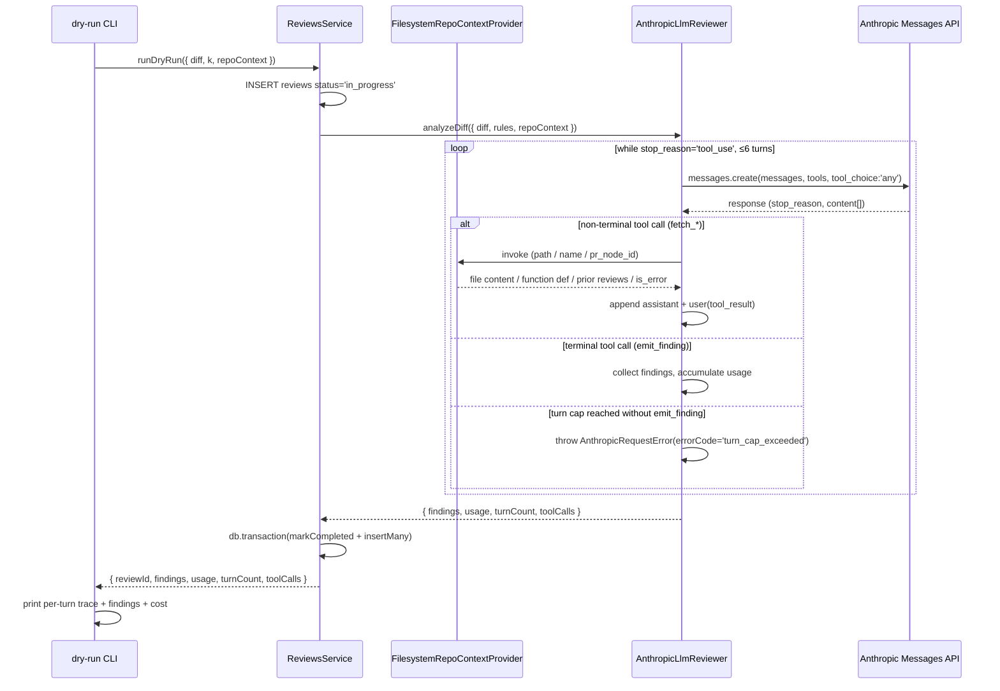

# Day 4 multi-turn agent loop — Claude tool_use over fetched repo context

This is the implementation-level plan for Day 4 of the 10-day sprint described in [docs/plans/01-baseline.md](01-baseline.md). It expands the parent plan's Day 4 paragraph (*"Agentic Layer — Bot acts like a reviewer fetching its own context"*) into concrete units a coding agent can execute. The product-level decisions live in the upstream requirements doc at [docs/brainstorms/day4-multi-turn-agent-loop-requirements.md](../brainstorms/day4-multi-turn-agent-loop-requirements.md).

---

## Summary

Replace Day-3's single-turn forced-`tool_use` review with a multi-turn agent loop inside `AnthropicLlmReviewer`. The adapter registers four tools — `fetch_related_file`, `fetch_function_definition`, `fetch_prior_review` (all read-only context fetchers) plus a terminal `emit_finding` — and runs a `while (stop_reason === "tool_use")` loop bounded at 6 turns. Each context-fetcher delegates to a new `IRepoContextProvider` seam; Day 4 ships a `FilesystemRepoContextProvider` that reads from a `<fixture>.repo/` directory co-located with each dry-run fixture. Two new fixtures (`silent-signature-change`, `dismissed-eqeqeq-rerun`) anchor acceptance — the agent must traverse multiple turns to produce findings Day-3's single-turn path cannot.

By end of Day 4 the dry-run CLI behaves like "what a real reviewer does" — fetching surrounding file content, looking up function definitions, checking prior reviews — but only against filesystem-served mock repos. Real-PR integration (webhook trigger + GitHub-backed provider + comment posting) lands Day 5.

---

## Problem Frame

Day-3's adapter sends the diff plus top-K retrieved rules as a single user message, forces a single `tool_use` call to `report_findings`, and exits. That works when violations are fully visible inside the diff hunk, but most real reviewer behavior reaches outside the hunk — opening the surrounding file, looking up a referenced function, checking whether a prior review already dismissed something at this location. None of that is reachable in a single forward pass.

The parent plan names Day 4 the "Agentic Layer" to address this. Without it, the showcase plateaus at Day-3 quality and Day-6's evaluation harness has no headroom to measure against. The brainstorm scoped the agentic shape to three context-fetcher tools (deferring full AST + GitHub API + comment-posting) and chose dry-run-only delivery so the loop mechanics, tool schemas, and observability columns can be exercised end-to-end against deterministic fixtures before Day-5 layers real GitHub plumbing on top.

---

## Scope

### In scope (Day 4)

- Multi-turn loop inside `AnthropicLlmReviewer` replacing the Day-3 single-turn forced-call. `tool_choice: 'any'`, hard cap of 6 turns, `max_tokens: 2048` per turn.
- Four tool schemas registered with every call: `fetch_related_file`, `fetch_function_definition`, `fetch_prior_review`, `emit_finding` (terminal).
- New `IRepoContextProvider` interface + `REPO_CONTEXT_PROVIDER` Symbol token under `apps/api/src/modules/reviews/types/`.
- New `apps/api/src/infrastructure/repo-context/` directory with **two implementations** — `FilesystemRepoContextProvider` (for CLI / fixtures) and `NullRepoContextProvider` (the deterministic-degraded default for the HTTP path that ensures Claude reaches `emit_finding` within the turn cap without real context). Plus a grep-based function-definition helper and the wiring module.
- `AnalyzeDiffInput` widens with an optional `repoContext?: IRepoContextProvider`; `AnalyzeDiffResult` widens with `turnCount` + `toolCalls: ToolCallRecord[]`. `ILlmReviewer.analyzeDiff` signature stays single-method.
- Drizzle migration `0003_reviews_turn_aggregates`: `turn_count` (integer notNull default 0) + `tool_calls_json` (text JSON nullable) on `reviews`. `SqliteReviewsRepository.markCompleted`/`markFailed` patches extended.
- New `errorCode` value: `turn_cap_exceeded`. Maps to `reviews.status='failed'` via the existing Day-3 `AnthropicRequestError` path.
- Cumulative `UsageStats` across turns (input/output/cache_creation/cache_read tokens summed). Day-3's single-call read site updates to accumulate.
- Three `cache_control: { type: 'ephemeral' }` breakpoints per request: end of `tools`, end of `system`, end of the initial user message. The 4th cache-control slot is held in reserve pending Day-6 hit-rate measurement (see Key Technical Decisions for the rationale).
- `SYSTEM_PROMPT` rewritten to describe the agentic protocol (call context tools to gather information, then terminate with `emit_finding`). `PROMPT_AND_TOOL_VERSION` bumps `v2` → `v3` in the same commit; the existing snapshot test guards drift.
- `emit_finding` schema widened from Day-3's `report_findings` shape: accepts `findings: array` with `maxItems: 10`, same per-finding shape (rule_id, title, message, location_hint?, citation?), still no `severity` field (D1 invariant carries forward). Multiple findings may share `rule_id`. The hallucination filter (`inputRuleKeys` set check) carries over and applies to every emitted finding.
- Dry-run CLI gains `--repo=<dir>` flag (positional `<patch-file>` and `--k=<n>` unchanged). When `--repo` is provided, the CLI instantiates `FilesystemRepoContextProvider` against the resolved path and passes it through `ReviewsService` into the adapter. Output formatting updates to render up to 10 findings grouped by severity then `location_hint`.
- Per-turn structured log line via Nest logger and dry-run CLI stdout: `{turn_idx, stop_reason, tool_name, tool_input, tool_result_excerpt (hash + first ~200 chars), usage}`. Terminal `emit_finding` logs full input.
- Two new fixtures: `silent-signature-change.patch` + `silent-signature-change.repo/` (synthetic `src/checkout.js` + `src/retry-queue.js`) and `dismissed-eqeqeq-rerun.patch` + `dismissed-eqeqeq-rerun.repo/` (synthetic `src/checkout.js` + `reviews.json` seeding a dismissed prior finding).
- `StubLlmReviewer` (`apps/api/test/modules/reviews/reviews.e2e-spec.ts` Day-3 helper) extended with a `multi-turn-script` mode that takes a scripted tool-call sequence and an optional final `emit_finding` payload, so e2e tests exercise the full lifecycle without an Anthropic mock.
- New unit and e2e tests covering all four origin acceptance examples (AE1–AE4). Real-API integration spec (`RUN_ANTHROPIC_INTEGRATION=true`) extended to assert `turn_count > 1` and at least one non-terminal tool call against `silent-signature-change.patch`.
- New section in `docs/setup/claude.md` documenting the grep-based `fetch_function_definition` heuristic and its known limitations.

### Scope Boundaries

- **Webhook → ReviewsService auto-trigger.** Day 5 wires the webhook handler to call `ReviewsService.runDryRun` (or its real-PR sibling) on `pull_request.opened` / `synchronize` events.
- **GitHub PR comment posting.** Day 5 introduces the Octokit comment-post path and the finding-to-comment formatting choice (single review vs many inline).
- **`GitHubRepoContextProvider`.** Day 5 adds a sibling implementation under `apps/api/src/infrastructure/repo-context/` that fetches file content via Octokit `repos.getContent`. The Day-4 interface and module are designed as the swap seam; the implementation itself is Day 5.
- **Full AST-based `fetch_function_definition`.** Day 4 ships a grep/regex heuristic with documented limitations. Tree-sitter or ts-morph upgrade is not in any named Day-10 polish slot and is an accepted demo limitation.
- **Per-turn detail table (`review_turns`).** Day 4 uses aggregate columns on `reviews`. If Day-6 eval surfaces a metric the aggregate cannot answer, the normalized table can be added later.
- **Day-6 evaluation harness (Ragas, precision/recall).** Day 6 work; Day 4 only ensures the persisted aggregate metadata makes those measurements possible.
- **Multi-language coverage.** Day-4 fixtures and heuristic target JavaScript / TypeScript. Broader-language support is post-sprint.
- **`tool_choice` strictness on `emit_finding`.** Research recommended `strict: true` on tool schemas. Day-4 sets it if the installed `@anthropic-ai/sdk` version supports it on Sonnet 4.6 + Haiku 4.5; otherwise the schema stays non-strict. Verification is an implementation-time step, not a planning decision.

#### Schema contract for Day 5

- `reviews.turn_count` and `reviews.tool_calls_json` ship now and stay populated whether or not the agent reaches more than one turn. Day-5's real-PR path will write the same columns; no Day-5 schema retrofit required.
- `errorCode='turn_cap_exceeded'` joins `credit_balance_too_low` in the controlled vocabulary on `reviews.error_code`. Day-5 may add comment-post-related codes (`github_api_error`, `comment_post_failed`, etc.); the column stays free-form text.
- `IRepoContextProvider` interface stays narrow enough that the Day-5 GitHub sibling is a direct method-for-method swap. The interface is contracted in this plan; Day 5 implements without renegotiating.

---

## Context & Research

### Relevant Code and Patterns

- `apps/api/src/infrastructure/anthropic/anthropic-llm-reviewer.ts` — Day-3 adapter with `analyzeDiff`, `REPORT_FINDINGS_TOOL`, `SYSTEM_PROMPT`, `classifyErrorCode`, lazy `createClient()` seam. Day-4 rewrites the request shape and inserts the loop; the `createClient()` seam, error wrapping, hallucination filter, and finding-shape carry forward unchanged.
- `apps/api/src/modules/reviews/types/llm-reviewer.ts` — holds `ILlmReviewer`, `LLM_REVIEWER` Symbol, `Finding`, `UsageStats`, `AnalyzeDiffInput`, `AnalyzeDiffResult`, and `PROMPT_AND_TOOL_VERSION`. Day-4 widens the input/output shapes here and bumps the version constant.
- `apps/api/src/modules/reviews/reviews.service.ts` — orchestrates the 3-step lifecycle, sources severity at persistence, sweeps stale `in_progress` rows. Day-4 plumbs the optional `repoContext` from CLI args through to the adapter call and persists the new aggregate columns.
- `apps/api/src/modules/reviews/scripts/dry-run.ts` — current `parseArgs` accepts `<patch-file>` + `--k=<n>`, uses `INIT_CWD` resolution, builds Nest application context. Day-4 adds `--repo=<dir>`, instantiates `FilesystemRepoContextProvider`, and updates the per-call output formatter for N findings.
- `apps/api/src/infrastructure/db/schema/reviews.ts` and `apps/api/src/infrastructure/db/repositories/sqlite-reviews.repository.ts` — current `reviews` schema and `ReviewCompletionPatch` / `ReviewFailurePatch` shapes that Day-4 extends.
- `apps/api/test/modules/reviews/reviews.e2e-spec.ts` — Day-3's `StubLlmReviewer` (`mode: 'echo-first-only' | 'echo-all' | 'echo-none' | 'throw-rate-limit' | 'delay-then-echo'`) is the canonical pattern Day-4 extends with a `multi-turn-script` mode.
- `apps/api/test/infrastructure/anthropic/anthropic-llm-reviewer.spec.ts` — Day-3 adapter unit-test pattern: `class TestableAnthropicLlmReviewer extends AnthropicLlmReviewer` with `createClient()` returning a stub. Day-4 reuses this pattern and adds turn-scripted stubs.
- `apps/api/test/fixtures/diffs/` — 6 existing Day-3 fixtures and `README.md`. Day-4 adds two more `.patch` files plus co-located `.repo/` directories.
- `CLAUDE.md` — tier rule (`modules` → `infrastructure` one-way), repository pattern, Drizzle migration workflow, no-AI-attribution-in-commits.

### Institutional Learnings

- `docs/solutions/` does not exist yet. Day-3 produced learnings worth capturing (prompt-cache thresholds per model, the user-message cache-write puzzle) and the Day-4 work will produce more (multi-turn cache hit-rate, agent oscillation patterns, tool-result token bloat). Capturing this is post-Day-4 follow-up via `/ce-compound`.

### External References

- Anthropic multi-turn `tool_use` guidance (compiled during brainstorm research): canonical `while (stop_reason === "tool_use")` shape, up to 4 cache breakpoints with a 20-block lookback, `tool_choice: 'any'` for guaranteed-tool-call turns, `tool_result` block keyed by `tool_use_id`, terminal-tool exit pattern, observability conventions (hash + truncated content for non-terminal turns).
- See origin `## Key Decisions` and `## Dependencies / Assumptions` for the full set of research-backed defaults already accepted.

---

## Key Technical Decisions

- **Provider injection via `AnalyzeDiffInput.repoContext`, not adapter constructor.** The repo context is per-review configuration (which mock repo dir, or eventually which PR's GitHub context), not per-app boot. Passing it through the input keeps `AnthropicLlmReviewer` stateless across reviews and avoids a factory layer. The `IRepoContextProvider` Symbol is still registered in the module for dependency-injection at the controller / CLI boundary, but the adapter consumes it as input.

  *Alternatives considered:* (a) constructor-injected provider with a per-call `setRepoContext()` setter — rejected because it makes the adapter stateful across reviews, defeating the per-call goal; (b) separate `AgentLoopRunner` collaborator owning the provider — rejected as premature decomposition at Day 4, revisit if Day 5 introduces a second loop variant or `AnthropicLlmReviewer` exceeds ~400 lines. The chosen shape leaks a collaborator into the data-shaped `AnalyzeDiffInput` contract, but the tradeoff is acceptable at a single call site; Day 5's GitHub provider has a documented escape hatch if its `auth-token-per-PR` lifecycle doesn't fit the per-call pattern.

- **`IRepoContextProvider` error variant carries a structured `reason` enum.** Each method returns `{ ok: true, content } | { ok: false, reason, message, retryAfterMs? }` where `reason: 'not_found' | 'forbidden' | 'rate_limited' | 'network' | 'invalid_input' | 'parse_error'`. Day-4's `FilesystemRepoContextProvider` only ever emits `not_found`, `invalid_input`, and `parse_error`; the wider vocabulary is contracted up front so Day-5's `GitHubRepoContextProvider` (which surfaces 404 / 403 / 429 / network failures) doesn't renegotiate the interface. The adapter MAY surface `reason` alongside `message` in the `tool_result` body so Claude can reason about whether a different tool or input would succeed.

- **`ILlmReviewer.analyzeDiff` widens; no sibling method.** Brainstorm's R1 keeps a single review code path. Day-3 single-turn collapses into the degenerate case where Claude emits `emit_finding` at turn 1.

- **Cumulative `UsageStats` returned by the adapter.** Anthropic returns per-call usage; the adapter accumulates `input_tokens`, `output_tokens`, `cache_creation_input_tokens`, and `cache_read_input_tokens` across the loop and returns one totalled `UsageStats` to `ReviewsService`. The current Day-3 single-call usage read pattern survives the change because turn 1 still populates these fields; the loop just sums.

- **Three cache-control breakpoints per request; the 4th slot is held in reserve.** End of `tools`, end of `system`, and end of the initial user message (the diff plus initial rule pack — the largest static prefix that survives across turns). The latest user message changes every turn (it's the newest `tool_result`), so marking it would write a cache entry only read once before being superseded — net cost (~1.25× write for one read) outweighs the benefit. Earlier `assistant` and `tool_result` blocks auto-include in the prefix once the third breakpoint sits behind them (Anthropic's 20-block lookback). Day-6 eval will measure steady-state hit rate and inform whether to place the 4th breakpoint on the *prior* user turn (one step back, where the now-stable previous `tool_result` becomes cacheable) — that's a Day-6 decision, not Day-4.

- **`tool_result.content` shape: array of content blocks.** The SDK accepts both raw-string and content-block-array forms. The array form (each `{ type: 'text', text: ... }`) matches the `assistant.content` shape Day-3 already returns and produces cleaner snapshot diffs when scripted in tests.

- **Grep heuristic for `fetch_function_definition`.** Three patterns matched per request: `^\s*(export\s+)?(async\s+)?function\s+<name>\b`, `^\s*(export\s+)?(const|let|var)\s+<name>\s*=`, and method-in-class `^\s+<name>\s*\(` inside a `class\s+` block. Returns the matched block plus N lines of surrounding context. Limitations documented (TypeScript overloads, decorated methods, default-exported function expressions, methods named identically in two classes). Full AST is unscheduled.

- **`tool_calls_json` field set.** Per turn: `{ turn_idx, tool_name, input_hash, result_bytes, latency_ms, stop_reason }`. The two fields beyond the brainstorm's named minimum (`latency_ms`, `stop_reason`) give Day-6 eval headroom to measure cost/latency distribution and inspect why a turn ended.

- **Anthropic mock approach: extend the existing pattern.** Adapter unit tests subclass `AnthropicLlmReviewer` and override `createClient()` to return a stub `messages.create` that yields scripted responses turn-by-turn. E2E tests extend Day-3's `StubLlmReviewer` (test-module override on `LLM_REVIEWER`) with a `multi-turn-script` mode. No SDK-level interceptor; no shared mocking framework.

- **`StubLlmReviewer` extension shape.** New mode `'multi-turn-script'` accepts a `script: ScriptedTurn[]` where each `ScriptedTurn` is either `{ kind: 'tool', name, input }` (the stub records the call against `lastInput.repoContext` and continues) or `{ kind: 'emit', findings }` (loop exits). The stub returns the same `AnalyzeDiffResult` shape as the real adapter, including `turnCount` and `toolCalls`. This keeps e2e scripting decoupled from the real Anthropic SDK while exercising the same `ReviewsService` integration.

- **Turn cap signals as `AnthropicRequestError`.** When the loop reaches turn 7 without `emit_finding`, the adapter throws `new AnthropicRequestError({ status: 200, errorCode: 'turn_cap_exceeded', message: 'Agent loop exceeded N turns without emit_finding' })`. The existing Day-3 catch in `ReviewsService` maps this to `markFailed({ error_code: 'turn_cap_exceeded' })` without a new branch — the Day-3 mapping (`err.errorCode ?? 'anthropic_error'`) handles it.

- **No partial findings on `turn_cap_exceeded`.** When the cap is reached, the review is marked `failed` and no findings are persisted. The loop's exit semantics make mid-loop `emit_finding` structurally impossible — the adapter exits on first `emit_finding` block in `content[]`, so the cap path and the emit path are mutually exclusive. Rationale for the no-partial decision (in case future protocol evolution makes mid-loop emit possible): (a) `emit_finding` is contractually the loop exit, so a non-terminal occurrence would indicate a protocol violation; (b) Day-5 PR comment posting must not surface findings from a failed review; (c) Day-6 eval treats cap-hit reviews as misses by design so the failure cost is visible in metrics. The alternative — a new `partial` status preserving mid-loop findings — is rejected to keep the `reviews.status` vocabulary binary (`completed` / `failed` / `in_progress`).

- **`SYSTEM_PROMPT` rewrite captures the protocol.** The prompt now reads as "you are an agentic code reviewer. You may call any of the four tools as needed; when finished, call `emit_finding` with your findings. The loop ends when `emit_finding` is invoked." Plus the Day-3 examples are retained or replaced with multi-turn examples that include intermediate tool calls.

- **HTTP `POST /reviews/dry-run` does not gain `repo_dir` at Day 4; the controller injects `NullRepoContextProvider` instead.** The brainstorm scopes the new tools to CLI invocations against `.repo/` directories. The HTTP endpoint continues to accept `{ diff, k?, pr_node_id? }`; `ReviewsService.runDryRun` defaults `input.repoContext` to a Nest-injected `NullRepoContextProvider` (bound via `ReviewsModule.forRoot()`'s providers list against the `REPO_CONTEXT_PROVIDER` token) when the caller doesn't pass one — keeping the HTTP path deterministic by serving empty content rather than `is_error`. The CLI overrides this default by constructing a `FilesystemRepoContextProvider` with the resolved `--repo` path. The endpoint exists for HTTP-shaped smoke testing; the canonical Day-4 surface is the CLI.

---

## Open Questions

### Resolved During Planning

- **`tool_result.content` shape** → Array of content blocks (`[{ type: 'text', text: ... }]`). Cleaner snapshot diffs, matches `assistant.content`.
- **`tool_calls_json` field set** → `{ turn_idx, tool_name, input_hash, result_bytes, latency_ms, stop_reason }` per turn.
- **Anthropic mock approach** → Subclass + `createClient()` override for adapter unit tests; `StubLlmReviewer` extended with `multi-turn-script` mode for e2e.
- **Interface shape (widen vs sibling method)** → Widen `AnalyzeDiffInput` / `AnalyzeDiffResult`; single `analyzeDiff` method.
- **Where the `IRepoContextProvider` interface lives** → `apps/api/src/modules/reviews/types/repo-context-provider.ts` (interface + Symbol); filesystem implementation under new `apps/api/src/infrastructure/repo-context/`.

### Deferred to Implementation

- **`strict: true` on `emit_finding` tool schema.** Verify the installed `@anthropic-ai/sdk` version supports `strict` on Sonnet 4.6 + Haiku 4.5 before enabling. If the SDK / model doesn't support it, ship without `strict` and document in the U4 unit commit message.
- **`SYSTEM_PROMPT` example set.** The Day-3 prompt's five examples cover single-turn shapes (no-var, eqeqeq, doc-only, multi-rule, no-rule). At least one of them should be replaced with a multi-turn example showing the agent calling `fetch_related_file` and then `emit_finding`. Exact wording is best decided while iterating against `silent-signature-change.patch`.
- **Grep heuristic regex tuning.** The three named patterns cover the common cases; edge-case tuning (escaped names, arrow functions assigned to `module.exports`, etc.) is best done with real fixtures in hand.
- **`tool_input_hash` algorithm.** SHA-256 of the canonical-JSON serialization of `tool_use.input` is the default; pick a shorter prefix (e.g., first 16 chars) for readability in logs and `tool_calls_json` storage.

---

## High-Level Technical Design

> *This illustrates the intended approach and is directional guidance for review, not implementation specification. The implementing agent should treat it as context, not code to reproduce.*



The three cache-control breakpoints per `messages.create` invocation are placed as follows. Anthropic's 4th slot is intentionally held in reserve at Day-4 pending Day-6 hit-rate measurement (see Key Technical Decisions for the rationale):

```
request:
  tools:    [ ..., { cache_control: ephemeral }  ]   ← BP1 (end of tools — stable across all calls)
  system:   [ { text, cache_control: ephemeral } ]    ← BP2 (end of system — stable across all calls)
  messages:
    user_0:   [ { text: diff+rules, cache_control: ephemeral } ]   ← BP3 (largest static prefix; cacheable from turn 2 onward)
    assistant_0, user_1, assistant_1, user_2, …                    ← auto-included via 20-block lookback once BP3 sits behind them
    user_N:   [ { tool_result } ]                                  ← (4th slot RESERVED — would write-once-read-zero on the moving turn; Day-6 may move it to user_{N-1})
```

---

## Implementation Units

### U1. Schema migration — aggregate turn columns on `reviews`

**Goal:** Add `turn_count` and `tool_calls_json` to `reviews`, extend repository patch types, generate the Drizzle migration.

**Requirements:** R10

**Dependencies:** None

**Files:**
- Modify: `apps/api/src/infrastructure/db/schema/reviews.ts`
- Create: `apps/api/src/infrastructure/db/migrations/0003_reviews_turn_aggregates.sql`
- Create: `apps/api/src/infrastructure/db/migrations/meta/0003_snapshot.json`
- Modify: `apps/api/src/infrastructure/db/migrations/meta/_journal.json`
- Modify: `apps/api/src/infrastructure/db/repositories/sqlite-reviews.repository.ts`
- Modify: `apps/api/src/modules/reviews/types/review.types.ts`
- Test: `apps/api/test/infrastructure/db/repositories/sqlite-reviews.repository.spec.ts`

**Approach:**
- Add `turn_count: integer().notNull().default(0)` and `tool_calls_json: text({ mode: 'json' })` (nullable) to the Drizzle schema for `reviews`.
- Generate migration with `cd apps/api && npx drizzle-kit generate --name=reviews_turn_aggregates` — do not hand-edit the SQL.
- **Backfill historical Day-3 rows.** Drizzle-generated SQL adds the columns with default 0 for existing rows; immediately after the auto-generated `ALTER TABLE ADD COLUMN` statements, append an `UPDATE reviews SET turn_count = 1 WHERE status IN ('completed', 'failed') AND turn_count = 0;` so historical single-turn rows reflect their real "one call was made" state. Day-4 pre-turn-1 failures (network error before the first `messages.create` returns) write `turn_count = 0`, which now unambiguously means "no turn started." Day-6 eval queries can distinguish historical, pre-turn-1-failure, and successful multi-turn reviews from this single column without joining on `prompt_version`.
- Extend `ReviewCompletionPatch` (and the corresponding `ReviewRecord` derivation) with the two new fields. `ReviewFailurePatch` accepts them as optional (turn_cap_exceeded carries `turn_count`, other failures may leave them null/0).
- Update `markCompleted` and `markFailed` in the SQLite repository to write the new columns.
- **Forward-compat commit.** U1 lands as a typing-only / dead-code change — `markCompleted` / `markFailed` accept the new params but no caller passes them yet. U5 adds the call sites once U4's adapter widens its return shape. This mirrors Day-3's `f3f3158` (schema) → `9e5db9c` (service consumer) sequence; the intermediate compile-clean state is intentional.

**Patterns to follow:**
- Day-3's migration `0002_reviews_and_review_findings.sql` for the SQL shape.
- Day-3's `ReviewCompletionPatch` / `ReviewFailurePatch` types and repository method signatures for the patch-pattern.

**Test scenarios:**
- Happy path: `insert` + `markCompleted({ turn_count: 3, tool_calls_json: [...] })` round-trips through `findById`.
- Happy path: `insert` + `markCompleted({})` (no turn fields) leaves `turn_count` at default 0 and `tool_calls_json` null.
- Happy path: `insert` + `markFailed({ error_code: 'turn_cap_exceeded', turn_count: 6 })` persists turn_count alongside the failure record.
- Edge case: `tool_calls_json` accepts large arrays (e.g., 6 entries) without truncation.

**Verification:**
- `npm test --workspace apps/api` passes the repository spec.
- A boot-time `migrate(...)` call applies cleanly against a fresh tmp database.

---

### U2. `IRepoContextProvider` interface, `FilesystemRepoContextProvider`, and `NullRepoContextProvider`

**Goal:** Define the repo-context seam and ship Day-4's two implementations — filesystem-backed (for CLI / fixtures) and null (for the HTTP path) — plus the grep-based function-definition helper.

**Requirements:** R4, R5, R6, R8

**Dependencies:** None

**Files:**
- Create: `apps/api/src/modules/reviews/types/repo-context-provider.ts`
- Create: `apps/api/src/infrastructure/repo-context/filesystem-repo-context.provider.ts`
- Create: `apps/api/src/infrastructure/repo-context/null-repo-context.provider.ts`
- Create: `apps/api/src/infrastructure/repo-context/helpers/grep-function-definition.ts`
- Create: `apps/api/src/infrastructure/repo-context/repo-context.module.ts`
- Create: `apps/api/src/infrastructure/repo-context/index.ts`
- Modify: `apps/api/src/modules/reviews/types/index.ts` (re-export interface + Symbol)
- Test: `apps/api/test/infrastructure/repo-context/filesystem-repo-context.provider.spec.ts`
- Test: `apps/api/test/infrastructure/repo-context/null-repo-context.provider.spec.ts`
- Test: `apps/api/test/infrastructure/repo-context/helpers/grep-function-definition.spec.ts`

**Approach:**
- `IRepoContextProvider` exposes three methods. Success returns `{ ok: true, content }`. Failure returns `{ ok: false, reason, message, retryAfterMs? }` where `reason: 'not_found' | 'forbidden' | 'rate_limited' | 'network' | 'invalid_input' | 'parse_error'` (see Key Technical Decisions for the rationale). Day-4's filesystem provider only emits `not_found` / `invalid_input` / `parse_error`; the rest of the enum is contracted up front for Day-5's GitHub sibling.
  - `fetchFile(path: string): Promise<RepoFileResult>`
  - `fetchFunctionDefinition(name: string, file?: string): Promise<RepoFunctionResult>`
  - `fetchPriorReview(query: PriorReviewQuery): Promise<RepoPriorReviewResult>`
- `REPO_CONTEXT_PROVIDER = Symbol('RepoContextProvider')` lives next to the interface.
- `FilesystemRepoContextProvider` is constructed with a `repoDir: string` (absolute path to a `<fixture>.repo/` directory). `fetchFile` resolves the requested path under that directory and refuses path traversal (no `..` escapes → `reason: 'invalid_input'`). Missing path → `reason: 'not_found'`. Malformed `reviews.json` → `reason: 'parse_error'`. `fetchPriorReview` reads an optional `reviews.json` inside `repoDir`; missing file returns `{ ok: true, content: [] }`. The asymmetry between `fetchFile` (missing = error) and `fetchPriorReview` (missing = empty success) is intentional: a specific file lookup expects a specific target, so absence is an error the caller needs to know about; prior-review data is optional context that may simply not exist yet (e.g., Day-4 cold-start), so absence is a valid empty result rather than a failure.
- `NullRepoContextProvider` is the deterministic-degraded default for the HTTP `POST /reviews/dry-run` path. `fetchFile` and `fetchFunctionDefinition` return `{ ok: false, reason: 'not_found', message: 'no repo context available on HTTP path' }`; `fetchPriorReview` returns `{ ok: true, content: [] }` (empty list is the correct truthful answer for "no prior reviews available"). One small file, no state. The truthful "broken capability" signal stops Claude from probing alternative paths to find non-empty content, keeping the HTTP path's turn count low and predictable.
- Export a named `PriorReviewEntry` type from `repo-context-provider.ts` with explicit fields: `review_id: string`, `finding_id: string`, `rule_id: string`, `file_path: string`, `location_hint: string`, `dismissed_at: number | null` (timestamp_ms per CLAUDE.md), `message: string`. Both Day-4's filesystem provider and Day-5's DB-backed sibling produce this exact shape — the alignment prevents a silent ISO-vs-timestamp drift between JSON fixtures and SQL rows when AE2's dismissal-detection path runs in production.
- `grepFunctionDefinition(name, fileContent)` runs the three patterns named in Key Technical Decisions, returns the first match plus 10 lines of surrounding context. `fetchFunctionDefinition` walks the repo dir (or the optional `file` hint) and returns the first hit.

**Execution note:** Test-first. Each method's contract is small enough that the spec drives the implementation cleanly.

**Patterns to follow:**
- CLAUDE.md tier rule: interface + Symbol in `modules/.../types/`, implementation under `infrastructure/`.
- Day-3 repository / token pattern (`PULL_REQUEST_REPOSITORY` etc.) for the Symbol-token wiring.
- Nest dependency injection: provide via Symbol token, inject via `@Inject(REPO_CONTEXT_PROVIDER)`.

**Test scenarios:**
- Happy path: `fetchFile('src/checkout.js')` returns the file content from the configured repo dir.
- Error path: `fetchFile('does/not/exist.js')` returns `{ ok: false, reason: 'not_found', message: ... }` without throwing.
- Error path: `fetchFile('../escape.js')` is rejected as path traversal → `{ ok: false, reason: 'invalid_input' }`.
- Happy path: `fetchFunctionDefinition('chargeCard')` finds `function chargeCard(`, `const chargeCard = `, and `class C { chargeCard(` forms.
- Happy path: `fetchFunctionDefinition('chargeCard', 'src/checkout.js')` searches only the hinted file.
- Error path: `fetchFunctionDefinition('nonExistent')` returns `{ ok: false, reason: 'not_found' }`.
- Happy path: `fetchPriorReview({ pr_node_id: 'PR_123' })` returns matching entries from `reviews.json`.
- Edge case: no `reviews.json` in repo dir → `fetchPriorReview` returns `{ ok: true, content: [] }`.
- Edge case: malformed `reviews.json` → `fetchPriorReview` returns `{ ok: false, reason: 'parse_error' }`.
- Edge case (helper): grep handles multi-line definitions and class methods with similar names in different classes (returns first hit, documents the limitation).
- Coverage: `FilesystemRepoContextProvider` only emits the three Day-4 reasons (`not_found` / `invalid_input` / `parse_error`); the wider enum (`forbidden | rate_limited | network`) is contractually reserved for Day-5's GitHub sibling.
- Truthful-error path (`NullRepoContextProvider`): `fetchFile('anything')` returns `{ ok: false, reason: 'not_found', message: 'no repo context available on HTTP path' }`.
- Truthful-error path (`NullRepoContextProvider`): `fetchFunctionDefinition('anything')` returns `{ ok: false, reason: 'not_found', message: 'no repo context available on HTTP path' }`.
- Happy path (`NullRepoContextProvider`): `fetchPriorReview({})` returns `{ ok: true, content: [] }` (empty list is the truthful "no prior reviews" answer, not an error).

**Verification:**
- `npm test --workspace apps/api` passes both new spec files.
- Helper spec demonstrates the documented limitations (e.g., methods with the same name in two classes return the first occurrence).

---

### U3. New fixtures with co-located mock repos

**Goal:** Author the two new acceptance fixtures.

**Requirements:** R14, R15

**Dependencies:** None (independent of U1/U2)

**Files:**
- Create: `apps/api/test/fixtures/diffs/silent-signature-change.patch`
- Create: `apps/api/test/fixtures/diffs/silent-signature-change.repo/src/checkout.js`
- Create: `apps/api/test/fixtures/diffs/silent-signature-change.repo/src/retry-queue.js`
- Create: `apps/api/test/fixtures/diffs/dismissed-eqeqeq-rerun.patch`
- Create: `apps/api/test/fixtures/diffs/dismissed-eqeqeq-rerun.repo/src/checkout.js`
- Create: `apps/api/test/fixtures/diffs/dismissed-eqeqeq-rerun.repo/reviews.json`
- Modify: `apps/api/test/fixtures/diffs/README.md`

**Approach:**
- `silent-signature-change.patch` adds an `idempotencyKey` argument to one `chargeCard(...)` call in `src/checkout.js`. The `.repo/` directory's `src/checkout.js` contains the unmodified file with four call sites of `chargeCard`. `src/retry-queue.js` contains a fifth call site. The function definition lives in `src/checkout.js` and uses the canonical `function chargeCard(order, opts) {` shape (so the grep heuristic finds it cleanly).
- `dismissed-eqeqeq-rerun.patch` re-applies an existing-style `eqeqeq` violation. The `.repo/src/checkout.js` carries the post-diff state; `.repo/reviews.json` seeds one prior finding with `dismissed_at` set and a `location_hint` matching the line the new diff would re-emit at.
- `reviews.json` shape mirrors what `fetchPriorReview` returns: `[{ review_id, finding_id, rule_id, file_path, location_hint, dismissed_at, ... }]`.
- README update is load-bearing, not just a table entry. The current "Adding a fixture" checklist (`apps/api/test/fixtures/diffs/README.md`) requires wiring new fixtures into BOTH `embeddings.e2e-spec.ts` (the retrieval-quality gate) AND `reviews.e2e-spec.ts`. Day-4's `.repo/`-backed fixtures are agent-loop fixtures, not retrieval-quality fixtures — they're exempt from the embeddings.e2e-spec.ts gate and get scenario-specific coverage in the new AE1/AE2 describes (U7). Update the README to reflect two fixture categories: (i) retrieval-only `.patch` fixtures (Day-3 shape — wired into both specs), (ii) `.repo/`-backed agent-loop fixtures (Day-4 shape — wired only into the relevant AE describe).

**Test scenarios:** Test expectation: none — fixture authoring is structural. Acceptance is proved end-to-end in U7.

**Verification:**
- Files exist at the listed paths.
- `git diff` of the `.patch` files applies cleanly against the matching `.repo/` content (sanity check — not a CI gate).
- `reviews.json` parses as valid JSON matching the schema referenced in U2.

---

### U4. Multi-turn loop in `AnthropicLlmReviewer` + four tool schemas + version bump

**Goal:** Replace the single-turn forced-call with the multi-turn agent loop, register the four tool schemas, bump `PROMPT_AND_TOOL_VERSION`, regenerate the snapshot.

**Requirements:** R1, R2, R3, R4, R5, R6, R7, R12, R13

**Dependencies:** U2 (`IRepoContextProvider` interface), U1 (so the adapter's return type matches what `ReviewsService` will persist)

**Files:**
- Modify: `apps/api/src/infrastructure/anthropic/anthropic-llm-reviewer.ts`
- Modify: `apps/api/src/modules/reviews/types/llm-reviewer.ts` (widen `AnalyzeDiffInput` + `AnalyzeDiffResult`, define `ToolCallRecord`, bump `PROMPT_AND_TOOL_VERSION` to `v3`)
- Modify: `apps/api/src/infrastructure/anthropic/anthropic.module.ts` (no behavioural change expected; verify the adapter still resolves cleanly)
- Modify: `apps/api/test/infrastructure/anthropic/__snapshots__/anthropic-llm-reviewer.snapshot.spec.ts.snap` (regenerated alongside the change)
- Test: `apps/api/test/infrastructure/anthropic/anthropic-llm-reviewer.spec.ts`
- Test: `apps/api/test/infrastructure/anthropic/anthropic-llm-reviewer.snapshot.spec.ts`

**Approach:**
- Replace the single `client.messages.create` call with a turn loop. Each iteration:
  1. Call `messages.create` with the current message list, the four tools, `tool_choice: { type: 'any' }`, `max_tokens: 2048`, and three `cache_control` markers (end of `tools`, end of `system`, end of initial user message) as diagrammed.
  2. Push the response content verbatim as an `assistant` message.
  3. Scan `response.content` for `tool_use` blocks:
     - **If any block is `emit_finding`:** take the FIRST `emit_finding` block, collect its findings, accumulate usage, and exit the loop immediately. Do NOT invoke the provider for non-terminal tool_use blocks in the same response (they would orphan tool_results Claude never sees) and do NOT merge findings across multiple `emit_finding` blocks in the same response (take only the first to keep the contract simple).
     - **Otherwise (all blocks are non-terminal):** for each `tool_use` block, invoke `input.repoContext` (with the `NullRepoContextProvider` default when the caller didn't pass one), build a `tool_result` content block keyed by `tool_use_id`, append all `tool_result` blocks as a single `user` message.
  4. Log the per-turn line via the Nest logger.
- After the loop, sum `input_tokens` / `output_tokens` / `cache_creation_input_tokens` / `cache_read_input_tokens` across the recorded responses into one `UsageStats`.
- Return `{ findings, usage, model, promptVersion, turnCount, toolCalls }`.
- Turn-cap handling: if turn 7 starts without `emit_finding`, throw `AnthropicRequestError({ status: 200, errorCode: 'turn_cap_exceeded', message: 'Agent loop exceeded 6 turns without emit_finding' })`.
- **Tool input validation.** Before dispatching a `tool_use` block, validate `tool_use.input` against the tool's declared schema (Zod or equivalent runtime guard derived from the same shape the SDK ships to Anthropic). For non-terminal tools, validation failure builds a `tool_result` with `is_error: true, content: 'invalid_input: <field> <reason>'` and the loop continues — Claude can correct on the next turn. For the terminal `emit_finding`, validation failure throws `new AnthropicRequestError({ status: 200, errorCode: 'malformed_emit_finding', message: 'emit_finding payload failed schema validation: <field>' })`. `malformed_emit_finding` joins `turn_cap_exceeded` and `credit_balance_too_low` in the controlled `error_code` vocabulary.
- Update `SYSTEM_PROMPT` to describe the agentic protocol; replace at least one Day-3 example with a multi-turn example.
- Bump `PROMPT_AND_TOOL_VERSION` from `v2` to `v3`. Replace the Day-3 `toMatchSnapshot()` pattern with an explicit hash-map enforcement: add a `PROMPT_AND_TOOL_VERSION_HASH_MAP: Record<typeof PROMPT_AND_TOOL_VERSION, string>` constant in `apps/api/src/modules/reviews/types/llm-reviewer.ts` mapping each known version to its expected `sha256(SYSTEM_PROMPT + JSON.stringify([FETCH_FILE_TOOL, FETCH_FUNC_TOOL, FETCH_PRIOR_TOOL, EMIT_FINDING_TOOL]))`. The spec asserts `sha256(...) === PROMPT_AND_TOOL_VERSION_HASH_MAP[PROMPT_AND_TOOL_VERSION]`. This closes the Day-3 gap where `jest -u` could silently regenerate the snapshot without bumping the constant — now changing the prompt without bumping the version (or vice versa) fails CI by hash mismatch. Add `v3`'s hash entry in the same commit.
- The hallucination filter (`inputRuleKeys` membership check) carries forward unchanged — every finding's `rule_id` must match a retrieved rule key.
- **Day-3 adapter spec gets rewritten, not extended.** The `describe('analyzeDiff — request shape (the cache invariant)')` block at `apps/api/test/infrastructure/anthropic/anthropic-llm-reviewer.spec.ts:89` hard-codes `tool_choice: { type: 'tool', name: 'report_findings' }` and `tools: [REPORT_FINDINGS_TOOL]`. Replace those assertions with `tool_choice: { type: 'any' }` and the new 4-tool array (`[FETCH_FILE_TOOL, FETCH_FUNC_TOOL, FETCH_PRIOR_TOOL, EMIT_FINDING_TOOL]`). The "byte-identical across two consecutive calls" cache-invariant assertion stays — but now applies to turn 1 of two separate `analyzeDiff` invocations. The Day-3 "no `severity` field on the schema" assertion migrates from `REPORT_FINDINGS_TOOL` to `EMIT_FINDING_TOOL`.

**Execution note:** Test-first on the loop mechanics. Write the failing scripted-stub tests for AE-equivalent behaviors before changing the adapter shape.

**Technical design:** *(directional)*

```
analyzeDiff(input):
  messages = [{ role: 'user', content: [{ text: build(diff, rules), cache_control: ephemeral }] }]
  responses = []

  for turn in 1..6:
    resp = await client.messages.create({
      model, max_tokens: 2048,
      tools: [...REGISTERED_TOOLS, { ..., cache_control: ephemeral }],   # BP1
      system: [{ text: SYSTEM_PROMPT, cache_control: ephemeral }],        # BP2
      tool_choice: { type: 'any' },
      messages: applyCacheBreakpoints(messages),                          # BP3 on user_0, BP4 sliding
    })
    responses.push(resp)
    log({ turn_idx: turn, stop_reason: resp.stop_reason, ... })

    if anyToolUse(resp.content, 'emit_finding'):
      return assemble(resp, responses)

    messages.push({ role: 'assistant', content: resp.content })
    messages.push({ role: 'user', content: applyToolResults(resp.content, input.repoContext) })

  throw AnthropicRequestError({ errorCode: 'turn_cap_exceeded', ... })
```

**Patterns to follow:**
- Day-3 adapter's `createClient()` seam and `AnthropicRequestError` wrapping.
- Day-3 snapshot spec for prompt+tool-schema drift detection — extend the hashed input to include all four tool schemas, not just `REPORT_FINDINGS_TOOL`.
- Day-3 `classifyErrorCode` pattern for mapping new error conditions.

**Test scenarios:**
- *Covers AE3.* Happy path / failure mode: stub returns `tool_use` for `fetch_related_file` six turns in a row → adapter throws `AnthropicRequestError` with `errorCode: 'turn_cap_exceeded'` after turn 6; `turnCount` on the error is 6.
- Happy path: stub returns `tool_use` for `emit_finding` on turn 1 with one finding → adapter returns `{ findings: [one], turnCount: 1, toolCalls: [{ tool_name: 'emit_finding', turn_idx: 1 }] }`.
- Happy path: stub returns `fetch_related_file` on turn 1, `emit_finding` on turn 2 → adapter invokes `input.repoContext.fetchFile`, returns `{ turnCount: 2, toolCalls: [...] }` with the file path in input_hash.
- Happy path: `emit_finding` with 10 findings (cap) → all 10 persist; findings sorted by severity then `location_hint`.
- Edge case: emit_finding emits a finding with rule_id not in `inputRuleKeys` → finding is dropped by the hallucination filter (carries forward Day-3 behavior).
- Edge case: `response.content` contains `[fetch_related_file, emit_finding]` in the same turn → adapter takes the `emit_finding` payload and exits the loop; `fetch_related_file` is NOT invoked, no orphan `tool_result` constructed.
- Edge case: `response.content` contains `[emit_finding, emit_finding]` (two terminal blocks) → adapter takes the FIRST `emit_finding`'s findings, ignores the second; exits cleanly.
- Edge case: `input.repoContext` is undefined → all non-terminal tool calls return `tool_result` with `is_error: true` and the loop continues.
- Edge case: tool throws unexpectedly → adapter wraps as `tool_result` with `is_error: true` rather than crashing the loop.
- Edge case: non-terminal `tool_use.input` fails schema validation (e.g., `fetch_related_file` with `{ path: 123 }` instead of string) → adapter returns `tool_result` with `is_error: true, content: 'invalid_input: path expected string'` and the loop continues; Claude can correct on the next turn.
- Edge case: terminal `emit_finding.input` fails schema validation (e.g., `findings: null` or a finding missing `rule_id`) → adapter throws `AnthropicRequestError({ errorCode: 'malformed_emit_finding' })`; `ReviewsService` maps to `markFailed({ error_code: 'malformed_emit_finding' })`.
- Integration: usage accumulates correctly across turns. Canonical case: stub adapter scripted with two turns each returning `{ input_tokens: 100, output_tokens: 50, cache_read_input_tokens: 25, cache_creation_input_tokens: 0 }` → returned `UsageStats` is `{ input_tokens: 200, output_tokens: 100, cache_read_input_tokens: 50, cache_creation_input_tokens: 0 }`.
- Integration: each `messages.create` call carries exactly three `cache_control` markers in the documented positions — end of `tools`, end of `system`, end of initial user message (asserted via stub spy).
- Snapshot-equivalent: `sha256(SYSTEM_PROMPT + JSON.stringify([FETCH_FILE_TOOL, FETCH_FUNC_TOOL, FETCH_PRIOR_TOOL, EMIT_FINDING_TOOL]))` equals `PROMPT_AND_TOOL_VERSION_HASH_MAP['v3']`. Negative case: editing `SYSTEM_PROMPT` without bumping `PROMPT_AND_TOOL_VERSION` fails the assertion (hash drift on v3); bumping the version without changing the prompt fails the assertion (no v4 entry in the map yet). Both edits must land in the same commit.

**Verification:**
- `npm test --workspace apps/api` passes the adapter spec.
- The snapshot file is regenerated with a `v3` baseline; CI fails if a future commit changes the prompt or any tool schema without bumping the version constant.

---

### U5. `ReviewsService` update — context-provider plumbing + aggregate persistence + turn-cap error mapping

**Goal:** Plumb the optional `repoContext` from caller through to the adapter, persist `turn_count` + `tool_calls_json` on completion, and inherit the `turn_cap_exceeded` error code via the existing failure path.

**Requirements:** R8, R10

**Dependencies:** U1, U2, U4

**Files:**
- Modify: `apps/api/src/modules/reviews/reviews.service.ts`
- Modify: `apps/api/src/modules/reviews/types/index.ts` (export `RunDryRunInput` widening if needed)
- Modify: `apps/api/src/modules/reviews/reviews.module.ts` (import `RepoContextModule`; bind `REPO_CONTEXT_PROVIDER` token if any HTTP path needs it — at Day 4 the CLI constructs the provider directly, so the module-level binding is optional and only matters when controller-level injection is later required)
- Test: `apps/api/test/modules/reviews/reviews.service.spec.ts`

**Approach:**
- `RunDryRunInput` widens to accept an optional `repoContext?: IRepoContextProvider`. The CLI passes a constructed `FilesystemRepoContextProvider`; HTTP callers leave it undefined.
- `runDryRun` forwards `repoContext` into `llm.analyzeDiff({ diff, rules, repoContext })`.
- After a successful `analyzeDiff`, the existing `markCompleted` call now also passes `turn_count: result.turnCount` and `tool_calls_json: result.toolCalls`.
- On failure: `err.errorCode === 'turn_cap_exceeded'` flows through the existing `markFailed({ error_code: err.errorCode ?? 'anthropic_error', error_status: err.status })` without code changes. Add the partial `turn_count` (if the error carries one) when available.
- No changes to severity sourcing (D1 invariant), retrieved-chunk-id hashing, or stale-row sweep.

**Patterns to follow:**
- Day-3 `runDryRun` lifecycle and transaction shape — keep the `db.transaction(...)` synchronous callback.
- Day-3 error mapping in the `catch (err instanceof AnthropicRequestError)` branch.

**Test scenarios:**
- Happy path: with `repoContext` defined, adapter returns `{ turnCount: 2, toolCalls: [...] }` → service writes both columns via `markCompleted`.
- Happy path: with `repoContext` undefined, adapter still returns valid result (loop ran with `is_error` tool results) → service persists, no special-casing.
- Error path: adapter throws `AnthropicRequestError({ errorCode: 'turn_cap_exceeded', status: 200 })` → service writes `status='failed'`, `error_code='turn_cap_exceeded'`, no rows in `review_findings`. The HTTP `POST /reviews/dry-run` response shape on any failed-status review is `{ review_id, status: 'failed', error_code, findings: [] }` — `findings` is explicitly an empty array, never `null` or absent. Test scenarios assert against the empty-array shape for stable assertions across all failure modes.
- Edge case: adapter result with `turnCount: 0` (shouldn't happen) → service still persists; no crash.
- Integration: severity sourcing still picks from rule metadata, not from any new adapter-return field.

**Verification:**
- `npm test --workspace apps/api` passes the service spec.
- Existing Day-3 service-spec assertions about the 3-step lifecycle and stale-row sweep still pass.

---

### U6. Dry-run CLI — `--repo` flag, N-finding output, per-turn trace

**Goal:** Accept the `--repo=<dir>` flag, construct the filesystem provider, pass it through `ReviewsService`, and update the output formatter for up to 10 findings plus the per-turn trace.

**Requirements:** R8, R11, R12

**Dependencies:** U2, U5

**Files:**
- Modify: `apps/api/src/modules/reviews/scripts/dry-run.ts`
- Modify: `apps/api/src/modules/reviews/helpers/estimate-cost.ts` (only if the cost-print line needs to account for cumulative usage — likely no change since `UsageStats` shape is unchanged)
- Test: (new) `apps/api/test/modules/reviews/scripts/dry-run.spec.ts` — unit tests for `parseArgs` and the output formatter

**Approach:**
- Extend `parseArgs(argv)` to recognize `--repo=<dir>` (and the alias `--repo <dir>` if Day-3 supports that form for `--k`; mirror the existing style). Reject if value is empty.
- After args parse, if `--repo` is present, resolve against `INVOCATION_CWD` (same pattern as `<patch-file>`) and construct `new FilesystemRepoContextProvider(resolvedRepoDir)`.
- Pass into `runDryRun({ diff, k, repoContext })`.
- Output formatter: when `findings.length > 1`, render as a numbered list grouped by severity (highest first), each entry showing `[severity] rule_id @ location_hint — message`. Day-3's single-finding print becomes the degenerate single-item list.
- Per-turn trace: as the adapter logs each turn via the Nest logger (Day-4 default), the CLI catches them via the existing `logger: ['error', 'warn']` config — the per-turn lines surface as warns or logs already if the adapter uses `Logger.log`. If the CLI's logger filter elides them, switch to `['error', 'warn', 'log']` for the dry-run script's bootstrap call.

**Patterns to follow:**
- Day-3 `parseArgs` style — module-scope function returning a typed shape.
- Day-3 `INIT_CWD` resolution in `readDiff`.

**Test scenarios:**
- Happy path: `parseArgs(['fixture.patch', '--repo=./fixture.repo'])` returns `{ patchPath: 'fixture.patch', repoDir: './fixture.repo' }`.
- Happy path: `parseArgs(['fixture.patch'])` returns `{ patchPath: 'fixture.patch', repoDir: undefined }`.
- Happy path: `parseArgs(['fixture.patch', '--k=5', '--repo=./fixture.repo'])` returns `{ patchPath, k: 5, repoDir: './fixture.repo' }` — both flags compose correctly.
- Edge case: `parseArgs(['fixture.patch', '--repo='])` rejects with a clear error.
- Edge case: `--repo` pointing at non-existent dir → `FilesystemRepoContextProvider` constructor (or first method call) surfaces a clear error; CLI exits non-zero.
- Edge case: `--help` / `-h` short-circuits and exits 0 without requiring `<patch-file>` (Day-3 behavior preserved).
- Happy path: output formatter renders 10 findings grouped by severity correctly.
- Happy path: output formatter renders a single finding (Day-3 shape) unchanged.
- Edge case: output formatter renders `findings=[]` with a clear "no findings" line and exits 0 (the AE2 scenario produces an empty findings array when the prior-review dismissal suppresses the only candidate).

**Verification:**
- `npm test --workspace apps/api` passes the new dry-run script spec.
- Manual smoke: `npm run review:dry-run --workspace apps/api -- silent-signature-change.patch --repo=silent-signature-change.repo` produces a finding referencing unchanged callers (verifies end-to-end against a real Anthropic call — gated by API key).

---

### U7. End-to-end + gated integration tests for the agent loop

**Goal:** Add e2e tests for all four origin acceptance examples and extend the gated real-API integration spec to assert multi-turn behavior.

**Requirements:** R17 (e2e), R19 (gated integration); R18 (unit tests) is covered across units — loop exit conditions in U4, filesystem context provider + tool validation in U2.

**Dependencies:** U1, U2, U3, U4, U5, U6

**Files:**
- Modify: `apps/api/test/modules/reviews/reviews.e2e-spec.ts` (extend `StubLlmReviewer` with `multi-turn-script` mode; add new describe blocks for AE1, AE1b, AE2, AE3, AE4)
- Modify (cross-spec stub-shape update): `apps/api/test/modules/reviews/reviews.service.spec.ts` — the spec's `makeLlm(result: AnalyzeDiffResult | Error)` helper returns `AnalyzeDiffResult` directly and will fail TypeScript compilation when the result shape widens. (Note: `reviews.controller.spec.ts` stubs `ReviewsService` rather than `ILlmReviewer`, so it does NOT need a stub-shape update.)
- Modify: `apps/api/test/infrastructure/anthropic/anthropic-llm-reviewer.integration.spec.ts` (extend the gated spec for multi-turn)

**Approach:**
- **Update all 5 existing `StubLlmReviewer` modes (`echo-first-only`, `echo-all`, `echo-none`, `throw-rate-limit`, `delay-then-echo`) to return the widened `AnalyzeDiffResult` shape FIRST.** Each existing mode emits `turnCount: 1` plus a synthetic single-entry `toolCalls: [{ turn_idx: 1, tool_name: 'emit_finding', input_hash, result_bytes, latency_ms: 0, stop_reason: 'tool_use' }]` so the degenerate single-turn path stays representable through the same return shape as multi-turn. The six existing describe blocks in `reviews.e2e-spec.ts` (and any references in `reviews.controller.spec.ts` / `reviews.service.spec.ts`) keep passing without test-body changes once the stub return shape is updated. **Skipping this step is a TypeScript compile error** — every existing test that constructs a stub would fail to satisfy `ILlmReviewer.analyzeDiff`'s new return shape.
- Extend `StubLlmReviewer` with the new `'multi-turn-script'` mode:
  ```
  type ScriptedTurn =
    | { kind: 'tool', name: 'fetch_related_file' | 'fetch_function_definition' | 'fetch_prior_review', input: object }
    | { kind: 'emit', findings: Finding[] }

  StubMode |= 'multi-turn-script'
  StubLlmReviewer adds `script?: ScriptedTurn[]` field; when mode === 'multi-turn-script', it walks the script,
    invoking input.repoContext on tool turns and returning the emit findings on the terminal turn.
  ```
- Add five describe blocks in `reviews.e2e-spec.ts` — AE1, AE2, AE3, AE4 from origin plus plan-derived AE1b (mid-loop recovery; not an origin requirement, added during deepening):
  - **AE1**: `silent-signature-change` script that calls `fetch_function_definition` then `fetch_related_file` then `emit_finding`. Assert that `repoContext.fetchFile` is invoked with `src/checkout.js`, that the emitted finding's `message` includes at least one unchanged-caller file path, that `turn_count === 3` on the persisted row, and that `tool_calls_json` contains both fetcher invocations.
  - **AE1b (mid-loop recovery)**: script that calls `fetch_related_file` on turn 1 with a path NOT present in the `.repo/` dir, then `fetch_function_definition` on turn 2, then `emit_finding` on turn 3. Assert `turnCount === 3`, `tool_calls_json[0]` records the `is_error: true` outcome (via the `result_bytes` shape or a dedicated `is_error` flag in the record), and the final finding is emitted normally — proves partial tool failures don't poison the loop and the per-turn record captures the failure.
  - **AE2**: `dismissed-eqeqeq-rerun` script that calls `fetch_prior_review` then `emit_finding` with zero findings (because the dismissal suppresses the only candidate). Assert the persisted `review_findings` table has no row corresponding to the dismissed location.
  - **AE3**: script that returns `fetch_related_file` on every turn (no `emit_finding`). Assert the persisted `reviews` row has `status='failed'`, `error_code='turn_cap_exceeded'`, `turn_count=6`, and no `review_findings` rows.
  - **AE4**: Day-3 fixture (e.g., `no-var-violation.patch`) with no `repoContext`. Assert the loop runs, every tool-call result includes `is_error: true`, and `emit_finding` still fires (with a degenerate single-finding script).
- Extend `anthropic-llm-reviewer.integration.spec.ts`: run `silent-signature-change.patch` with the filesystem provider against the real Haiku model, assert `turnCount > 1` and at least one entry in `toolCalls` with `tool_name !== 'emit_finding'`.

**Patterns to follow:**
- Day-3 `reviews.e2e-spec.ts` test-module construction (`makeTestModule` mirroring `AppModule` without importing it; `.overrideProvider(LLM_REVIEWER).useValue(stubLlm)`).
- Day-3 integration-spec gating with `RUN_ANTHROPIC_INTEGRATION=true` + session rate-limit guard.

**Test scenarios:** (these ARE the scenarios — listed under Approach above)
- Covers AE1, AE1b (mid-loop recovery), AE2, AE3, AE4 plus the gated integration assertion. AE1b is plan-derived (not in origin), covers the recovery-from-tool-error path end-to-end.

**Verification:**
- `npm test --workspace apps/api` passes the e2e spec (≥5 new describe blocks).
- With `RUN_ANTHROPIC_INTEGRATION=true ANTHROPIC_API_KEY=<key>`, the integration spec passes against the live Haiku model.
- All Day-3 e2e tests continue to pass.

---

### U8. Documentation — grep heuristic limitations note in `docs/setup/claude.md`

**Goal:** Document the grep-based `fetch_function_definition` heuristic and its known limitations so the demo's gap is honest and discoverable.

**Requirements:** R5, R20

**Dependencies:** U2 (the heuristic must exist to be accurately documented)

**Files:**
- Modify: `docs/setup/claude.md`

**Approach:**
- New section under an appropriate heading (e.g., *"Function definition lookup — known limitations"*):
  - Lists the three regex patterns the heuristic matches.
  - Names the limitations confirmed during U2 testing: TypeScript overloads (heuristic matches first overload only), decorated methods (the decorator line precedes the function and may not match), default-exported function expressions (`export default function () { ... }` has no name to match), methods of the same name across multiple classes (returns the first hit).
  - States the rationale (Day-4 ships the heuristic; full AST is post-sprint polish; the demo's behavior is honest about the gap).
  - One sentence pointing readers to Day-10 polish as the candidate slot for a tree-sitter or ts-morph upgrade.

**Test scenarios:** Test expectation: none — docs unit, no behavioral assertion.

**Verification:**
- `docs/setup/claude.md` renders cleanly (visual check).
- The named limitations align with what U2's spec demonstrates.

---

## System-Wide Impact

- **Interaction graph:** New `IRepoContextProvider` seam plugs into `AnthropicLlmReviewer` via `AnalyzeDiffInput`. The CLI constructs the filesystem implementation; the HTTP controller does not (so HTTP-shape callers run the loop with `repoContext: undefined` and get `is_error` on every fetch). Day 5 will introduce a GitHub-backed sibling and the controller-level wiring.
- **Error propagation:** `turn_cap_exceeded` joins `credit_balance_too_low` in the `error_code` vocabulary. Both flow through Day-3's `AnthropicRequestError` → `markFailed` path without new branches in `ReviewsService`.
- **State lifecycle risks:** Stale `in_progress` rows can now represent partially-completed multi-turn loops (e.g., process killed mid-turn 4). The existing 5-minute `sweepStaleInProgress` cutoff continues to cover this; the swept row will have `turn_count` at whatever value was last `markCompleted`-ed (i.e., 0 if never reached completion). Acceptable.
- **API surface parity (HTTP regression accepted with mitigation):** HTTP `POST /reviews/dry-run` does NOT gain `repo_dir` at Day 4 — CLI is the canonical surface for the new tools. The HTTP path runs the loop with a `NullRepoContextProvider` (shipped alongside the filesystem provider in U2) that returns a truthful `{ ok: false, reason: 'not_found' }` for file/function fetches and an empty array for prior-review lookups. This keeps the HTTP path deterministic with low turn counts — Claude reads `not_found` as a broken capability and falls through to `emit_finding` rather than probing alternative paths. The semantic gap (HTTP cannot fetch real context) is documented in the Risks table; Day 5 wires the GitHub provider for real PRs.
- **Integration coverage:** Day-4's e2e tests exercise the `ReviewsService → AnthropicLlmReviewer → FilesystemRepoContextProvider` integration end-to-end via `StubLlmReviewer`. The gated integration spec proves the real Anthropic loop against the live Haiku model.
- **Unchanged invariants:** Severity sourcing (D1 — from rule metadata at persistence), `PROMPT_AND_TOOL_VERSION` snapshot guard pattern, 3-step lifecycle (`in_progress` insert → adapter call → success/failed update), the `ENABLE_DRY_RUN` HTTP gate, the throttler, the hallucination filter on rule_id membership, the deterministic hit-sort. None of these change.

---

## Risks & Dependencies

| Risk | Mitigation |
|------|------------|
| Installed `@anthropic-ai/sdk` version does not support `tool_choice: 'any'` or `strict: true` on Sonnet 4.6 / Haiku 4.5 | `tool_choice: 'any'` is broadly supported in 2025+ SDKs; verify the version at U4. If `strict` is unsupported on the target models, ship without it (documented in commit message). |
| Cumulative `tool_result` content inflates the conversation across turns and reduces cache hit rate | `tool_result.content` truncation is the wrong knob (Claude needs the full content to reason); the three-breakpoint cache plan ensures the static prefix (tools + system + initial user) caches across turns. Day-6 eval will measure observed cache hit rates and decide whether to commit the reserved 4th slot to the *prior* user turn (one step behind the moving one). |
| HTTP `POST /reviews/dry-run` returns degraded behavior — `NullRepoContextProvider` means no real context fetching | Documented in SWI as an accepted regression; CLI is the canonical surface. `NullRepoContextProvider` returns truthful `is_error: not_found` (rather than `ok: true, content: ''`) so Claude reads it as a broken capability and stops probing — keeping HTTP-path turn counts low and predictable. Day 5 introduces the GitHub-backed sibling that closes the gap. |
| `emit_finding` schema change invalidates Day-3 prompt cache permanently | Expected and accepted — the prompt + tool schemas changed, so the v2 cache is cold. The `v2 → v3` bump signals this; Day-6 will measure steady-state cache hits in the new state. |
| Grep heuristic for `fetch_function_definition` produces wrong-definition matches in name-collision cases | Documented in U8. Day-6 eval will reveal real impact; full AST upgrade is the polish slot. |
| `StubLlmReviewer`'s `multi-turn-script` mode drifts from real adapter behavior over time | Adapter unit tests in U4 cover the loop mechanics directly (not via the stub); the stub is for service-layer integration only. Drift between stub and real adapter shows up as integration-spec failures. |
| Migration applies on existing dev databases — historical Day-3 rows need accurate turn_count semantics for Day-6 eval | The migration backfills `turn_count = 1` on historical `completed`/`failed` rows (truthful: they did one Anthropic call). Day-4 pre-turn-1 failures stay at 0. `tool_calls_json` is null on historical rows. Day-6 eval distinguishes the three states (historical, pre-turn-1 failure, multi-turn) from `turn_count` alone without joining on `prompt_version`. |
| The hallucination filter drops findings whose `rule_id` matches a retrieved rule but with a slightly different casing or whitespace | Day-3 behavior carries forward unchanged; if Day-6 eval surfaces this as a real false-negative cause, address it as a separate fix. |

---

## Documentation / Operational Notes

- `docs/setup/claude.md` gains the grep-limitations section in U8.
- No new environment variables (the existing `ANTHROPIC_API_KEY`, `ANTHROPIC_MODEL`, `ENABLE_DRY_RUN` are sufficient).
- Migration runs automatically at boot (Day-3 lifecycle pattern). Operationally: developers on the existing dev database get the migration applied on next `npm start --workspace apps/api`; tests use `mkdtempSync` databases so no migration coordination needed.
- The Day-3 manual smoke procedure documented in `docs/setup/claude.md` continues to apply; the only ergonomic delta is the new `--repo=<dir>` flag.
- Cost expectation: per-review with one or two non-terminal tool calls runs ~$0.015–0.04 on Sonnet (vs Day-3's ~$0.011 single-turn) and ~$0.005–0.015 on Haiku (vs Day-3's ~$0.004). Worst-case 6-turn run on Sonnet is ~$0.04–0.10. Documented separately in the setup doc for the manual smoke procedure if helpful.

---

## Sources & References

- **Origin document:** [docs/brainstorms/day4-multi-turn-agent-loop-requirements.md](../brainstorms/day4-multi-turn-agent-loop-requirements.md)
- **Parent sprint plan:** [docs/plans/01-baseline.md](01-baseline.md) — Day 4 paragraph
- **Day-3 implementation:** [docs/plans/04-day3-claude-integration.md](04-day3-claude-integration.md) — the single-turn baseline this plan extends
- **Day-3 PR:** https://github.com/azaz101hassan/ai-pr-review-copilot/pull/7 (merged)
- **Repo conventions:** `CLAUDE.md` (tier rule, repository pattern, Drizzle workflow, no-AI-attribution-in-commits)
- **Anthropic SDK guidance:** synthesized in origin's `## Key Decisions` and `## Dependencies / Assumptions`
