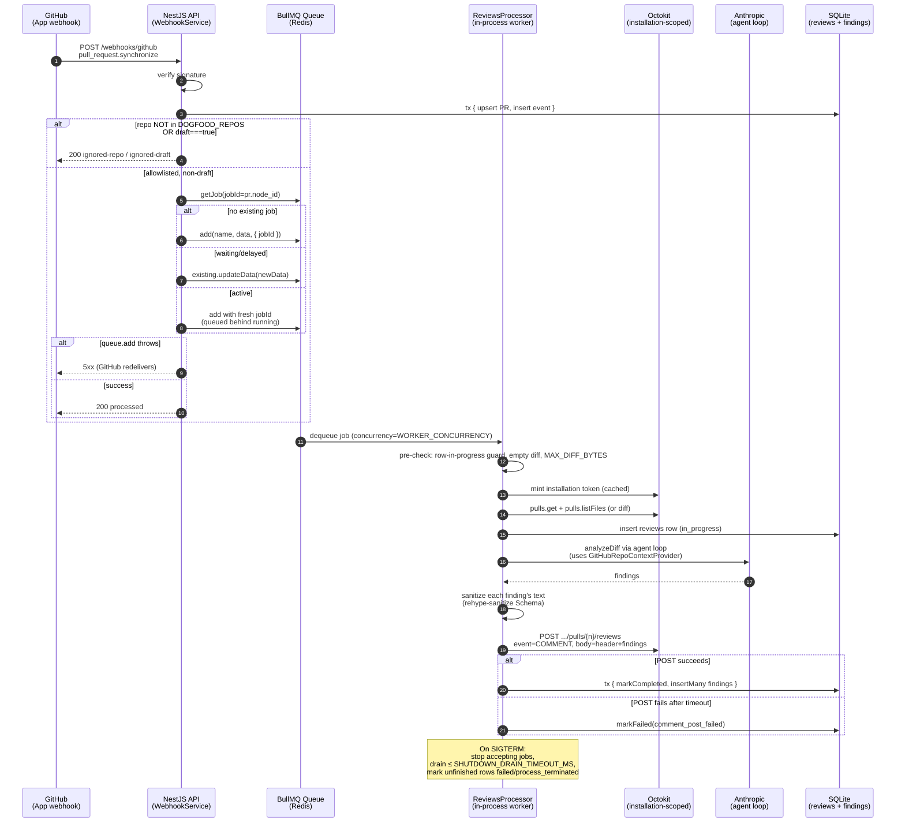

# Day 5 real-PR integration — webhook-triggered review jobs + GitHub Review posting

This is the implementation-level plan for Day 5 of the 10-day sprint described in [docs/plans/01-baseline.md](01-baseline.md). It expands the parent plan's Day 5 paragraph (*"Real PR Integration — Webhook → review → comment"*) into concrete units a coding agent can execute. The product-level decisions, requirement IDs (R1–R13), actors (A1–A6), key flows (F1–F3), and acceptance examples (AE1–AE6) live in the upstream requirements doc at [docs/brainstorms/day5-real-pr-integration-requirements.md](../brainstorms/day5-real-pr-integration-requirements.md).

---

## Summary

Wire real GitHub PRs into the Day-4 multi-turn agent loop. A `pull_request.opened` or `pull_request.synchronize` webhook on an allowlisted repository enqueues a per-PR job on a Redis-backed BullMQ queue using a deterministic job-id keyed on `pr.node_id` (with upsert-on-collision via `getJob → getState → updateData/add` primitives so concurrent webhook deliveries coalesce). A worker mints an installation-scoped Octokit via a GitHub App auth provider, fetches the unified PR diff, runs the existing agent loop with a new `GitHubRepoContextProvider`, sanitizes Claude-emitted finding text to a safe markdown subset, and POSTs a single body-only Review (`event=COMMENT`) listing every finding under a self-identifying header. Body-only Review and App-only auth are the Day-5 contracts; Hybrid format (inline `comments[]`) and PAT mode are first-class deferrals to Day 10. Day 5's worker also closes the Day-4 R8 residual by making `fetchPriorReview` query this project's own `reviews` and `review_findings` tables filtered to successfully-completed prior runs.

By end of Day 5 the recorded on-camera demo shows a PR opened on a controlled OSS fork triggering an AI Review within ~60 seconds, with at least three planted violations of distinct severities surfaced in sanitized markdown; the same install runs in dogfood mode against `ai-pr-review-copilot` itself, gated by an env-driven `DOGFOOD_REPOS` allowlist that doubles as a kill switch.

---

## Problem Frame

Day 4 shipped a multi-turn agent loop that produces high-quality findings against deterministic filesystem fixtures via a dry-run CLI. The loop has no real-PR entry point: the webhook handler records `pull_request.opened` / `synchronize` events but does not trigger anything, the HTTP review path runs with `NullRepoContextProvider` so every file fetch comes back `not_found`, and the system has never written anything back to GitHub. The whole pipeline therefore terminates inside a SQLite row.

The parent baseline plan names this day the "Real PR Integration" checkpoint and explicitly calls for re-evaluating timeline and scope after it ships. Without it, Day 6's evaluation harness has nothing real to measure against, the demo recording has nothing to capture, and Day 4's agentic capabilities stay invisible. Day 4 deliberately locked the seams (`IRepoContextProvider` interface, the wider `RepoContextErrorReason` vocabulary including `forbidden | rate_limited | network`) so Day 5's swap is a method-for-method replacement rather than an interface renegotiation.

Day 5's scope is deliberately conservative: body-only Reviews and App-only auth let the demo land and the checkpoint genuinely re-evaluate scope, rather than burning runway on inline-comment machinery and a second auth mode whose payoff lands later. Two small flow-analysis-surfaced scope additions ride alongside (skip-drafts + a 256KB diff cap) because both close concrete failure modes — Anthropic budget burned on work-in-progress code, and Claude's context window overflowing on monorepo-style dogfood PRs.

---

## Scope

### In scope (Day 5)

- Webhook enqueue path: extends `WebhookService` with a `DOGFOOD_REPOS` allowlist gate and a queue `add` call after the existing Day-1 transaction commits. New `WebhookHandlerStatus` outcomes: `'ignored-repo'`, `'ignored-draft'`.
- BullMQ + Redis as the per-PR job queue. New `infrastructure/queue/` adapter with `IReviewQueue` interface in the reviews module. Deterministic per-PR job-id keyed on `pr.node_id` with hand-rolled `getJob → getState → updateData/add` upsert primitives.
- GitHub infrastructure adapter under `infrastructure/github/`: Octokit factory cached per installation, `IGithubAuthProvider` interface with a single Day-5 `AppInstallationAuthProvider` implementation (App ID + PEM private key), `GithubRequestError` mirroring the Day-3 `AnthropicRequestError` scrub discipline. Boot probe via `GET /app` fails the process fast on credential errors.
- New `GitHubRepoContextProvider` implementing `IRepoContextProvider`: `fetchFile` via `repos.getContent` with a 1 MB cap, `fetchFunctionDefinition` composing the existing grep helper with `fetchFile`, `fetchPriorReview` via a new repository method querying the project's own `reviews` + `review_findings` tables (joined SQL, filtered to `status='completed' AND error_code IS NULL`).
- Worker: `ReviewsProcessor` consuming BullMQ jobs. Mints installation Octokit at `process()` entry, pre-checks empty diff and the 256KB diff cap, calls a new `ReviewsService.runRealReview` that mirrors the Day-3/4 lifecycle (`insert(in_progress) → llm.analyzeDiff → transaction(markCompleted + findings.insertMany)`) and POSTs the body-only Review on completion.
- Markdown sanitization helper using `unified` + `rehype-sanitize` with a custom Schema. Pinned contract: preserve link display text (strip URL), wrap `citation` content in a fenced code block (no sanitization on code-block bodies), escape leading `#`/`>`/`-`/`*` outside code blocks, allow `<!-- ai-pr-review-copilot:v1 -->` HTML comment marker as a forward-compat hook for Day-10 intra-PR dedupe.
- Body-only Review format: one Review per completed run, `event=COMMENT`, sanitized markdown body with a self-identifying header line plus the machine-readable HTML comment marker.
- New `reviews.error_code` literals: `github_api_error`, `comment_post_failed`, `enqueue_failed`, `pr_closed_during_review`, `diff_too_large`. Column stays free-form text — no migration needed.
- Bounded worker shutdown drain (`SHUTDOWN_DRAIN_TIMEOUT_MS`, default 25000) plus a sweep-cutoff bump from 5 → 10 minutes so the worst-case six-turn loop budget never races the sweep.
- `DOGFOOD_REPOS` env allowlist (comma-separated `repo_full_name` set). Empty string → silent.
- Anthropic zero-retention mode wired through `ANTHROPIC_USE_ZERO_RETENTION` for production / dogfooding paths.
- Setup docs: Redis bring-up via docker-compose, App install + minimum permissions + key-rotation procedure, troubleshooting table for the new error codes, `.env.example` updates.

### Deferred to Follow-Up Work

These items are planned work for later days, not non-goals:

- **Hybrid Review format** (Day 10): inline `comments[]` array with structured `{path, line}` locations, `emit_finding` v3→v4 schema bump, stale-SHA refetch, per-finding idempotency keys, body-fallback for unparseable locations. The Day-5 self-identifying HTML comment marker is the only forward-compat artifact this plan ships.
- **PAT auth mode** (Day 8 or 10): the `IGithubAuthProvider` seam stays interface-stable so a `PersonalAccessTokenAuthProvider` impl can land later without renegotiating consumers.
- **Operator notification on `credit_balance_too_low`** (Day 8 observability): Day-4's classifier already emits this error code; Day-5 changes nothing here.
- **Token rotation handling**: Day-5 maps mid-process 401s to `github_api_error` and lets the operator notice via failed-row volume. Day-8 observability adds proactive alerting.
- **`@bot` slash commands** (pause, re-review): manual control is via App install/uninstall or the `DOGFOOD_REPOS` env flip.
- **GitHub Checks API status surface** on the PR's "checks" tab: body-only Review is the only PR-visible artifact at Day 5.
- **Visible failure signals** (a "review failed" PR body, error reaction, Check failure): Day-8 observability work.

### Outside this product's identity (true non-goals)

- The dry-run CLI does NOT gain a `--pr=` real-PR mode. The webhook is the canonical real-PR entry point.
- The bot does not actively dismiss, resolve, or delete bot comments from prior runs (intra-PR Review accumulation is the visible Day-5 trade-off).
- Cross-PR or cross-repo de-duplication is not in scope.
- Multi-process workers / horizontal scale across machines: Day 5 is single-worker-per-process.
- Octokit response-body validation beyond status-code branching: any 2xx from `pulls.createReview` is success.
- Rate-limit accounting against the Anthropic budget.

---

## Requirements Trace

Every brainstorm requirement R1–R13 maps to one or more implementation units; brainstorm acceptance examples AE1–AE6 plus plan-added acceptance examples AE-P, AE-D, AE-Q, AE-T map to test scenarios on the unit that owns the assertion. The brainstorm's P0/P1/P2 priority tiers drive sequencing — if Day 5 runs long, P2 (R8) can slip to Day 6 without breaking the recorded demo.

| Brainstorm | Priority | Unit(s) | Acceptance Examples |
|---|---|---|---|
| R1. PR action filter (`opened`/`synchronize` only) | P0 | U5 | AE-D |
| R2. Deterministic BullMQ job-id + upsert | P0 | U4, U5 | AE1, AE2, new AE-Q (two-workers-same-pr invariant) |
| R3. Queue-per-PR, never cancel running | P0 | U4, U5 | AE1 |
| R4. Webhook 5xx on `queue.add` failure | P0 | U5 | AE4 |
| R5. `IGithubAuthProvider` seam, App-installation impl | P0 | U2 | — |
| R6. `GitHubRepoContextProvider` matches Day-4 contract | P0 | U3 | — |
| R7. `fetchFile` with 1MB cap | P0 | U3 | — |
| R8. `fetchPriorReview` joined SQL filtered to completed | P2 | U3 | — |
| R9. One body-only Review per completed run + header | P0 | U6, U7 | AE3 |
| R10. Markdown sanitization to safe subset | P0 | U6 | AE3 |
| R11. New `error_code` vocabulary | P0 | U7 | AE4, AE5, new AE-P (PR closed mid-review) |
| R12. Bounded shutdown drain | P1 | U8 | — |
| R13. `DOGFOOD_REPOS` allowlist | P1 | U5 | AE6 |

New acceptance examples added by this plan (covered in test scenarios on the unit indicated):

- **AE-P** (U7). PR closed/deleted between webhook dequeue and worker start: `pulls.get` returns 404; worker writes `error_code = 'pr_closed_during_review'` (status 404 → `github_api_error` if not yet open at fetch time); no Review posted.
- **AE-D** (U5). `pull_request.opened` OR `pull_request.synchronize` with `payload.pull_request.draft === true` returns `ignored-draft`; persists the audit row; does NOT enqueue. A subsequent `pull_request.ready_for_review` is recorded as `ignored-action` (not yet in `ACTIONS_THAT_PROGRESS_PIPELINE`); the bot reviews on the first `synchronize` after the draft is promoted.
- **AE-Q** (U4). Two `synchronize` deliveries for the same `pr.node_id` arrive within 1 ms; the deterministic-jobId upsert ensures exactly one job runs (the second `add` is a no-op after `getJob` confirms an active job exists); a second waiting job is created behind the running one.
- **AE-T** (U7). The worker's incoming job's diff size exceeds `MAX_DIFF_BYTES`; the row is marked `failed` with `error_code = 'diff_too_large'`; no Anthropic call is made; no Review is posted.

---

## High-Level Technical Design

*This illustrates the intended approach and is directional guidance for review, not implementation specification. The implementing agent should treat it as context, not code to reproduce.*



The arrows from API/Worker to Octokit go through `IGithubAuthProvider` (Day-5 binding: `AppInstallationAuthProvider`); the PAT impl deferred to Day 8/10 plugs into the same seam.

---

## Output Structure

This plan adds two new infrastructure folders and one feature-module file. Existing folders gain new files alongside their existing siblings. The tree below shows additions only; not a constraint — the implementer may adjust if implementation reveals a cleaner layout.

```
apps/api/
├── src/
│   ├── config/
│   │   └── config.service.ts                          (+ new env props)
│   ├── infrastructure/
│   │   ├── github/                                    (NEW)
│   │   │   ├── github.module.ts
│   │   │   ├── github-app.service.ts                  (Octokit factory, boot probe)
│   │   │   ├── app-installation-auth.provider.ts
│   │   │   ├── github-repo-context.provider.ts
│   │   │   ├── github-request.error.ts
│   │   │   └── index.ts
│   │   ├── queue/                                     (NEW)
│   │   │   ├── queue.module.ts
│   │   │   ├── bullmq-review-queue.ts
│   │   │   └── index.ts
│   │   ├── db/
│   │   │   └── repositories/
│   │   │       └── sqlite-review-findings.repository.ts  (+ findByPrNodeIdForPriorReview)
│   │   └── repo-context/
│   │       └── repo-context.module.ts                 (binding swap)
│   └── modules/
│       ├── webhooks/
│       │   ├── webhook.service.ts                     (+ allowlist + enqueue)
│       │   └── types/
│       │       ├── webhook-delivery.types.ts          (+ ignored-repo, ignored-draft)
│       │       └── github-webhook-payload.types.ts    (+ draft, state, user.type)
│       └── reviews/
│           ├── reviews.module.ts                      (+ processor + queue wiring)
│           ├── reviews.service.ts                     (+ runRealReview, sweep cutoff)
│           ├── reviews.processor.ts                   (NEW BullMQ Processor)
│           ├── helpers/
│           │   ├── sanitize-finding-markdown.ts       (NEW)
│           │   └── format-review-body.ts              (NEW)
│           └── types/
│               ├── github-auth-provider.ts            (NEW)
│               ├── review-queue.ts                    (NEW)
│               └── review-finding.repository.ts       (+ new method on interface)
└── docker-compose.yml                                 (+ redis service)

docs/setup/
├── github-app.md                                      (+ Day-5 install + permissions + rotation)
└── real-pr-smoke.md                                    (NEW: Redis bring-up, troubleshooting)
```

---

## Implementation Units

Units are dependency-ordered. U-IDs are stable across plan edits. Files listed are repo-relative. P0 units (U1–U7) must ship to record the demo; U8 (shutdown drain) and U10 (docs) are P1; U9 (sweep-cutoff bump) is small enough to land with U7.

### U1. Config, dependencies, and Redis service

**Goal:** Add the seven new env vars to `ConfigService`, pin the ten new runtime deps in `apps/api/package.json`, and add a Redis service to `docker-compose.yml`. This unit gates every downstream unit.

**Requirements:** R5 (dependencies for Octokit + auth-app), R2/R3/R4 (Redis is the queue), R10 (sanitizer deps), R12 (`SHUTDOWN_DRAIN_TIMEOUT_MS`), R13 (`DOGFOOD_REPOS`), and the Anthropic zero-retention assumption.

**Dependencies:** none.

**Files:**

- `apps/api/package.json` — add `@nestjs/bullmq@^11.0.4`, `bullmq@^5.77.6`, `ioredis@^5.10.1`, `octokit@^5.0.5`, `@octokit/auth-app@^8.2.0`, `unified@^11.0.5`, `remark-parse@^11.0.0`, `remark-rehype@^11.1.2`, `rehype-sanitize@^6.0.0`, `rehype-stringify@^10.0.1`. No Nest-11 upgrade is forced (`@nestjs/bullmq@11` accepts `@nestjs/common@^10 || ^11` peer).
- `package.json` (repo root) — bump `engines.node` from `>=20.0.0` to `>=22.12.0`. The sanitizer pipeline (`unified` / `remark-*` / `rehype-*`) is pure ESM and `apps/api` compiles to CommonJS; Node 22.12 enabled `require(ESM)` by default, which is the smallest change that lets these imports load without a tsconfig or build-system migration. See Open Questions for the Node-20-compatible alternative.
- `apps/api/src/config/config.service.ts` — new typed properties: `appId: string`, `appPrivateKey: string`, `redisUrl: string` (or `redisHost`/`redisPort`/`redisPassword` triple), `dogfoodRepos: Set<string>`, `anthropicUseZeroRetention: boolean`, `workerConcurrency: number`, `shutdownDrainTimeoutMs: number`, `maxDiffBytes: number`.
- `apps/api/test/config/config.service.spec.ts` — mirror existing validators.
- `docker-compose.yml` — add a `redis` service with `image: redis:7-alpine` pinned, healthcheck via `redis-cli ping`, password from `REDIS_PASSWORD`, bound to localhost / Docker bridge network only.
- `.env.example` — add the new vars with placeholder values plus inline comments pointing at `docs/setup/real-pr-smoke.md`.

**Approach:**

- Mirror the existing `requireSecret` / `requireNonEmptyToken` / URL-shape validators in `ConfigService`. `APP_PRIVATE_KEY` is a PEM secret (`requireSecret` + a `-----BEGIN` prefix check). `REDIS_URL` parses with `redis:` / `rediss:` scheme. `DOGFOOD_REPOS` parses comma-separated tokens into a `Set<string>` after trimming; empty string yields the empty set.
- `WORKER_CONCURRENCY` defaults to `1`; finite-positive-integer check. `SHUTDOWN_DRAIN_TIMEOUT_MS` defaults to `25000`. `MAX_DIFF_BYTES` defaults to `256 * 1024`. `ANTHROPIC_USE_ZERO_RETENTION` parses via a new exported `parseBooleanFlag` helper modelled on `parseEnableDryRun`.
- Group required-by-default constructor checks so a fresh `.env` surfaces all missing vars together rather than one-at-a-time.

**Patterns to follow:** `apps/api/src/config/config.service.ts` validation helpers; `apps/api/src/config/config.service.ts` `parseEnableDryRun` exported-function pattern for `parseBooleanFlag`.

**Test scenarios:**

- Happy path: every new env var supplied → properties read correctly; `dogfoodRepos` contains expected entries; defaults applied where absent.
- Edge: empty `DOGFOOD_REPOS` → empty `Set`; whitespace-only token → rejected.
- Error: missing `APP_PRIVATE_KEY` → `Error` mentions the var name. PEM that lacks `-----BEGIN` → rejected. Invalid `REDIS_URL` scheme → rejected. Non-numeric `WORKER_CONCURRENCY` → rejected.
- Test expectation: no behavioral side-effects beyond construction; no separate runtime test needed for env loading.

**Verification:** `npm test --workspace apps/api -- config.service.spec.ts` passes. A scratch `.env` with all required vars set boots the app; missing any one causes immediate fail-fast at startup with a message naming the offending var.

---

### U2. GitHub infrastructure adapter + auth provider + boot probe

**Goal:** Stand up `apps/api/src/infrastructure/github/` with an `IGithubAuthProvider` seam, a single `AppInstallationAuthProvider` implementation, an Octokit factory cached per installation, a `GithubRequestError` mirroring `AnthropicRequestError`'s scrub discipline, and a boot-time `GET /app` probe that fails fast on credential errors.

**Requirements:** R5.

**Dependencies:** U1.

**Files:**

- `apps/api/src/modules/reviews/types/github-auth-provider.ts` — `GITHUB_AUTH_PROVIDER` Symbol token, `IGithubAuthProvider` interface (`forInstallation(installationId: number): Octokit`), supporting types.
- `apps/api/src/infrastructure/github/github.module.ts` — wires `GITHUB_AUTH_PROVIDER` → `AppInstallationAuthProvider`; declares `GitHubAppService` (Octokit factory + boot probe) with `onModuleInit`.
- `apps/api/src/infrastructure/github/app-installation-auth.provider.ts` — calls `createAppAuth({ appId, privateKey })`; returns an `Octokit` constructed via `new Octokit({ authStrategy: createAppAuth, auth: { appId, privateKey, installationId } })` plugged with `@octokit/plugin-throttling` and `@octokit/plugin-retry`. Holds an in-process `Map<installationId, Octokit>` so installation-token caching from `@octokit/auth-app` (in-memory, lazy-refresh at the 59-minute mark) actually compounds across job invocations.
- `apps/api/src/infrastructure/github/github-app.service.ts` — `onModuleInit` runs `octokit.request('GET /app')` (App-JWT-authenticated, no installation needed); throws on non-2xx with a redacted message.
- `apps/api/src/infrastructure/github/github-request.error.ts` — mirror `AnthropicRequestError`: `name`, `status`, `errorCode?`, `serverMessage?`, optional `installationId?` / `prNodeId?` partial-state fields, `cause?`. Top-of-file comment block restricting what enters `Error.message` (never response bodies, tokens, PR contents).
- `apps/api/src/infrastructure/github/index.ts` — barrel.
- `apps/api/test/infrastructure/github/app-installation-auth.provider.spec.ts`
- `apps/api/test/infrastructure/github/github-app.service.spec.ts`

**Approach:**

- Octokit plugins: install `@octokit/plugin-throttling` with `onRateLimit` / `onSecondaryRateLimit` callbacks that return `false` (no in-callback retry — surface to caller as a `RequestError` with `status: 429` and `Retry-After` headers preserved). `@octokit/plugin-retry` with defaults for 5xx on idempotent verbs (GET, HEAD) only; we explicitly disable retries on the Review POST via per-call `request.retries = 0` in U7.
- Boot probe is `octokit.request('GET /app')` authenticated with the App JWT (no installation). 2xx → log "GitHub App probe OK" with the App's `slug` field; non-2xx → throw a `GithubRequestError` with sanitized message, causing Nest to halt startup.
- Token-rotation policy: out of scope at Day 5; if the operator rotates the PEM mid-process, the next Octokit call will 401 and the worker will surface `error_code = 'github_api_error'`. Documented as a Day-8 follow-up.

**Patterns to follow:** `apps/api/src/infrastructure/anthropic/anthropic-request.error.ts` scrub discipline; `apps/api/src/infrastructure/anthropic/anthropic.module.ts` for the module shape (single provider class bound to a Symbol token); `apps/api/src/infrastructure/anthropic/anthropic-llm-reviewer.ts` `createClient()` test-seam pattern (protected method) so the auth provider can be tested without real Octokit construction.

**Test scenarios:**

- Happy path: `forInstallation(123)` returns an `Octokit`; calling it twice with the same `installationId` returns the cached instance (identity check).
- Boot probe success: stubbed Octokit returns 200 → `onModuleInit` resolves; logs the App slug.
- Boot probe failure: stubbed Octokit throws a 401 `RequestError` → `onModuleInit` rejects with a `GithubRequestError`; `Error.message` does NOT contain the PEM, the App ID, or the response body.
- Error mapping: a 429 with `Retry-After: 30` → captured by `onRateLimit` callback; `onRateLimit` returns `false`; original `RequestError` propagates.
- Test expectation: real Octokit construction is mocked at the constructor boundary (test seam); no HTTPS calls in unit tests.

**Verification:** `npm test --workspace apps/api -- infrastructure/github` passes. Starting the API with a valid `APP_ID` + `APP_PRIVATE_KEY` logs "GitHub App probe OK" with the App slug; starting with a malformed PEM exits with a clear error before any HTTP route binds.

---

### U3. `GitHubRepoContextProvider` + repository method for prior reviews

**Goal:** Implement `IRepoContextProvider` against Octokit so the agent loop's three context tools work end-to-end on real PRs. Close the Day-4 R8 residual by joining `reviews` + `review_findings` to surface a real `PriorReviewEntry[]` filtered to successfully-completed runs.

**Requirements:** R6, R7, R8.

**Dependencies:** U2.

**Files:**

- `apps/api/src/infrastructure/github/github-repo-context.provider.ts` — implements `IRepoContextProvider`. Receives an `Octokit` (passed in per-job via the worker, not module-scoped) plus the `owner`, `repo`, `head_sha`, `pr_node_id` context for this run.
- `apps/api/src/modules/reviews/types/review-finding.repository.ts` — extend interface with `findByPrNodeIdForPriorReview(prNodeId: string): PriorReviewEntry[]`. Existing `insertMany` and `findByReviewId` unchanged.
- `apps/api/src/infrastructure/db/repositories/sqlite-review-findings.repository.ts` — implement the new method via a single joined SQL through Drizzle's query builder: `reviews INNER JOIN review_findings ON reviews.id = review_findings.review_id WHERE reviews.pr_node_id = ? AND reviews.status = 'completed' AND reviews.error_code IS NULL ORDER BY reviews.completed_at DESC`. Shape rows into `PriorReviewEntry`. `dismissed_at` is `null` until a future column lands.
- `apps/api/src/infrastructure/repo-context/repo-context.module.ts` — leave unchanged. `NullRepoContextProvider` remains the module-scoped DI binding (the dry-run HTTP path still uses it). `GitHubRepoContextProvider` cannot be DI-bound because it requires per-job constructor args (`Octokit`, `owner`, `repo`, `head_sha`, `pr_node_id`); the worker constructs it manually per job in U7 instead.
- `apps/api/test/infrastructure/github/github-repo-context.provider.spec.ts`
- `apps/api/test/infrastructure/db/repositories/sqlite-review-findings.repository.spec.ts` — new tests for the prior-review method.

**Approach:**

- `fetchFile`: `octokit.rest.repos.getContent({ owner, repo, path, ref: head_sha })`. On `type === 'file'` with a usable `content` (base64), decode and return. The Octokit response includes `size` — short-circuit to `{ ok: false, reason: 'not_found', message: 'file exceeds 1 MB API limit' }` when `size > 1_048_576`. On 404 → `not_found`; on 403 with `x-ratelimit-remaining: 0` or 429 → `rate_limited` with `retryAfterMs` parsed from `Retry-After` or `X-RateLimit-Reset`; on other 4xx → `forbidden` or `not_found` based on status; on 5xx / network → `network`. Never throw.
- `fetchFunctionDefinition`: reuse the existing `grep-function-definition` helper, but compose it on top of `fetchFile` rather than the filesystem. Practical wiring: when `file` is supplied, fetch that file's content and run the grep heuristic; when `file` is omitted, the Octokit code-search API is out of scope (mirror filesystem provider's "needs file arg" behavior). Return `parse_error` when the grep produces no result.
- `fetchPriorReview`: delegate to the new repository method. Translate `query.pr_node_id` → `prNodeId`. The `file_path` and `rule_id` filters can be applied in JS over the result (small lists). Returns `{ ok: true, content: [] }` when no prior runs exist (mirrors the `NullRepoContextProvider` precedent).
- Provider must never throw — any unexpected error wraps into `{ ok: false, reason: 'network', message: <sanitized> }`.

**Patterns to follow:** `apps/api/src/infrastructure/repo-context/filesystem-repo-context.provider.ts` for the result-shape discipline; `apps/api/src/infrastructure/repo-context/helpers/grep-function-definition.ts` for the function-grep heuristic; `apps/api/src/infrastructure/db/repositories/sqlite-pull-requests.repository.ts` for Drizzle query patterns.

**Test scenarios:**

- `fetchFile` happy path: Octokit returns base64 content; provider returns `{ ok: true, content, path }`.
- `fetchFile` 404 → `{ ok: false, reason: 'not_found', message }`.
- `fetchFile` size > 1 MB (mocked) → `not_found` with the documented message.
- `fetchFile` 429 with `Retry-After: 30` → `rate_limited` with `retryAfterMs: 30000`.
- `fetchFile` network exception → `network`.
- `fetchFunctionDefinition` with explicit `file` arg → composes `fetchFile` + grep correctly.
- `fetchPriorReview` (real SQLite) — covers AE-aligned `Covers R8` scenarios:
  - No prior runs for this `pr_node_id` → `{ ok: true, content: [] }`.
  - One completed + one failed run → only the completed run's findings are returned.
  - Two completed runs → both returned, ordered most-recent-first.
  - Filter by `file_path` reduces the in-memory list correctly.
- Test expectation: provider unit tests stub Octokit; repository test uses real SQLite tmpdir per repo convention.

**Verification:** `npm test --workspace apps/api -- repo-context` and `npm test --workspace apps/api -- sqlite-review-findings` both green. After this unit lands, the existing reviews HTTP path (`POST /reviews/dry-run` with a real diff against a fixture repo on GitHub) demonstrates real Octokit-backed file fetches.

---

### U4. BullMQ queue adapter

**Goal:** Stand up `apps/api/src/infrastructure/queue/` with an `IReviewQueue` interface in the reviews module, a `BullMQReviewQueue` implementation that exposes `enqueueReview(input)` using the hand-rolled `getJob → getState → updateData/add` upsert pattern, and a Redis-PING boot probe.

**Requirements:** R2, R3, R4.

**Dependencies:** U1.

**Files:**

- `apps/api/src/modules/reviews/types/review-queue.ts` — `REVIEW_QUEUE` Symbol; `IReviewQueue` interface with `enqueueReview(input: ReviewJobData): Promise<EnqueueResult>` where `EnqueueResult = { jobId: string; result: 'added' | 'updated-in-place' | 'enqueued-behind-active' }`; `ReviewJobData` shape (`pr_node_id`, `owner`, `repo`, `pr_number`, `head_sha`, `installation_id`).
- `apps/api/src/infrastructure/queue/queue.module.ts` — wires `REVIEW_QUEUE` → `BullMQReviewQueue`. Calls `BullModule.registerQueueAsync(...)` from `@nestjs/bullmq` with a `useFactory` that reads connection settings from `ConfigService`. Includes an `onModuleInit` that issues `await queue.client.ping()` (Redis `PING`) and throws on failure.
- `apps/api/src/infrastructure/queue/bullmq-review-queue.ts` — concrete impl. Encapsulates the upsert primitive sequence.
- `apps/api/src/infrastructure/queue/index.ts` — barrel.
- `apps/api/test/infrastructure/queue/bullmq-review-queue.spec.ts` — unit tests against `ioredis-mock` (allowed test-only dep) or a stubbed BullMQ `Queue`.

**Approach:**

- The `enqueueReview` method:
  1. `const jobId = data.pr_node_id;`
  2. `const existing = await this.queue.getJob(jobId);`
  3. If `!existing` → `await this.queue.add(REVIEW_JOB_NAME, data, { jobId });` return `{ jobId, result: 'added' }`.
  4. `const state = await existing.getState();`
  5. If `state === 'waiting' || state === 'delayed'` → `await existing.updateData(data);` return `{ jobId, result: 'updated-in-place' }`.
  6. Else (state ∈ `active | completed | failed | unknown`) → `const newJobId = ${jobId}:${data.head_sha};` `await this.queue.add(REVIEW_JOB_NAME, data, { jobId: newJobId });` return `{ jobId: newJobId, result: 'enqueued-behind-active' }`.
- Hand-rolled primitives chosen over BullMQ's newer `deduplication: { keepLastIfActive }` because: the primitive sequence is observable in worker logs (debuggable mid-demo), insulated from minor-version churn in BullMQ's deduplication API shape, and the brainstorm's "deterministic BullMQ job-id with upsert-on-collision" phrasing implies primitive-level mechanics.
- Boot probe: cast `BullMQQueue.opts.connection` to `IORedis` and call `await connection.ping()`. Refuses startup if Redis is unreachable (paired with U2's `GET /app` probe — both block boot so transient outages surface at startup, not at webhook arrival).
- Default BullMQ retry: `attempts: 3`, `backoff: { type: 'exponential', delay: 1000 }`. Tunable via the queue registration options.

**Patterns to follow:** `apps/api/src/infrastructure/anthropic/anthropic.module.ts` for the module shape; `apps/api/src/infrastructure/chroma/chroma.module.ts` for the async-factory pattern reading from `ConfigService`.

**Test scenarios:**

- Happy path: enqueue for a brand-new `pr_node_id` → `result: 'added'`, `jobId === pr_node_id`.
- AE2 / R2: same `pr_node_id`, existing job in `waiting` → `result: 'updated-in-place'`; verify `updateData` was called with the new payload's `head_sha`.
- AE-Q (new): same `pr_node_id`, existing job in `active` → `result: 'enqueued-behind-active'`; new `jobId` contains the `head_sha` suffix.
- R3: same `pr_node_id`, existing job in `active`, then a third `enqueueReview` arrives → the second active-state path produces a third job suffixed with the newest `head_sha`; verify the running job is untouched.
- AE4 / R4: queue ops throw (Redis dropped mid-call) → `enqueueReview` rejects with a typed error; webhook propagates 5xx.
- Edge: `getJob` returns `undefined` despite the jobId being added moments earlier (race) → fall through to `add` path; BullMQ's own duplicate-id Lua emits a `"duplicated"` event but the call resolves without error.
- Test expectation: unit tests use `ioredis-mock` or stub the `Queue` class with Jest. No real Redis required for CI.

**Verification:** `npm test --workspace apps/api -- queue/bullmq-review-queue.spec.ts` passes. Booting the API with `REDIS_URL` pointing at a stopped Redis container fails fast with "Redis ping failed".

---

### U5. Webhook enqueue path, allowlist gate, draft filter

**Goal:** Extend `WebhookService.handleDelivery` to (a) gate `pull_request.opened` / `synchronize` deliveries on `DOGFOOD_REPOS`, (b) skip drafts, (c) enqueue via `IReviewQueue` after the Day-1 transaction commits, (d) 5xx on `queue.add` failure so GitHub redelivers.

**Requirements:** R1, R2, R3, R4, R13. New AE-D coverage.

**Dependencies:** U1, U4.

**Files:**

- `apps/api/src/modules/webhooks/types/webhook-delivery.types.ts` — extend `WebhookHandlerStatus` union: add `'ignored-repo'`, `'ignored-draft'`.
- `apps/api/src/modules/webhooks/types/github-webhook-payload.types.ts` — extend `GithubWebhookPayload.pull_request` with `draft?: boolean`, `state?: 'open' | 'closed'`, `user?: { login: string; type: string }`. Add a top-level `installation?: { id: number }` field so U5's enqueue branch can read `installation.id`. Backwards-compatible — fields are optional.
- `apps/api/src/modules/webhooks/webhook.service.ts` — inject `@Inject(REVIEW_QUEUE) IReviewQueue` and `ConfigService`. After the existing transaction commits in the action-progresses branch, add: (1) if `payload.pull_request.draft === true` → return `'ignored-draft'` (applies to BOTH `opened` and `synchronize` — consistent draft-skip policy); (2) if `repository.full_name` ∉ `configService.dogfoodRepos` → return `'ignored-repo'`; (3) call `queue.enqueueReview({ pr_node_id, owner, repo, pr_number, head_sha, installation_id })`. Catch errors from `enqueueReview` and re-throw so the controller returns 5xx.
- `apps/api/src/modules/webhooks/webhook.module.ts` — add `infrastructure/queue` to `imports`.
- `apps/api/test/modules/webhooks/webhook.service.spec.ts` — extend with new branches.
- `apps/api/test/modules/webhooks/webhook.e2e-spec.ts` — add e2e cases for ignored-repo and queue-failure 5xx.

**Approach:**

- The draft filter applies to BOTH `opened` and `synchronize` — checking `payload.pull_request.draft === true` regardless of action — so subsequent WIP-state pushes on a draft PR are also skipped. This keeps the stated WIP-budget rationale intact (no Anthropic spend on draft commits). The `ready_for_review` action lands on the existing `ignored-action` path; the bot then reviews on the next `synchronize` after the promotion. For the Day-5 demo this is acceptable because the planted-violations PR opens non-draft.
- The `ACTIONS_THAT_PROGRESS_PIPELINE` set is module-private; adding `ready_for_review` is intentionally deferred (the next `synchronize` triggers review acceptably for Day-5 scope).
- Idempotency-vs-enqueue ordering: the existing `delivery_id` idempotency short-circuit runs FIRST (unchanged). If a delivery successfully persists the audit row but then `queue.add` throws and we 5xx, GitHub redelivers; on redelivery the short-circuit returns `'duplicate'` and does NOT re-attempt the enqueue. Explicit Day-5 trade-off: a Redis blip on a `pull_request.opened` delivery may strand the PR until the next `synchronize`. Documented in Scope Boundaries; Day-8 observability surfaces the orphan. The recorded demo path is operator-controlled so this never fires; the dogfood leg gets multiple synchronizes per real PR.
- Drizzle's `db.transaction(fn)` callback is synchronous (better-sqlite3 contract). The `queue.enqueueReview` call is async and happens AFTER `db.transaction(...)` returns. Order is: commit → allowlist/draft gates → enqueue → return.

**Patterns to follow:** `apps/api/src/modules/webhooks/webhook.service.ts:42-88` for the existing branch shape; `apps/api/src/modules/webhooks/types/webhook-delivery.types.ts` for the union extension.

**Test scenarios:**

- R1: `pull_request.opened` action present → enqueue path runs.
- R1: `pull_request.reopened` → skipped, returns `'ignored-action'` (unchanged).
- R13 / AE6: allowlisted repo → enqueue; non-allowlisted → `'ignored-repo'`, audit row persisted, no queue call.
- AE-D (new): `pull_request.opened` with `draft: true` → `'ignored-draft'`; a subsequent `synchronize` while `draft: true` → also `'ignored-draft'`; the first `synchronize` after `draft: false` enqueues normally.
- R4 / AE4: queue `enqueueReview` throws → controller returns 5xx; audit row was persisted in the prior transaction (verify the row exists in DB after the 5xx).
- R2 integration (real `BullMQReviewQueue` against `ioredis-mock`): two `synchronize` deliveries for the same `pr.node_id` → only one waiting job in the queue; second call returns `result: 'updated-in-place'`.
- Idempotency: same `delivery_id` arriving twice with Redis healthy → first call enqueues; second short-circuits to `'duplicate'` and does NOT call `enqueueReview` a second time.
- Edge: payload missing `installation.id` (real GitHub webhooks always include it but type allows `undefined`) → reject before enqueue with a typed error, status `'ignored-event'` (or extend the union with `'invalid_payload'` — the implementing agent picks).

**Verification:** Existing webhook unit and e2e tests still pass plus the new scenarios above. Manual exercise: `curl` with a synthesized signed payload triggers an enqueue visible in Redis (`redis-cli LRANGE bull:reviews:wait 0 -1`).

---

### U6. Markdown sanitizer + Review body formatter

**Goal:** Implement the `sanitize-finding-markdown` helper using `unified` + `rehype-sanitize` with a custom Schema, and the `format-review-body` helper that assembles the self-identifying header + per-finding markdown blocks into the final Review body.

**Requirements:** R9, R10. Covers AE3.

**Dependencies:** U1.

**Files:**

- `apps/api/src/modules/reviews/helpers/sanitize-finding-markdown.ts` — exports `sanitizeFindingMarkdown(input: string): string`. Pure function.
- `apps/api/src/modules/reviews/helpers/format-review-body.ts` — exports `formatReviewBody(input: { findings: SanitizedFinding[]; reviewId: string }): string`. Pure function.
- `apps/api/src/modules/reviews/helpers/index.ts` — barrel.
- `apps/api/test/modules/reviews/helpers/sanitize-finding-markdown.spec.ts`
- `apps/api/test/modules/reviews/helpers/format-review-body.spec.ts`

**Approach:**

- Sanitizer pipeline: `unified().use(remarkParse).use(remarkRehype, { allowDangerousHtml: false }).use(rehypeSanitize, schema).use(rehypeStringify)`.
- Schema (custom, derived from `defaultSchema` in `hast-util-sanitize`):
  - `tagNames`: `['strong', 'b', 'em', 'i', 'code', 'pre', 'p', 'br', 'ul', 'ol', 'li']` (lists included — they carry no injection vector and findings often enumerate).
  - `attributes`: `code: ['className']` (preserves the `language-ts` hint for syntax highlighting).
  - No `a`, `img`, `h1..h6`, `table`, `blockquote`, `script`, `style`, `iframe`. Nodes not in `tagNames` are removed but their text content is preserved (the unified default behavior). Link display text survives the strip — `[click here](http://evil)` becomes `click here`.
- Title / message / citation contract:
  - `title` and `message`: sanitized as prose.
  - `citation`: wrapped in a fenced code block (` ```\n{citation}\n``` `) on output; code-block contents pass through unsanitized but newlines and backtick boundaries are escaped. (Markdown spec — three backticks inside a three-backtick fence breaks the fence; the formatter escapes by switching to a four-backtick fence when input contains a triple-backtick sequence.)
  - Leading `#`, `>`, `-`, `*`, `1.` on the first character of any sanitized line outside a code block is escaped with a backslash to prevent heading / list / blockquote injection.
- Self-identifying header: literal first line `**🤖 AI PR Review Copilot** — automated review (Day 5)` (plain bold + emoji + scoped descriptor) plus a machine-readable HTML comment marker `<!-- ai-pr-review-copilot:v1:review-id={reviewId} -->` on the second line. The sanitizer Schema must allow this exact HTML comment shape (single-line, no attributes other than the literal text) as a documented exception. Day-10 Hybrid format reads the marker for intra-PR Review dedupe.
- `formatReviewBody` orders findings by severity (`error > warning > info`) then by emit order; each finding renders as a level-3 markdown bullet block `**[{severity}]** {title}\n\n{message}\n\n_Citation:_\n\`\`\`\n{citation}\n\`\`\`\n_Rule:_ \`{rule_id}\``.

**Patterns to follow:** none in repo — these are new helpers. Follow `apps/api/src/infrastructure/anthropic/anthropic-llm-reviewer.ts` `formatProviderError` style for the helper's input/output discipline (pure function, no I/O, no logging).

**Test scenarios:**

- AE3 happy path: a finding with `**important**` bold in `message` → bold preserved; a finding with `[click here](http://attacker.example)` → link stripped, `click here` plain text preserved; the self-identifying header line and HTML comment marker appear at the top.
- Sanitization defence (link / image / heading / raw HTML):
  - `[click here](javascript:alert(1))` → `click here` plain text.
  - `` → empty string (no display text).
  - `# H1 injection` at line start → `\# H1 injection` (escaped).
  - `<script>alert(1)</script>` → empty (tag stripped; text content survives but `<script>` content is dropped per unified default).
  - `<iframe src="…"></iframe>` → stripped entirely.
- Citation rendering: a citation with raw `**`, `<`, `>` characters → preserved literally inside the fenced code block (no sanitization applied to code-block content).
- Citation containing triple-backtick → output fence widens to four backticks; round-trip parses correctly.
- List rendering: `- item one\n- item two` in `message` → preserved.
- Empty / whitespace-only finding fields → render placeholders (`_(no message)_`) so the output never has bare empty lines breaking markdown parser.
- `formatReviewBody` ordering: a mix of severities → output orders error → warning → info.
- HTML comment marker: regex-match the exact shape `<!-- ai-pr-review-copilot:v1:review-id=<uuid> -->` in the output.

**Verification:** `npm test --workspace apps/api -- helpers/sanitize-finding-markdown` and `format-review-body` both green; the test suite includes a `prompt-injection-corpus.json` fixture exercising ~20 attack payloads. None produce raw HTML or external URLs in the output.

---

### U7. `ReviewsProcessor` worker + `runRealReview` lifecycle

**Goal:** Stand up the BullMQ `Processor` class that consumes jobs from `IReviewQueue`. On each job: mint installation Octokit, pre-check guards (in-flight row guard, empty diff, `MAX_DIFF_BYTES`), fetch the PR diff and the PR state, call a new `ReviewsService.runRealReview(input)`, sanitize the emitted findings, POST a single body-only Review, and write the row to `completed`. Wire every failure path through `markFailed` with a structured `error_code`. Bump the existing `sweepStaleInProgress` cutoff from 5 → 10 minutes to outlast the worst-case six-turn agent loop budget.

**Requirements:** R6, R7, R9, R11. Covers AE-P, AE-T, AE5.

**Dependencies:** U2, U3, U4, U5, U6.

**Files:**

- `apps/api/src/modules/reviews/reviews.processor.ts` — `@Processor(REVIEW_QUEUE_NAME)` class extending `WorkerHost` from `@nestjs/bullmq`. Constructor injects `IGithubAuthProvider`, `ReviewsService`, `IReviewFindingRepository` (for the runtime guard), `ConfigService`. Implements the abstract `async process(job: Job<ReviewJobData>)` method (no `@Process()` decorator — `@nestjs/bullmq@11` removed that in favor of the `WorkerHost` abstract base).
- `apps/api/src/modules/reviews/reviews.service.ts` — new method `runRealReview(input: RunRealReviewInput): Promise<RunRealReviewResult>`. Mirrors `runDryRun` lifecycle (`insert(in_progress) → llm.analyzeDiff → transaction(markCompleted + findings.insertMany)`) but takes a real `Octokit`, `pr_node_id`, `head_sha`, `owner`, `repo`, `pr_number`, and an explicit `IRepoContextProvider` (the `GitHubRepoContextProvider` constructed per-job).
- `apps/api/src/modules/reviews/reviews.service.ts` — bump `STALE_IN_PROGRESS_CUTOFF_MS` from `5 * 60_000` to `10 * 60_000`. Document inline with a one-line comment naming the worst-case turn budget.
- `apps/api/src/modules/reviews/reviews.module.ts` — register `ReviewsProcessor`; import `GithubModule` and `QueueModule`.
- `apps/api/src/modules/reviews/types/review.repository.ts` — extend `IReviewRepository` with `findRecentInProgressForPr(prNodeId: string, withinMs: number): ReviewRecord | undefined` for the stalled-job guard.
- `apps/api/src/infrastructure/db/repositories/sqlite-reviews.repository.ts` — implement `findRecentInProgressForPr`.
- `apps/api/test/modules/reviews/reviews.processor.spec.ts`
- `apps/api/test/modules/reviews/reviews.service.spec.ts` — extend with `runRealReview` tests.
- `apps/api/test/infrastructure/db/repositories/sqlite-reviews.repository.spec.ts` — extend with positive + negative branches of `findRecentInProgressForPr`.

**Approach:**

- Processor `process(job)` flow:
  1. Read `job.data` once at entry (per the AE2 contract — never re-read mid-job).
  2. Guard: query `reviewsRepository.findRecentInProgressForPr(pr_node_id, withinMs: SHUTDOWN_DRAIN_TIMEOUT_MS + 2_000)` — if a row exists, abort the re-run (BullMQ stalled-job protection); mark this job complete-with-skip so BullMQ doesn't retry. Adds a new `IReviewsRepository.findRecentInProgressForPr` method.
  3. Mint `octokit = githubAuth.forInstallation(job.data.installation_id)`.
  4. `pulls.get({ owner, repo, pull_number })` — if response `state !== 'open'`, mark the row `failed/pr_closed_during_review` and exit clean. On 404 (`RequestError.status === 404`), mark `failed/github_api_error` with `error_status: 404`.
  5. Fetch unified diff via `octokit.request('GET /repos/{owner}/{repo}/pulls/{n}', { mediaType: { format: 'diff' } })`. Check `Buffer.byteLength(diff) <= configService.maxDiffBytes`; on overflow, mark `failed/diff_too_large` and exit clean.
  6. Empty diff (`diff.trim().length === 0`) → mark `completed` with zero findings; do not call Anthropic; do not POST. (Mirrors the existing Day-3 `'diff is empty'` semantics but as a clean completion rather than an error.)
  7. Construct `repoContext = new GitHubRepoContextProvider({ octokit, owner, repo, head_sha, pr_node_id, priorReviewRepo })`.
  8. Call `reviewsService.runRealReview({ diff, prNodeId, headSha, repoContext })`. The service handles `insert(in_progress)`, the agent loop, and the `transaction(markCompleted + findings.insertMany)` write.
  9. Sanitize each emitted finding's `title`, `message`, and `citation` via `sanitizeFindingMarkdown` / fenced-code-block wrapping.
  10. Call `formatReviewBody({ findings: sanitized, reviewId })` → `body`. `formatReviewBody` validates `reviewId` matches the canonical UUID regex (`/^[0-9a-f]{8}-[0-9a-f]{4}-[0-9a-f]{4}-[0-9a-f]{4}-[0-9a-f]{12}$/i`) before interpolating into the HTML comment marker; on mismatch it throws (treated as `internal_error` upstream). The marker is the only HTML allowed through the sanitizer; the regex check prevents marker-spoofing if `reviewId` ever sources from attacker-controlled input.
  11. POST `octokit.rest.pulls.createReview({ owner, repo, pull_number, event: 'COMMENT', body }, { request: { retries: 0 } })`. **`commit_id` is intentionally omitted** so GitHub defaults to the PR's current branch tip — this eliminates the stale-head-SHA window where a `synchronize` mid-job would otherwise pin the Review to an outdated commit (PR UI shows "Outdated"). **No retry on POST.** Trade-off: fail-fast-no-retry over retry-once-with-jitter — the brainstorm and synthesis confirmed this. A 5xx after the configured request timeout marks the row `failed/comment_post_failed`; the operator re-triggers via `synchronize`.
  12. Success → log `worker.review.posted` with the Review URL.
- Failure-wrap: the entire step 3–11 sequence runs inside a `try { ... } catch (err) { await reviewsService.markFailed(reviewId, classifyError(err)); throw err; }`. Re-throwing lets BullMQ apply its own retry budget (default 3 attempts with exponential backoff); each retry inserts a fresh `reviews` row (per the per-attempt contract). The terminal failure row's `error_code` reflects the last attempt.
- `classifyError(err)`:
  - `instanceof RequestError && err.status === 422` on POST → `comment_post_failed`.
  - `instanceof RequestError` on POST after timeout → `comment_post_failed`.
  - `instanceof RequestError` on fetch → `github_api_error` with `error_status: err.status`.
  - `instanceof AnthropicRequestError` → preserves the existing Day-3/4 mapping (`anthropic_error`, `credit_balance_too_low`, etc.).
  - Anything else → `internal_error`.
- New `error_code` values land informally in `error_code` (free-form text column, no migration). Document the union in a comment block at the top of `reviews.service.ts` next to the existing list.
- `runRealReview` reuses the agent loop's existing `runDryRun` core. Implementation choice: refactor the shared core into a private method `runReviewCore(input)` that takes the diff + context provider + persistence-shape and lets both `runDryRun` and `runRealReview` wrap it. Limits the refactor surface in this unit.
- Concurrency: `WORKER_CONCURRENCY` controls how many jobs the processor handles in parallel. Default `1` because per-PR serialization is already guaranteed by deterministic jobId; bumping concurrency means multi-PR parallelism (acceptable but increases Anthropic-budget burn rate).

**Execution note:** Implement the empty-diff and `diff_too_large` guards (steps 5–6) with failing tests first; both close concrete failure modes the flow analysis surfaced and the demo path will not exercise them.

**Patterns to follow:** `apps/api/src/modules/reviews/reviews.service.ts:114-225` for the `runDryRun` lifecycle and `markFailed` flow; `apps/api/src/infrastructure/anthropic/anthropic-llm-reviewer.ts` for the `*RequestError` classification pattern; `apps/api/src/infrastructure/db/database.service.ts:105` for the synchronous-transaction discipline.

**Test scenarios:**

- Happy path (R9 / AE3 / R11): processor receives a job → fetches PR + diff → runs agent loop → POSTs Review with the expected body shape → row is `completed` with `error_code IS NULL`.
- AE-T (new): job has a diff exceeding `MAX_DIFF_BYTES` → row marked `failed/diff_too_large`; no Anthropic call; no Octokit POST.
- AE-P (new): `pulls.get` returns 404 → row marked `failed/github_api_error` with `error_status: 404`; no POST.
- PR closed (state !== 'open'): row marked `failed/pr_closed_during_review`; no POST.
- AE5 (R11): `pulls.createReview` throws a 502 after timeout → row marked `failed/comment_post_failed`; findings remain in DB.
- Empty diff: row marked `completed` with zero findings; no Anthropic call; no POST; emits a `worker.review.empty` log.
- Stalled-job guard: a `reviews` row in `in_progress` for the same `pr_node_id` exists within the drain-grace window → processor exits clean without re-running; BullMQ's retry counter does not advance.
- Rate-limit: an Octokit fetch throws a 429 with `Retry-After: 30` → re-thrown so BullMQ retries with delay; sanity-check BullMQ schedules the retry.
- Token expiry mid-job: stub `forInstallation` to return an Octokit whose `pulls.get` throws 401 → row marked `failed/github_api_error`; documented as Day-8 surfacing.
- Sweep-cutoff bump: existing `sweepStaleInProgress` test extended — assert the new 10-minute cutoff is enforced.

**Verification:** `npm test --workspace apps/api -- reviews.processor` and `reviews.service` green. Manual integration test: run `npm run start:dev` against a local Redis + a synthetic webhook payload pointing at a real PR on a controlled fork → observe the worker log lines `worker.job.dequeued`, `worker.review.started`, `worker.review.findings_emitted` (count), `worker.review.posted` (URL) → load the PR in a browser and see the Review.

---

### U8. Bounded worker shutdown drain

**Goal:** Wire `OnApplicationShutdown` on the processor so SIGTERM stops accepting new jobs, drains in-flight jobs up to `SHUTDOWN_DRAIN_TIMEOUT_MS`, and on timeout marks any still-running `reviews` rows `failed/process_terminated` so the BullMQ stalled-job retry on the next boot is suppressed by the per-PR guard in U7.

**Requirements:** R12.

**Dependencies:** U7.

**Files:**

- `apps/api/src/modules/reviews/reviews.processor.ts` — extend with `OnApplicationShutdown` lifecycle.
- `apps/api/src/modules/reviews/reviews.service.ts` — minor: a `markRowsFailedByIdSet(reviewIds: string[], errorCode: string)` helper for the drain. Implemented as a `db.transaction(...)` wrapping a loop over the existing `IReviewRepository.markFailed(reviewId, errorCode)` — no repository interface change required (atomicity comes from the transaction; better-sqlite3's synchronous transaction contract makes the loop safe).
- `apps/api/test/modules/reviews/reviews.processor.spec.ts` — extend with drain scenarios.

**Approach:**

- On shutdown:
  1. `await worker.pause(/* doNotWaitActive */ false);` — BullMQ stops dequeuing new jobs.
  2. `const drainPromise = worker.close(/* force */ false);` — waits for active jobs to finish.
  3. `Promise.race([drainPromise, sleep(SHUTDOWN_DRAIN_TIMEOUT_MS)])`.
  4. On timeout: collect the set of `reviewId`s the processor knows are in-flight (tracked in an in-memory `Set<string>` updated on `process()` entry/exit) and call `reviewsService.markRowsFailedByIdSet(inFlight, 'process_terminated')`. Then `worker.close(true)` to force-kill.
- The processor maintains an `activeReviewIds: Set<string>` updated atomically inside the `process()` method (`activeReviewIds.add(reviewId)` after the row insert; `delete` in `finally`).
- The 5-minute → 10-minute sweep cutoff in U7 is the backstop: if the drain misses a row (e.g., the kill races the in-memory set update), the sweep catches it on next boot.

**Patterns to follow:** `apps/api/src/infrastructure/db/database.service.ts` `onApplicationShutdown` pattern; `apps/api/src/modules/reviews/reviews.service.ts:102-112` `onModuleInit` startup-sweep pattern as the symmetric boot-time mechanism.

**Test scenarios:**

- Drain success: SIGTERM arrives, one job in-flight, finishes within timeout → row stays `completed`; no `process_terminated` writes.
- Drain timeout: SIGTERM arrives, one job in-flight, exceeds timeout → row flipped to `failed/process_terminated`; force-close called.
- No in-flight jobs: SIGTERM arrives, queue empty → drain resolves immediately; no writes.
- Concurrency=2, both jobs in-flight, one finishes inside timeout, one exceeds → only the laggard row gets `process_terminated`.
- Guard interaction (with U7): after a `process_terminated` row exists, a subsequent boot's stalled-job recovery dispatches the job → U7's guard finds the recent terminal row → exits clean. (Integration scenario across U7 + U8.)

**Verification:** `npm test --workspace apps/api -- reviews.processor` covers drain scenarios. Manual: `npm run start:dev` → trigger a webhook → `kill -TERM` the process mid-job → observe the row in `failed/process_terminated` and the log line `worker.shutdown.drain_timeout` (or `worker.shutdown.drain_complete`).

---

### U9. _(Merged into U7 — sweep cutoff bump.)_

The 5-min → 10-min sweep cutoff bump originally scoped as a standalone unit is small enough to land with the U7 worker changes. Preserving the U-ID as a placeholder so future plan edits don't accidentally renumber U10.

---

### U10. Setup docs + `.env.example` + troubleshooting

**Goal:** Extend `docs/setup/` with a Day-5 bring-up guide covering Redis, the App install + minimum permissions + key-rotation procedure, the `DOGFOOD_REPOS` allowlist semantics, the `ANTHROPIC_USE_ZERO_RETENTION` mode, and a troubleshooting table for the new `error_code` values. Update `.env.example`. Update `docs/setup/github-app.md` "What's next" section to reflect Day-5 completion.

**Requirements:** Dependencies / Assumptions in the brainstorm.

**Dependencies:** U1–U8 substantively complete (so the docs match shipped behavior).

**Files:**

- `docs/setup/real-pr-smoke.md` — NEW. Sections: (1) Redis bring-up (docker-compose snippet, `redis-cli` smoke test, security note on password + bind-to-loopback); (2) `.env` for Day 5 — pointing at every new var; (3) GitHub App install on the demo target (controlled OSS fork) + on `ai-pr-review-copilot` itself; (4) Minimum App permissions (Pull requests: read+write, Contents: read, Metadata: read, Webhook events: pull_request); (5) Key rotation procedure (generate new key in App settings → update `APP_PRIVATE_KEY` → restart → confirm boot log "GitHub App probe OK" → delete old key in App settings); (6) `DOGFOOD_REPOS` allowlist semantics + kill switch usage; (7) Troubleshooting table for new error codes.
- `docs/setup/github-app.md` — update the "What's next" section: Day 5 done, Day 6+ uses the same install.
- `apps/api/.env.example` — add the seven new vars with placeholder values and a comment pointing at the Day-5 guide.

**Approach:**

- Match the existing tone of `docs/setup/github-app.md` and `docs/setup/claude.md` — numbered steps, "Target: ~15 minutes" intro, terse troubleshooting table.
- Troubleshooting table covers:
  - `github_api_error` (Octokit 5xx / unknown failure on fetch or non-422 POST).
  - `comment_post_failed` (Review POST timed out or failed after retry budget).
  - `enqueue_failed` (reserved — webhook 5xx'd, row may exist from a subsequent retry).
  - `pr_closed_during_review` (PR closed/merged between webhook delivery and worker dequeue).
  - `diff_too_large` (diff exceeded `MAX_DIFF_BYTES`).
  - `process_terminated` (existing — clarify Day-5 semantics: bounded-drain timeout OR 10-min sweep).
- For the OSS fork demo target: scaffold guidance ("pick a small JS/TS repo with clear coding standards — suggestions: a small CLI utility, a TodoMVC clone, a documentation example — and fork into your personal account. Push 1-2 branches with planted violations matching the seeded rules in `docs/setup/embeddings.md`."). Do NOT name a specific repo — explicit operator action per the brainstorm.

**Patterns to follow:** `docs/setup/github-app.md` for tone and step structure; `docs/setup/claude.md` for the troubleshooting-table shape.

**Test scenarios:** none — documentation unit. `Test expectation: none — docs only.`

**Verification:** Manual review by the user. Run-through: a clean checkout following the new doc end-to-end produces a running API + worker + Redis with the App installed on a target repo and a real PR-triggered Review posted.

---

## Key Technical Decisions

- **BullMQ duplicate-jobId mechanism: hand-rolled `getJob → getState → updateData/add` primitives** rather than BullMQ's newer `deduplication: { keepLastIfActive }` mode. Both ship correct behavior; primitives chosen because (a) the sequence is observable in worker logs and debuggable mid-demo, (b) the brainstorm's "deterministic BullMQ job-id with upsert-on-collision" phrasing implies primitive-level mechanics, (c) the deduplication API option-shape has had churn across BullMQ minor versions. Risk: hand-rolled adds ~15 LoC and three test cases vs. one config flag; accepted.

- **Idempotency-vs-enqueue ordering: the existing `delivery_id` short-circuit runs first; an enqueue failure during `pull_request.opened` may strand the PR until the next `synchronize`.** Alternative would be making the duplicate check also verify a live job exists for the `pr.node_id`; rejected because it couples the webhook DB code to the queue and adds a query per delivery. The recorded demo is operator-controlled (no Redis blips); the dogfood leg gets multiple synchronizes per real PR. Day-8 observability surfaces the orphan.

- **Per-attempt `reviews` row contract: each BullMQ retry inserts a fresh row.** Alternative would be updating the prior failed row's state back to `in_progress`; rejected because the row's `status` enum has a terminal-state CHECK constraint, `error_code` is an audit artifact, and flipping back would corrupt the 3-state lifecycle. Cost: the same `pr.node_id` now produces N rows per PR with `failed | failed | … | completed`; `fetchPriorReview`'s SQL filters to `status='completed' AND error_code IS NULL` so the noise stays out of the agent loop.

- **`fetchPriorReview` SQL: joined query, not composed repo calls.** A single `INNER JOIN` reads cleaner than `reviewsRepo.findByPrNodeId` + `findingsRepo.findByReviewId` composed in JS, and SQLite's query planner uses the existing `idx_reviews_pr_node_id` index efficiently. Implementation choice resolved per brainstorm Q1.

- **Review POST retry policy: fail-fast-no-retry.** Per-call `request.retries = 0` disables `@octokit/plugin-retry` for `pulls.createReview` only. A 5xx after the configured request timeout marks the row `failed/comment_post_failed`; the operator re-triggers via a manual `synchronize` (push an empty commit or comment-toggle). Alternative would be retry-once-with-jitter accepting rare duplicate Reviews on the PR; rejected for the Day-5 demo because a duplicate Review on-camera is more embarrassing than a "no Review yet" plus operator action. GET fetches retain `@octokit/plugin-retry` defaults (3 retries on 5xx for idempotent verbs).

- **Worker concurrency starting value: 1.** Per-PR serialization is already guaranteed by deterministic jobId. Concurrency > 1 means multi-PR parallelism, which is acceptable but increases Anthropic-budget burn rate during a demo. Configurable via `WORKER_CONCURRENCY` for the dogfood leg if needed.

- **Sweep-cutoff bump from 5 → 10 minutes.** Worst-case six-turn agent loop with file fetches can reach ~6 minutes wall clock; a 5-minute sweep racing a freshly-rebooted process risks flipping a healthy `in_progress` row to `failed/process_terminated`. 10 minutes is safely above worst-case while still surfacing real stalls within an operator's attention window. Alternative (per-row `updated_at` heartbeat) was rejected as too much code for Day 5.

- **Self-identifying header: human-visible bold line PLUS a machine-readable HTML comment marker** allowed through the sanitizer as a documented exception. The marker (`<!-- ai-pr-review-copilot:v1:review-id={uuid} -->`) is a Day-5-cheap forward-compat hook for Day-10 Hybrid format's intra-PR Review dedupe. The sanitizer Schema's HTML-comment exception is narrow (literal pattern only).

- **Sanitizer pipeline: `unified` + `rehype-sanitize`** over alternatives. `sanitize-html` was repo-archived in 2026-02 (still published, signal hit). `marked` + custom renderer is fragile against new markdown features. The unified ecosystem's `rehype-sanitize` mirrors GitHub's own sanitization Schema, is maintained by the same authors as `remark` / `mdx`, and the Schema is data-driven (overrideable). The pipeline adds ~5 packages; accepted.

- **GitHub Octokit construction: one `Octokit` per installation, reused across job invocations** via the in-process `Map<installationId, Octokit>`. `@octokit/auth-app` caches installation tokens in-memory (15k slot capacity) with lazy refresh at the 59-minute mark; reusing the `Octokit` lets that cache compound. Constructing a fresh `Octokit` per job forfeits the cache and triggers a token-mint round-trip per call.

- **Boot probes: BOTH `GET /app` (App credentials) AND Redis `PING` block startup.** A Redis outage at startup is a fail-fast condition rather than a webhook-5xx-forever condition; an App credential error surfaces at startup rather than at first webhook. Both probes run before HTTP routes bind.

- **App-installation auth only at Day 5; PAT seam stays interface-stable for Day 8/10.** The `IGithubAuthProvider` interface accommodates a future `PersonalAccessTokenAuthProvider` without renegotiating consumers. Rejected dual-mode at Day 5 because the recorded demo and dogfood leg both run as the App's identity.

- **Body-only Review at Day 5; Hybrid format deferred to Day 10.** The brainstorm's R9 contract is one body-only Review per completed run. Hybrid format's failure modes (whole-Review 422 races, idempotency over-fire on legitimate regressions, degraded-mode-vs-broken-mode ambiguity) compound only with re-runs and inline comments; body-only proves the chain first.

- **`@nestjs/bullmq@11.0.4` despite the major bump.** Counter-intuitive but verified against the published `peerDependencies`: `@nestjs/bullmq@11` accepts `@nestjs/common@^10 || ^11`. No Nest-11 upgrade is forced. The 11.x line receives current fixes; 10.x would also work identically.

---

## System-Wide Impact

| Surface | Impact | Mitigation |
|---|---|---|
| Webhook HTTP path | Adds an async enqueue call after the synchronous Day-1 transaction; introduces 5xx failure mode (intentional, GitHub redelivery). New `WebhookHandlerStatus` literals (`'ignored-repo'`, `'ignored-draft'`) — downstream consumers in tests and logs read this. | Update `WebhookHandlerStatus` consumers; extend e2e tests for the new outcomes; document the 5xx-redelivery contract in setup docs. |
| Reviews module | Gains a second entry point (`runRealReview`) alongside `runDryRun`. Shared core extracted as `runReviewCore` private helper. New `error_code` literals; existing `error_code` consumers (Day-6 eval) get new values to bucket. | Inline-comment the union at the top of `reviews.service.ts` so the Day-6 evaluation harness has a checklist. |
| DI graph | Three new infrastructure modules (`infrastructure/github/`, `infrastructure/queue/`) and three new injection tokens (`GITHUB_AUTH_PROVIDER`, `REVIEW_QUEUE`, plus the swapped `REPO_CONTEXT_PROVIDER` binding). | All new tokens follow the existing Symbol-token pattern; module imports remain explicit. The `RepoContextModule` binding swap is the only existing-token rebinding in this plan. |
| Schema | No migrations needed. New `error_code` values land in the free-form text column. | None required. |
| Boot lifecycle | Two new fail-fast probes (`GET /app`, Redis `PING`). Adds ~200ms to startup against healthy dependencies. | Probes block HTTP route binding; an operator with broken creds sees the failure within the first second of startup. |
| Operational surface | Redis container in `docker-compose.yml`. New env vars in `.env.example`. Worker-shutdown SIGTERM grace window relevant for Docker / k8s deployments. | Documented in `docs/setup/real-pr-smoke.md`. |
| Anthropic budget | Per-PR jobs run the agent loop with real diffs; dogfood leg adds ongoing budget burn. `MAX_DIFF_BYTES` cap and `WORKER_CONCURRENCY=1` default bound the burn rate. `ANTHROPIC_USE_ZERO_RETENTION=true` removes the data-retention risk. | Day-8 observability adds proactive budget alerting; Day-5 trusts the operator's spend cap from Day-3 setup. |
| GitHub API rate limits | Worker hits `pulls.get`, `pulls.listFiles`, `repos.getContent` (per-fetch), and `pulls.createReview`. Per-PR with concurrency=1: ~5–15 calls per review against a 5,000/hour installation limit. | `onRateLimit` callback returns `false` (no in-callback retry) and surfaces a typed `RequestError` so BullMQ schedules a retry with delay. Day-8 adds active rate-limit metrics. |
| Day-6 evaluation harness | Reads `error_code`, `turn_count`, `tool_calls_json` to compute eval signals. New error codes appear in the column. | Day-6 reads the inline-commented union for the canonical list; no schema-coupled change. |

---

## Risks & Mitigation

| Risk | Likelihood | Impact | Mitigation |
|---|---|---|---|
| BullMQ's hand-rolled `getJob → getState → updateData/add` upsert has a subtle race window (between `getState` and `add`, the job transitions from `waiting` to `active`). | Medium (concurrent webhooks). | Low (worst case: a second waiting job is created instead of in-place update; queue still serializes correctly via the deterministic jobId pattern). | Document the race window in `bullmq-review-queue.ts` comments. Accept as Day-5 trade-off; the alternative `deduplication: { keepLastIfActive }` mode is the planned Day-8 swap if the race causes observable issues. |
| `pulls.createReview` 5xx with the request actually persisted server-side → duplicate Review on retry. | Low (GitHub's API is reliable). | Medium-High (visible duplicate on the demo PR). | Disable plugin-retry on the POST. Accept fail-fast-no-retry per Key Technical Decisions. Operator re-triggers via `synchronize`. |
| Sanitizer mis-classifies legitimate finding text and produces unreadable output. | Medium (model emits creative text). | Medium (degraded demo quality). | The `prompt-injection-corpus.json` test fixture covers ~20 attack patterns plus ~10 benign legitimate-text patterns. Manual eyeball pass on the first dogfood PR's Review body before public-facing demo recording. |
| Installation-token expiry mid-job after a long queue wait (1-hour TTL). | Low (jobs run in seconds; queue wait dominated by sub-minute gaps). | Low (worker reports `github_api_error/401`; next webhook re-triggers). | Mint token at `process()` entry. Day-8 follow-up adds a 401-retry-with-fresh-token. |
| Redis outage mid-day strands a PR until next `synchronize`. | Low (Redis is local-process or co-located in compose). | Medium (visible "no Review yet"). | Documented Day-5 trade-off. The boot probe ensures the outage surfaces at start, not during a webhook. Operator gets a 5xx in the webhook log. |
| Worker SIGKILL bypasses the bounded drain entirely → `reviews` row sits `in_progress` indefinitely until the 10-min sweep. | Medium (Docker / k8s SIGKILL after grace window). | Low (sweep handles it within 10 minutes). | Increased drain timeout (25s) is well below Docker's default 10-min SIGTERM grace. Sweep is the backstop. Both mechanisms tested. |
| Sweep races a healthy long-running review across boot (process restart during a 9-minute review). | Low (10-minute cutoff). | Medium (false `process_terminated` row + duplicate retry). | 10-min cutoff exceeds the 6-turn agent loop worst case (~6 min with file fetches). Per-row `updated_at` heartbeat is the Day-8 follow-up if observed in practice. |
| Markdown sanitizer breaks future GitHub-flavored markdown features the model emits (e.g., admonitions). | Low (model output is constrained). | Low (degraded findings; still posted). | Schema is data-driven; adding allowed tagNames is a one-line change. Day-10 Hybrid format re-evaluates the Schema. |
| `DOGFOOD_REPOS` typo silently disables the bot. | Medium (operator error). | Low (kill switch behavior — bot is silent, no harm done). | Boot log records the parsed allowlist. Setup doc emphasizes `repo_full_name` exact-match. |
| BullMQ worker concurrency > 1 paired with the deterministic-jobId race window produces two workers on the same PR. | Low (concurrency=1 default). | Medium (duplicate Anthropic call, duplicate Review). | The U7 row-in-progress guard is the second-line defence even when the jobId contract slips. Documented in U4 / U7 test scenarios. |

---

## Dependencies / Prerequisites

- **Runtime:** Node ≥ 20.0.0 (already pinned). Redis 7 (pinned via docker-compose).
- **New npm packages (production):** `@nestjs/bullmq@^11.0.4`, `bullmq@^5.77.6`, `ioredis@^5.10.1`, `octokit@^5.0.5`, `@octokit/auth-app@^8.2.0`, `unified@^11.0.5`, `remark-parse@^11.0.0`, `remark-rehype@^11.1.2`, `rehype-sanitize@^6.0.0`, `rehype-stringify@^10.0.1`.
- **New npm packages (test):** `ioredis-mock@^8` (or compatible) for queue adapter unit tests without a real Redis.
- **Environment variables (new):** `APP_ID`, `APP_PRIVATE_KEY` (PEM contents, newlines escaped), `REDIS_URL` (with password), `DOGFOOD_REPOS` (comma-separated `repo_full_name`), `ANTHROPIC_USE_ZERO_RETENTION` (default `true` in production), `WORKER_CONCURRENCY` (default `1`), `SHUTDOWN_DRAIN_TIMEOUT_MS` (default `25000`), `MAX_DIFF_BYTES` (default `262144`).
- **GitHub App requirements:** App installed on the demo target (controlled OSS fork) AND on `ai-pr-review-copilot` itself. Minimum permissions: Pull requests: read+write, Contents: read, Metadata: read. Webhook events: `pull_request`.
- **Anthropic API:** zero-retention mode enabled for production / dogfood paths via `ANTHROPIC_USE_ZERO_RETENTION=true`. The Day-3 spend-cap (per `docs/setup/claude.md`) remains the operator's primary budget guard.
- **Day-4 invariants that must hold:** `IRepoContextProvider` interface unchanged; `RepoContextErrorReason` union unchanged; agent loop `analyzeDiff` entry signature unchanged. Day 5 swaps providers without renegotiating these.
- **Operator action (deferred from plan):** picking the specific OSS fork repo for the on-camera demo recording. Day-5 setup docs scaffold the choice but do not name a specific repo.

---

## Documentation Plan

- `docs/setup/real-pr-smoke.md` — NEW Day-5 bring-up guide (U10).
- `docs/setup/github-app.md` — update "What's next" section to flag Day 5 as the day this surface activates (U10).
- `apps/api/.env.example` — add the seven new vars with placeholder values + comments (U10).
- Inline comments next to the `error_code` declaration in `reviews.service.ts` listing the full union (Day-3 + Day-4 + Day-5 values) for downstream consumers (Day-6 eval) (U7).
- Inline comments at the top of `bullmq-review-queue.ts` explaining the hand-rolled upsert primitives and the documented race window (U4).
- Inline comments at the top of `sanitize-finding-markdown.ts` documenting the safe-subset Schema and the HTML-comment exception (U6).

---

## Operational / Rollout Notes

- **Day-5 deploy target is local-only.** The demo recording and dogfood install both run from the operator's development machine via `npm run start:dev` with a tunnel (ngrok / cloudflared) for webhook delivery. No production-tier hosting is in scope.
- **Boot sequence:** dotenv load → ConfigService construction (fail-fast on env) → DI module init → `GitHubAppService.onModuleInit` runs the `GET /app` probe → `QueueModule.onModuleInit` runs Redis `PING` → `ReviewsService.onModuleInit` runs the 10-min stale-`in_progress` sweep → HTTP routes bind.
- **Shutdown sequence:** Nest fires `OnApplicationShutdown` → `ReviewsProcessor` drains within `SHUTDOWN_DRAIN_TIMEOUT_MS` → in-flight rows flipped to `failed/process_terminated` on timeout → BullMQ worker force-closes → Redis connection closes → SQLite connection closes (existing Day-1 hook).
- **Demo recording checklist:**
  1. API + Redis running locally with tunnel exposed.
  2. App installed on the chosen OSS fork; `DOGFOOD_REPOS` includes that fork's `full_name`.
  3. Open a PR with at least three planted violations of distinct severities matching the seeded rules in `docs/setup/embeddings.md`.
  4. Capture: tunnel webhook log → API webhook log → worker dequeue log → worker finding-emit log (count) → worker review-posted log (URL) → browser view of the PR's Review.
  5. Stop recording. Document Day-5 completion.
- **Dogfood install:** the App on `ai-pr-review-copilot` runs continuously after Day-5. Operator monitors `reviews` row volume and `error_code` distribution; if either spikes, flip `DOGFOOD_REPOS=` (empty) to silence without uninstalling the App.

---

## Success Metrics

Demo-critical (must hold to record):

- A `pull_request.opened` or `pull_request.synchronize` event on the demo target produces a body-only GitHub Review within ~60 seconds (measured: webhook delivery timestamp → Review-posted timestamp).
- The Review's body opens with the self-identifying header line and contains the HTML comment marker.
- At least three of the planted violations (of distinct severities) surface in the Review with no more than one false positive.
- Every finding's text passes the sanitization-corpus suite — no raw HTML, no external URLs, no heading-level injection.
- The whole chain is reproducible on a fresh machine following only `docs/setup/real-pr-smoke.md`.

Day-6-ready (the eval harness reads these):

- `reviews` table populates `turn_count > 0`, `tool_calls_json` non-null, `input_tokens` / `output_tokens` non-null for successful runs.
- New `error_code` values appear at expected frequencies during the dogfood run (`github_api_error` rare, `process_terminated` near-zero after a successful day, `comment_post_failed` near-zero).
- `fetchPriorReview` returns non-empty results after the second `synchronize` on the same PR (validates the R8 closure).

---

## Verification

Order of validation:

1. **Unit tests green:** `npm test --workspace apps/api`. New test files added under `test/config/`, `test/infrastructure/github/`, `test/infrastructure/queue/`, `test/modules/reviews/helpers/`, `test/modules/reviews/reviews.processor.spec.ts`, and extensions to `webhook.service.spec.ts` and `reviews.service.spec.ts`.
2. **E2E tests green:** `npm test --workspace apps/api -- e2e`. Extended `webhook.e2e-spec.ts` covers ignored-repo, ignored-draft, queue-failure 5xx, and AE6.
3. **Boot probes:** Start API with valid creds → log "GitHub App probe OK"; with invalid PEM → fail-fast within 1s; with Redis down → fail-fast within 1s.
4. **Synthetic webhook → Review:** Local Redis up; App installed on a test fork; allowlisted; signed `pull_request.opened` payload `curl`-fired at the tunnel; worker logs visible; Review appears on the fork's PR within 60s with the sanitized body and header.
5. **Resilience drills:** kill the worker mid-job (SIGTERM, then SIGKILL) → confirm the row's final state matches the contract (`process_terminated` or sweep-recovered). Drop Redis mid-day → confirm subsequent webhook returns 5xx; restore Redis → confirm next `synchronize` proceeds normally.
6. **Demo dry run:** record the chain once end-to-end against the OSS fork without errors. If any step in the recording shows an unexpected error code, re-investigate before public recording.
7. **Day-6 readiness check:** the `reviews` table after a half-day of dogfood activity shows non-empty `tool_calls_json` and a healthy `turn_count` distribution; `error_code` distribution is dominated by `NULL` (success).

---

## Open Questions Carried to Implementation

These are unknowns the implementing agent resolves at code-time, not planning-time:

- Exact `IORedis` connection-option shape for the BullMQ `connection` field (URL vs. host/port/password triple) — pin against the version installed.
- Whether `octokit.request('GET /repos/{owner}/{repo}/pulls/{n}', { mediaType: { format: 'diff' } })` returns a string body or a typed object body — verify against the installed `octokit@5.0.5` types.
- Whether `rehype-sanitize`'s `Schema` carries the same `clobberPrefix` semantics as `hast-util-sanitize`'s default — verify against the installed version's source.
- The exact log-line format for the worker observability surface (`worker.review.posted` etc.) — match the existing log style in `ReviewsService` and `AnthropicLlmReviewer`.
- Whether to extract a shared `runReviewCore` private helper from `runDryRun` + `runRealReview` in U7 vs. duplicate the lifecycle — pick at implementation time based on diff readability.

### Judgment calls flagged by doc-review (decide before merging, not before coding)

These were surfaced by the headless `ce-doc-review` pass after plan-write. Each names a real trade-off where the agent's chosen default is reasonable but worth re-examining once implementation reveals the cost. None block U1 from starting.

- **Node 20-compatible alternative to bumping engines (U1).** Patched default: bump `engines.node` to `>=22.12` so `require(ESM)` works for the sanitizer pipeline. Alternative if Node 22.12 is unacceptable for the operator's local toolchain: set `tsconfig.json` `module: "nodenext"` + `moduleResolution: "nodenext"` and switch `sanitize-finding-markdown.ts` to a dynamic `await import('unified')` inside its async function body. The dynamic-import path stays on Node 20 but adds a tsconfig change with broader knock-on effects (TypeScript resolution semantics shift for the whole package). Re-evaluate if the operator's environment can't move to Node 22.12.
- **PEM private key in-memory scrub discipline (U2).** The `APP_PRIVATE_KEY` lives as a plain `string` property on `ConfigService` for the process lifetime. Plan ships log-level scrub via `GithubRequestError.message` discipline. Stronger options: (a) drop the `appPrivateKey` property after passing the value into `createAppAuth` so the only retainer is the closure; (b) add an explicit scrub check in `GithubRequestError`'s constructor rejecting any message containing `-----BEGIN`. Decide whether either is worth the API surface at code time vs. accepting the Day-8 observability deferral.
- **BullMQ job retry budget × Anthropic spend (U4 / U7).** Day-5 default: BullMQ `attempts: 3` with exponential backoff; each retry runs the WHOLE job (including the multi-turn agent loop). A flaky Review POST 5xx on the dogfood leg therefore triggers up to 3× Anthropic spend on the same PR. Alternative: set `attempts: 1` so end-to-end behaves consistent with the no-retry-on-Review-POST policy. Pick whichever the operator's budget can stomach for the dogfood install; the recorded demo is a single run so this doesn't affect it.
- **`MAX_DIFF_BYTES = 262144` default sizing (U1 / U7).** 256KB was picked as a defensive byte cap, but (a) bytes-to-tokens conversion varies widely by diff content (lockfile churn ≠ source code ≠ markdown) and (b) this very repository's typical PRs (touching multiple plan docs or adding a feature module mirrored under `test/`) routinely produce diffs >256KB. The cap exists to defend Claude's context window; bytes are a coarse proxy. Re-evaluate: raise the default to 1MB, OR replace the byte cap with an estimated-token cap using a chars/4 heuristic. The default is most likely to bite the dogfood leg, not the demo recording.
- **60-second success metric vs. 6-minute worst-case loop (Success Metrics / U7).** Success Metrics target ~60s end-to-end, but Key Technical Decisions size the worst-case six-turn loop at ~6 minutes. These can't both hold on a real PR with file fetches. Either constrain the demo PR shape so the loop fires 1–2 turns (the 60s target stands and the operator picks a PR accordingly), OR restate the metric as "plumbing within 25s, end-to-end within ~6 minutes". Decide what the operator says on-camera.
- **Demo quality validation gate before recording (Success Metrics).** No implementation unit owns the "N-1 of 3 planted violations surfaced with ≤1 FP" demo signal. The Day-4 agent loop was validated only against filesystem fixtures, never against real PR diffs on a different repo. Options: (a) add a Day-5 pre-recording verification step (run end-to-end against the chosen OSS fork's planted-violations branch and abort/tune if signal drops below the threshold), OR (b) move the quality bar to Day 6 and reduce the Day-5 demo claim to "chain works end-to-end". Worth deciding before scheduling the recording, not during code-write.
- **Hand-rolled upsert lost-update window vs. `keepLastIfActive` (U4).** Plan ships hand-rolled `getJob → getState → updateData/add` primitives. Adversarial review surfaced a narrower-than-acknowledged race: between `getState` returning `'waiting'` and `updateData` resolving, the worker may dequeue and the new payload is lost (no second queued job is created in this exact path). Mitigations: (a) re-check state after `updateData` and fall through to `add` on transition, OR (b) adopt BullMQ's `deduplication: { keepLastIfActive }` (Lua-script-atomic, no race). The plan defaults to (a) being added at code-time; re-evaluate if (b)'s API stability has improved enough to take the dependency.
- **Octokit installation cache invalidation on PEM rotation / App uninstall (U2).** The `Map<installationId, Octokit>` lives for the process lifetime. Rotating the PEM mid-process makes every cached Octokit 401 forever (operator must restart). App uninstall has the same shape until the in-memory token expires. Optional cheap fix at code time: invalidate the cache entry on the first 401 from any cached Octokit and re-mint. Decide whether the ~10 LoC is worth the ergonomics vs. requiring a restart.
- **Redis TLS enforcement for non-localhost deployments (U1).** Plan accepts `redis:` and `rediss:` schemes. For Day-5 local-only this is fine. If the dogfood install ever moves off localhost (post-Day-5 ops work), the `redis:` scheme would expose job payloads (including PR identifiers) on the wire. Optional: ConfigService validator rejects `redis:` when host is non-loopback, OR docs note that any non-localhost deploy must use `rediss:`. Decide based on whether the operator anticipates a non-localhost deploy in the sprint window.
- **GitHub Checks API alternative to body-only Reviews (Scope Boundaries).** Adversarial review surfaced that Checks API would solve several Day-5 trade-offs cleanly: idempotent updates (no duplicate-Review risk on retry, no intra-PR accumulation), built-in `in_progress`/`completed`/`failure` states (visible failure signals without the Day-8 deferral), structured `annotations[]` with `(path, line)` (less Day-10 Hybrid scope). The plan inherits body-only Reviews from the brainstorm without re-litigating Checks. Document the inheritance or revisit at the Day-5 checkpoint review.
