# Day 6 evaluation harness — capture/score split, finding-F1 gate + claim-decomposition faithfulness

This is the implementation-level plan for Day 6 of the 10-day sprint described in [docs/plans/01-baseline.md](01-baseline.md). It expands the parent plan's Day 6 paragraph (*"Evaluation metrics shown (faithfulness + recall on test PRs)"*) into concrete units a coding agent can execute. The product-level decisions, requirement IDs (R1–R17), actors (A1–A4), key flows (F1–F2), and acceptance examples (AE1–AE5) live in the upstream requirements doc at `docs/brainstorms/day6-evaluation-harness-requirements.md` (gitignored, local-only — `.gitignore:61 docs/brainstorms/`).

---

## Summary

Build an offline-by-default evaluation harness as a two-step pipeline under the reviews module's existing script tooling. A gated **capture** step (real Anthropic + Voyage + a seeded Chroma) runs the real review pipeline over a known-answer fixture corpus, runs a claim-decomposition LLM-as-judge faithfulness scorer, and writes committed JSON **recordings**. An offline **score** step — a plain `ts-node` script that imports neither `AppModule` nor `ConfigService`, so it runs keyless in CI — reads the recordings plus a co-located expectations **manifest**, computes finding **micro-F1** (precision × recall) on `(fixture, rule_id)` matching (per origin R4; doc-review verified zero `rule_id` collisions exist across the current seed sources, and a CorpusLoader-level assertion fails fast at boot if a future seed update ever introduces one), aggregates faithfulness from recorded verdicts, emits a machine-readable result + a markdown summary, and exits non-zero on an F1 regression. Recordings are the contract between the two steps; because temperature 0 does not make Claude deterministic, record-and-replay *is* the reproducibility layer.

By end of Day 6 a developer can run one offline command and get reproducible F1/precision/recall + faithfulness for the corpus with no API key, the regression gate fails CI when F1 drops below a baseline threshold, and the markdown summary is honest blog/README source — framing the gate corpus as synthetic/self-authored, reporting the held-out real-PR sample separately as independent evidence, and carrying the same-family-judge caveat with a human-calibration number beside it.

---

## Problem Frame

After Day 5 the reviewer works end-to-end on real PRs, but there is no way to answer "is it *good*, and did this change make it worse?" The existing 533-test suite gates on a **stub** LLM and deterministic retrieval — it proves the plumbing, not the review quality of the real model. The two production bugs of the last two sessions (the Anthropic `timeout` placed in the message body instead of `RequestOptions`, and the BullMQ jobId `:` separator) shipped past 530+ green tests precisely because the mocks accept call shapes the real services reject; review quality has the same blind spot. A prompt tweak or model swap that quietly tanks precision or starts inventing claims would ship unnoticed. There is also a delivery commitment: the sprint's success criteria require "evaluation metrics shown (faithfulness + recall on test PRs)," and the Day-9 blog needs numbers a reader can trust.

A structural consequence the plan must honor (origin R15): because capture is gated and CI runs only the offline score, **the always-on gate cannot catch the real-infra / SDK-contract regression class** that motivated this work — only a capture run does. The harness therefore ships with an operator discipline (capture-before-release), not just a CI step.

---

## Scope

### In scope (Day 6)

- A two-step harness under `apps/api/src/modules/reviews/eval/`: a gated **capture** entry point that boots a headless Nest application context, and an offline **score** entry point that imports neither `AppModule` nor `ConfigService`. Two npm scripts (`eval:capture`, `eval:score`) in `apps/api/package.json` mirroring the existing `review:dry-run` entry.
- A **recording schema** (discriminated union on `status: 'emitted' | 'threw'`) and a co-located **expectations manifest** that is the single source of truth for expected findings. Both carry a provenance block.
- **Corpus assembly:** manifest entries for the 8 existing fixtures (6 violating `.patch` + 2 `.repo`-backed agent-loop, one of which is the suppression case) plus ~5 new synthetic **clean** diffs (≥ 11 gating cases total). A separate held-out real-PR sample (report-only).
- **Metrics engine:** micro-aggregated and per-fixture precision/recall/**F1** on `(fixture, rule_id)` matching (per origin R4); the gate keys on micro-F1. Faithfulness aggregate from recorded verdicts.
- **Faithfulness judge:** a hand-rolled claim-decomposition LLM-as-judge (Haiku) built on the existing Anthropic adapter, with its own snapshot/version discipline mirroring `PROMPT_AND_TOOL_VERSION`.
- **Capture machinery:** the session rate-limit guard (today inlined in the integration spec) extracted into a reusable utility plus a corpus-wide budget cap; capture constructs a real `ConfigService` (satisfies R16) and preflights Chroma reachability + seed-corpus version.
- **Outputs & gating:** machine-readable JSON + markdown summary; configurable thresholds with report-only mode until a baseline is set; non-zero exit on F1 regression. CI runs the offline score in the existing `test` job (no new secrets).
- **Operator runbook** encoding the capture-before-release discipline (R15) and a baseline capture that sets the first thresholds and produces the calibration number.

### Deferred to Follow-Up Work

These items are planned work for later, not non-goals:

- **Runtime staleness *enforcement*** (failing the score step on a prompt-version/model/seed-corpus drift): Day 6 records the provenance metadata and *warns* on drift; hard enforcement is deferred (origin R11).
- **Context-recall metric** (did retrieval surface each expected rule?): Day 8, if the retrieval path is cheaply instrumentable (origin Scope Boundaries).
- **Wiring faithfulness into production runtime telemetry** (the Day-8 "hallucination flag"): the eval computes it offline only.
- **Specific real-PR selection + hand-labeling** (which permissively-licensed repos/PRs, attribution mechanics): the plan fixes the *criteria* and the report-only wiring; the authoring itself is execution-time work in U8 (see Open Questions → Deferred to Implementation).
- **A cross-family judge robustness pass** (running a slice through a non-Claude judge to bound same-family bias): optional, not required for the Day-6 credibility claim.

### Outside this product's identity (true non-goals)

- **Live-PR / real-GitHub eval.** The harness scores fixtures; the Day-5 dogfood path stays the separate real-PR channel.
- **Adopting an eval library** (autoevals / promptfoo) or a Python Ragas sidecar — rejected in favor of the hand-rolled scorer (origin Key Decisions). Numbers are labeled "Ragas-inspired," not literal Ragas.
- **Ragas answer-relevance metric** — dropped; a Q&A-shaped metric with no natural "question" in diff→findings.
- **A metrics dashboard / visualization** — Day-7+.

---

## Requirements

This plan satisfies origin R1–R17. The trace below maps each to the unit(s) that carry it; full requirement text lives in the origin doc.

- R1 (corpus ≥ 11 + held-out sample) → U2, U8
- R2 (manifest: category, expected rule_ids, needs-repo flag, agent-loop injected rules) → U1
- R3 (clean fixtures realistic, provably clean) → U2
- R4 (headline F1; matching unit; micro + per-fixture; gate keys on F1) → U6
- R5 (empty-expected handling; whole-corpus-zero → F1 0; even split) → U6
- R6 (faithfulness = supported claims / total claims, equal weight, claims decomposed, verified against cited rule + diff) → U4
- R7 (hand-rolled Haiku LLM-as-judge, no new dep; same-family caveat + human calibration) → U4, U10
- R8 (capture/score split; recordings are the contract) → U1, U5, U6
- R9 (gated capture runs full real pipeline incl. repo context; `analyzeDiff` directly; records outputs + verdicts; failed review recorded) → U5
- R10 (rate-limit guard reused per fixture-run, budget cap) → U3, U5
- R11 (recordings committed, carry model + promptVersion + provenance metadata; rule_id refs not verbatim rule text; runtime enforcement deferred) → U1, U5
- R12 (offline score, no API, deterministic, CI-runnable) → U6
- R13 (machine-readable artifact + markdown summary; synthetic framing, real-PR separate, same-family caveat) → U6, U9, U10
- R14 (configurable thresholds, non-zero exit on F1 regression; faithfulness threshold optional; thresholds from baseline; report-only until set) → U6, U9
- R15 (capture is the only real-infra signal; required before release + on adapter/prompt/retrieval changes) → U6 (structural staleness gate), U9 (capture), U10 (runbook)
- R16 (capture reads keys exclusively via `ConfigService`) → U5
- R17 (held-out real-PR sample, report-only, not tuned against) → U8

**Origin actors:** A1 (developer / sprint author), A2 (CI pipeline), A3 (blog/portfolio reader), A4 (reviewer under test).
**Origin flows:** F1 (capture — gated/live), F2 (score — offline/default).
**Origin acceptance examples:** AE1 (clean fixture FP → R4, R5), AE2 (suppression expect-zero → R5), AE3 (unsupported-claim faithfulness ≈ 0 → R6, R7), AE4 (zero-findings degenerate → R4, R14), AE5 (offline CI score → R12, R14).

---

## Context & Research

### Relevant Code and Patterns

- **Script-tooling precedent:** `apps/api/src/modules/reviews/scripts/dry-run.ts`, `apps/api/src/modules/embeddings/scripts/seed.ts`, `query.ts` — `import 'dotenv/config'` first, `NestFactory.createApplicationContext(AppModule)`, `require.main === module` dual-purpose idiom (script + importable pure functions). Unit-testing-a-script pattern: `apps/api/test/modules/reviews/scripts/dry-run.spec.ts`.
- **Gated real-API spec to mirror:** `apps/api/test/infrastructure/anthropic/anthropic-llm-reviewer.integration.spec.ts` — `describeIf = ENABLED ? describe : describe.skip` on `RUN_ANTHROPIC_INTEGRATION`; the inline module-scoped session rate-limit guard (5 calls / 60s, throws `SessionRateLimitExceeded`); Haiku default `claude-haiku-4-5-20251001`; `.repo` fixtures via `FilesystemRepoContextProvider`.
- **Reviewer entry point:** `apps/api/src/infrastructure/anthropic/anthropic-llm-reviewer.ts` — `analyzeDiff(input)` returns `{ findings, usage, model, promptVersion, turnCount, toolCalls }`; `filterHallucinatedFindings` (lines ~588-618) admits a finding only if `${source}:${rule_id}` is in `inputRuleKeys` (built at ~line 274); `computePromptToolHash()`, `SYSTEM_PROMPT`, `REGISTERED_TOOLS` exports; `TURN_CAP = 6`. Contract types: `apps/api/src/modules/reviews/types/llm-reviewer.ts` — `Finding` is `{ rule_id, title, message, location_hint?, citation? }` (**no `source`**); `PROMPT_AND_TOOL_VERSION = 'v3'` + `PROMPT_AND_TOOL_VERSION_HASH_MAP` (hash-enforced by `anthropic-llm-reviewer.snapshot.spec.ts`).
- **Error taxonomy:** `apps/api/src/modules/reviews/types/review.types.ts` — `ReviewErrorCode` union + `isKnownReviewErrorCode`; `ToolCallRecord` is `{ turn_idx, tool_name, input_hash, result_bytes, latency_ms, stop_reason, is_error? }` (**no tool-result content**). Adapter attaches partial `turnCount`/`toolCalls` only to `turn_cap_exceeded` and `malformed_emit_finding`; pre-loop throws (`credit_balance_too_low`, auth, network) carry neither.
- **Capture entry decision:** `apps/api/src/modules/reviews/reviews.service.ts` `runDryRun` (lines ~144-325) — do **not** call it; it inserts an `in_progress` `reviews` row and `review_findings` rows, runs a boot-time stale sweep, sources severity from rule metadata, and returns persisted records. Replicate only its first half: `embeddings.search()` → sort hits by `${source}:${rule_id}` (~line 175) → map to `analyzeDiff` rules → call `analyzeDiff` directly. The service already computes `retrievedChunkIds` + `retrievedChunkIdsHash` (~lines 179-180) and joins SearchHit→Finding with `source` (~line 275).
- **Retrieval:** `apps/api/src/modules/embeddings/embeddings.service.ts` — `search(diff, { k?, where? })` returns `SearchHit[]` (`{ rule_id, source, score, title, document, metadata }`); `DEFAULT_K = 10`; `indexCorpus()` is the Chroma seed path. `CorpusLoader.load()` reads `apps/api/seeds/*.json`.
- **Config gateway:** `apps/api/src/config/config.service.ts` — `requireSecret` (16-char min) for `anthropicApiKey` / `voyageApiKey`; `chromaUrl` / `chromaCollection` / `embeddingModel`; Haiku default for dev/test. Constructing it validates all keys fail-fast (free preflight).
- **Fixtures:** `apps/api/test/fixtures/diffs/` + `README.md` inventory. 6 violating `.patch` (incl. multi-rule `thin-controllers-violation.patch` → 4 expected rule_ids); 2 `.repo`-backed (`silent-signature-change` → `no-param-reassign`; `dismissed-eqeqeq-rerun` → suppression, expects zero). `reviews.json` shape `PriorReviewEntry[]` in `apps/api/src/modules/reviews/types/repo-context-provider.ts` (`dismissed_at: number | null`).
- **CI:** `.github/workflows/ci.yml` — job `test` runs `npm test --workspaces` with `RUN_ANTHROPIC_INTEGRATION: ''`, **no API secrets**; separate `chroma-integration` job. The score step hooks into `test` as an added step.

### Institutional Learnings

- **`memory/anthropic-realapi-test-gap.md`** — the load-bearing motivation: mocks model happy-path return values, not the dependency's validation rules, so contract violations ship green. Capture is the first-class real-infra signal; CI structurally cannot enforce it (drives U9's runbook). Preferred long-term fix: teach offline mocks the real constraint where possible.
- **Haiku cache-threshold caveat** (in the integration spec + memory note) — a prompt-prefix change that alters caching requires `jest -u` the snapshot **and** a `PROMPT_AND_TOOL_VERSION` bump in the same commit. A version bump is therefore the explicit "recordings are stale, re-capture due" trigger; the judge prompt mirrors this discipline (drives U4 + U9).
- **ConfigService single-gateway rule** (`CLAUDE.md` pitfall #3) — the integration spec's `makeConfig()` `process.env` shortcut *violates* R16; capture must construct a real `ConfigService` (drives U5).
- **Seed-corpus count drift** — the Day-5 smoke note records "43 chunks seeded"; the brainstorm cites "45 rules." Reconcile at capture time and pin a `seedCorpusVersion` into recordings (drives U5 preflight).

### External References

- **Ragas faithfulness methodology** ([docs](https://docs.ragas.io/en/stable/concepts/metrics/available_metrics/faithfulness/), [`_faithfulness.py`](https://github.com/explodinggradients/ragas/blob/main/src/ragas/metrics/_faithfulness.py)) — canonical two-step: statement decomposition ("no pronouns" → self-contained claims) → per-claim NLI verdict ("directly inferable from context" = supported) → score = supported/total, `NaN` on zero claims. This is the structure U4 mirrors to honestly claim "Ragas-inspired."
- **LLM-as-judge design (2024-2026):** reason-before-verdict (CoT) lifts judge↔human correlation modestly but consistently (G-Eval 0.51→0.66); keep reasoning short/bounded. Use structured tool-use output with a closed verdict enum, not free-text-then-regex. Same-family (Claude-judging-Claude) self-preference bias is real but model-dependent and partly confounded with genuine quality; reference-grounded entailment (which faithfulness is by construction) is among the least bias-prone judge tasks — ship the caveat + a measured number. Calibration: report **Cohen's κ + raw % agreement** on a stratified hand-labeled subset, present ~10-15 items as "directional, not validation" (κ stabilizes ~30+). Determinism: temp 0 maximizes consistency but Claude has no reproducibility guarantee/seed → record-and-replay is the actual reproducibility mechanism. ("Rethinking Atomic Decomposition for LLM Judges," arXiv 2603.28005, found holistic competitive with decomposition for short text — noted, but the user chose literal decomposition for fidelity to the "Ragas-inspired" label; the restate-the-rule gaming risk it flags is mitigated by claim tagging in U4.)

---

## Key Technical Decisions

Plan-time architectural choices. Product-level decisions live in origin's Key Decisions.

- **Matching identity follows origin R4: `(fixture, rule_id)`.** Doc-review verified zero rule_id collisions exist between `airbnb-rules.json` (33 rules) and `team-standards.json` (10 rules), so bare matching is safe and matches the production code's semantics (`reviews.service.ts:275` and `anthropic-llm-reviewer.ts:595` both use bare `rule_id`). A CorpusLoader-level assertion fails fast at boot if any future seed update introduces a cross-source slug collision, so the eval never silently mis-scores. Manifest entries store bare `rule_id` strings; recordings need no resolved-source field.
- **Recording = discriminated union on `status`.** `emitted` carries per-finding `{ rule_id, title, message, location_hint, citation, faithfulness verdict + claims + rationale }` plus the sorted retrieved/injected rule set. `threw` carries `{ errorCode, turnCount: number | null, toolCalls: ToolCallRecord[] | null }` (pre-loop throws have neither). An empty `findings[]` never stands in for failure — `status` is the only failure discriminant.
- **Provenance block on every recording:** `{ promptVersion, model, judgeModel, judgePromptVersion, seedCorpusVersion, expectedSetHash, gitSha }`. The score step **hard-fails** on a missing/orphan recording or an `expectedSetHash` mismatch (a manifest edit silently re-scoring stale recordings is a correctness trap), and **warns** on prompt/model/seed-corpus drift (enforcement deferred per R11). `gitSha` powers the structural staleness gate (see below).
- **Structural staleness gate** (replaces "runbook discipline" as the R15 enforcement mechanism). `score.ts` reads each recording's `gitSha` and compares it to `git log -1 --format=%H -- <staleness-tracked-paths>`, where the tracked set is `apps/api/src/infrastructure/anthropic/**`, `apps/api/src/modules/reviews/eval/faithfulness-judge.prompt.ts`, and `apps/api/seeds/**`. On mismatch the score step **warns** in report-only mode and **hard-fails** once thresholds are set — turning "remember to re-capture" into a real check the always-on CI step actually runs. The runbook becomes a how-to, not the enforcement mechanism.
- **Harness location + two entry points.** Lives under `apps/api/src/modules/reviews/eval/` (extends the module-local script precedent). `capture.ts` boots a **leaner `EvalCaptureModule`** (`ConfigModule` + `DatabaseModule` + `EmbeddingsModule` + `AnthropicModule` only) to resolve `EmbeddingsService` + the `LLM_REVIEWER` token, **not the full `AppModule`** — this avoids `GithubAppService.onModuleInit` (the live `GET /app` probe), `QueueModule.onModuleInit` (Redis ping), `ReviewsService.onModuleInit` (the stale-row sweep against the operator's local SQLite), and the fail-fast validation of `GITHUB_WEBHOOK_SECRET` / `APP_ID` / `APP_PRIVATE_KEY` / `REDIS_URL` that capture has no business requiring. `score.ts` is a plain `ts-node` script that imports **neither `AppModule` nor `ConfigService`** (so it runs in CI with no env and no key) — it only reads committed JSON + the manifest. Pure functions (`metrics.ts`, manifest/recording loaders) are exported behind `require.main === module` for unit testing.
- **Faithfulness judge: single-call claim-decomposition implementing R6 literally.** Decompose-then-verify in one Haiku call (a 1-3 sentence finding doesn't warrant Ragas's two round-trips); emit per claim a `{ claim, reason, verdict: 'supported' | 'not_supported' | 'unclear' }` via structured tool-use, reason-before-verdict. `unclear` counts as `not_supported` (conservative — unverifiable = ungrounded). **Score = supported / total, equal weight across all claims** (per origin R6 verbatim). The markdown summary surfaces three first-class numbers beside the score: the **supported rate**, the **unclear rate** (so a high `unclear` count is visible rather than buried under "not supported"), and the **not-supported rate**. Rule-restatement-vs-diff-assertion claim tagging is deferred — if restate-the-rule gaming emerges empirically at U9 baseline, add tagging then with proper calibration of the tags themselves. The judge has its own `FAITHFULNESS_JUDGE_VERSION` constant + hash, mirroring `PROMPT_AND_TOOL_VERSION` discipline.
- **Failed-capture treatment: three buckets by error code.** Triage keys on `errorCode` via `isKnownReviewErrorCode`. (a) **Contract failures** (`malformed_emit_finding`, `unexpected_response_shape`) → count the fixture's expected rules as recall misses (FN), depressing F1 — these are real adapter contract violations. (b) **Cap-saturated** (`turn_cap_exceeded`) → tracked as a separate "cap-saturated" count with its own threshold (e.g. ≤ N% of agent-loop fixtures), does **not** move F1; a prompt change that increases tool-use depth on a hard `.repo` fixture is doing better work, not regressing. (c) **Infra** (`credit_balance_too_low`, rate-limit, auth, network) → excluded from F1 and surfaced as a separate "incomplete capture" count.
- **Clean fixtures inject the full 43-rule corpus** (bypass retrieval, like agent-loop fixtures), so "clean" means clean against *every* rule, not just the retrieved top-10 — the only way origin R3/R5's intent holds. Violating fixtures still run real retrieval. The cardinality is pinned: `seedCorpusVersion: 'v1'` = 43 chunks (33 airbnb + 10 team-standards), verified at plan time; the brainstorm's "~45" was an unverified count. **A/B sanity check at U5:** for each clean fixture, capture once with the full corpus AND once with real retrieval top-10. A large delta in finding count is evidence that full-corpus injection is biasing Haiku into over-eager findings, in which case the markdown summary reports both shapes side-by-side and U9 thresholds key on the production-shape (top-10) numbers. Small delta is the all-clear.
- **Gate on micro-F1, report macro alongside.** Expected-set sizes span 0→4; micro weights each fixture by its true matching-unit count. Per-fixture recall is **undefined (excluded)** for empty-expected fixtures, which still contribute false positives to precision.
- **Suppression correctness is a three-part check** (AE2): zero findings AND a `fetch_prior_review` tool call occurred AND its result contained a `dismissed_at != null` entry for the suppressed rule. Since `ToolCallRecord` stores no result content, capture **enriches the suppression fixture's recording** with a `priorReviewSnapshot` field. The mechanism is mechanical, not adapter-invasive: capture instantiates a `FilesystemRepoContextProvider` against `dismissed-eqeqeq-rerun.repo/` and reads `reviews.json` directly (the same payload `fetch_prior_review` returns), embedding it as `recording.priorReviewSnapshot`. No `ToolCallRecord` schema change, no `PROMPT_AND_TOOL_VERSION` bump.
- **Recordings committed** under `apps/api/test/fixtures/eval/recordings/` (nothing in `.gitignore` excludes that path). Store the **sorted** retrieved set (what the model saw), not Chroma's raw similarity order.

---

## Open Questions

### Resolved During Planning

- Faithfulness judge approach → literal claim-decomposition implementing R6 verbatim (supported/total, equal weight); no claim-kind tagging at Day 6 — add later with proper tag-calibration if gaming emerges empirically (doc-review pass).
- Faithfulness scoring surface → three first-class rates beside the supported/total score: supported, unclear, not-supported (doc-review pass).
- Clean-fixture rule-set scope → inject the full 43-rule corpus, with U5 A/B-capturing against the production-shape top-10 to detect injection-induced bias before U9 baseline-setting.
- Failed-capture treatment → three buckets by error code: contract failures count as FN (depress F1), cap-saturated tracked separately (does not move F1), infra excluded (doc-review pass).
- Matching identity → bare `rule_id` (origin R4), validated by doc-review's verification of zero current collisions across seed sources, with a CorpusLoader-level slug-collision assertion as the safety net.
- Capture Nest module → leaner `EvalCaptureModule` (Config + Database + Embeddings + Anthropic only), not `AppModule` — avoids GitHub/Redis probes, stale-row sweep, and unrelated env validation (doc-review pass).
- Suppression checkability → enrich the fixture's recording with `priorReviewSnapshot` via `FilesystemRepoContextProvider` independently of `analyzeDiff` (no adapter change, no `ToolCallRecord` schema change).
- R15 enforcement mechanism → structural staleness gate in `score.ts` (`gitSha` comparison against tracked paths), not just operator-runbook discipline (doc-review pass).
- Harness location + on-disk format → `modules/reviews/eval/`; JSON discriminated-union recordings + JSON manifest under `test/fixtures/eval/`.
- Micro vs. macro F1 → gate on micro, report macro.

### Deferred to Implementation

- **Exact judge prompt + claim-decomposition wording** — iterate during `ce-work`; lock behind `FAITHFULNESS_JUDGE_VERSION` + a snapshot test once it stabilizes (U4).
- **Specific real-PR selection + hand-labeling** — which permissively-licensed repos/PRs, attribution mechanics, how much diff text is committed, who labels; selection must avoid PRs the reviewer would be tuned against (U8 authoring).
- **Exact threshold values** — derived from the first baseline capture, not chosen a priori; gate runs report-only until set (U9). Cap-saturated threshold is optional.
- **Calibration subset** — which ~10-15 (ideally 30+) stratified findings to hand-label, and the labeling itself (U10).
- **Clean-fixture A/B reconciliation outcome** — whether headline numbers come from the full-corpus shape or the top-10 shape is decided at U9 baseline once the empirical delta is visible.
- **Finer recording-dir layout** (one file per fixture vs. one aggregate) — settle when writing U1/U5; the schema is authoritative, the file granularity is not.

---

## Output Structure

```
apps/api/
├── src/modules/reviews/eval/
│   ├── capture.ts                      ← gated capture entry (boots leaner EvalCaptureModule)
│   ├── eval-capture.module.ts          ← Config + Database + Embeddings + Anthropic only
│   ├── score.ts                        ← offline score entry (no AppModule/ConfigService)
│   ├── faithfulness-judge.ts           ← claim-decomposition LLM-as-judge (Haiku)
│   ├── faithfulness-judge.prompt.ts    ← judge prompt + FAITHFULNESS_JUDGE_VERSION + hash
│   ├── metrics.ts                      ← pure precision/recall/F1 + faithfulness aggregation
│   ├── staleness.ts                    ← gitSha-based recording-vs-tracked-paths check
│   ├── manifest.ts                     ← manifest loader + types
│   └── recording.ts                    ← recording schema (discriminated union) + IO helpers
├── src/infrastructure/anthropic/
│   └── session-rate-limit-guard.ts     ← extracted reusable guard + budget cap
└── test/fixtures/eval/
    ├── expectations.manifest.json      ← single source of truth for expected findings
    ├── recordings/                     ← committed capture outputs (JSON)
    └── real-pr/                        ← held-out report-only samples + attribution (U8)
```

New clean `.patch` fixtures (U2) live alongside the existing corpus in `apps/api/test/fixtures/diffs/` and are catalogued in its `README.md`. The implementer may adjust this layout if implementation reveals a better one; the per-unit `Files` lists and the recording schema remain authoritative.

---

## High-Level Technical Design

> *This illustrates the intended approach and is directional guidance for review, not implementation specification. The implementing agent should treat it as context, not code to reproduce.*

```mermaid
flowchart LR
  subgraph Capture["F1 · capture.ts (gated, real-API)"]
    MAN[manifest + fixtures] --> BR{category}
    BR -->|violating| RET[EmbeddingsService.search\nVoyage + Chroma, K=10]
    BR -->|clean / agent-loop| INJ[inject full / manifest rule set\nretrieval bypassed]
    RET --> AD[analyzeDiff directly\nrepoContext for .repo fixtures]
    INJ --> AD
    AD -->|AnalyzeDiffResult| JUDGE[faithfulness judge\nclaim-decompose + verify]
    AD -->|AnthropicRequestError| THREW[status: threw\nerrorCode + partial state]
    JUDGE --> RECW[(recording: emitted\nfindings+source, verdicts,\nsorted rule set, provenance)]
    THREW --> RECW
  end
  RECW -->|committed JSON| RECR
  subgraph Score["F2 · score.ts (offline, keyless, CI)"]
    RECR[read recordings + manifest] --> JOIN{join strict?\nmissing/orphan/hash drift}
    JOIN -->|mismatch| HF[hard-fail exit≠0]
    JOIN -->|ok| MET[micro/macro P/R/F1\nrule_id match + errorCode triage]
    MET --> FAITH[faithfulness aggregate\nfrom recorded verdicts]
    FAITH --> OUT[JSON result + markdown summary]
    OUT --> GATE{thresholds set?}
    GATE -->|unset| RPT[report-only · exit 0]
    GATE -->|set, F1 below| FAILG[exit≠0]
    GATE -->|set, F1 ok| PASSG[exit 0]
  end
```



---

## Implementation Units

### Phase A — Contract & corpus

#### U1. Recording schema + expectations manifest + provenance

**Goal:** Define the data contract between capture and score — the recording discriminated union, the manifest shape, the provenance block — and write the manifest entries for the 8 existing fixtures.

**Requirements:** R2, R8, R11.

**Dependencies:** None.

**Files:**
- Create: `apps/api/src/modules/reviews/eval/recording.ts` (types + read/write helpers)
- Create: `apps/api/src/modules/reviews/eval/manifest.ts` (manifest types + loader + `expectedSetHash`/`manifestVersion` computation)
- Create: `apps/api/test/fixtures/eval/expectations.manifest.json` (entries for the 8 existing fixtures)
- Test: `apps/api/test/modules/reviews/eval/manifest.spec.ts`
- Test: `apps/api/test/modules/reviews/eval/recording.spec.ts`

**Approach:**
- Recording is a discriminated union on `status: 'emitted' | 'threw'`. `emitted` per-finding entry: `{ rule_id, title, message, location_hint, citation, faithfulness }` where `faithfulness` is `{ score, claims: Array<{ claim, kind, reason, verdict }> }`. `threw`: `{ errorCode, turnCount: number | null, toolCalls: ToolCallRecord[] | null }`. Shared provenance block (see Key Technical Decisions). Plus the sorted retrieved/injected rule set, and `fixtureId`.
- Manifest entry per fixture: `{ fixtureId, path, category: 'violating' | 'clean' | 'suppression' | 'agent-loop', expected: string[] (bare rule_ids), needsRepoContext: boolean, injectedRules?: string[], gates: boolean }`. `gates` defaults true; the held-out sample sets it false (M2).
- `manifest.ts` computes a stable `expectedSetHash` per fixture (sorted rule_ids) and a `manifestVersion`. Loader validates category↔expected coherence (clean/suppression ⇒ `expected` empty; agent-loop ⇒ `injectedRules` present).
- Reuse `ToolCallRecord` and `ReviewErrorCode` from `apps/api/src/modules/reviews/types/`; import the `Finding` shape for field parity. Type-only imports only (respect the tier rule).

**Patterns to follow:** `apps/api/src/modules/reviews/types/review.types.ts` (union + type-guard style); `apps/api/test/fixtures/diffs/README.md` (the inventory the manifest must align with).

**Test scenarios:**
- Happy path: loader parses a well-formed manifest with one fixture of each category; returns typed entries.
- Edge case: a `clean`/`suppression` entry with a non-empty `expected` set → loader rejects with a clear error (category↔expected incoherence).
- Edge case: an `agent-loop` entry missing `injectedRules` → rejected.
- Happy path: `expectedSetHash` is order-independent (same set of rule_ids in different order → same hash) and changes when a rule_id is added/removed.
- Happy path: a recording round-trips through write→read with `status: 'emitted'` and with `status: 'threw'` (including `turnCount: null`).
- Edge case: a `threw` recording with `toolCalls: null` (pre-loop throw) round-trips without loss.

**Verification:** Manifest for the 8 existing fixtures loads and validates; the multi-rule `thin-controllers-violation.patch` entry lists all 4 expected rule_ids; the suppression fixture entry is `category: 'suppression'`, `expected: []`.

---

#### U2. Synthetic clean fixtures + manifest entries

**Goal:** Author ~5 realistic clean diffs that a correct reviewer returns zero findings on, provably clean against all 43 seeded rules (`seedCorpusVersion: 'v1'`), and add their manifest entries.

**Requirements:** R1, R3, R5.

**Dependencies:** U1.

**Files:**
- Create: `apps/api/test/fixtures/diffs/<clean-fixture-name>.patch` (×~5)
- Modify: `apps/api/test/fixtures/diffs/README.md` (catalogue the new fixtures)
- Modify: `apps/api/test/fixtures/eval/expectations.manifest.json` (5 `category: 'clean'` entries, `expected: []`, `injectedRules` = full corpus marker)
- Test: covered by U6's metric tests + U5's capture validation; no standalone behavioral test (authoring artifacts).

**Approach:**
- Each clean fixture is a plausible refactor (e.g., a rename, an extracted helper, a typed-return tightening) — non-trivial enough to exercise the reviewer, not whitespace. Diversity across languages/rule-domains so the corpus isn't all one shape.
- "Provably clean" is enforced *against the full corpus* (the full-45 injection decision): a clean fixture that trips any seeded rule during baseline capture is an **authoring failure to fix**, not a silent false positive. U5's capture surfaces an unexpected finding on a clean fixture loudly; U9's baseline run is where this is exercised.
- Clean fixtures bypass retrieval at capture time and receive the full corpus as their rule set (manifest carries the full-corpus marker).

**Patterns to follow:** existing `.patch` fixtures in `apps/api/test/fixtures/diffs/` (real `diff --git` headers, synthetic-but-realistic hunks); the README's "Adding a fixture" procedure.

**Test scenarios:**
- *Test expectation: none (fixture-authoring artifacts).* Cleanliness is validated empirically by U5 capture + U9 baseline, not by a unit test — a clean fixture's correctness is "the real reviewer emits zero against all 43 rules," which only the gated capture can prove.

**Verification:** ≥ 5 clean `.patch` fixtures exist and are catalogued; each has a `category: 'clean'`, `expected: []` manifest entry; a dry-run/capture against them yields zero findings (confirmed in U9).

---

### Phase B — Capture machinery

#### U3. Extract the session rate-limit guard + budget cap

**Goal:** Lift the rate-limit guard currently inlined in the Anthropic integration spec into a reusable utility, add a corpus-wide budget cap, and repoint the spec at it without changing its behavior.

**Requirements:** R10.

**Dependencies:** None.

**Files:**
- Create: `apps/api/src/infrastructure/anthropic/session-rate-limit-guard.ts`
- Modify: `apps/api/src/infrastructure/anthropic/index.ts` (export)
- Modify: `apps/api/test/infrastructure/anthropic/anthropic-llm-reviewer.integration.spec.ts` (import the extracted guard instead of the inline copy)
- Test: `apps/api/test/infrastructure/anthropic/session-rate-limit-guard.spec.ts`

**Approach:**
- Extract the rolling-window guard (`RATE_LIMIT_WINDOW_MS = 60_000`, `RATE_LIMIT_MAX_CALLS = 5`) as a small class with instance state (not module-scoped globals) so capture can instantiate one per corpus run. The current inline guard throws a plain `Error` whose message starts with `SessionRateLimitExceeded:` (not a typed class); the extracted utility introduces a typed `SessionRateLimitExceededError` — backward-compatible because no current spec matches on the typed class.
- **Preserve watch-runaway behavior in the integration spec:** the existing inline guard uses module-scoped state (`const callTimestamps: number[] = []` at the spec file's top level), so its counter persists across every `it` in the file within one Jest worker. When repointing the spec, instantiate the guard **once at the spec file's module-scope** (`const sessionGuard = new SessionRateLimitGuard({ windowMs: 60_000, maxCalls: 5 })`) so its state lifetime matches the existing array. Tests call `sessionGuard.acquire()`. Capture instantiates its own (separate) guard inside `main()`.
- Add a **budget cap**: a max-total-calls ceiling for the whole capture loop (the 5-call/60s window guards a `jest --watch` runaway; the budget cap guards a corpus loop firing one call per fixture across 11+ fixtures × judge calls). Exceeding either throws.
- The integration spec must stay green with identical observable behavior.

**Execution note:** Characterization-first — assert the spec's existing window behavior is preserved before adding the budget cap.

**Patterns to follow:** the inline guard at `anthropic-llm-reviewer.integration.spec.ts` (~lines 23-41); `GithubRequestError`/`AnthropicRequestError` for the error-class shape.

**Test scenarios:**
- Happy path: 4 calls within the window pass; the 5th within 60s throws `SessionRateLimitExceeded`.
- Edge case: a call after the window slides (old timestamps dropped) passes.
- Happy path: budget cap of N total calls — the (N+1)th throws regardless of timing.
- Integration: the existing Anthropic integration spec still passes with the extracted guard (no behavior change).

**Verification:** `npm test --workspace apps/api -- --testPathPattern=session-rate-limit-guard` passes; the Anthropic integration spec still skips-by-default and passes when gated on.

---

#### U4. Claim-decomposition faithfulness judge

**Goal:** Build the hand-rolled Haiku LLM-as-judge that scores a finding's faithfulness via claim decomposition + per-claim entailment against the cited rule doc + diff, implementing origin R6 verbatim, with its own version discipline.

**Requirements:** R6, R7.

**Dependencies:** U1 (verdict/claim shape lives in the recording schema).

**Files:**
- Create: `apps/api/src/modules/reviews/eval/faithfulness-judge.ts`
- Create: `apps/api/src/modules/reviews/eval/faithfulness-judge.prompt.ts` (`FAITHFULNESS_JUDGE_VERSION` + prompt + hash map)
- Test: `apps/api/test/modules/reviews/eval/faithfulness-judge.spec.ts`
- Test: `apps/api/test/modules/reviews/eval/faithfulness-judge.snapshot.spec.ts` (version↔hash guard)

**Approach:**
- Single Haiku call per finding via the Anthropic SDK structured tool-use path: decompose the finding's `title`/`message` into atomic self-contained claims ("no pronouns"), and emit `{ claim, reason, verdict: 'supported' | 'not_supported' | 'unclear' }` with reason **before** verdict. Context fed to the judge = the cited rule's `document` text + the PR diff. No claim-kind tagging — origin R6 is implemented literally: every claim contributes equally.
- Score = supported / total (NaN/undefined when zero claims). `unclear` → counts as `not_supported` (conservative — unverifiable = ungrounded). U6 reports the `unclear` rate as a first-class metric beside the supported rate so a high `unclear` rate is visible rather than buried under "not supported."
- Temperature 0. The verdict + claims + rationale are returned for the caller (capture) to record — the judge does not persist anything itself.
- `FAITHFULNESS_JUDGE_VERSION` + a sha256 hash of the prompt, enforced by a snapshot spec, mirroring `PROMPT_AND_TOOL_VERSION_HASH_MAP`. A prompt edit requires bumping both in the same commit (and is a re-capture trigger; the structural staleness gate in U6 also detects judge-prompt churn since the prompt file is in the tracked-paths set).
- Construct the judge against the same Anthropic client/config plumbing the reviewer uses; no new dependency.
- Rule-restatement-vs-diff-assertion claim tagging is **deferred** — if restate-the-rule gaming emerges empirically at U9 baseline, add tagging then with proper calibration of the tags themselves (the same Haiku tagging its own claims is uncalibrated bias the U9 κ on verdicts doesn't catch).

**Execution note:** Test-first against constructed inputs — the judge's correctness is unit-testable without the live pipeline (and must be, per AE3).

**Patterns to follow:** `apps/api/src/infrastructure/anthropic/anthropic-llm-reviewer.ts` (SDK client construction, tool-use request shape, `computePromptToolHash`); `PROMPT_AND_TOOL_VERSION_HASH_MAP` in `llm-reviewer.ts`; the integration spec's Haiku default.

**Test scenarios:**
- *Covers AE3.* Edge case: a constructed finding whose claims are unsupported by the cited rule doc + diff → score near 0 (tested on constructed input, since the live pipeline filters invented rule_ids upstream and recorded findings can never contain one).
- Happy path: a finding whose every claim is directly inferable from the rule + diff → score 1.0.
- Edge case: a claim the judge marks `unclear` → counts against the supported/total score (treated as `not_supported`) AND surfaces in the `unclear` rate.
- Edge case: a finding that decomposes to zero claims → score is NaN/undefined, surfaced (not silently 0 or 1).
- Error path: a malformed/unparseable judge tool response → recorded as a judge error, never a silent default score.
- Snapshot: editing the prompt without bumping `FAITHFULNESS_JUDGE_VERSION` fails the hash guard.

**Verification:** Judge unit tests pass offline (mocked SDK for the deterministic cases; constructed inputs); the version↔hash snapshot guard is wired.

---

#### U5. Capture step (gated, real-API)

**Goal:** The gated capture entry point — preflight live deps, loop the corpus calling `analyzeDiff` directly with the right rule set per category, run the judge, write committed recordings.

**Requirements:** R8, R9, R10, R11, R16.

**Dependencies:** U1, U2, U3, U4.

**Files:**
- Create: `apps/api/src/modules/reviews/eval/capture.ts`
- Create: `apps/api/src/modules/reviews/eval/eval-capture.module.ts` (lean Nest module: `ConfigModule` + `DatabaseModule` + `EmbeddingsModule` + `AnthropicModule` only)
- Modify: `apps/api/package.json` (`eval:capture` script)
- Test: `apps/api/test/modules/reviews/eval/capture.spec.ts` (pure helpers: category→rule-set selection, recording assembly, preflight logic — not the live loop)

**Approach:**
- `import 'dotenv/config'` first, then `NestFactory.createApplicationContext(EvalCaptureModule)` — **not `AppModule`** — to avoid `GithubAppService.onModuleInit` (live `GET /app` probe), `QueueModule.onModuleInit` (Redis ping), `ReviewsService.onModuleInit` (stale-row sweep on local SQLite), and the fail-fast validation of `GITHUB_WEBHOOK_SECRET` / `APP_ID` / `APP_PRIVATE_KEY` / `REDIS_URL` that capture has no business requiring. Resolve `EmbeddingsService`, the `LLM_REVIEWER` token, and a **real `ConfigService`** (satisfies R16; the lean module's `ConfigService` only needs Anthropic + Voyage + Chroma keys to validate). `require.main === module` guards the live `main()`; pure helpers are exported for the unit test.
- **Preflight:** assert Chroma reachability + that the seeded collection matches a pinned `seedCorpusVersion` (`v1` = 43 chunks); assert no cross-source `rule_id` slug collision in the loaded corpus (the matching-identity safety net); fail fast with an operator-readable message before spending any API budget.
- **Per-fixture branch on manifest category:**
  - `violating` → `embeddings.search(diff)` (relies on the service's internal `DEFAULT_K = 10`, which is module-private; do not import it), sort hits by `${source}:${rule_id}` for prompt-cache stability, map to `analyzeDiff` rules, and record the resolved K as `searchHits.length` in provenance.
  - `clean` → **A/B capture:** invoke `analyzeDiff` TWICE per clean fixture — once with the **full 43-rule corpus** injected (retrieval bypassed; the headline clean-fixture path) and once with the **real retrieval top-10** (production-shape sanity check). Both runs are recorded; U6 compares them. If the full-corpus run produces materially more findings than the top-10 run on the same diff, full-corpus is biasing Haiku and U6's markdown reports both shapes side-by-side.
  - `agent-loop` → inject the manifest's declared rule set (retrieval bypassed).
  - `needsRepoContext` → construct `FilesystemRepoContextProvider` for the fixture's `.repo/` dir.
- Call `analyzeDiff` **directly** (never `runDryRun` — no SQLite writes). On success, run the judge over each finding (recording stores findings with bare `rule_id`; the retrieved/injected rule set is recorded separately as provenance). On `AnthropicRequestError`, record `status: 'threw'` with `errorCode` + partial state (nullable `turnCount`/`toolCalls`).
- **Suppression fixture enrichment (no adapter change):** for the suppression fixture only, capture instantiates a `FilesystemRepoContextProvider` against `dismissed-eqeqeq-rerun.repo/` and reads `reviews.json` independently of `analyzeDiff`, embedding the payload as `recording.priorReviewSnapshot`. U6's AE2 check joins on this snapshot. No `ToolCallRecord` change, no `PROMPT_AND_TOOL_VERSION` bump.
- **Provenance `gitSha`:** capture records `git rev-parse HEAD` at run time so U6's staleness gate can compare against the current commit's `git log` for tracked paths.
- Use one extracted rate-limit guard instance for the whole loop (window + budget cap; clean-fixture A/B doubles the Anthropic call count, factor into the cap).
- Write recordings (with full provenance) to `apps/api/test/fixtures/eval/recordings/`. Exit context cleanly.

**Execution note:** The live loop is gated behind `RUN_ANTHROPIC_INTEGRATION` (or a dedicated `RUN_EVAL_CAPTURE` flag) and default-off, like the integration spec; unit-test only the pure helpers.

**Patterns to follow:** `apps/api/src/modules/reviews/scripts/dry-run.ts` (context boot + `require.main` idiom); `reviews.service.ts` `runDryRun` first-half (search → sort → map; the SearchHit→Finding source join at ~line 275); the integration spec's `.repo` fixture wiring.

**Test scenarios:**
- Happy path: category→rule-set selector returns retrieval for `violating`, full corpus for `clean`, injected set for `agent-loop`.
- Happy path: recording assembly from a successful `AnalyzeDiffResult` carries findings with bare `rule_id`, the sorted retrieved/injected rule set, and full provenance.
- Edge case: an `AnthropicRequestError` with `turn_cap_exceeded` → `status: 'threw'`, `errorCode` set, partial `turnCount`/`toolCalls` recorded.
- Edge case: a pre-loop throw (no partial state) → `status: 'threw'`, `turnCount`/`toolCalls` null.
- Edge case: preflight detects a seed-corpus version mismatch → throws before any API call.
- Integration: (gated, real-API, manual/CI-opt-in) the suppression fixture's recording contains the full `fetch_prior_review` result with the `dismissed_at` entry.

**Verification:** `eval:capture` runs end-to-end against live deps (U9), writes one recording per gating fixture; with deps unset it fails the preflight with a clear message rather than a stack trace.

---

### Phase C — Score & gate

#### U6. Offline metrics engine + outputs + thresholds + CI wiring

**Goal:** The offline score entry point — strict join, rule_id-matched micro/macro P/R/F1 with three-bucket errorCode triage and empty-expected handling, faithfulness aggregate (supported/unclear/not-supported rates), structural staleness gate, JSON + markdown outputs, threshold gating with report-only mode, plus the CI wiring that runs it.

**Requirements:** R4, R5, R12, R13, R14, R15.

**Dependencies:** U1.

**Files:**
- Create: `apps/api/src/modules/reviews/eval/score.ts` (entry; **no `AppModule`/`ConfigService` import**)
- Create: `apps/api/src/modules/reviews/eval/metrics.ts` (pure matching + P/R/F1 + faithfulness aggregation + threshold assertion)
- Create: `apps/api/src/modules/reviews/eval/staleness.ts` (gitSha-vs-tracked-paths comparison; pure, no Nest)
- Create: `apps/api/test/fixtures/eval/thresholds.json` (initially empty/report-only; values set in U9)
- Modify: `apps/api/package.json` (`eval:capture` + `eval:score` scripts; `eval:score` uses plain `ts-node`)
- Modify: `.github/workflows/ci.yml` (add `eval:score` step to the existing `test` job, after the suite; no new secrets)
- Test: `apps/api/test/modules/reviews/eval/metrics.spec.ts`
- Test: `apps/api/test/modules/reviews/eval/score.spec.ts` (join + gating + exit-code logic on constructed recordings)
- Test: `apps/api/test/modules/reviews/eval/staleness.spec.ts`

**Approach:**
- Strict join recording↔manifest by `fixtureId`: a manifest fixture with no recording **hard-fails**; an orphan recording **hard-fails**; an `expectedSetHash` mismatch **hard-fails**; prompt/model/seed-corpus drift **warns** and is surfaced in the summary.
- **Structural staleness gate** (replaces runbook discipline as R15's enforcement). For each recording, compare its `gitSha` against `git log -1 --format=%H -- <tracked-paths>` where the tracked set is `apps/api/src/infrastructure/anthropic/**`, `apps/api/src/modules/reviews/eval/faithfulness-judge.prompt.ts`, and `apps/api/seeds/**`. On mismatch: **warn** in report-only mode (before baseline thresholds exist) and **hard-fail** once thresholds are set. This is the structural answer to "the always-on gate can't catch real-infra regressions" — adapter/judge-prompt/seed changes since the last capture become visible in every CI run, not just in operator memory.
- Per gating fixture, set-reduce emitted rule_ids (dedupe — the adapter can emit two findings with the same rule_id), classify TP/FP/FN against the manifest's expected rule_id set. Empty-expected fixtures: any emitted finding is a FP (contributes to precision denominator); recall is **undefined/excluded** for them.
- **Three-bucket errorCode triage** on `threw` recordings: (a) **Contract failures** (`malformed_emit_finding`, `unexpected_response_shape`) → expected rules counted as FN, depressing F1 (real contract violations). (b) **Cap-saturated** (`turn_cap_exceeded`) → tracked under a separate `capSaturatedCount` per agent-loop fixture; **does NOT move F1**; gated by its own threshold (e.g. ≤ N% of agent-loop fixtures may saturate) so a thoroughness-improving prompt change isn't penalized as F1 regression. (c) **Infra** (`credit_balance_too_low`, rate-limit, auth, network) → excluded from F1 and surfaced as an `incompleteCaptureCount`.
- Micro-aggregate TP/FP/FN across gating fixtures → precision/recall/F1 once; also compute macro for reporting. Held-out (`gates: false`) fixtures excluded from the aggregate, scored and reported separately.
- **Faithfulness aggregate:** mean over recorded verdicts; report three first-class rates per-fixture and overall — **supported / unclear / not-supported** — alongside the headline supported/total score (which counts `unclear` as `not_supported` per R6). The `unclear` rate being a separate visible number means a high-`unclear` baseline is honestly surfaced rather than buried.
- **Clean-fixture A/B reporting:** when a clean fixture has both a full-corpus and a top-10 recording (per U5), report finding-count delta in the markdown. A material delta is the empirical signal that full-corpus injection is biasing Haiku; the markdown surfaces both shapes side-by-side and U9 thresholds key on the production-shape (top-10) numbers.
- Emit a machine-readable JSON result and a markdown summary (the U9/Day-9 source). Thresholds from `thresholds.json`: any unset metric → report-only for that metric (exit 0); set → assert and exit non-zero on regression. Faithfulness threshold optional. The cap-saturated threshold is optional and held-out fixtures never gate.
- **CI:** add a step `npm run eval:score --workspace apps/api` to the existing `test` job after the suite. No new secrets; the step's keyless guarantee is asserted by `score.spec.ts`. While thresholds are unset the step is report-only (exit 0) so it never blocks merges before baseline. Keep `eval:capture` out of CI (gated, real-API, local-only).

**Patterns to follow:** `apps/api/test/modules/reviews/scripts/dry-run.spec.ts` (unit-testing a script's pure functions); `metrics.ts` and `staleness.ts` stay dependency-free for keyless CI.

**Test scenarios:**
- *Covers AE1.* Edge case: a clean fixture (`expected = ∅`) with 1 emitted finding → counts as a false positive, lowers precision, adds nothing to the recall denominator.
- *Covers AE2.* Integration: the suppression fixture with zero findings AND a recorded `fetch_prior_review` toolCall AND a `priorReviewSnapshot` containing a `dismissed_at != null` entry for the suppressed rule → scores as a correct expect-zero; zero findings *without* the prior-review snapshot evidence → flagged, not silently passed.
- *Covers AE4.* Edge case: zero findings across the whole corpus → recall 0 → F1 0 → gate fails, even though precision is undefined/1.0.
- *Covers AE5.* Integration: given committed recordings + set thresholds, the score runs with no network and exits 0/non-zero on the F1 threshold.
- Happy path (multi-rule attribution): a fixture expecting 4 rule_ids that emits 2 expected + 1 unexpected → per-fixture TP=2, FN=2, FP=1 (precision 2/3, recall 2/4); micro sums fold in as 2/2/1.
- Edge case: duplicate emitted rule_ids within a fixture dedupe to the set before counting (a double-emit is not TP=2).
- Edge case (cap-saturated bucket): an agent-loop fixture with `threw: turn_cap_exceeded` does **not** move F1 but increments `capSaturatedCount` and surfaces in the markdown; an emitted-zero non-`threw` fixture is unaffected.
- Edge case (contract failure): a fixture with `threw: malformed_emit_finding` → expected rules become FN, F1 drops.
- Edge case (infra failure): a fixture with `threw: credit_balance_too_low` → excluded from F1, counted under `incompleteCaptureCount`.
- Edge case (clean A/B): a clean fixture with full-corpus recording emitting 2 findings vs. top-10 recording emitting 0 findings → markdown surfaces the delta; gate keys on top-10 numbers.
- Edge case (unclear rate): a recording where 5 of 10 claims are `unclear` → supported/total counts them as not-supported (score = supported/(supported+unclear+not_supported)) AND the `unclear` rate is 0.5 in the markdown.
- Error path: a manifest fixture with no recording → hard-fail (exit non-zero), not a silent denominator shrink.
- Error path: an `expectedSetHash` mismatch between manifest and recording → hard-fail.
- Edge case (staleness): a tracked-path commit newer than the recording's `gitSha` → warn in report-only mode; hard-fail once thresholds set.
- Edge case: thresholds unset → report-only, exit 0; faithfulness threshold absent but F1 threshold set → faithfulness reported, F1 gated.
- Edge case: micro vs. macro F1 diverge on uneven expected-set sizes → both reported, gate keys on micro.
- *Test expectation for CI step:* assertions live in `score.spec.ts` (exit-code behavior, keyless run); CI YAML change is verified by a passing PR pipeline.

**Verification:** `npm run eval:score --workspace apps/api` runs against committed recordings with no env/key, prints the markdown summary, writes the JSON result, runs the staleness check, and exits per the thresholds; a CI run executes the score step with no secrets and passes (report-only) on the committed recordings.

---

### Phase D — External validity & baseline

#### U8. Held-out real-PR sample (report-only)

**Goal:** Wire a small held-out real-PR sample as report-only external-validity evidence — manifest support, capture/score paths, attribution — with the specific PR selection left to execution-time authoring.

**Requirements:** R13, R17.

**Dependencies:** U1, U5, U6.

**Files:**
- Create: `apps/api/test/fixtures/eval/real-pr/` (3-5 sample diffs + an `ATTRIBUTION.md` with source URLs + licenses)
- Modify: `apps/api/test/fixtures/eval/expectations.manifest.json` (real-PR entries, `gates: false`, hand-labeled expected rule_ids)
- Modify: the markdown summary section (U6) to report the held-out sample separately

**Approach:**
- Manifest `gates: false` entries (M2) so the score's gating micro-aggregate excludes them; they are captured and scored on the same pipeline but reported under a separate "external-validity sample" heading.
- **Selection criteria** (the plan fixes these; the picking is authoring): permissively-licensed public repos with attribution; PRs the reviewer was *not* tuned against; hand-labeled expected findings; only the diff text needed is committed, with provenance in `ATTRIBUTION.md`.
- The markdown summary frames these as independent evidence (not gate numbers) and carries the synthetic-vs-real distinction (R13).

**Test scenarios:**
- Happy path: a `gates: false` fixture is excluded from the gating micro-F1 aggregate but appears in the separate external-validity section of both JSON and markdown outputs (asserted in U6's `score.spec.ts` with a constructed `gates: false` recording).

**Verification:** With ≥ 3 real-PR samples captured, the score's gate number is unchanged by their presence, and the markdown reports them under a distinct heading with attribution.

---

#### U9. Baseline capture + thresholds + clean-fixture reconciliation

**Goal:** Run the first real capture, reconcile any clean-fixture authoring failures (and the full-corpus vs top-10 A/B), set baseline thresholds, and flip the gate from report-only to active.

**Requirements:** R13, R14, R15.

**Dependencies:** U5, U6, U8.

**Files:**
- Modify: `apps/api/test/fixtures/eval/recordings/` (committed baseline recordings)
- Modify: `apps/api/test/fixtures/eval/thresholds.json` (baseline-derived F1 floor, optional faithfulness floor, optional cap-saturated cap)
- Modify (potentially): `apps/api/test/fixtures/diffs/<clean-fixture-name>.patch` (any clean fixture that trips a rule in capture is an authoring failure to fix in-place per U2)

**Approach:**
- Run `eval:capture` against live Anthropic + Voyage + seeded Chroma over the full corpus + held-out sample; commit the recordings.
- **Clean A/B reconciliation:** read the markdown summary's per-clean-fixture full-corpus vs. top-10 delta. Small delta → full-corpus injection isn't biasing, headline numbers come from full-corpus shape per the plan. Material delta → headline numbers come from the production-shape (top-10) recording for clean fixtures; full-corpus is reported as a coverage-cleanliness sidebar. Document the choice in the markdown.
- **Clean-fixture cleanliness proof:** confirm clean fixtures yield zero findings under the shape chosen above; fix any authoring failure in-place and re-capture.
- Derive thresholds from the measured baseline (F1 floor a small delta below the baseline, not chosen a priori). The cap-saturated threshold is set to baseline saturation + a small margin (or left optional). Faithfulness threshold optional or soft. Flip the gate from report-only to active once set.

**Execution note:** This unit is gated/real-API and may iterate (fix clean fixtures → re-capture). Budget cap in U3 covers the iteration cost.

**Test scenarios:**
- *Test expectation: none* — this is a run-and-set-thresholds unit; its correctness is the committed recordings scoring green at the chosen thresholds. The behavioral guarantees are covered by U4–U6 tests.

**Verification:** `eval:score` passes on the committed baseline recordings with active thresholds; clean fixtures show zero findings under the chosen shape; the markdown summary carries F1/precision/recall, the clean-A/B delta, the cap-saturated count, and the held-out sample as separate evidence.

---

#### U10. Faithfulness calibration + operator runbook

**Goal:** Produce the human-calibration number (Cohen's κ + raw % agreement) for the faithfulness judge against a stratified hand-labeled subset, surface it honestly in the markdown summary, and write the operator runbook that documents preflight, re-capture triggers, and how to act on the structural staleness gate's warnings.

**Requirements:** R7, R13, R15.

**Dependencies:** U9 (baseline recordings need to exist before they can be labeled).

**Files:**
- Modify: `apps/api/test/fixtures/eval/recordings/` (calibration labels added per recorded finding in the stratified subset)
- Create: `docs/setup/eval-harness-runbook.md` (operator guide)
- Modify: `apps/api/src/modules/reviews/eval/metrics.ts` (compute κ over the labeled subset; surface in JSON + markdown)
- Modify: `docs/plans/01-baseline.md` (mark Day 6 status, if that is the sprint convention)
- Test: `apps/api/test/modules/reviews/eval/metrics.spec.ts` (κ + % agreement math on constructed labels)

**Approach:**
- Hand-label a stratified subset of recorded findings (~10-15 minimum, ideally 30+) — sample some clearly-grounded, some clearly-hallucinated, some borderline-`unclear` so κ isn't dominated by easy agreements. Labels live alongside the recording (or in a sidecar JSON keyed by `fixtureId + findingIndex`).
- `metrics.ts` computes Cohen's κ + raw % agreement between human labels and judge verdicts; outputs both. The markdown summary surfaces them as "preliminary calibration on N=X items (directional, not validation)" with the same-family caveat (Claude judging Claude) named explicitly.
- **Runbook (`docs/setup/eval-harness-runbook.md`):** how-to documentation, not the enforcement mechanism (the structural staleness gate in U6 is the enforcement). Cover: capture preflight (Chroma reachable + seeded, Voyage + Anthropic keys), the staleness gate's tracked-paths set, what to do when it warns/fails (run capture), re-capture triggers (`PROMPT_AND_TOOL_VERSION` or `FAITHFULNESS_JUDGE_VERSION` bump, seed-corpus change, anything under the tracked paths), threshold-setting procedure, and the calibration-labeling procedure for re-running κ when the judge prompt evolves.

**Execution note:** Labeling is manual; the κ computation + markdown surfacing is code.

**Test scenarios:**
- Happy path: given 15 constructed (label, verdict) pairs where 13 agree → κ + raw % agreement computed; markdown frames as preliminary.
- Edge case: κ on small N is unstable — verify the markdown wording surfaces N explicitly and avoids "validated" framing.

**Verification:** `eval:score` markdown carries the κ + raw % agreement number on the labeled subset alongside the same-family caveat; the runbook is on disk and documents the staleness-gate response procedure.

---

## System-Wide Impact

- **Interaction graph:** capture reuses `EmbeddingsService.search` + `AnthropicLlmReviewer.analyzeDiff` **read-only** — it writes no `reviews`/`review_findings` rows (the deliberate divergence from `runDryRun`). The guard extraction (U3) touches the existing Anthropic integration spec, which must stay green. The production review path (`ReviewsService`, the webhook→BullMQ→worker chain) is untouched.
- **Error propagation:** capture catches `AnthropicRequestError` and records `status: 'threw'` with `errorCode`; the score triages model-vs-infra by `errorCode`. Judge tool-parse failures are recorded errors, never silent default scores.
- **State lifecycle risks:** capture's only persisted artifact is the committed recordings — no DB writes, no stale-row sweep. Recordings are append/overwrite per fixture; provenance + `expectedSetHash` guard against scoring stale recordings against an edited manifest.
- **API surface parity:** none — the harness is a dev/CI tool, not a runtime surface.
- **Integration coverage:** the suppression three-part check (AE2) and the gated-capture real-infra signal (R15) are exactly the things unit tests with mocks cannot prove — they require the live capture (U9).
- **Unchanged invariants:** `analyzeDiff`, the `Finding` shape, `PROMPT_AND_TOOL_VERSION`, the retrieval path, and the production review pipeline are not modified. U3's guard extraction preserves the integration spec's observable behavior exactly.

---

## Risks & Dependencies

| Risk | Mitigation |
|------|------------|
| Same-family judge bias (Claude judging Claude) inflates faithfulness | Ship the explicit same-family caveat + a measured Cohen's κ on a stratified hand-labeled subset (U10); reference-grounded entailment is among the least bias-prone judge tasks; optional cross-family delta deferred. |
| The always-on offline gate cannot catch real-infra/SDK regressions (the motivating bug class) | **Structural staleness gate** in `score.ts` (U6) compares each recording's `gitSha` against `git log` for tracked paths (adapter, judge prompt, seeds) and warns/fails on mismatch — adapter/judge/seed changes since the last capture become visible in every CI run; the runbook (U10) becomes a how-to, not the enforcement mechanism. |
| Seed-corpus drift makes recordings non-reproducible | Capture preflight asserts the seeded collection matches `seedCorpusVersion: 'v1'` (= 43 chunks); provenance records it; score warns on drift; the staleness gate triggers on any `apps/api/seeds/**` change. |
| A clean fixture accidentally trips a real rule → indistinguishable from a model FP | Full-corpus injection means cleanliness is tested against all 43 rules; unexpected findings surface loudly at U9 baseline as an authoring failure to fix in-place. |
| Full-corpus injection biases Haiku into over-eager findings, inflating measured FPs on clean fixtures | U5 captures each clean fixture in A/B (full corpus AND top-10 retrieval); U6 reports the delta; U9 baseline chooses which shape headline numbers come from. If injection bias is empirically present, gate keys on the production-shape (top-10) numbers. |
| Cap-saturated penalty conflates thoroughness with regression | `turn_cap_exceeded` is tracked as a separate `capSaturatedCount` bucket with its own optional threshold (U6); does not move F1. A prompt change that increases tool-use depth on a hard `.repo` fixture is no longer punished as an F1 drop. |
| Judge nondeterminism / model drift changes faithfulness across runs | Temperature 0 + record-and-replay (recorded verdicts are the reproducibility layer); `FAITHFULNESS_JUDGE_VERSION` + hash; a bump is an explicit re-capture trigger AND triggers the staleness gate. |
| `unclear` verdict rate silently understates reviewer quality on the headline score | U6 reports `unclear` rate as a first-class metric beside the supported rate in JSON + markdown; a high `unclear` baseline is visible immediately, not buried under "not supported." |
| Capture burns API budget on a runaway loop | Extracted rate-limit guard (window) + corpus-wide budget cap (U3); small corpus; capture default-off and gated. Clean A/B doubles the per-clean-fixture call count — factored into the cap. |
| Manifest edit silently re-scores stale recordings | `expectedSetHash` in provenance; score hard-fails on mismatch (U6). |
| Real-PR sample contaminating the deterministic gate or adding licensing risk | `gates: false` excludes it from the gate; report-only; only necessary diff text committed with attribution (U8). |

---

## Documentation / Operational Notes

- **Structural staleness gate (R15 enforcement, U6):** `score.ts` compares each recording's `gitSha` against `git log -1` for `apps/api/src/infrastructure/anthropic/**`, `apps/api/src/modules/reviews/eval/faithfulness-judge.prompt.ts`, and `apps/api/seeds/**`. Warns in report-only mode, hard-fails once thresholds are set. The always-on CI step now structurally surfaces "recordings are stale vs. adapter/judge/seed changes" rather than relying on operator memory.
- **Operator runbook** (`docs/setup/eval-harness-runbook.md`, U10): preflight (Chroma reachable + seeded, Voyage + Anthropic keys), the staleness-gate response procedure (when CI warns/fails, run `eval:capture`), re-capture triggers (`PROMPT_AND_TOOL_VERSION` or `FAITHFULNESS_JUDGE_VERSION` bump, seed-corpus change, anything under tracked paths), threshold-setting from baseline, and the calibration-labeling procedure for re-running κ.
- **Markdown summary** doubles as Day-9 blog/README source: synthetic-self-authored gate framing ("reproducible regression methodology"), held-out real-PR sample as separate independent evidence, same-family-judge caveat + κ on the calibration subset, the three first-class faithfulness rates (supported / unclear / not-supported), the cap-saturated count, the clean-A/B delta, rule_id references not verbatim rule text.
- **No new CI secrets**: the score step runs keyless in the existing `test` job; capture is local/manual only.
- **`.env` / setup:** capture requires `ANTHROPIC_API_KEY` + `VOYAGE_API_KEY` + a reachable seeded Chroma; document the gate flag (`RUN_ANTHROPIC_INTEGRATION` or a dedicated `RUN_EVAL_CAPTURE`). Capture's lean `EvalCaptureModule` does **not** require `GITHUB_WEBHOOK_SECRET`, `APP_ID`, `APP_PRIVATE_KEY`, or `REDIS_URL` (those are AppModule's contract).

---

## Alternative Approaches Considered

- **Holistic single-call faithfulness judge** (vs. claim-decomposition): 2026 prompt-controlled research (arXiv 2603.28005) found a holistic rubric competitive-to-better than decomposition for 1-3 sentence reference-grounded judgments. Not chosen — the user opted for literal decomposition for fidelity to the "Ragas-inspired" label.
- **Claim-kind tagging (rule-restatement vs. diff-assertion) with diff-assertion-weighted headline:** would defend against rule-restatement gaming, but the same Haiku tags its own claims so the weight surface is uncalibrated — and at Day 6 corpus scale the gaming risk is theoretical. Deferred; revisit at U9 if empirically present.
- **Scoring clean fixtures through real retrieval (top-10)** (vs. full-corpus injection): production-faithful but structurally can only prove "clean against the nearest 10 rules," and a fixture-authoring mistake is indistinguishable from a model FP. Rejected for full-corpus injection so "clean" is honest.
- **Calling `ReviewsService.runDryRun` as the capture entry** (vs. `analyzeDiff` directly): rejected — it writes SQLite rows, runs the stale sweep, and returns persisted records rather than the raw `AnalyzeDiffResult`, making capture non-deterministic and side-effecting.
- **Adopting `autoevals` / a Python Ragas sidecar** (vs. hand-rolled TS judge): rejected upstream in the brainstorm — keeps one language/CI, no new dependency, fits the adapter/DI conventions.

---

## Sources & References

- **Origin document:** `docs/brainstorms/day6-evaluation-harness-requirements.md` (gitignored, local-only)
- **Parent sprint plan:** [docs/plans/01-baseline.md](01-baseline.md)
- Related code: `apps/api/src/infrastructure/anthropic/anthropic-llm-reviewer.ts`, `apps/api/src/modules/reviews/types/llm-reviewer.ts`, `apps/api/src/modules/reviews/types/review.types.ts`, `apps/api/src/modules/reviews/reviews.service.ts`, `apps/api/src/modules/embeddings/embeddings.service.ts`, `apps/api/src/config/config.service.ts`, `apps/api/src/modules/reviews/scripts/dry-run.ts`
- Related tests/fixtures: `apps/api/test/infrastructure/anthropic/anthropic-llm-reviewer.integration.spec.ts`, `apps/api/test/fixtures/diffs/` (+ `README.md`)
- Related PRs: #2 (Anthropic timeout in RequestOptions), #3 (BullMQ jobId separator) — the contract-regression bug class this harness exists to surface
- External: [Ragas faithfulness](https://docs.ragas.io/en/stable/concepts/metrics/available_metrics/faithfulness/), [Ragas `_faithfulness.py`](https://github.com/explodinggradients/ragas/blob/main/src/ragas/metrics/_faithfulness.py), [Rethinking Atomic Decomposition for LLM Judges (arXiv 2603.28005)](https://arxiv.org/pdf/2603.28005)
