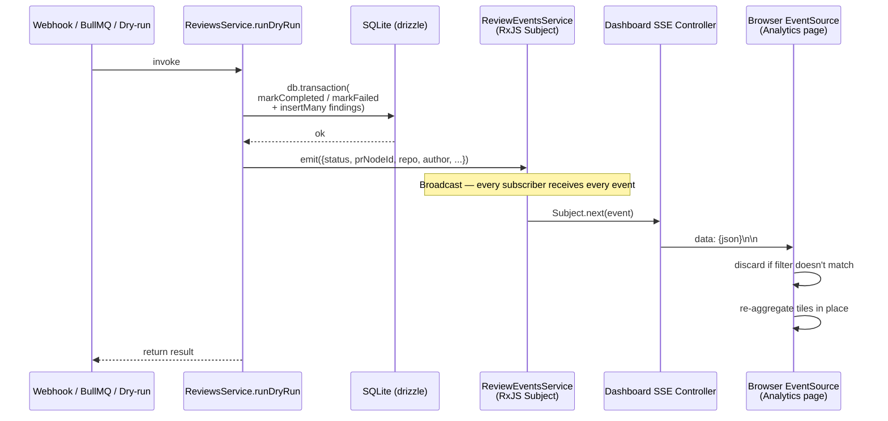
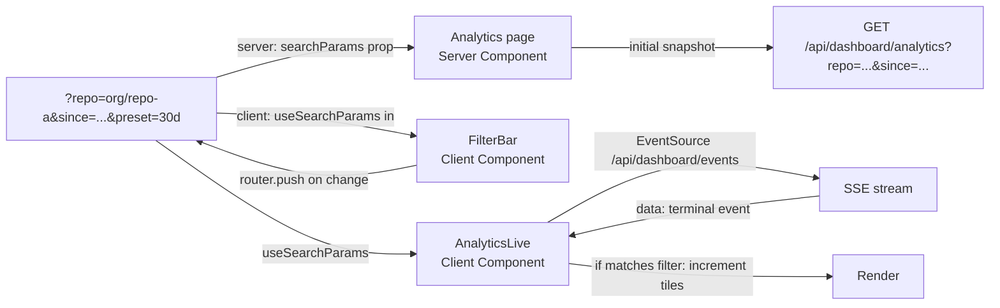

# Day 7 — Next.js Dashboard

## Summary

Ship the first frontend (`apps/web/`) plus its read-only backend surface
(`apps/api/src/modules/dashboard/`). Backend lands the dashboard module
(REST controllers + a single SSE controller), a singleton
`ReviewEventsService` (RxJS `Subject`) emitted from `ReviewsService` at
terminal state transitions, repository extensions for filtered list +
analytics aggregates + distinct-value lookups, and the loopback-bind +
SSE connection-cap security posture. Frontend lands the Next.js 14 App
Router shell (Tailwind v4 + shadcn/ui new-york, `next.config.js` rewrites
for `/api/*`, persistent navigation, URL-state filter primitives), the
four pages (analytics with live SSE, reviews list, review detail,
read-only settings stub), and a dev-seed script.

---

## Problem Frame

After Day 6 the bot reviews real PRs end-to-end and there is a committed
F1 baseline, but there is no operator-side surface. Day 7 fills that gap
with a four-page dashboard for the developer who installed the bot, plus
the read-only API endpoints + live event source that feed it. The
detailed user problem framing lives in origin (see Sources & References).

---

## Requirements

This plan satisfies the 18 requirements in the origin doc plus the
Top-3 Threat Model, with one mechanism caveat: R11 ("stream respects
the subscriber's filter spec") is satisfied **in spirit** — the SSE
stream itself broadcasts every terminal event and the browser client
discards events that do not match its current filter, per the
client-side-filtering Key Technical Decision below. AE2 still passes
because the aggregates do not change for excluded events. Plan-local
R-IDs are not reissued; the units below reference origin R-IDs
directly.

**Origin actors carried forward:** A1 (dashboard user), A2 (review
pipeline), A3 (NestJS API), A4 (Next.js dashboard), A5 (sprint author).

**Origin flows covered:** F1 (analytics overview), F2 (filter narrowing),
F3 (live update), F4 (reviews list browse), F5 (single-review
inspection), F6 (read-only settings inspection), F7 (dev-seed).

**Origin acceptance examples covered:** AE1 (R7, R8 — live rollup
refresh), AE2 (R7, R11 — filter excludes off-repo events), AE3 (R3 —
NULL `pr_node_id` placeholder rendering), AE4 (R5 — no secrets in
settings response), AE5 (R13 — fresh-checkout seed loop).

---

## Scope Boundaries

Carried verbatim from origin (single-list structure — origin is Standard
tier, not Deep-product):

- Vercel deployment of the frontend, managed API hosting, CORS for a
  cross-origin deploy. Day 10.
- Dashboard auth of any flavor. Day 10.
- Live faithfulness scoring + hallucination-flag computation in
  production. Day 8.
- Knowledge-base browse / search / add / edit / disable. Future day.
- Admin / install / connect-repos UI, model selection UI, threshold
  editing UI. Future day.
- Re-running a review from the dashboard, any write mutation against
  `reviews` / `review_findings` from the web app. Future day.
- Cross-PR / cross-repo analytics requiring net-new schema columns
  (running F1 trend from prod reviews). Day 8.
- Migrating SQLite to libSQL / Postgres for multi-process safety.
  Revisit at deployment.

### Deferred to Follow-Up Work

- **Visual distinction for seeded rows in the reviews list** — once the
  `seed:` prefix marker is established (U5), a follow-up frontend change
  can label seeded rows. Day-7 ships the marker contract; visual
  treatment lands in a follow-up PR if the mix of seed + real rows is
  ever confusing in practice.
- **Reviews-list live updates** — list page polls or requires manual
  refresh in Day 7 (per Open Question resolution Q3). If the
  `in_progress → completed` UX gap proves painful, a follow-up subscribes
  the list page to the same SSE stream.

---

## Context & Research

### Relevant Code and Patterns

- **Tier rule + module shape:** `CLAUDE.md` (apps/api section) — modules
  consume infrastructure through repository interface tokens; never the
  reverse. `apps/api/src/modules/reviews/reviews.module.ts` shows the
  `DynamicModule.forRoot()` pattern; `apps/api/src/modules/webhooks/`
  shows the simpler static module pattern (this plan follows the static
  pattern — no env-conditional controllers needed).
- **Drizzle schema files (read-only consumers):**
  `apps/api/src/infrastructure/db/schema/reviews.ts`,
  `review-findings.ts`, `pull-requests.ts`, `knowledge-chunks.ts`,
  `knowledge-sources.ts`.
- **Repository pattern + token tables:** `apps/api/src/infrastructure/db/
  database.module.ts` binds tokens. New repository methods extend the
  existing interfaces in `apps/api/src/modules/reviews/types/
  review.repository.ts` and
  `apps/api/src/modules/webhooks/types/pull-request.repository.ts`
  rather than introducing a new `IDashboardRepository` token.
- **Token consumers within a module:**
  `apps/api/src/modules/reviews/reviews.service.ts` shows the
  `@Inject(REVIEW_REPOSITORY)` injection pattern that the new
  `DashboardService` mirrors. `DatabaseModule` is `@Global()` so the new
  module does not re-import it.
- **DTO + ValidationPipe pattern:** `apps/api/src/modules/embeddings/
  types/dto/search-request.dto.ts` shows class-validator decorators for
  inbound DTOs. The global `ValidationPipe` with `transform + whitelist +
  forbidNonWhitelisted` is wired in `apps/api/src/main.ts`.
- **DB test pattern:** `apps/api/test/infrastructure/db/repositories/
  sqlite-reviews.repository.spec.ts` shows `fs.mkdtempSync` per-test
  directories, real SQLite, no mocks of the driver. New repository
  method tests extend this file or land in a new sibling.
- **E2E test pattern:** any `*.e2e-spec.ts` under `apps/api/test/`. New
  dashboard e2e specs use `@nestjs/testing` with the full `AppModule` +
  supertest, mirroring the existing webhook + embeddings + reviews
  e2e tests.
- **Jest setup primes env via `??=`** — `apps/api/jest.setup.ts`. New
  specs that construct `ConfigService` directly do not need their own
  `beforeAll`.
- **apps/web placeholder:** `apps/web/app/layout.tsx` + `apps/web/app/
  page.tsx` (inline styles only, dark background). `apps/web/
  next.config.js` is currently `{ reactStrictMode: true }` — gains a
  `rewrites()` block in U6.
- **Workspace boundary verified:** `apps/web/tsconfig.json` aliases
  `@/*` to `./*` (the web root, not `./src/*`). Shared API response
  types duplicate into `apps/web/lib/api-types.ts` — no
  `apps/api/src/` imports.

### Institutional Learnings

- **Mock / real divergence** (`~/.claude/projects/.../memory/
  anthropic-realapi-test-gap.md`) — two prior production regressions
  (Anthropic request body, BullMQ jobId) slipped through mocked tests
  because the mocks accepted shapes the real services rejected. The new
  SSE surface is exactly the kind of contract the mocks will accept
  silently: a `Subject` mock that emits *something* passes, but the real
  browser `EventSource` rejects payloads missing the `data: <json>\n\n`
  format. U7 mandates a real-shape assertion on the SSE response
  (`Content-Type: text/event-stream`, `data:` line prefix, double
  newline terminator). Same discipline applies to the new
  query-param DTOs: at least one e2e test passes the real `ValidationPipe`.
- **Secret-allowlist discipline** — R5 + AE4 require a positive
  allowlist, not a negative one. Construct a dedicated
  `SettingsResponseDto` that the controller serializes; never pass the
  raw `ConfigService` instance to a JSON serializer.

### External References

- NestJS `@Sse()` returns `Observable<MessageEvent>`; framework sets
  `Content-Type: text/event-stream`, `Cache-Control: no-cache`,
  `Connection: keep-alive` automatically. `MessageEvent.data` may be
  object (JSON-serialized) or string. Inject `@Res()` for the underlying
  `'close'` listener — but never call `.json()` / `.send()` from inside
  a `@Sse` handler.
- NestJS `enableShutdownHooks()` interferes with SSE: connected
  `EventSource` clients do not detect closure on SIGTERM. `main.ts`
  currently calls `enableShutdownHooks()` — the
  `beforeApplicationShutdown` hook in `ReviewEventsService` explicitly
  `.complete()`s the Subject so clients see a clean stream end.
- The browser's `EventSource` auto-reconnects with a ~3 second default
  retry interval. The first SSE frame from NestJS is empty
  (`data: \n\n`) on connection — the client must guard against empty
  `event.data` before `JSON.parse`.
- Next.js 14 App Router `useSearchParams()` must be wrapped in
  `<Suspense>` or the build (not dev) fails with `Missing Suspense
  boundary with useSearchParams`. The filter control component carries
  the Suspense wrapper.
- `next.config.js` `rewrites` runs after filesystem checks by default;
  the plan does not create any `app/api/` routes that would shadow the
  proxy.
- Tailwind v4 install: `tailwindcss @tailwindcss/postcss postcss`. CSS
  import is the single line `@import "tailwindcss";`. PostCSS config is
  `postcss.config.mjs` (not `.js`). shadcn/ui v4-compatible scaffolding
  via `npx shadcn@latest init --monorepo -c apps/web` and style is
  `new-york` (the v4-deprecated `default` is replaced).
  `tailwindcss-animate` is replaced by `tw-animate-css`.
- SQLite has no `percentile_cont`. Latency p50 / p95 fetch matched
  rows' duration values into Node and compute the percentile in TS
  (small row counts at local-first scale).

---

## Key Technical Decisions

- **SSE emit lives in `ReviewsService.runDryRun`** at **two sites**, both
  **outside** the `db.transaction(...)` call:
  - Success site: after `db.transaction(markCompleted + insertMany)`
    returns, before the method returns to the caller.
  - Failure site: inside the catch block, after the inline
    `markFailedSafely(...)` closure writes the failed row, before
    `throw err`.

  Both emits are wrapped in `try/catch` to absorb subscriber failures
  (an `onError` in a subscriber must not propagate back through
  `Subject.next()` into the caller). Emitting **outside** the
  transaction is load-bearing: `better-sqlite3.transaction(fn)()` runs
  `fn` synchronously inside `BEGIN…COMMIT`, with no post-commit hook;
  emitting inside `fn` would rollback the transaction if a subscriber
  threw.

  **Other terminal-state writes do NOT emit:**
  - `ReviewsProcessor.writeStandaloneFailure` and
    `writeStandaloneCompletion` (rare pre-Anthropic failure paths) —
    these rows are already excluded from analytics aggregates per the
    standalone-row exclusion below; the live-update gap is the reviews
    list, which is manual-refresh per Q3 anyway. Keeps the "processor
    does not emit" architectural simplicity.
  - `ReviewsService.onModuleInit` startup sweep — fires before any SSE
    subscribers exist; `sweepStaleInProgress` also returns only a
    count, not row metadata.
  - `ReviewsService.markRowsFailedByIdSet` (SIGTERM drain) — fires
    during shutdown when `ReviewEventsService.beforeApplicationShutdown`
    is completing the Subject; subscribers are disconnecting.

  Keeping the emit on the service (vs the processor) decouples
  SSE-event ordering from the post-write GitHub POST result. When the
  GitHub POST fails and the row is flipped via `markFailed` from the
  processor's catch path, no second event fires — the row is durable
  but the live tile doesn't tick. Acceptable for Day-7 (this is a rare
  comment_post_failed branch); reviews list shows it on next refresh.
- **Client-side SSE filtering, not server-side fan-out.** The
  `ReviewEventsService` broadcasts every terminal event to every
  subscriber; the browser client discards events whose `repo_full_name` /
  `author_login` / `pr_node_id` do not match its current filter spec.
  AE2 still passes because the rollups do not change for excluded
  events. This avoids per-connection filter registries on the server
  (no allocation per subscriber; no cleanup-on-disconnect filter map).
- **Loopback bind on `apps/api/src/main.ts`.** `app.listen(port,
  '127.0.0.1')` replaces the current `app.listen(port)`. `ngrok http
  3001` already targets `127.0.0.1:3001` by default, so the Day-5
  webhook smoke loop continues to work. The change is one line; the
  blast radius is non-existent outside the local-only Day-7 posture.
- **Seed-row marker = `seed:` prefix on `pr_node_id`.** No schema
  migration. Idempotency check: `SELECT COUNT(*) FROM reviews WHERE
  pr_node_id LIKE 'seed:%'` — if non-zero and `--force` is absent,
  the script prints the count and exits. `--force` is the single
  guard that bypasses both the `NODE_ENV` check and the idempotency
  check (consolidated from the original `--force-seed` /
  `--force-reseed` split). With `--force` set, the script DELETEs
  `seed:%`-prefixed rows in FK order (`reviews` → `pull_requests`)
  before re-inserting, so the PRIMARY KEY constraint on
  `pull_requests.node_id` is never violated. The same prefix is the
  seam for future visual distinction in the list page (deferred to
  follow-up).
- **Exclude standalone rows from analytics aggregates.** All five
  analytics aggregate queries add `WHERE prompt_version NOT IN
  ('standalone-failure', 'standalone-empty-diff')`. The reviews list
  page still shows them (so the row count matches the DB), but they
  are excluded from severity rollup, latency percentiles, and token
  cost rollup — they have no findings, zero diff, and NULL token
  fields and would distort every metric.
- **SSE connection cap = 10, heartbeat = 25 s, named-event wire
  shape.** The connection-cap counter lives on
  `DashboardEventsController` (P2 #20); over-cap returns a
  single-frame `event: cap-reached\ndata: \n\n` and closes the
  response (NOT HTTP 503 — browser `EventSource` does not expose
  status to `onerror` and would auto-reconnect anyway). The client
  registers `addEventListener('cap-reached', ...)` to call
  `eventSource.close()` and surface "Live updates unavailable" on
  the badge. Heartbeat fires every 25 s as a named SSE event:
  `event: keepalive\ndata: \n\n` — the client does NOT register a
  listener for `keepalive`, so the bytes keep the connection alive
  through proxy idle timeouts without polluting `onmessage`.
  Terminal events stay on the default `event: message` channel.
- **Repository method placement.** New methods land on the existing
  `IReviewRepository` (`findFiltered`, `aggregateByFilter`,
  `distinctRepos`, `distinctAuthors`, etc.) and
  `IPullRequestRepository` (`findRecentMatching` for the PR filter
  picker). No new `IDashboardRepository` token — the queries are
  read-side analytics on entities the existing interfaces already own.
- **No shared types package.** Response DTO shapes duplicate into
  `apps/web/lib/api-types.ts`. The R12 boundary (`apps/web` MUST NOT
  import from `apps/api/src/`) is verified with a grep test in U6.
- **Pagination is offset-based** (`?offset=N&limit=50`, default 50,
  max 200). R17 requires bookmarkable URLs with back-nav state
  preservation; cursor pagination would require encoding the full
  cursor chain in the URL to support deep-link back-nav (heavy).
  Offset satisfies R17 directly at Day-7's tens-to-hundreds row
  volumes. Cursor pagination moves to a follow-up refactor if/when
  row counts warrant it.
- **Settings is a top-level nav slot** alongside Analytics and
  Reviews for Day-7 IA clarity. Renaming it (e.g. to "About") or
  folding it into an analytics-page header is deferred to Day-10
  polish — the brainstorm flagged it as an open question and Day-7
  picks the simplest IA that doesn't pre-commit either direction.
- **Tailwind v4 (not v3).** shadcn/ui new-york's current install
  flow expects v4 (`@tailwindcss/postcss`, `tw-animate-css`); v3
  base-color tokens are deprecated in the v4 generator. No v3 fallback
  is wired.
- **Server vs Client Component split.**
  - Analytics page (`apps/web/app/page.tsx`) — Server Component for
    initial-fetch SSR; nested filter + SSE consumer is a Client
    Component.
  - Reviews list (`apps/web/app/reviews/page.tsx`) — Server Component
    for initial-fetch SSR; filter bar + pagination affordance is a
    Client Component.
  - Review detail (`apps/web/app/reviews/[id]/page.tsx`) — Server
    Component.
  - Settings (`apps/web/app/settings/page.tsx`) — Server Component.
- **URL-state filter persistence.** All four pages read filter state
  from `searchParams`. Server Components consume the prop directly;
  Client Components use `useSearchParams()` + `useRouter().push()` and
  are wrapped in `<Suspense>`.
- **`/api/*` rewrite for local CORS avoidance.** Next.js proxies
  `/api/:path*` to `http://localhost:3001/:path*`. `EventSource`
  attaches to `/api/dashboard/events` — same origin, no CORS preflight.

---

## Open Questions

### Resolved During Planning

- **Where does the terminal-state SSE event emit?** →
  `ReviewsService.runDryRun`, at two sites OUTSIDE
  `db.transaction(...)`: after the success-path transaction returns,
  and inside the catch block after `markFailedSafely` writes the
  failed row. See the Key Tech Decisions block above for the full
  list of terminal writes that do NOT emit. (Flow analysis Q1.)
- **What is the seed-row marker?** → `seed:` prefix on `pr_node_id`.
  (Flow analysis Q2.)
- **Does the reviews list page get live updates?** → No, manual
  refresh affordance. (Flow analysis Q3.)
- **How are standalone-failure / standalone-empty-diff rows treated in
  analytics?** → Excluded from aggregates; shown in list. (Flow
  analysis Q4.)
- **What does the 11th SSE client receive?** → A single named SSE
  frame `event: cap-reached\ndata: \n\n` followed by connection
  close. Client `addEventListener('cap-reached', ...)` calls
  `eventSource.close()` and renders "Live updates unavailable" on
  `<SseStatusBadge>` — no reconnect loop. (HTTP 503 + Retry-After
  was the original Flow-Q5 answer but doesn't work: browser
  EventSource doesn't expose status to `onerror` and auto-reconnects
  regardless.) (Flow analysis Q5, revised in plan review.)
- **Fresh-checkout empty state?** → Zero-value tiles + "Run
  `npm run seed:dev` to populate" helper text. (Flow analysis Q6.)
- **Loopback bind compatibility with ngrok?** → `ngrok http 3001`
  targets 127.0.0.1 by default; no setup change needed. (Flow
  analysis Q7.)
- **Filter input validation rejection UI?** → API returns NestJS
  standard 400 body; UI renders inline validation error per filter
  control + falls back to the prior valid filter spec when invalid
  params arrive via URL.

### Deferred to Implementation

- **Exact REST endpoint paths** — naming will follow the
  `/api/dashboard/...` convention; specific paths land at implementation
  (`/api/dashboard/reviews`, `/api/dashboard/reviews/:id`,
  `/api/dashboard/analytics`, `/api/dashboard/filters`,
  `/api/dashboard/settings`, `/api/dashboard/events`).
- **Exact aggregate SQL** for `top N rules` — `GROUP BY rule_id ORDER
  BY count DESC LIMIT N` (likely N = 10) — and the partition for p50 /
  p95 latency (compute in TS after fetching `completed_at − created_at`
  durations from filtered rows; there is no `duration_ms` column).
- **Filter dropdown population for `author_login`** — flow analysis
  flagged the LEFT JOIN vs INNER JOIN choice. Implementer uses LEFT
  JOIN; reviews with NULL `pr_node_id` are still surfaced in the list
  but do not appear as a distinct value in the author filter (because
  they have no author).
- **Styling of empty / loading / error states** — the requirement
  exists (R16); exact visual treatment is the implementer's call,
  respecting the shadcn/ui design system tokens.

---

## Output Structure

```
apps/api/src/
├── main.ts                                              # MODIFY (loopback bind)
├── app.module.ts                                        # MODIFY (register DashboardModule)
└── modules/
    ├── dashboard/                                       # NEW
    │   ├── dashboard.module.ts
    │   ├── dashboard.controller.ts                      # REST endpoints (reviews list, detail, analytics, filters, settings)
    │   ├── dashboard.service.ts                         # query orchestration + standalone-row exclusion
    │   ├── dashboard-events.controller.ts               # @Sse() endpoint + connection cap
    │   ├── helpers/
    │   │   └── latency-percentile.ts                    # p50/p95 over a number[]
    │   ├── types/
    │   │   ├── dto/
    │   │   │   ├── filter-spec.dto.ts                   # class-validator: repo/author/pr/since/until
    │   │   │   └── settings-response.dto.ts             # positive allowlist
    │   │   └── dashboard-response.types.ts              # response envelopes
    │   ├── scripts/
    │   │   └── seed-dev.ts                              # entry: NODE_ENV guard + seed: prefix
    │   └── index.ts
    └── reviews/
        ├── reviews.service.ts                           # MODIFY (emit terminal events)
        ├── events/                                      # NEW (lives inside reviews module to keep emit-side together)
        │   └── review-events.service.ts                 # singleton RxJS Subject + connection counter
        └── types/
            └── review.repository.ts                     # MODIFY (filter / aggregate / distinct methods)

apps/api/src/infrastructure/db/repositories/
├── sqlite-reviews.repository.ts                         # MODIFY (impl new methods)
└── sqlite-pull-requests.repository.ts                   # MODIFY (distinct-value methods)

apps/web/
├── package.json                                         # MODIFY (add tailwind, shadcn, lucide-react, etc.)
├── next.config.js                                       # MODIFY (rewrites)
├── postcss.config.mjs                                   # NEW (Tailwind v4)
├── components.json                                      # NEW (shadcn)
├── tsconfig.json                                        # MODIFY (path alias confirmation)
├── app/
│   ├── globals.css                                      # NEW (tailwind import + theme tokens)
│   ├── layout.tsx                                       # MODIFY (replace inline styles; persistent nav)
│   ├── page.tsx                                         # MODIFY (analytics — was placeholder)
│   ├── loading.tsx                                      # NEW (Suspense fallback)
│   ├── reviews/
│   │   ├── page.tsx                                     # NEW (reviews list)
│   │   └── [id]/
│   │       ├── page.tsx                                 # NEW (review detail)
│   │       └── not-found.tsx                            # NEW (rendered within <NavShell> on 404)
│   └── settings/
│       └── page.tsx                                     # NEW (settings stub)
├── components/                                          # NEW (shadcn-installed + custom)
│   ├── nav-shell.tsx                                    # persistent navigation
│   ├── filter-bar.tsx                                   # 'use client' — useSearchParams
│   ├── analytics-live.tsx                               # 'use client' — EventSource
│   ├── empty-state.tsx                                  # shared empty state
│   └── ui/                                              # shadcn-generated (Card, Table, Badge, ...)
└── lib/
    ├── api-types.ts                                     # NEW (duplicated response DTOs)
    └── api.ts                                           # NEW (fetch helpers, URL helpers)

apps/api/test/modules/dashboard/                          # NEW (mirrors src/modules/dashboard/)
├── dashboard.controller.spec.ts
├── dashboard.controller.e2e-spec.ts                     # asserts ValidationPipe + endpoint shapes against real AppModule
├── dashboard.service.spec.ts
├── dashboard-events.controller.e2e-spec.ts              # asserts SSE wire format
└── scripts/seed-dev.spec.ts                              # idempotency + env guard

apps/api/test/modules/reviews/                            # MODIFY
├── reviews.service.spec.ts                              # MODIFY (assert emit fires at terminals)
└── events/review-events.service.spec.ts                 # NEW

apps/api/test/infrastructure/db/repositories/             # MODIFY
├── sqlite-reviews.repository.spec.ts                    # MODIFY (new method coverage)
└── sqlite-pull-requests.repository.spec.ts              # MODIFY (new method coverage)
```

---

## High-Level Technical Design

> *This illustrates the intended approach and is directional guidance
> for review, not implementation specification. The implementing agent
> should treat it as context, not code to reproduce.*



REST snapshot path is the classical request / response: `Server
Component fetch → @Controller GET → DashboardService → IReviewRepository
+ IPullRequestRepository → SQLite`.

URL filter state flow on the analytics page:



---

## Phased Delivery

Phases align with merge boundaries: each phase is a coherent
review-sized slice. Given the Day-7 file count (~57 new + modified
files across api + web), **the recommended shipping mode is one PR
per phase** so each PR stays under the origin success criterion of
"small enough to review in one sitting." A single mega-PR with phase
boundaries as commit groups remains acceptable when the sprint author
prefers it, but the review burden is concentrated.

### Phase A — Backend infra (U1, U2, U3)

Loopback bind + event bus + repository extensions. No HTTP routes
ship yet, but the foundations are tested. Safe to merge independently
because nothing outside the test scope reads the new emit yet.

**Commit ordering within Phase A:** U1's `main.ts` loopback-bind
commit lands FIRST, before U2 and U3 commits. This guarantees the API
never binds to `0.0.0.0:3001` while exposing new dashboard endpoints
later in the PR — closing a small but real LAN-exposure window on
multi-commit branches. After the U1 commit, verify with
`ss -tlnp | grep 3001` or `lsof -nP -iTCP:3001` (only `127.0.0.1`
should appear).

### Phase B — Backend module + dev-seed (U4, U5)

Dashboard REST + SSE controllers + dev-seed. Now the API is reachable
from anything that can hit `localhost:3001` (the loopback bind from
Phase A scopes who). Safe to merge after Phase A.

### Phase C — Frontend stack (U6)

Tailwind / shadcn / rewrites / navigation shell / API types lib. No
pages yet but `next dev` runs against the placeholder.

### Phase D — Frontend pages (U7, U8)

All four pages live against the Phase B backend. End-to-end demo
possible after this phase.

---

## Implementation Units

### U1. Security posture (loopback bind + SSE cap pattern)

**Goal:** Land R15's hard security constraints — `apps/api` binds to
`127.0.0.1` only, and the SSE-controller scaffolding for connection
capping is in place — before the SSE controller itself lands in U4.

**Requirements:** R15 (loopback + SSE cap), Top-3 Threat Model items 1
and 2.

**Dependencies:** None.

**Files:**
- Modify: `apps/api/src/main.ts`
- Test: `apps/api/test/main.spec.ts` (NEW — minimal assertion that the
  bootstrap function calls `app.listen` with `'127.0.0.1'`)

**Approach:**
- Replace `app.listen(port)` with `app.listen(port, '127.0.0.1')`. No
  other change; the existing `enableShutdownHooks()` call stays.
- Document the change in a comment beside `app.listen` referencing
  R15 and the ngrok-compatibility rationale.

**Patterns to follow:**
- The existing `main.ts` bootstrap structure (dotenv-first import,
  rawBody, shutdown hooks).

**Test scenarios:**
- Happy path: `bootstrap()` returns; `app.listen` is invoked with port
  and host `'127.0.0.1'`. (Mock `NestFactory.create` minimally and
  assert call shape — the goal is to lock the host param, not to
  re-test NestJS internals.)
- Integration: Existing `apps/api/test/modules/webhooks/
  webhook.e2e-spec.ts` continues to pass without modification (it boots
  the app over the test transport, not via `app.listen`).

**Verification:**
- `grep -nE "app\\.listen\\(.*'127" apps/api/src/main.ts` returns the
  call site.
- `npm test --workspace apps/api` is green.
- Manual: `ss -tlnp | grep 3001` (or equivalent) shows the API listening
  only on 127.0.0.1 after `npm run dev`.

---

### U2. ReviewEventsService + terminal-state emit step

**Goal:** Introduce a singleton in-process event bus and emit
terminal-state events from `ReviewsService` at every `markCompleted` /
`markFailed` site, so SSE has something to forward.

**Requirements:** R8 (live updates), R11 (SSE stream backed by
in-process event source), R15 (connection counter lives on this
service).

**Dependencies:** None (independent of U1).

**Files:**
- Create:
  `apps/api/src/modules/reviews/events/review-events.service.ts`
- Modify: `apps/api/src/modules/reviews/reviews.service.ts` (inject
  the service; emit at the **two** terminal sites inside `runDryRun`
  — success after `db.transaction(...)` returns, failure inside the
  catch block after the inline `markFailedSafely` closure writes the
  failed row)
- Modify: `apps/api/src/modules/reviews/reviews.module.ts` (provide
  the new service; export it so `DashboardModule` can consume it)
- Test:
  `apps/api/test/modules/reviews/events/review-events.service.spec.ts`
  (NEW)
- Test: `apps/api/test/modules/reviews/reviews.service.spec.ts`
  (MODIFY — assert emit fires once on the success and failure paths
  of `runDryRun` with the expected payload shape)

**Approach:**
- `ReviewEventsService` exposes `emit(event: TerminalReviewEvent)`,
  `stream(): Observable<TerminalReviewEvent>`, and a
  `beforeApplicationShutdown()` hook that completes the inner
  `Subject` so connected `EventSource` clients see a clean stream
  end (works around NestJS issue #9517). The connection-cap counter
  (`tryAcquireSlot` / `releaseSlot` / `subscriberCount`) lives on
  `DashboardEventsController` in U5 — slot management is HTTP-
  connection lifecycle, not event-bus state.
- `TerminalReviewEvent` shape includes: `review_id`, `pr_node_id`,
  `repo_full_name` (NULL if no pr_node_id join), `author_login`
  (likewise), `status` ('completed' | 'failed'), `prompt_version`,
  per-severity finding counts (zero for failed reviews), token totals
  (NULL on pre-LLM-failure rows), `completed_at` ms.
- `ReviewsService` constructor gains a positional dependency on
  `ReviewEventsService` (DI by class, no token).
- **Two emit sites inside `runDryRun`, both OUTSIDE the
  `db.transaction(...)` call:**
  - **Success site:** after `this.db.transaction(...)` returns,
    before `return result`. Build the `TerminalReviewEvent` from
    in-scope variables (`reviewId`, `prNodeId`, `result.model`,
    `PROMPT_AND_TOOL_VERSION`, severity counts derived from
    `findingInserts`, `result.usage`, `completedAt`). Repo metadata
    (`repo_full_name`, `author_login`) is looked up via the existing
    `IPullRequestRepository.findByNodeId` when `prNodeId` is non-NULL.
    Emit via `this.events.emit(event)` wrapped in `try/catch` so a
    subscriber failure does not propagate.
  - **Failure site:** inside the `catch (err)` block, after the
    inline `markFailedSafely(...)` closure writes the failed row,
    before each `throw`. Build the `TerminalReviewEvent` with
    `status: 'failed'`, zero finding counts, NULL token fields.
    Emit wrapped in `try/catch`.
- **Why outside the transaction:**
  `better-sqlite3.transaction(fn)()` runs `fn` synchronously inside
  `BEGIN…COMMIT`; there is no post-commit hook. Emitting inside `fn`
  would rollback the transaction if a subscriber threw — the
  opposite of the intended "emit only after the row is durably
  committed" invariant.
- **Other terminal-state writes do NOT emit** — see Key Technical
  Decisions for the full enumeration and rationale
  (standalone-row writes on the processor, the `onModuleInit` sweep,
  and the SIGTERM-drain `markRowsFailedByIdSet`).

**Execution note:** Test-first. Write the
`review-events.service.spec.ts` and the new assertion in
`reviews.service.spec.ts` first; emit-step implementation follows.

**Patterns to follow:**
- `apps/api/src/modules/reviews/reviews.service.ts` injection style
  (constructor-based, repository tokens).
- NestJS `beforeApplicationShutdown` lifecycle hook is implemented on
  `DatabaseService` — same shape applies to `ReviewEventsService`.

**Test scenarios:**
- Happy path: emit then subscribe — the subscriber receives the
  emitted event payload.
- Happy path: two subscribers — both receive the same event (broadcast).
- Edge case: `beforeApplicationShutdown` completes the inner Subject —
  subsequent emit is silently dropped (no subscribers).
- Edge case: a subscriber that throws on `next` does NOT propagate
  back through `emit()` (verified via a deliberately throwing
  subscriber).
- Integration: `ReviewsService.runDryRun` happy path against a real
  SQLite DB emits exactly one event with `status: 'completed'`,
  expected `review_id`, and finding counts matching the inserted
  rows. **Covers AE1.**
- Integration: `ReviewsService.runDryRun` failure path
  (`AnthropicRequestError`) emits exactly one event with
  `status: 'failed'`, zero finding counts, NULL token fields.
- Integration: a subscriber that throws inside `next` does NOT roll
  back the `runDryRun` committed row (proves emit lives outside the
  transaction, not inside the callback).

**Verification:**
- `npm test --workspace apps/api -- review-events.service` is green.
- Existing `reviews.service.spec.ts` continues to pass.

---

### U3. Repository extensions (filter / aggregate / distinct)

**Goal:** Add the read-side query surface the dashboard needs: filtered
review list, analytics aggregates (status breakdown, severity rollup,
top-N rules, latency snapshot, token rollup), and distinct values for
filter dropdowns.

**Requirements:** R3 (reviews list with filter/pagination), R4 (review
detail join), R6 (analytics metrics), R7 (filter composition), R10
(read-only API surface).

**Dependencies:** None.

**Files:**
- Modify:
  `apps/api/src/modules/reviews/types/review.repository.ts`
- Modify:
  `apps/api/src/modules/webhooks/types/pull-request.repository.ts`
- Modify:
  `apps/api/src/infrastructure/db/repositories/sqlite-reviews.repository.ts`
- Modify:
  `apps/api/src/infrastructure/db/repositories/sqlite-pull-requests.repository.ts`
- Create:
  `apps/api/src/modules/dashboard/helpers/latency-percentile.ts`
- Test:
  `apps/api/test/infrastructure/db/repositories/sqlite-reviews.repository.spec.ts`
  (MODIFY)
- Test:
  `apps/api/test/infrastructure/db/repositories/sqlite-pull-requests.repository.spec.ts`
  (MODIFY)
- Test:
  `apps/api/test/modules/dashboard/helpers/latency-percentile.spec.ts`
  (NEW)

**Approach:**
- New `IReviewRepository` methods (preserve existing methods unchanged):
  - `findFiltered(spec: ReviewFilterSpec, opts: { limit: number; offset?: number }): ReviewListEntry[]`
    — joins `pull_requests` via LEFT JOIN to expose `repo_full_name`,
    `number`, `title`, `author_login` (NULL when `pr_node_id` is
    NULL); orders by `created_at DESC`. Offset-based pagination per
    the Key Tech Decision.
  - `countFiltered(spec: ReviewFilterSpec): number` — total row count
    matching the filter, used by the frontend to render
    "showing N–M of TOTAL" and to disable the next-page control when
    `offset + limit >= total`.
  - `findByIdWithFindings(id): { review, findings } | null` — single
    review with its joined findings. Uses
    `IReviewFindingRepository.findByReviewId`.
  - `aggregateByFilter(spec): AnalyticsAggregate` — runs five queries
    inside a single read transaction: status breakdown via `GROUP BY
    status`, severity rollup via JOIN to `review_findings` with `GROUP
    BY severity`, top-10 rules via `GROUP BY rule_id ORDER BY count
    DESC LIMIT 10`, token totals via `SUM` over the four token cols,
    and latency raw durations fetched as
    `(completed_at − created_at)` over filtered rows (the `reviews`
    table has no `duration_ms` column) — the helper computes p50/p95
    in TS.
  - `distinctRepos(spec, limit): string[]` — `SELECT DISTINCT
    repo_full_name FROM pull_requests JOIN reviews ON ... WHERE ...
    LIMIT N`.
  - `distinctAuthors(spec, limit): string[]` — same shape, on
    `author_login`.
- New `IPullRequestRepository` methods:
  - `findRecentMatching(spec, limit): PullRequestSummary[]` — populates
    the single-PR filter picker.
- **All aggregate queries add the standalone-row exclusion clause** —
  `WHERE prompt_version NOT IN ('standalone-failure',
  'standalone-empty-diff')`. Documented in a per-method comment.
- **`ReviewFilterSpec` shape**: `{ repo?: string; author?: string;
  prNodeId?: string; sinceMs?: number; untilMs?: number }`. The
  controller maps the validated DTO to this shape.
- **`latency-percentile.ts` helper**: pure function over `number[]`
  returning `{ p50, p95 }`. Empty input returns `{ p50: null, p95:
  null }`. Implementation: sort ascending, pick the floor index for
  p50 and p95 (≥10 samples) or interpolate for small N. Tested
  separately.

**Execution note:** Test-first. Each new repository method gets a
spec scenario first; SQLite is fast enough.

**Patterns to follow:**
- The existing `SqliteReviewsRepository` Drizzle-query style
  (`this.db.drizzle.select()...`).
- The existing `findByPrNodeIdForPriorReview` join pattern.

**Test scenarios:**
- Happy path: `findFiltered` with no filters returns all reviews newest
  first.
- Happy path: `findFiltered({ repo: 'org/a' })` returns only reviews
  whose joined `pull_requests.repo_full_name = 'org/a'`. **Covers
  AE2.**
- Edge case: `findFiltered` returns reviews with NULL `pr_node_id`
  in the list (no filter active) with NULL repo / number / title /
  author placeholders. **Covers AE3.**
- Edge case: `findFiltered({ author: 'someone' })` with no matches
  returns `[]`, not error.
- Edge case: `findFiltered({ sinceMs, untilMs })` includes rows
  whose `created_at` is in `[since, until]` inclusive.
- Edge case: `aggregateByFilter` over an empty filter set returns all
  zeros / NULLs without erroring.
- Edge case: `aggregateByFilter` excludes standalone rows — a row
  with `prompt_version='standalone-empty-diff'` does NOT contribute to
  any aggregate.
- Integration: `aggregateByFilter` with mixed rows (3 completed, 1
  failed, 1 standalone-empty-diff) returns volume = 4 (excludes
  standalone), severity counts from the 3 completed rows' findings,
  latency p50 / p95 over 4 durations.
- Happy path: `distinctRepos` returns sorted unique values from the
  joined `pull_requests`.
- Happy path: `distinctAuthors` returns sorted unique `author_login`s;
  reviews with NULL `pr_node_id` do not surface a NULL row.
- Happy path: `findByIdWithFindings` returns the review and its
  findings ordered by `created_at ASC`.
- Happy path: `findByIdWithFindings` returns `null` for an unknown id.
- Happy path: `latency-percentile.ts` — sorted input `[10, 20, 30,
  40, 50]` returns `{ p50: 30, p95: 50 }`.
- Edge case: `latency-percentile.ts` — empty input returns `{ p50:
  null, p95: null }`.
- Edge case: `latency-percentile.ts` — single value `[42]` returns
  `{ p50: 42, p95: 42 }`.

**Verification:**
- All new spec files pass against real SQLite (no driver mocks).
- `IReviewRepository` and `IPullRequestRepository` interface
  signatures match their concrete implementations.

---

### U4. Dashboard REST surface

**Goal:** Ship the read-only REST endpoints the four frontend pages
consume — reviews list, review detail (with chunk hydration), analytics
aggregates, filter-population endpoints, and the read-only settings
endpoint.

**Requirements:** R5 (settings allowlist), R7 (filter input validation),
R10 (read-only API endpoints), R12 (web reads only through API).

**Dependencies:** U3 (repository methods).

**Files:**
- Create: `apps/api/src/modules/dashboard/dashboard.module.ts`
- Create: `apps/api/src/modules/dashboard/dashboard.controller.ts`
- Create: `apps/api/src/modules/dashboard/dashboard.service.ts`
- Create:
  `apps/api/src/modules/dashboard/types/dto/filter-spec.dto.ts`
- Create:
  `apps/api/src/modules/dashboard/types/dto/settings-response.dto.ts`
- Create:
  `apps/api/src/modules/dashboard/types/dashboard-response.types.ts`
- Create: `apps/api/src/modules/dashboard/index.ts`
- Modify: `apps/api/src/app.module.ts` (register `DashboardModule`)
- Test:
  `apps/api/test/modules/dashboard/dashboard.controller.spec.ts`
- Test:
  `apps/api/test/modules/dashboard/dashboard.service.spec.ts`
- Test:
  `apps/api/test/modules/dashboard/dashboard.controller.e2e-spec.ts`

**Approach:**
- Endpoints (paths to be finalized at implementation; below is the
  intended shape):
  - `GET /dashboard/reviews` — query params: `repo`, `author`,
    `pr_node_id`, `since` (epoch ms), `until` (epoch ms), `offset`
    (default 0), `limit` (default 50, max 200). Returns
    `ReviewListResponse { items, total, offset, limit }` — `total`
    drives the "showing N–M of TOTAL" affordance and the
    next-page-disabled state in `<PaginationControls>`.
  - `GET /dashboard/reviews/:id` — returns
    `ReviewDetailResponse { review, findings, retrievedChunks }` where
    `retrievedChunks` is the result of parsing
    `reviews.retrieved_chunk_ids` JSON and calling
    `IKnowledgeChunkRepository.findByIds` to hydrate; missing chunks
    are returned as `{ id, missing: true }` placeholders so the UI
    can show "knowledge source removed" without throwing. Returns
    404 when not found.
  - `GET /dashboard/analytics` — same filter query params as
    `/reviews`. Returns `AnalyticsResponse` (status counts, severity
    rollup, top-10 rules, latency `{ p50, p95 }`, token totals).
  - `GET /dashboard/filters` — same filter query params; returns
    `FilterOptionsResponse { repos, authors, recentPrs }` driving the
    filter dropdowns. Bounded `LIMIT 100` per list.
  - `GET /dashboard/settings` — returns `SettingsResponseDto`
    (allowlist below).
- `FilterSpecDto` validates with class-validator:
  `@IsOptional() @IsString() @Length(1, 200) @Matches(/^[a-zA-Z0-9_\-./@]+$/)`
  for repo / author / pr_node_id; `@IsOptional() @IsInt() @Min(0)
  @Max(Date.now() + 1 day)` for since / until. Numeric `limit`
  bounded. The global `ValidationPipe` in `main.ts` enforces.
- `SettingsResponseDto` is the **positive allowlist** named in R5:
  - `model: string` (from `config.anthropicModel`)
  - `embeddingModel: string` (from `config.embeddingModel`)
  - `chromaCollection: string`
  - `knowledgeSources: { id, name, description: string | null }[]`
    (from `IKnowledgeSourceRepository.listAll`)
  - `severityGate: { allowed: SeverityLevel[]; default:
    SeverityLevel }` — read from `ReviewsService.ALLOWED_SEVERITIES`
    and `DEFAULT_SEVERITY` (extract these into exported constants
    in `reviews.service.ts` if not already exported).
- **Never** pass the raw `ConfigService` to the serializer.
- **No `evalBaseline` field.** R9 explicitly excludes faithfulness
  scoring from Day-7 surface area (Day 8); surfacing offline-eval
  thresholds on a production-config page conflates the two systems.
  If a "What does the bot grade itself by?" surface is wanted in
  Day 8, it lands on its own evaluation page, not the settings stub.
- `DashboardService` injects the new repository methods via the
  existing `REVIEW_REPOSITORY`, `KNOWLEDGE_CHUNK_REPOSITORY`,
  `KNOWLEDGE_SOURCE_REPOSITORY`, `PULL_REQUEST_REPOSITORY` tokens
  plus `ConfigService`. No `REVIEW_FINDING_REPOSITORY` — the
  findings join is encapsulated inside U3's `findByIdWithFindings`
  on the reviews repository, so direct injection of the findings
  repo would be unused redundancy. No new Symbol tokens introduced.
- Empty-state handling on `/analytics`: zero rows in the filter
  window → response has zero counts everywhere and `latency:
  { p50: null, p95: null }`. The frontend renders the "fresh checkout"
  helper text based on `volume === 0`.

**Execution note:** Test-first on `dashboard.service.spec.ts` — the
service is the testable seam. Controller and e2e tests follow.

**Patterns to follow:**
- `apps/api/src/modules/embeddings/search.controller.ts` — DTO +
  ValidationPipe usage.
- `apps/api/src/modules/embeddings/types/dto/search-request.dto.ts` —
  class-validator decorators.
- `apps/api/src/modules/reviews/reviews.service.ts` — repository
  token injection style.

**Test scenarios:**
- Happy path: `GET /dashboard/reviews` returns paginated list with
  expected shape. **Covers AE1, F4.**
- Happy path: `GET /dashboard/reviews/:id` returns review + findings +
  hydrated chunks. **Covers F5.**
- Edge case: `GET /dashboard/reviews/:id` for a NULL-pr_node_id review
  returns the review with no PR metadata; UI consumes
  placeholders. **Covers AE3.**
- Edge case: `GET /dashboard/reviews/:id` with chunk IDs missing from
  `knowledge_chunks` returns `{ id, missing: true }` placeholders, not
  500. **Integration scenario.**
- Edge case: `GET /dashboard/analytics` with `repo=org/x` but no
  matching rows returns zero-everywhere response without
  erroring. **Covers F2 narrowing-to-empty.**
- Edge case: `GET /dashboard/analytics` excludes standalone rows from
  every metric. **Integration scenario.**
- Error path: `GET /dashboard/reviews?repo=<%>;DROP%20TABLE</id>`
  rejected with 400 by `ValidationPipe` (charset constraint). Verified
  via real `ValidationPipe` in e2e.
- Error path: `GET /dashboard/reviews?limit=99999` rejected with 400
  (over `@Max`).
- Happy path: `GET /dashboard/settings` returns the positive
  allowlist. **Covers F6.**
- Error path: `GET /dashboard/settings` response body contains **none
  of** the runtime *values* of `config.appId`, `config.redisUrl`,
  `config.anthropicApiKey`, `config.voyageApiKey`,
  `config.appPrivateKey`, `config.githubWebhookSecret`,
  `config.dogfoodRepos`, `config.databasePath`. **Covers AE4.**
  Canonical assertion (run inside an e2e using the real
  `ConfigService`): `const body = JSON.stringify(response.body);` then
  `expect(body).not.toContain(config.<each-secret-field>)` per field.
  The value-substring check catches a mis-wired leak like
  `model: this.config.anthropicApiKey` that a key-name-only check
  would silently pass.
- Happy path: `GET /dashboard/filters` returns distinct repos,
  authors, recent PRs from the join.

**Verification:**
- All endpoint specs pass.
- `grep -nE "ConfigService" apps/api/src/modules/dashboard/` shows
  no direct response serialization of `ConfigService`.
- The AE4 secret-exposure test passes with the real `ConfigService`.

---

### U5. Dashboard SSE controller + dev-seed

**Goal:** Land the SSE controller that consumes the U2 event bus +
applies the U1 connection-cap pattern, and the dev-seed script that
populates the local DB without a live PR.

**Requirements:** R8 (live updates), R11 (SSE stream), R13 (dev-seed),
R15 (connection cap), R18 (dev-seed env guard + append-only).

**Dependencies:** U2 (event bus), U4 (module wiring).

**Files:**
- Create:
  `apps/api/src/modules/dashboard/dashboard-events.controller.ts`
- Create:
  `apps/api/src/modules/dashboard/scripts/seed-dev.ts`
- Modify: `apps/api/package.json` (add `seed:dev` script)
- Modify: `apps/api/src/modules/dashboard/dashboard.module.ts` (declare
  events controller; import `ReviewEventsService` from
  `ReviewsModule`)
- Modify: `apps/api/src/modules/reviews/reviews.module.ts` (export
  `ReviewEventsService`)
- Test:
  `apps/api/test/modules/dashboard/dashboard-events.controller.e2e-spec.ts`
- Test:
  `apps/api/test/modules/dashboard/scripts/seed-dev.spec.ts`

**Approach:**
- **SSE controller** (`DashboardEventsController`) — `@Sse('events')`
  handler that owns the connection-cap state directly (no longer on
  `ReviewEventsService` per P2 #20). Private fields:
  `private subscriberCount = 0` and `private readonly MAX_SUBSCRIBERS = 10`.
  Methods `tryAcquireSlot()` / `releaseSlot()` are private. Flow:
  - On request, call `tryAcquireSlot()`. If it returns `false`, return
    a **single-frame Observable**:
    `of({ type: 'cap-reached', data: '' })`. NestJS sends one SSE
    frame (`event: cap-reached\ndata: \n\n`) and closes the response
    when the Observable completes. No 503; the slot is not consumed
    because acquisition failed.
  - If acquisition succeeds, inject `@Res()` for its `'close'`
    listener that calls `releaseSlot()` deterministically on
    disconnect (the only reliable signal for browser-side abort), then
    return:
    `merge(ReviewEventsService.stream().pipe(map((e) => ({ data: JSON.stringify(e) }))), heartbeat$)`.
- **Heartbeat as a named SSE event** (not a comment):
  `interval(25_000).pipe(map(() => ({ type: 'keepalive', data: '' })))`
  merged into the stream. NestJS serializes the `type` field as the
  SSE `event:` line, so the wire bytes are
  `event: keepalive\ndata: \n\n`. The browser client does **not**
  register a listener for `keepalive`, so `onmessage` never fires for
  these — the bytes keep the connection alive through proxy idle
  timeouts but don't pollute the message handler.
- **Cap-reached as a named SSE event** mirrors the above: the
  single-frame `{ type: 'cap-reached', data: '' }` serializes as
  `event: cap-reached\ndata: \n\n`. The client registers
  `eventSource.addEventListener('cap-reached', …)` to call
  `eventSource.close()` and surface "Live updates unavailable" on
  `<SseStatusBadge>`. Terminal events stay on the default
  `event: message` channel and continue to flow through
  `onmessage`.
- **Dev-seed script** (`apps/api/src/modules/dashboard/scripts/seed-dev.ts`):
  - First line in `main()`: `if (process.env.NODE_ENV !==
    'development' && !args.includes('--force')) { console.error +
    process.exit(1) }`.
  - Print the target `DATABASE_PATH` (resolved absolute) and the
    intended row counts before any write.
  - **Idempotency:** `SELECT COUNT(*) FROM reviews WHERE pr_node_id
    LIKE 'seed:%'` — if non-zero and `--force` is absent, print the
    count and exit zero (idempotent no-op). With `--force`, the
    script first runs
    `DELETE FROM reviews WHERE pr_node_id LIKE 'seed:%'` followed by
    `DELETE FROM pull_requests WHERE node_id LIKE 'seed:%'` (in that
    order to avoid FK violations) so the subsequent insert never
    collides with the `pull_requests.node_id` PRIMARY KEY. Real
    (non-prefixed) rows are NEVER touched. **The `--force` flag is
    the single guard** that bypasses both the `NODE_ENV` check and
    the idempotency check — consolidated from the prior
    `--force-seed` / `--force-reseed` split, which was two names for
    related guards.
  - Append flow: insert synthetic `pull_requests` rows with
    `node_id = 'seed:org/sample-repo/<n>'`, `repo_full_name =
    'seed-org/sample-repo'`, `author_login = 'seed-author'`, etc.
    Insert synthetic `reviews` rows with realistic shapes (mix of
    completed / failed; some with token costs, some with NULL). Insert
    `review_findings` rows linked to completed reviews drawn from a
    fixed fixture list (severities mix of error / warning / info).
  - **Why synthetic fixtures, not Day-6 eval captures:** the eval
    capture format (JSON-line, see Day-6 plan) records prompt + LLM
    output + scored findings, but lacks the full DB-row shape
    (per-finding rows with severity, token totals, prompt_version,
    repo metadata) that the analytics aggregates need. Synthetic
    fixtures also let us shape the seed data to exercise specific UI
    branches (NULL `pr_node_id` for AE3, mixed severities for the
    rollup tile, a standalone-row for the exclusion-from-aggregates
    invariant).
  - End with `process.exit(0)` (per the memory note in commit `fa0f047`
    about dry-run.ts / seed.ts hanging).
- Script entry: `npm run seed:dev` in `apps/api/package.json`, invoked
  via `ts-node`. Follows the pattern in
  `apps/api/src/modules/embeddings/scripts/seed.ts`.

**Execution note:** Test-first on the SSE wire-format assertion and
the seed-script idempotency check.

**Patterns to follow:**
- `apps/api/src/modules/embeddings/scripts/seed.ts` — script
  bootstrap, `process.exit(0)` on success.
- The `events$.pipe(...)` style in the U2 service.

**Test scenarios:**
- Integration (SSE wire format): start an e2e harness, hit
  `GET /dashboard/events` with a `node-fetch` or supertest client,
  assert response `Content-Type` starts with `text/event-stream`,
  assert at least one `data: <json>\n\n` frame is emitted on the
  default `message` event after manually emitting one event via the
  bus. **Covers AE1 wire-shape.**
- Integration: emit one event → all connected SSE subscribers receive
  it on `event: message`. **Covers F3.**
- Integration: heartbeat emits as `event: keepalive\ndata: \n\n`
  every 25 s (assert by tailing the raw response bytes for ≥30 s).
  A client that registers only `onmessage` does NOT see them.
- Edge case: at the 11th concurrent connection, the controller
  returns a single `event: cap-reached\ndata: \n\n` frame and closes
  the response. The underlying `Subject` is NOT subscribed to (slot
  was not consumed); the next connection after a disconnect
  succeeds.
- Edge case: a client disconnects mid-stream → `releaseSlot()` fires
  → an 11th client that had been capped can connect and receives the
  full stream on retry.
- Edge case: `beforeApplicationShutdown` on `ReviewEventsService`
  completes the Subject; connected `EventSource` clients see clean
  end (works around NestJS issue #9517).
- Happy path (seed): `seed:dev` on an empty DB writes N synthetic
  reviews + findings; querying `IReviewRepository.findAll` returns
  them. **Covers AE5.**
- Edge case (seed): running `seed:dev` twice without `--force` is a
  no-op (idempotent — `pull_requests` and `reviews` counts unchanged).
- Edge case (seed): running `seed:dev --force` after a prior seed
  succeeds — the script DELETEs `seed:%` rows (from `reviews` then
  `pull_requests` to respect the FK) and re-inserts. Final
  `pull_requests` count equals the synthetic-fixture count, with no
  `UNIQUE constraint` violation on `node_id`.
- Edge case (seed): running with `NODE_ENV=production` and no
  `--force` exits non-zero with a refusal message.
- Edge case (seed): real (non-seeded) review rows are NEVER deleted
  or modified — assert via row count of `WHERE pr_node_id NOT LIKE
  'seed:%'` (or NULL) before and after `--force`.

**Verification:**
- `npm test --workspace apps/api -- dashboard-events` is green.
- `npm test --workspace apps/api -- seed-dev` is green.
- Manual: `npm run seed:dev` populates the dev DB; opening
  `localhost:3001/dashboard/reviews` returns the seeded rows.

---

### U6. apps/web stack + navigation shell

**Goal:** Install Tailwind v4 + shadcn/ui, wire `next.config.js`
rewrites, build the persistent navigation shell, set up URL-state
filter primitives, and create the API types lib. After this unit
`next dev` runs the placeholder + shell against the U4 backend.

**Requirements:** R1 (4-page app), R16 (UI states required), R17
(persistent nav + URL filter persistence), R12 (web reads only through
API).

**Dependencies:** None (frontend foundation can land in parallel with
backend work — but no pages depend on it yet).

**Files:**
- Modify: `apps/web/package.json` (install: `tailwindcss`,
  `@tailwindcss/postcss`, `postcss`, `lucide-react`,
  `tw-animate-css`, dev-deps for shadcn CLI run)
- Modify: `apps/web/next.config.js` (add `rewrites()` block)
- Create: `apps/web/postcss.config.mjs`
- Create: `apps/web/components.json`
- Modify: `apps/web/tsconfig.json` (confirm `@/*` alias)
- Modify: `apps/web/app/layout.tsx` (replace inline styles; import
  `globals.css`; render `<NavShell>`)
- Create: `apps/web/app/globals.css`
- Create: `apps/web/app/loading.tsx`
- Create: `apps/web/components/nav-shell.tsx`
- Create: `apps/web/components/filter-bar.tsx` (`'use client'`)
- Create: `apps/web/components/empty-state.tsx`
- Create: `apps/web/components/ui/...` (shadcn-installed: button,
  card, table, badge, skeleton, alert, separator)
- Create: `apps/web/lib/api.ts` (fetch helper with the `/api/*` prefix;
  filter-spec → query string helper; URL-state helpers)
- Create: `apps/web/lib/api-types.ts` (response DTO shapes mirroring
  U4's `dashboard-response.types.ts`)
- Modify: `apps/web/app/page.tsx` (replace placeholder with the
  analytics page skeleton — actual content lands in U7/U8 but the
  shell is wired here)

**Approach:**
- Tailwind v4 install per official Next.js guide; OKLCH-based theme
  tokens in `globals.css`; `tw-animate-css` (not the deprecated
  `tailwindcss-animate`).
- shadcn init in monorepo mode: `npx shadcn@latest init --monorepo
  -c apps/web` — style `new-york`, base color `zinc`, css variables
  enabled, components alias `@/components`, utils alias `@/lib/utils`.
- `next.config.js` rewrites: `/api/:path* →
  http://localhost:3001/:path*`. Documented inline as the local-dev
  CORS-avoidance pattern.
- `<NavShell>` is a Server Component layout fragment that renders the
  top nav (analytics / reviews / settings links) and slots in
  `children`. Active-route highlight via `usePathname()` in a small
  Client subcomponent.
- `<FilterBar>` is the Client Component that reads `useSearchParams()`
  and calls `router.push()` to mutate URL state. It is wrapped in a
  `<Suspense>` boundary at the call site (every page that includes
  it). The component itself does NOT include the wrapper.
  - **Filter-change pending UX:** wrap `router.push()` in React 18's
    `startTransition(() => router.push(...))` so Next.js holds the
    current page content during the server-component refetch rather
    than blanking to `loading.tsx`. Surface the pending state via
    `useTransition()`'s `isPending` flag on a subtle indicator in the
    nav bar.
  - **Accessibility:** restore focus to the changed control after the
    navigation completes via
    `useEffect(() => { lastChangedRef.current?.focus(); }, [searchParams])`
    so keyboard users don't jump to document top on every filter
    change.
- `apps/web/lib/api.ts` exports `fetchDashboard<T>(path,
  searchParams?, init?)` — a thin `fetch` wrapper that joins the
  `/api/dashboard/...` prefix, serializes filter params to the query
  string, applies `cache: 'no-store'` by default, and JSON-parses the
  response. **Contract:** on non-2xx responses, throws a
  `FetchDashboardError` carrying both `status: number` and the parsed
  body. Page components branch on `error.status === 404` to call
  `notFound()` (so the 404 case renders inside `<NavShell>` via
  `not-found.tsx` rather than escaping to Next.js's default 404
  page) and re-throw for everything else (caught by `error.tsx`).
- `apps/web/lib/api-types.ts` mirrors the U4 response types
  one-to-one — interfaces only, no runtime code. Stays in sync with
  U4 by hand for Day 7; future days can codegen.

**Patterns to follow:**
- The existing `apps/web/app/layout.tsx` shows the dark-theme base
  (replaced by the shadcn tokens).
- The `apps/web/tsconfig.json` alias style.

**Test scenarios:**
- Test expectation: none — this unit is pure scaffolding /
  dependency-install / config-wire. No business logic to test; the
  next.config rewrites and Tailwind / shadcn install are verified by
  the pages in U7 / U8 rendering correctly.
- Verification: `npm run build --workspace apps/web` succeeds (catches
  the `useSearchParams` Suspense gotcha at build time).
- Verification: `grep -rn "apps/api/src" apps/web/` returns nothing
  (R12 boundary).
- Verification: `grep -rn "from 'next/server'" apps/web/app/` shows
  no Server Components leaking `useSearchParams` (which is
  client-only).

**Verification:**
- `npm run dev` from repo root starts both apps; `localhost:3000`
  renders the nav shell with three links; clicking each is a
  client-side navigation (no full reload).
- `localhost:3000/api/dashboard/settings` (via the rewrite) hits the
  U4 backend and returns the allowlist JSON.

---

### U7. Reviews list + review detail pages

**Goal:** Ship the two read-heavy pages — reviews list (filterable,
paginated, NULL-pr handling) and review detail (with chunk hydration).

**Requirements:** R3 (reviews list display), R4 (review detail
display with joined chunks), R7 (filters), R16 (empty / loading /
error states), R17 (URL state persistence).

**Dependencies:** U4 (REST endpoints), U6 (stack + nav shell).

**Files:**
- Modify: `apps/web/app/page.tsx` (analytics page lands in U8, but
  the root may temporarily route to reviews list if needed for
  testing — final routing is set in U8)
- Create: `apps/web/app/reviews/page.tsx` (Server Component — initial
  fetch + render)
- Create: `apps/web/app/reviews/[id]/page.tsx` (Server Component)
- Create: `apps/web/components/reviews-table.tsx` (server
  presentational)
- Create: `apps/web/components/review-detail.tsx` (server
  presentational, includes findings table + retrieved-chunks
  display)
- Create: `apps/web/components/pagination-controls.tsx` (Client
  Component — bumps `?offset=N` via `router.push`, disables
  Next when `offset + limit >= total`)
- Create: `apps/web/app/reviews/loading.tsx`
- Create: `apps/web/app/reviews/error.tsx`
- Create: `apps/web/app/reviews/[id]/loading.tsx`
- Create: `apps/web/app/reviews/[id]/error.tsx`
- Create: `apps/web/app/reviews/[id]/not-found.tsx` (rendered within
  `<NavShell>` when the API returns 404 for the requested review id)

**Approach:**
- `reviews/page.tsx` is a Server Component that reads `searchParams`
  (the filter spec), calls `fetchDashboard('/reviews', searchParams)`,
  and renders `<FilterBar>` (wrapped in `<Suspense>`) + `<ReviewsTable
  items={...} />` + `<PaginationControls offset={...} total={...} limit={...} />`.
- NULL `pr_node_id` rows render with placeholder repo / number /
  title cells (e.g., dim-grey "—" or a tagged "dry-run" pill). The
  row is still clickable to the detail page.
- `reviews/[id]/page.tsx` is a Server Component that fetches the
  detail and renders. The `retrievedChunks` array is rendered as a
  card list: each card shows `rule_id`, source path, and the chunk's
  short text preview. Missing chunks render as a placeholder card
  ("Knowledge source removed; rule_id only").
- **404 differentiation:** the Server Component catches the
  `FetchDashboardError` from `lib/api.ts`. If `error.status === 404`,
  call `notFound()` from `next/navigation` — Next.js renders the
  sibling `not-found.tsx` inside `<NavShell>` instead of escaping to
  its default 404 page. Any other error re-throws (caught by
  `error.tsx`, which is for 5xx and network failures only).
- Empty state: when `items.length === 0` and the filter spec is
  default, `<EmptyState>` shows "No reviews yet — run `npm run
  seed:dev` to populate" (per Q6). When `items.length === 0` and a
  filter is active, `<EmptyState>` shows "No reviews match these
  filters."
- Error state: `error.tsx` renders a generic "Couldn't load reviews"
  card with a retry button. The fetch helper in `lib/api.ts` throws
  `FetchDashboardError` on non-2xx responses; the error boundary
  catches the 5xx/network case. 404s land in `not-found.tsx`, not
  here.
- Loading state: `loading.tsx` renders a `<Skeleton>` table
  placeholder.

**Patterns to follow:**
- Next.js 14 App Router conventions for Server Components +
  `loading.tsx` + `error.tsx`.
- shadcn `Table`, `Badge`, `Card`, `Skeleton`, `Alert` components.

**Test scenarios:**
- Test expectation: lightweight smoke only. No frontend test runner
  in this repo today, and standing one up is outside Day-7 scope. The
  test layer relies on:
  - U4's e2e tests (data shape guarantee)
  - `npm run build --workspace apps/web` succeeding (compile-time
    contract)
  - Manual verification in the verification section below
- Manual smoke (recorded in PR description):
  - **Happy path:** `localhost:3000/reviews` lists seeded reviews
    newest first.
  - **AE3 case:** A review with NULL `pr_node_id` renders with
    placeholders and no link out, but the row is still clickable to
    its detail page.
  - **Filter:** changing the repo filter updates the URL query
    string and re-fetches the list.
  - **Empty state:** `localhost:3000/reviews?repo=zzz` shows "No
    reviews match these filters."
  - **Pagination:** clicking the next-page control updates URL and
    list.
  - **Detail (R4):** clicking a row navigates to
    `/reviews/<id>`; the page shows PR metadata, all findings,
    hydrated chunks (rule_id + source + preview), token breakdown,
    and turn count.
  - **Detail with missing chunk:** force-delete a `knowledge_chunks`
    row referenced by a review; the detail page renders a
    "knowledge source removed" placeholder for that chunk and does
    NOT 500.
  - **Detail not found:** `/reviews/nonexistent` renders the
    `not-found.tsx` page **inside** `<NavShell>` (nav bar still
    visible), not Next.js's default 404 page and not the generic
    `error.tsx`.

**Verification:**
- `npm run build --workspace apps/web` succeeds.
- Manual smoke checklist above is recorded in the PR description.

---

### U8. Analytics page + Settings page

**Goal:** Ship the analytics page (with SSE live updates + filter
controls + URL state) and the read-only settings page. After this
unit the four-page app is end-to-end.

**Requirements:** R2 (analytics is headline), R5 (settings stub), R6
(analytics metrics), R7 (filters), R8 (live updates), R11 (SSE), R16
(empty / loading / error states), R17 (URL state persistence).

**Dependencies:** U5 (SSE), U6 (stack), U7 (some shared components).

**Files:**
- Modify: `apps/web/app/page.tsx` (the analytics page — was
  placeholder in U6, becomes the real implementation here)
- Create: `apps/web/components/analytics-tiles.tsx` (server
  presentational)
- Create: `apps/web/components/analytics-live.tsx` (`'use client'`
  EventSource subscriber)
- Create: `apps/web/components/sse-status-badge.tsx` (`'use client'`
  — renders "live", "stale", or "limit reached" based on EventSource
  state)
- Create: `apps/web/app/loading.tsx` (if not already from U6)
- Create: `apps/web/app/error.tsx`
- Create: `apps/web/app/settings/page.tsx` (Server Component)
- Create: `apps/web/app/settings/loading.tsx`
- Create: `apps/web/app/settings/error.tsx`
- Create: `apps/web/components/settings-card.tsx`

**Approach:**
- `app/page.tsx` (analytics):
  - Server Component. Reads `searchParams` → fetches
    `/api/dashboard/analytics` and `/api/dashboard/filters` in
    parallel. Renders `<FilterBar>` (in `<Suspense>`) +
    `<AnalyticsTiles initial={aggregate} />` + `<AnalyticsLive
    initialAggregate={aggregate} filter={searchParams} />`.
  - **Tile hierarchy** (deliberate, not a uniform grid):
    - **Primary row (larger, top):** Volume and severity rollup.
      These are the "what's happening" headline; designed to be
      readable from across the room.
    - **Secondary row (smaller):** Latency p50/p95 and token cost
      rollup. The "how is the bot performing" detail.
    - **Supporting list (full-width, below tiles):** Top-N rules
      table. Always-visible context for which rules are firing.
  - **Error states (R16):**
    - Partial failure (analytics fetch succeeds, filters fetch
      throws): `<AnalyticsTiles>` still renders; `<FilterBar>`
      renders with a "Filter options unavailable — refresh to retry"
      badge in its empty state.
    - Total failure (both throw): propagates to `app/error.tsx`,
      which renders an `<Alert>` with "Could not load analytics. The
      API may be down — try `npm run dev` from the repo root." plus
      a retry button calling `reset()`.
  - `<AnalyticsLive>` is a Client Component. Constructs an
    `EventSource('/api/dashboard/events')` on mount and registers:
    - `onmessage` for terminal events on the default `event: message`
      channel: parses `JSON.parse(event.data)`, discards events
      whose `repo_full_name` / `author_login` / `pr_node_id` don't
      match the current filter spec, applies the delta to local
      aggregate state.
    - `addEventListener('cap-reached', ...)` for the named
      `event: cap-reached` frame: calls `eventSource.close()` and
      sets local `capReached: true` (surfaced via `<SseStatusBadge>`).
    - **No** listener for `event: keepalive` — those frames are
      silently received and ignored at the app layer, just keeping
      the connection warm.
    - **Stale-closure guard:** the current filter spec is held in a
      `useRef` updated on every `searchParams` change (or the
      EventSource is re-attached on filter change). `onmessage` reads
      from the ref, NOT from a captured `useSearchParams()` value —
      otherwise the handler closes over the initial filter and
      silently misses updates after navigation (AE2 would break).
    - **Hold-stale on reconnect:** when `EventSource.onopen` fires
      after a prior disconnect (badge state was 'reconnecting'),
      refire the initial `/api/dashboard/analytics` fetch with the
      current filter and atomically swap the tile state on
      resolution. Tiles hold their last-good values during the
      refetch; no skeleton flash on every brief network blip.
  - `<SseStatusBadge>` shows "Live", "Reconnecting", or "Live updates
    unavailable" based on `EventSource.readyState` + the
    `capReached` flag set by the cap-reached listener. Renders with
    `role="status" aria-live="polite"` so screen-reader users hear
    state changes.
  - Empty state: `aggregate.volume === 0` and default filter →
    "Run `npm run seed:dev` to populate" helper. Non-default filter
    with zero matches → "No reviews match these filters."
- `app/settings/page.tsx`:
  - Server Component. Fetches `/api/dashboard/settings` and renders
    `<SettingsCard>` for each section: **Model**, **Knowledge sources**,
    **Severity gate**. Read-only — no edit affordances. (No Eval
    baseline section — see Key Tech Decisions / U4 rationale.)
  - Empty knowledge_sources: section renders "No sources configured"
    + a pointer to `npm run embeddings:seed`.

**Patterns to follow:**
- `useSearchParams()` + `<Suspense>` pattern from U6.
- The `<NavShell>` + page-level `loading.tsx` / `error.tsx` pattern.

**Test scenarios:**
- Test expectation: same as U7 — manual smoke recorded in PR
  description. The U2 + U5 backend tests already cover the SSE
  wire-shape and delivery; the U4 e2e tests cover the analytics
  endpoint shape; this unit's correctness rides on those plus the
  manual checklist below.
- Manual smoke (recorded in PR description):
  - **Happy path:** `localhost:3000/` renders analytics tiles
    populated from seeded data. **Covers AE1 (initial-rollup
    shape).**
  - **Live update:** with the page open, run `node -e "fetch('http://
    localhost:3001/reviews/dry-run', { method: 'POST', body:
    JSON.stringify({...}) })"` (or any path that completes a review).
    Tiles update without a page reload. **Covers AE1 (live tile
    refresh).**
  - **AE2 case:** filter to a specific repo; complete a review against
    a different repo; tiles do NOT change.
  - **Disconnect / reconnect:** kill the API process; the badge
    flips to "Reconnecting"; restart the API; badge returns to
    "Live" and the latest snapshot refetches.
  - **Cap reached:** open the page in 11 tabs simultaneously; the
    11th tab receives the single `event: cap-reached` frame, closes
    its EventSource, and renders the "Live updates unavailable"
    badge without entering a reconnect loop.
  - **Empty filter:** `?repo=zzz` shows "No reviews match these
    filters" with zero-value tiles.
  - **Settings allowlist (AE4):** open dev-tools network tab; verify
    the `/api/dashboard/settings` response body contains none of the
    secret fields named in the AE4 verification list (also covered
    by U4's e2e).
  - **URL state propagation (R17):** apply a filter on analytics;
    navigate to reviews list; the filter is pre-applied in the
    reviews list's URL.

**Verification:**
- `npm run build --workspace apps/web` succeeds.
- The success-criteria walkthrough in the origin doc passes
  end-to-end:
  - `localhost:3000` shows analytics populated from seeded data
  - Narrow by repo / author / time
  - Click into a review
  - See findings + retrieval trace + token cost
  - Confirm bot config on settings page
- No live PR review needed (per origin success criterion).

---

## System-Wide Impact

- **Interaction graph:** `ReviewsService` gains a constructor
  dependency on `ReviewEventsService`. Existing call sites
  (`ReviewsController.dryRun`, `ReviewsProcessor.process`) continue to
  work unchanged because the dependency is internal to the service.
  `app.module.ts` registers a new top-level module
  (`DashboardModule`); the new module imports `ReviewsModule` to
  consume the exported `ReviewEventsService`.
- **Error propagation:** SSE emit fires from `ReviewsService.runDryRun`
  AFTER the `db.transaction(...)` call returns (success path) or
  AFTER the inline `markFailedSafely` write inside the catch block
  (failure path), wrapped in `try/catch` so a subscriber throw does
  not propagate. "Emit means the row is committed" is preserved by
  the placement, not by being inside the transaction callback —
  `better-sqlite3` has no post-commit hook, and emitting inside the
  callback would rollback on subscriber error. Dashboard REST errors
  surface as standard NestJS exceptions (404 for missing reviews,
  400 for invalid filters, 500 for unexpected). The review-detail
  Server Component branches on `error.status === 404` to call
  `notFound()` (renders the sibling `not-found.tsx` within
  `<NavShell>`); other errors propagate to `error.tsx`. SSE errors
  propagate as SSE error frames (per NestJS issue #12670), not HTTP
  errors — documented in the controller.
- **State lifecycle risks:** The connection cap counter
  (`subscriberCount`) lives on `DashboardEventsController` (P2 #20)
  and must stay accurate across abrupt client disconnects. The
  `'close'` listener attached via `@Res()` is the only reliable
  signal for this — verified by the U5 connection-cap test scenario
  (cap-reached frame + slot-release-on-disconnect).
- **API surface parity:** No existing API surface changes. Webhook,
  embeddings, reviews dry-run endpoints continue unchanged. The
  global `ThrottlerGuard` (30 req/60s per IP from `AppModule`)
  applies to the new endpoints automatically. The SSE endpoint
  consumes one rate-limit slot per CONNECT, not per emitted event —
  this is correct behavior, but documented because rate-limit math
  is non-obvious for streaming endpoints.
- **Integration coverage:** Three cross-layer scenarios that unit
  tests alone won't prove and are exercised by e2e tests:
  - `ReviewsService.runDryRun → ReviewEventsService → SSE controller
    → response body` (U2 + U5 e2e).
  - `Validation pipe → query DTO → repository filter spec` (U4 e2e).
  - `Settings response body contains no secrets` (U4 e2e, real
    `ConfigService`).
- **Unchanged invariants:** The Day-1-through-Day-6 paths
  (`/webhooks/github`, `/embeddings/search`, `/reviews/dry-run`, the
  BullMQ flow, the eval harness) are unchanged. `ConfigService`
  shape is unchanged. Database schema is unchanged. The CLAUDE.md
  tier rule (modules → infrastructure through tokens, not the
  reverse) is preserved.

---

## Risks & Dependencies

| Risk | Likelihood | Impact | Mitigation |
|------|-----------|--------|------------|
| Mock / real divergence on SSE wire format — the unit test "Subject emitted" passes but the browser `EventSource` rejects the response | Med | High | U5's e2e asserts `Content-Type: text/event-stream` AND `data: <json>\n\n` frame shape directly; manual `EventSource` smoke before merge. |
| Mock / real divergence on `ValidationPipe` — DTO mismatch passes unit but real pipe rejects | Med | Med | U4's e2e tests run real `ValidationPipe`. |
| `useSearchParams` build failure — `next dev` passes, `next build` errors out | Med | Med | U6's verification calls `next build`; all `useSearchParams` consumers are wrapped in `<Suspense>` at their call sites. |
| `enableShutdownHooks` breaks SSE auto-reconnect | Low | Med | `ReviewEventsService.beforeApplicationShutdown` completes the Subject explicitly. |
| Loopback bind breaks the Day-5 webhook smoke — ngrok now can't reach the API | Low | High | ngrok defaults to forwarding 127.0.0.1; verified at U1 verification. If a user has a non-default ngrok config they get a Day-5 setup-doc note. |
| Dev-seed overwrites a real review row | Low | High | R18 + U5: `NODE_ENV` gate + `seed:` prefix marker + append-only check + test scenario explicitly verifying real rows are not modified. |
| p50 / p95 computed in TS skews under large datasets | Low | Low | Local-first scope; row counts at sprint time are tens-to-hundreds. Documented as a follow-up if production deploy lands. |
| Cross-repo type drift — `apps/web/lib/api-types.ts` falls out of sync with the U4 response types | Med | Low | TypeScript catches at the fetch boundary when types diverge; U6 verification step greps for `apps/api/src` imports to enforce the boundary. |
| 11 tabs same browser → 11th connection capped → user blames the dashboard | Low | Low | `<SseStatusBadge>` explicitly says "Live updates unavailable" with a brief help link. |
| Connection-cap counter leaks slots on abrupt disconnect | Med | Med | `@Res()` `'close'` listener fires `releaseSlot` deterministically; verified in U2 + U5 test scenarios. |

---

## Documentation / Operational Notes

- No external docs change for Day 7. The Day-5 setup guide
  (`docs/setup/day5-real-pr.md`) gets a one-line note that the API
  now binds to 127.0.0.1 (ngrok continues to work; this just
  documents intent).
- `apps/web/README.md` does not exist today and is not introduced —
  the project README scope is Day 9.
- The new `seed:dev` script gains a one-line `# Scripts` entry in
  `apps/api/package.json`; no separate runbook is needed for a
  developer-tool script.

---

## Sources & References

- **Origin document:** `docs/brainstorms/day7-dashboard-requirements.md`
  — 18 requirements, Top-3 Threat Model, Deferred / Open Questions.
- **Codebase context:** `CLAUDE.md` (tier rule + Drizzle ORM contract),
  `apps/api/src/modules/reviews/reviews.service.ts` (emit-site
  reference), `apps/api/src/infrastructure/db/schema/*` (column shapes
  the repository extensions consume), `apps/api/jest.setup.ts` (env
  priming for unit specs), `apps/api/src/modules/embeddings/scripts/
  seed.ts` (script-bootstrap pattern reference for U5).
- **External docs (NestJS):** NestJS `@Sse()` reference; NestJS
  GitHub issues #12670 (SSE error-handling gaps) and #9517
  (`enableShutdownHooks` interference with SSE).
- **External docs (Next.js):** Next.js 14 `useSearchParams` reference
  (`<Suspense>` requirement); `next.config.js` rewrites reference.
- **External docs (Tailwind / shadcn):** Tailwind v4 install guide;
  shadcn/ui v4 install guide (`--monorepo` flag,
  `tw-animate-css` replacement).
- **Day-5/6 reference plans:** `docs/plans/06-day5-real-pr-integration.md`,
  `docs/plans/07-day6-evaluation-harness.md` — for the file-layout
  precedent (`NN-dayN-name.md`) and per-unit structure.
