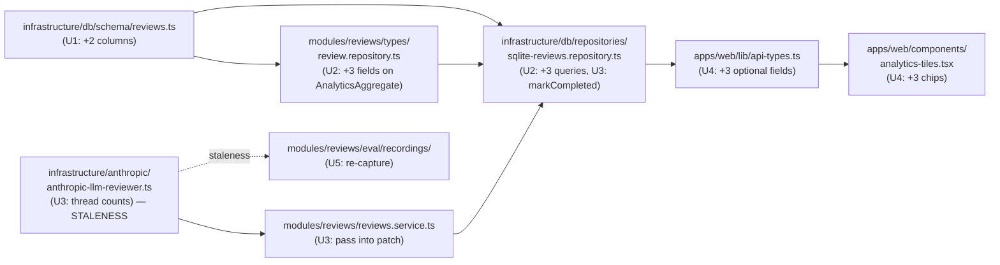

# feat: Day 8 — Observability (hallucination, failure-mode, cache-hit)

## Summary

Add three new signals to the analytics dashboard — count of findings dropped as hallucinated, top error-code breakdown for failed reviews, and tool-call cache-hit rate — bundled into one PR mirroring the shape of the existing "skipped" chip. Two new INTEGER columns on the `reviews` row carry the counts, the analytics aggregator gains three new aggregations, and the dashboard tile gains three muted chips. A design pass on the live UI runs before merge.

---

## Problem Frame

The dashboard already shows volume, status, severity, p50/p95 latency, token totals, and a "diff too large — skipped" count. What it doesn't show is the reviewer's self-correction signals: how often the model invents rule IDs (the filter drops them silently), which error codes dominate when reviews fail, and whether the in-loop dedup cache from the recent reviewer work is actually saving turns.

Today the operator can only learn those things by tailing logs for `Dropped hallucinated rule_id=...` warnings, opening the database directly to `GROUP BY error_code`, or reading per-review tool-call records to count cache hits. None of those are fast enough to catch a regression at a glance. The Day 8 plan entry in `docs/plans/01-baseline.md` calls out "hallucination flag" and "metrics on dashboard" explicitly; the cache-hit signal validates the recent dedup work and slots into the same surface.

---

## Origin

Sourced from `docs/brainstorms/day8-observability-requirements.md`. All R-IDs in this plan refer to that document; A/F/AE IDs are absent there (single-operator, no multi-step user flows).

---

## Requirements

Carried forward from origin. Each implementation unit traces back to one or more R-IDs.

- R1. Every completed review records the count of findings the hallucination filter dropped, summing both filter paths into one number.
- R2. Cache-hit counts are aggregatable across reviews without re-parsing the tool-call record on every read.
- R3. The dashboard's aggregate object exposes three new fields alongside the existing `skippedCount`.
- R4. All three new fields respect the dashboard's existing time-window filter.
- R5. Each of the three signals is surfaced visibly on the dashboard.
- R6. When a signal's value is zero across the time window, the chip either hides or renders muted.
- R7. The design pass happens before the PR merges, so follow-ups land in the same PR.
- R8. The existing offline evaluation gate continues to pass; recordings are refreshed before the PR is opened if the change touches a staleness-tracked path.

---

## Key Technical Decisions

- **Cache-hit aggregation lands as a denormalized column** (`cache_hit_count INTEGER NOT NULL DEFAULT 0` on `reviews`), not a SQL extraction over the per-turn tool-call record. Rationale: the dedup loop already has the count in hand at completion time; SUM on an integer column is faster on read than `json_each` iteration; the pattern matches how `turn_count` was added in the agent-loop work. Resolves origin R2's deferred-to-planning question.
- **Top-N for error-code breakdown is 10**, mirroring the existing `topRules` aggregation at `apps/api/src/infrastructure/db/repositories/sqlite-reviews.repository.ts` line 322. The chip renderer can subset further for display — 10 is the storage ceiling, not the display target. Resolves origin R3's deferred-to-planning question.
- **Final chip placement and styling is decided during the design pass on the live UI**, not pre-committed in this plan. Resolves origin R5's deferred-to-planning question by carrying it forward to the live-render stage.
- **The error-code breakdown excludes `standalone-failure` synthetic rows** (and other `STANDALONE_VERSIONS` entries), consistent with the existing aggregator's standalone exclusion. Synthetic failures are orchestration artifacts, not reviewer failure modes; rolling them into the chip would muddy the operator signal.
- **Two new columns ship with `NOT NULL DEFAULT 0`**. Historical rows backfill to 0 automatically — no retroactive recomputation, which is fine because both signals are forward-looking metrics, not historical accounting.
- **Web-side `AnalyticsResponse` fields are marked optional (`?`)** the same way `skippedCount?` was — so the frontend type-checks against API responses that pre-date this deploy.

---

## Implementation Units

### U1. Schema: add hallucinated_finding_count and cache_hit_count columns

- **Goal:** Extend the `reviews` table with two INTEGER NOT NULL DEFAULT 0 columns so the reviewer (U3) and aggregator (U2) have a place to write and read from.
- **Requirements:** R1, R2
- **Dependencies:** none
- **Files:**
  - `apps/api/src/infrastructure/db/schema/reviews.ts` (edit)
  - `apps/api/src/infrastructure/db/migrations/000X_<generated-name>.sql` (drizzle-kit generates; do not hand-edit)
- **Approach:** Add two columns to the `reviews` schema table definition, both `integer('<name>').notNull().default(0)`. Regenerate the migration via drizzle-kit. The boot-time `migrate(...)` call in `DatabaseService.open()` applies it automatically on next start; CI's test boot picks up the new schema.
- **Patterns to follow:** same shape as the prior schema additions documented in the schema file header comments (e.g., `turn_count: integer('turn_count').notNull().default(0)` at line 61).
- **Test scenarios:** Test expectation: none — schema and generated migration are mechanical, validated by Drizzle types and by the existing migration test that boots a fresh DB.
- **Verification:** `npm test --workspace apps/api` passes (migration applies cleanly on test setup); generated SQL contains both new columns with the expected types and defaults.

### U2. Aggregator: extend AnalyticsAggregate with three new fields

- **Goal:** Make `aggregateByFilter` return hallucinated-finding total, error-code breakdown, and cache-hit total alongside the existing fields.
- **Requirements:** R3, R4
- **Dependencies:** U1
- **Files:**
  - `apps/api/src/modules/reviews/types/review.repository.ts` (extend `AnalyticsAggregate`; add `ErrorCodeEntry` shape)
  - `apps/api/src/infrastructure/db/repositories/sqlite-reviews.repository.ts` (extend `aggregateByFilter`)
  - `apps/api/test/infrastructure/db/repositories/sqlite-reviews.repository.spec.ts` (new test scenarios)
- **Approach:**
  - Add `ErrorCodeEntry { error_code: string; count: number }` to the types file; extend `AnalyticsAggregate` with `hallucinatedTotal: number`, `errorCodeBreakdown: ErrorCodeEntry[]`, `cacheHitTotal: number`.
  - Inside the existing `aggregateByFilter` transaction, add three new queries:
    1. `SUM(hallucinated_finding_count)` over `baseWhere` (which already excludes standalone rows and respects the filter) → `hallucinatedTotal`.
    2. `GROUP BY error_code` on failed reviews, filtered with `baseWhere AND status = 'failed' AND error_code IS NOT NULL`, ordered by count desc, limited to 10 → `errorCodeBreakdown`.
    3. `SUM(cache_hit_count)` over `baseWhere` → `cacheHitTotal`.
  - Return the extended shape from the transaction.
- **Patterns to follow:**
  - Token-totals SUM pattern at `sqlite-reviews.repository.ts` lines 327–345 (for the two SUM queries).
  - Top-rules GROUP BY pattern at lines 313–325 (for the error-code breakdown — `limit(10)`, `orderBy(desc(count()))`).
  - Reuse `baseWhere` to keep standalone exclusion and filter behavior consistent with the rest of the aggregator.
- **Test scenarios:** Cover happy path, filter respect, and the new top-N case.
  - **Covers R3.** Given three completed reviews with hallucinated_finding_count values 1, 2, 0, the aggregate returns `hallucinatedTotal = 3`.
  - **Covers R4.** Given a review with hallucinated_finding_count = 5 completed outside the `sinceMs` window, the aggregate returns `hallucinatedTotal = 0` (filter respected).
  - **Covers R3.** Given five failed reviews with error_codes `[turn_cap_exceeded, turn_cap_exceeded, invalid_request_error, github_api_error, turn_cap_exceeded]`, `errorCodeBreakdown` returns at least `[{ error_code: 'turn_cap_exceeded', count: 3 }, ...]` ordered desc by count.
  - **Covers R3.** Given zero failed reviews matching the filter, `errorCodeBreakdown` returns `[]`.
  - The error-code breakdown excludes standalone-failure rows: given two `standalone-failure` rows with error_code `synthetic_x` and one real failed review with error_code `turn_cap_exceeded`, only the real one appears in the breakdown.
  - **Covers R3.** Given four reviews with cache_hit_count values 0, 2, 3, 1, the aggregate returns `cacheHitTotal = 6`.
  - **Covers R4.** Given a repo filter that matches only some reviews, the three new fields reflect only the matching rows (parity with existing token-totals behavior).
- **Verification:** Existing aggregator tests continue to pass; new test scenarios pass; `npm test --workspace apps/api` is green.

### U3. Reviewer: thread hallucinated_finding_count and cache_hit_count into ReviewCompletionPatch

- **Goal:** Populate the two new columns at review completion time so the aggregator (U2) has data to sum.
- **Requirements:** R1, R2
- **Dependencies:** U1, U2 (type extension)
- **Execution note:** This is the only unit that touches a path under `STALENESS_TRACKED_PATHS` (`apps/api/src/infrastructure/anthropic/**`). Landing this unit forces a re-capture of eval recordings — handled in U5. Sequence U3 ahead of U5 deliberately so the re-capture happens once, after the reviewer threading is final.
- **Files:**
  - `apps/api/src/infrastructure/anthropic/anthropic-llm-reviewer.ts` (modify `filterHallucinatedFindings` return shape to expose drop count; capture cache-hit count from the existing dedup loop; pass both into the loop result)
  - `apps/api/src/modules/reviews/types/review.types.ts` (extend `ReviewCompletionPatch` with the two new optional fields)
  - `apps/api/src/infrastructure/db/repositories/sqlite-reviews.repository.ts` (`markCompleted` writes both new columns from the patch; default to 0 when absent)
  - `apps/api/src/modules/reviews/reviews.service.ts` or equivalent caller (pass the two new values into the patch when constructing the completion call)
  - `apps/api/test/infrastructure/anthropic/anthropic-llm-reviewer.spec.ts` (new test scenarios)
  - `apps/api/test/infrastructure/db/repositories/sqlite-reviews.repository.spec.ts` (extend existing `markCompleted` tests for the new columns)
- **Approach:**
  - Change `filterHallucinatedFindings` to return `{ findings: Finding[]; droppedCount: number }` (or compute the drop count at the call site as `rawFindings.length - filtered.length`). Keep the existing per-drop log lines; just sum.
  - In the agent loop, track a running `cacheHitCount` increment alongside the existing `toolResultCache` short-circuit branch. The `cache_hit: true` annotation on `ToolCallRecord` is already in place — this is just a numeric counter alongside it.
  - Surface both counts on the loop's terminal result object so the calling service can pass them into `ReviewCompletionPatch`.
  - Extend `ReviewCompletionPatch` with `hallucinated_finding_count?: number; cache_hit_count?: number` (optional, default to 0 if undefined — matches the `turn_count?` / `tool_calls?` pattern at lines 139–140 of review.types.ts).
  - In `markCompleted`, write both columns; coerce undefined → 0.
- **Patterns to follow:** the wiring shape already used for `turn_count` and `tool_calls` extension in the agent-loop work — same patch flow through the same caller path.
- **Test scenarios:** Cover happy path, edge cases (no findings, no cache hits), and a regression check on existing behaviors.
  - **Covers R1.** Given the model emits 5 findings and 2 are dropped by `filterHallucinatedFindings` (one unknown rule_id, one wrong composite), the `ReviewCompletionPatch` carries `hallucinated_finding_count = 2`.
  - **Covers R1.** Given the model emits 0 findings, the patch carries `hallucinated_finding_count = 0`.
  - **Covers R1.** Given the model emits 3 findings and none are dropped, the patch carries `hallucinated_finding_count = 0`.
  - **Covers R2.** Given the dedup cache short-circuits 3 tool calls during a 5-turn loop, the patch carries `cache_hit_count = 3`.
  - **Covers R2.** Given a review with no cache hits, the patch carries `cache_hit_count = 0`.
  - Existing reviewer tests (turn count, token totals, malformed-emit, turn-cap-exceeded, etc.) continue to pass — no regressions in the loop's core behavior.
  - **Covers R1, R2 (repository side).** Given a `ReviewCompletionPatch` with `hallucinated_finding_count: 2` and `cache_hit_count: 5`, `markCompleted` persists both values; subsequent `findById` returns them.
  - Given a `ReviewCompletionPatch` without the new fields (legacy / partial caller), `markCompleted` writes 0 to both columns.
- **Verification:** All reviewer unit tests pass; the existing end-to-end loop test passes; database round-trip test confirms persistence.

### U4. Dashboard: surface the three chips on the analytics tile

- **Goal:** Render the new aggregator fields on the dashboard so the operator can see them at a glance.
- **Requirements:** R3, R5, R6
- **Dependencies:** U2 (aggregator returns the fields), U3 (data is non-zero for new reviews — not strictly blocking for rendering, but the chips look meaningful once U3 populates)
- **Files:**
  - `apps/web/lib/api-types.ts` (mirror the three new fields on `AnalyticsResponse`, optional `?` to allow older API responses to typecheck)
  - `apps/web/components/analytics-tiles.tsx` (add three chips)
- **Approach:**
  - Extend `AnalyticsResponse` with the three optional fields plus the `ErrorCodeEntry` shape, mirroring the snake_case wire convention used throughout this file (see header comment at `api-types.ts` lines 1–14).
  - In `analytics-tiles.tsx`, add three muted chips. Suggested baseline placement, to be confirmed on the live UI during the design pass:
    - **Hallucinated drops:** a muted line under the Severity row (Row 2) — these are findings the reviewer dropped, so they sit near the findings ledger semantically.
    - **Error-code breakdown:** a muted line under the failed count in the Volume row's ledger (Row 1) — failures and their dominant cause belong together.
    - **Cache-hit total:** a muted line under the Latency/Tokens row (Row 3) — it's a call-cost signal alongside the other cost telemetry.
  - Each chip follows the existing `skipped > 0 ? ... : null` conditional-render pattern at lines 92–101 of analytics-tiles.tsx so zero states hide.
  - The error-code breakdown chip displays the top 3 codes (the aggregator returns 10; the chip subsets); exact format is a design-pass choice.
- **Patterns to follow:** the `skipped` ledger line at analytics-tiles.tsx lines 92–101 — same muted-text-xs treatment, same `> 0` guard.
- **Test scenarios:** Test expectation: none — the project has no web-component test harness (see CLAUDE.md project structure; `apps/web` is presentational, no jest config there). Manual verification on the live dashboard plus the design-pass critique in U5 are the quality gates here. If a future session lands a web test harness, regression tests for these chips can be backfilled then.
- **Verification:** `npm run build --workspace apps/web` is clean; the running dev server renders the three chips against live data (with realistic non-zero values from U3 once the reviewer has produced a few reviews); the chips hide when their value is zero across the time window.

### U5. Re-capture eval recordings + design-pass critique on the live dashboard

- **Goal:** Refresh stale eval recordings (triggered by U3's reviewer changes) and validate the new chips visually against the live UI before the PR merges.
- **Requirements:** R7, R8
- **Dependencies:** U3 (triggers staleness), U4 (chips must be visible to critique)
- **Files:**
  - `apps/api/src/modules/reviews/eval/recordings/*` (re-captured fixtures; replaces existing recordings)
- **Approach:**
  - U3's edit under `apps/api/src/infrastructure/anthropic/` flips the staleness checker's `trackedPathsHash` comparison to `hash-differs` for every existing recording (see `apps/api/src/modules/reviews/eval/staleness.ts` line 39 for the tracked paths list).
  - Run the eval re-capture command (operator runs locally — captures all 23 recordings, ~5–10 minutes wall clock, ~$0.05–0.30 against Anthropic given the lifted cap; see the eval module's capture entry point for the exact CLI).
  - Confirm the offline gate stays PASS: micro-F1 ≥ 0.70, faithfulness ≥ 0.75. Document the new baseline values in the PR description so future re-captures have a comparison point.
  - With the dashboard rendering all three chips against live or seeded data, re-run the existing dashboard design critique against the live UI. Address any P0 / P1 findings inside this PR rather than as a chaser.
- **Patterns to follow:** the re-capture flow used after PR #18's dedup change (~23 recordings, same scope) and the design-critique flow with snapshots saved alongside the existing baseline.
- **Test scenarios:** Test expectation: none — this unit is process work, not code. The offline-eval-gate CI job and the design-critique trend report ARE the verification.
- **Verification:** CI's offline evaluation gate job passes on push; design-critique trend shows no regressions versus baseline (any new findings get resolved in this same PR before merge).

---

## System-Wide Impact

The change touches all three tiers documented in `CLAUDE.md`, with the dependency rule preserved (modules → infrastructure via interface tokens; infrastructure consumes types from modules but no values).

Affected parties:
- **Operator (the only end user today)** sees three new chips on the dashboard.
- **CI** runs the migration on every test boot (no human action) and runs the offline eval gate after U3/U5 re-capture.
- **No external API consumers** — the dashboard REST surface is internal; the three new fields are additive and the optional `?` typing protects pre-deploy clients.

---

## Test Strategy

- **Aggregator (U2):** unit tests at `apps/api/test/infrastructure/db/repositories/sqlite-reviews.repository.spec.ts`. Mirror the existing aggregator test structure — fresh in-memory SQLite per test, seed rows directly, call `aggregateByFilter`, assert on the returned shape. Cover the seven scenarios enumerated in U2.
- **Reviewer threading (U3):** unit tests at `apps/api/test/infrastructure/anthropic/anthropic-llm-reviewer.spec.ts`. Mock the Anthropic client (existing test pattern), assert on the loop result's two new fields. Five scenarios enumerated in U3.
- **Repository round-trip (U3):** extend `markCompleted` tests at the same repository spec file to confirm both columns persist and round-trip via `findById`. Two scenarios in U3.
- **Dashboard (U4):** no unit tests — no web-component harness exists. Manual verification on the live dev server plus the design-pass critique in U5.
- **Eval offline gate (U5):** the existing CI job validates micro-F1 and faithfulness after re-capture. No additional code; this is the automated gate.

Every feature-bearing unit (U2, U3) has explicit test file paths in its **Files:** list. U1, U4, U5 are non-feature-bearing (schema, presentational, process) — `Test expectation: none -- [reason]` is annotated on each.

---

## Risks

- **Re-capture cost or flakiness.** U3 forces re-capture of all 23 recordings against the Anthropic API. Cost is ~$0.05–0.30 (cap is lifted); time is ~5–10 minutes. Risk: a transient rate-limit or network failure mid-capture. Mitigation: the capture flow already has a 30/60s rolling rate-limit (per PR #18); if it still hits the wall, the cap is tunable in `apps/api/src/modules/reviews/eval/capture.ts`. Operator runs locally and only pushes when the gate passes.
- **Eval gate drift after re-capture.** PR #18 already showed a ~0.04 micro-F1 drift on dedup. The reviewer threading in U3 doesn't change reasoning behavior — it just counts — so the expectation is no drift. If drift surfaces, investigate before merging; do not raise the threshold.
- **Design pass surfaces a real follow-up.** The new chips might land poorly against the existing tile composition. Mitigation: U5 runs the critique BEFORE merge so follow-ups land in this same PR. If the critique surfaces a P0 that needs a structural rework of the tile, the PR can absorb it; if it needs a separate redesign, the chips can ship as-is and the redesign tracks as a follow-on.
- **`cache_hit_count = 0` for historical rows** is correct but might confuse a future reader looking at long-window aggregates. Acceptable — the chip will accurately reflect the post-deploy cache-hit rate, which is what the signal is for; historical context is documented in the migration comment and in this plan.
- **Error-code breakdown empty when there are zero failed reviews** could read as "broken." Mitigated by R6's hide-or-mute-at-zero rule, but the design pass should confirm the zero-state reads correctly.

---

## Deferred to Implementation

- Final method-level signatures inside `filterHallucinatedFindings` (return shape `{ findings, droppedCount }` vs computing the count at the call site). Either works; implementer picks the cleaner option.
- Exact SQL phrasing of the three new aggregator queries — depends on what Drizzle's query builder generates cleanly; mirror the existing patterns and use what compiles.
- Whether the error-code breakdown chip shows top-3, top-5, or "top + collapsed others" — design pass decides on the live UI.
- Whether the cache-hit chip shows raw count, percentage of tool calls, or both — design pass decides.
- Whether the existing `markCompleted` test fixtures need updating (probably yes for the new columns; mechanical).

---

## Scope Boundaries

Carried forward from origin; split into deferred and out-of-product as the origin had a single list.

### Deferred to Follow-Up Work

- Per-stage latency instrumentation (retrieval / LLM / persistence as three buckets) — needs new timing in the reviewer; out of this PR.
- Per-review hallucination chip on the review detail page — aggregate-only display in this PR; per-review surface is a follow-on if the aggregate motivates it.
- Splitting the hallucination count by drop path (unknown `rule_id` vs wrong composite) into two chips — one number for now; can split later if the aggregate signal warrants it.
- Hallucination alerting / thresholds — visibility-only in this PR; thresholds wait until a healthy baseline is observable.
- Backfilling historical `cache_hit_count` from existing `tool_calls_json` data — not done; signal is forward-looking.

### Out of scope (this product)

- Sentry or other browser-side error tracking — out of scope this PR; bot-side structured `error_code` logging plus the new failure-mode breakdown cover the immediate operator need.

---

## Verification

The plan is complete when:

- The two new schema columns exist in the running database after migration (U1).
- `aggregateByFilter` returns the three new fields with values that respect the time-window and repo/author filters, validated by the seven test scenarios in U2.
- New reviews persist non-zero `hallucinated_finding_count` and `cache_hit_count` values when the underlying conditions occur, validated by the seven test scenarios in U3.
- The dashboard renders three new chips against live data, hides them when values are zero, and passes the design-pass critique (U4, U5).
- The offline evaluation gate stays PASS (micro-F1 ≥ 0.70, faithfulness ≥ 0.75) after eval re-capture (U5).
- `npm test --workspace apps/api` is green; `npm run build --workspace apps/web` is clean.

A downstream implementer can start at U1 and follow the unit ordering without needing to invent additional product behavior, scope, or success criteria.
